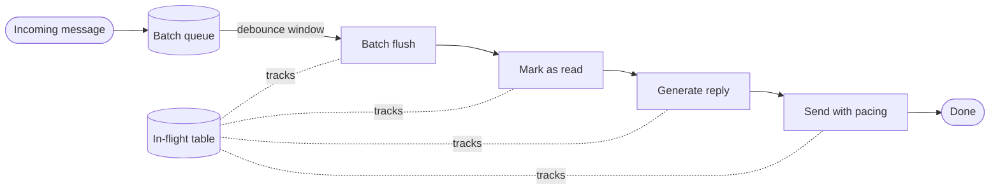
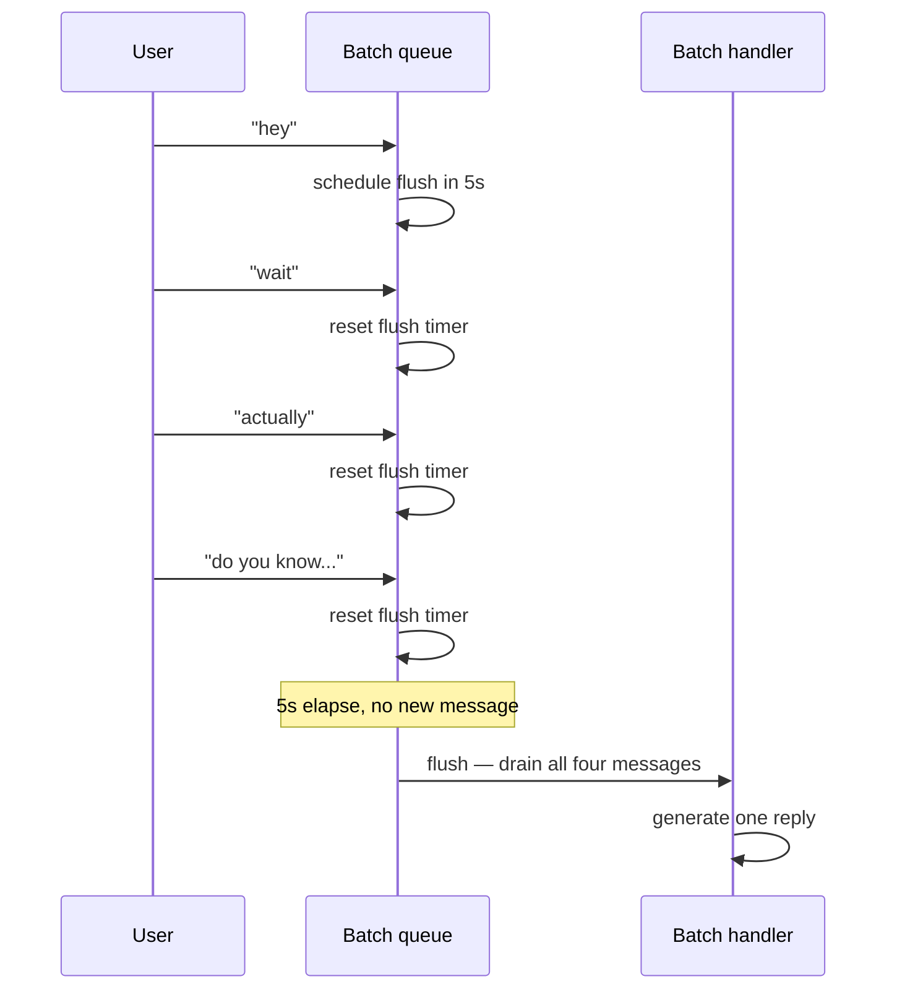
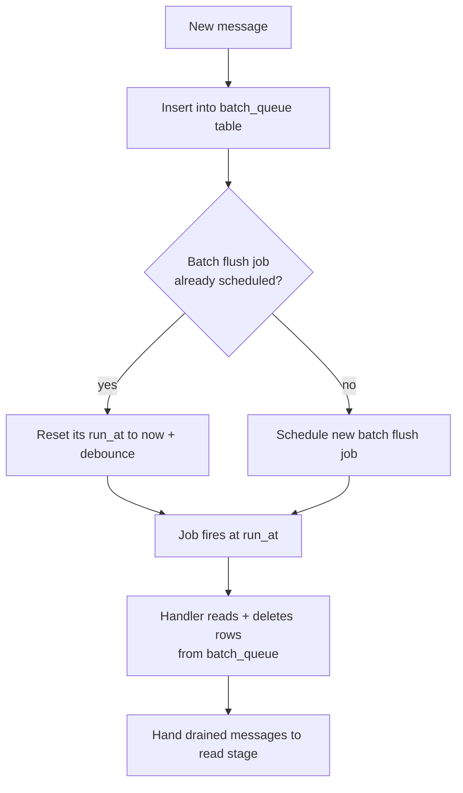
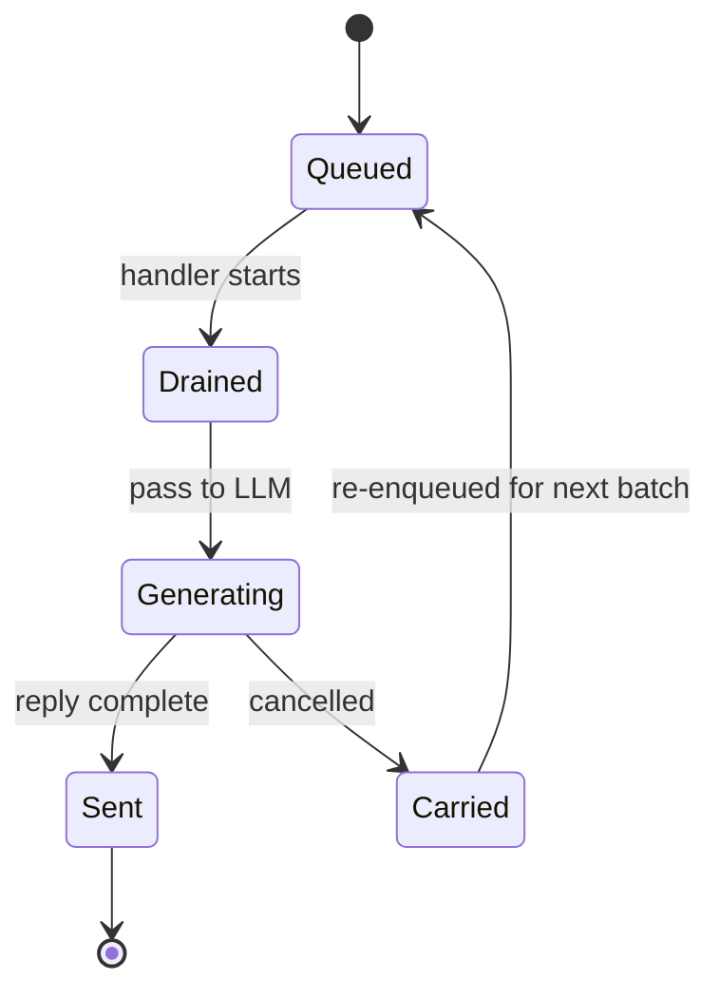
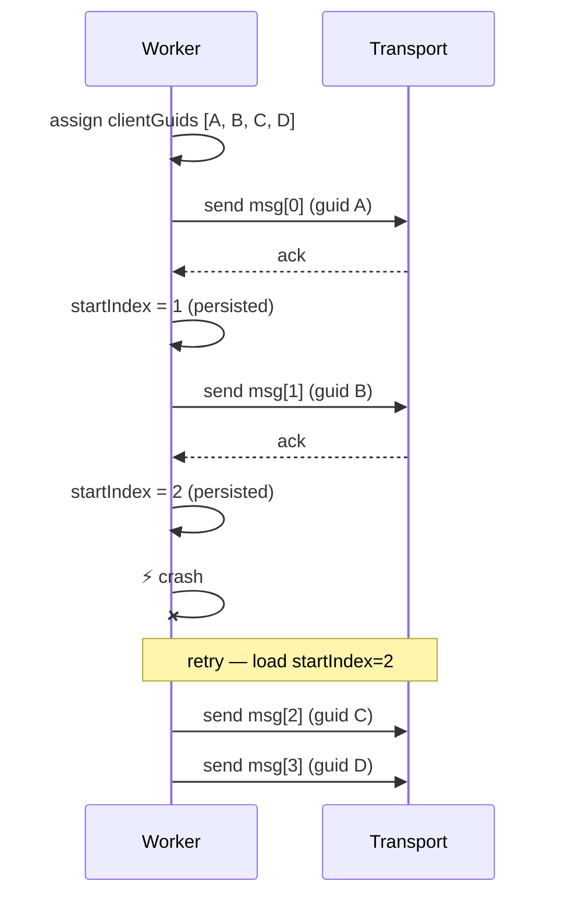
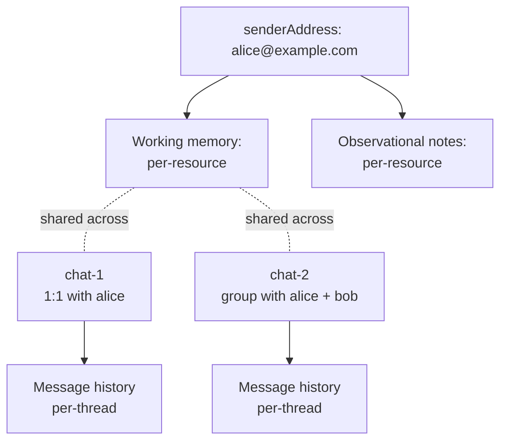
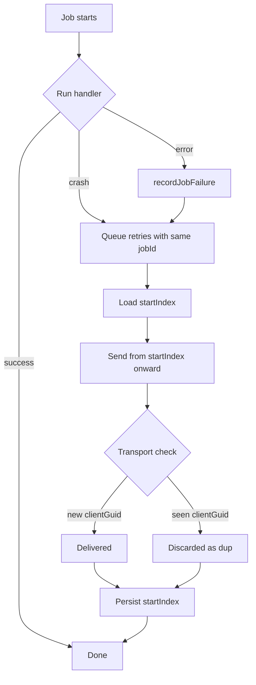

# Best practices: production agent patterns

> **Language note.** Code on this page is TypeScript (`spectrum-ts`). The architecture, queue topology, and concurrency rules described here are language-neutral and apply to any Spectrum SDK; only the runtime details (`AbortController`, `pg-boss`, async iterators) are TS-specific. The same patterns work with any equivalent job queue and abort/cancellation primitive in another language.

These are the architecture patterns Photon uses internally to ship agents that **live natively inside IM apps**. They're pulled directly from production — the problems we hit and the solutions we built. If you're building a similar agent, these patterns will save you months of trial and error.

A naive Spectrum agent — read incoming, call the LLM, send the reply — falls apart in ways you don't see until you ship it. The user types "hey" → "wait" → "actually nvm" inside three seconds and gets three independent responses. The agent replies in 200ms when a real person would take five minutes. A worker crashes mid-send and the user receives the same message twice on retry. The patterns below solve those problems.

## The pipeline

Every incoming message flows through five stages backed by a job queue. Each stage is a separately enqueued job, which is what makes any of them cancellable when a follow-up message lands.



The `In-flight` table is a per-chat record of whichever job ID currently owns each stage. When a new message arrives, the enqueuer reads it, cancels those jobs, and moves any messages that were already drained into a carry-forward table so the next batch sees them.

### Why split it up

If you do everything in one handler — read, generate, send — you lose the ability to react to a new message that arrives during generation. By the time you notice, you've already sent a reply that ignored what the user just said, or you've raced the LLM against itself.

Splitting into stages costs a few hundred ms of extra hop latency and buys you:

- **Cancellation points.** Each stage can check a flag and abort cleanly.
- **Resume points.** A worker crash mid-stage retries one stage, not the whole conversation turn.
- **Idempotency seams.** The send stage carries stable client GUIDs so retries don't double-send.
- **Distinct timing.** The read stage can sleep for an hour while the send stage runs in 500ms — they're independent jobs.

## Inbound pipeline

People text in bursts. A real conversation looks like this:

```
hey
wait
actually
do you know if the train runs on holidays
```

Four messages in eight seconds. If your agent fires a generation on each one, you get four overlapping replies — and the model never sees the actual question. The fix is to debounce: wait a few seconds for the burst to settle, and handle whatever has accumulated as one turn.



A few seconds of fixed debounce gets you most of the way there. The harder problems are what happens after the flush.

### Drain in the handler, not the enqueuer

The single most important rule: **the messages stay in the queue table until the handler reads them.** Don't pull them into the job payload at enqueue time.

Why: if the batch-flush job gets cancelled before the handler runs, anything in the payload is lost. Anything still in the queue is naturally picked up by the next batch. Keeping the data in the queue table until the last possible moment makes cancellation a non-event for those messages.



If the flush job is cancelled between F and G, the rows stay in `batch_queue` and the next incoming message picks them up.

### Carry-forward

Sometimes the handler does drain the queue but is then cancelled mid-generation. Those messages are now in memory inside a cancelled job — they'd be lost on the floor.

The fix is a `carried_messages` table. When a job is cancelled after draining, write the drained messages there. The next batch's handler reads from `carried_messages` first and prepends them as `[Earlier message] ...` lines so the model sees them as historical context, not as fresh input.



### In-flight cancellation

When a new message arrives and you have a job in flight (reading, generating, or sending), you need to stop it. Two pieces:

1. **A cancellation flag** in a per-chat `in_flight` table. The enqueuer sets `cancelled_at` and calls `boss.cancel(jobId)`.
2. **Polling inside the handler.** The send stage in particular polls `cancelled_at` every 500ms and aborts via an `AbortController`.

The subtle bit: compare `cancelled_at` against the chain's own `chainStartedAt` timestamp, not against "is the flag set." Otherwise a stale flag from a prior cancelled chain orphans the new one. The flag is per-chain, not per-chat.

```ts
const inflight = await readInflight(chatId);
if (inflight?.cancelled_at && inflight.cancelled_at > chainStartedAt) {
  abortController.abort();
}
```

### What you give up

This pipeline buys you correctness at the cost of a few hundred milliseconds of hop latency between stages. For a conversational Spectrum agent that's irrelevant — humans don't notice 300ms when a real reply takes 5 seconds anyway. For a low-latency tool integration, you'd consolidate stages.

## Recovery and state

Workers crash. The send job fails halfway through a 4-message reply. The retry runs from the top — and the user gets messages 1 and 2 again, then 3 and 4 for the first time. Now they have a duplicate.

You need three things to make this robust: stable client GUIDs, a resume cursor, and a place to record what failed.

### Stable client GUIDs

Every message you enqueue gets a deterministic identifier — a `clientGuid` — assigned at enqueue time, not at send time. The transport uses it for deduplication: if it sees the same `clientGuid` twice, it discards the second copy.

```ts
const messages = reply.map((text, index) => ({
  text,
  clientGuid: `${jobId}-${index}`, // stable across retries
}));
```

Most modern messaging transports support stable client-side IDs for dedup, and Spectrum surfaces them through the provider interface — check what your provider exposes before assuming you need to build dedup yourself.

The reason `clientGuid` must be stable is subtle: a worker that crashes after the transport ack'd but before the worker recorded it will retry the same message. Without a stable GUID, the transport sees a "new" message and delivers a duplicate.

### startIndex resume cursor

GUID-based dedup handles "transport already saw this." But you also want the worker itself to skip messages it knows it already sent — for performance and to avoid the dedup roundtrip.

Persist a `startIndex` on the job. After each successful send, atomically bump it. On retry, resume from there:



If the crash happens _between_ ack and persist, the retry resends `msg[1]` — but the transport sees the same `clientGuid B` and discards it. Both layers of defense are doing work.

### Per-resource memory scope

A single agent talks to many users. Each one needs their own working memory, conversation history, and observational notes. Mixing them up is catastrophic — the agent telling one user about another user's plans is the kind of bug you see once and never forget.

Scope every memory operation by `resourceId = senderAddress`. The thread ID is per-chat (`chat-${chatId}`), but memory is per-person:

```ts
await memory.getWorkingMemory({
  resourceId: senderAddress,
  threadId: `chat-${chatId}`,
});
```

The same person messaging from a group chat versus a 1:1 sees the same working memory (same `resourceId`), but conversation history is per-thread (different `threadId`). That's usually what you want — the agent remembers _who you are_ across all chats but treats each thread as its own conversation.



If you shard memory across databases or tenants, each shard needs to follow the same convention. Test multi-user concurrency hard — race conditions in working-memory updates corrupt state silently and you won't notice until two users compare notes.

### Job failure audit log

When a job fails, you want to know which job, when, with what payload, and why — without grepping through rotating logs.

A `job_failures` table is a small amount of code that pays back disproportionately. Every error path calls `recordJobFailure(queueName, jobId, payload, error)` and inserts a row. Now you can ask:

- "Which jobs failed in the last hour?"
- "Are all failures coming from one chat?" (a corrupt working-memory state)
- "Are all failures from one queue stage?" (a transport outage vs. an LLM bug)
- "What was the payload that triggered this?" (reproducer)

Operational notes:

- **Add a retention policy.** Otherwise the table grows forever. Delete entries older than 30 days.
- **Make `recordJobFailure` itself fail-safe.** Wrap it in a try/catch with a log fallback — you don't want a failed-failure-record to take down the worker.
- **Be careful with payload size.** If your jobs carry images or large blobs, the audit table balloons. Either truncate or store a pointer.

### Putting it together



Three independent layers — queue retry, resume cursor, transport dedup — and any one is enough to prevent a duplicate in most failure modes. Together they survive almost everything short of the database itself going down.
