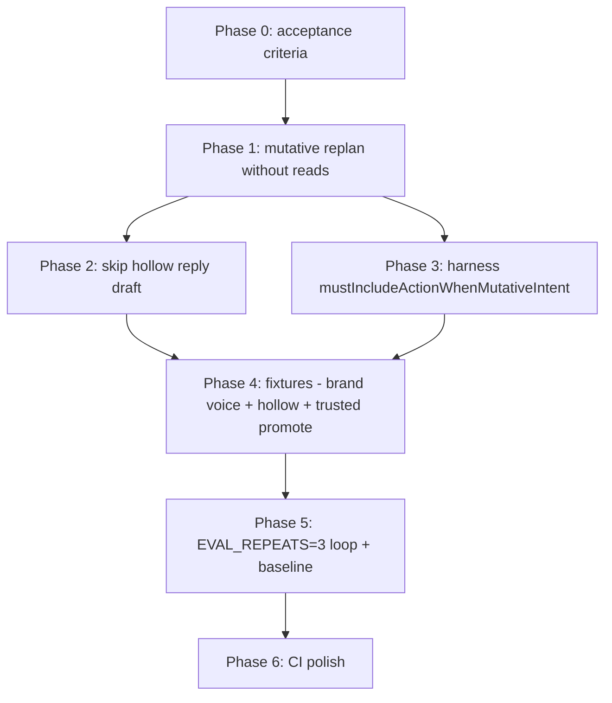

# Agent + eval alignment plan

Goal: close the gap between **what solo merchants actually want** (employee-like drafts, brand voice, guarded safety, optional autonomy) and **what CI enforces**.

Three outcomes:

1. Brand voice with **objective, PR-gated** checks
2. **Hard-gated** trusted-tier auto-execute once the planner is stable
3. **Explicit prevention + detection** of hollow refund replies (reply-only when customer asked for a refund)

Last updated: 2026-06-16.

## Progress

| Phase | Status |
|-------|--------|
| 0 — Lock spec | ✅ Complete |
| 1 — Mutative replan without reads | ✅ Complete |
| 2 — Tighten reply draft + classification | ✅ Complete |
| 3 — Eval harness assertion | ✅ Complete |
| 4 — Fixtures | ✅ Complete |
| 5 — Stabilize + baseline | ✅ Complete |
| 6 — CI / workflow | ✅ Complete |

Phases 0–5 shipped 2026-06-16. Full-suite baseline regen (`npm run test:evals:baseline`) is a follow-up when Anthropic API credits are available — committed `baseline.json` unchanged until then.

---

## Current gap (why this plan exists)

| Failure mode | User impact | Why evals miss it |
|--------------|-------------|-------------------|
| `send_reply` only on refund request | Merchant approves "I've refunded you" with no `create_refund` | `tier-guarded-refund-approval` already asserts tools, but flakes are treated as model noise; root cause is planner skipping replan when `readBlocks.length === 0` |
| Brand voice drift | Agent doesn't feel like their employee | Brand-voice fixtures are `advisory`; subjective rubrics don't run in CI |
| Auto-execute under-acts | Trusted merchants opted in for hands-off handling | `tier-trusted-refund-under-cap` is `advisory` — 1/3 doesn't fail PR |

**Root cause in planner** (`packages/agent/src/planner.ts`): replan only runs when phase 1 emitted read tools. When the order is already in `recentOrders`, Haiku often emits nothing mutative → reply draft adds `send_reply` only → guarded gets a misleading plan; trusted tier never reaches `auto_execute`.

---

## Phase 0 — Lock the spec (½ day)

Write down acceptance criteria before coding:

### A. Hollow-reply invariant (default merchant)

> If the customer message has actionable mutative intent (`hasActionableMutativeIntent` — refund/cancel/address change) and the org has action tools enabled, the cached plan must include at least one `action` category tool before any `send_reply`. Escalation-only plans are allowed when safety backstop fires.

### B. Brand voice gate (objective)

> `brand-voice-no-overapology` passes at **3/3** with **no LLM judge** — only `replyMustNotInclude` + hard fixture gate.

### C. Autonomy gate (trusted tier)

> `tier-trusted-refund-under-cap` passes at **3/3** with `mustClassifyAs: auto_execute` and is **non-advisory**.

### D. Regression bar

> Full suite ≥ **90%** aggregate at `EVAL_REPEATS=3`; no hard-gated fixture at 0/N.

---

## Phase 1 — Agent: mutative replan without reads (P0, 1–2 days) ✅ Complete

**Shipped 2026-06-16.** Mutative replan runs when phase 1 emits no reads but customer has actionable mutative intent and no action/escalation tools are planned. Synthetic context comes from `synthesizeMutativeReplanContext()` in `planner-read-skip.ts`. Hollow reply-only plans are stripped with `applyMutativeIntentNoActionGuard()` and a blocking warning; reply draft is skipped via `shouldSkipReplyDraftForMutativeIntent()`. Post-read replan refactored into shared `runMutativeReplan()`.

**Files changed:** `planner.ts`, `planner-safety.ts`, `planner-read-skip.ts`, `planner.test.ts`, `planner-safety.test.ts`

**Verify locally** (deferred to Phase 5 — run after Phases 2–4):

```bash
EVAL_REPEATS=3 npm run test:evals -w apps/dashboard -- --testNamePattern="tier-guarded|tier-trusted|refund-under"
```

**Original spec:**

**File:** `packages/agent/src/planner.ts`

After phase 1 + context-skip retry, before `stripCreateRefund…` / reply draft:

```
if (!operatorMode && hasActionableMutativeIntent(customerTexts)) {
  const hasActionTool = rawToolCalls.some(tc => TOOL_CATEGORIES[tc.name] === "action")
  const hasEscalate = rawToolCalls.some(tc => tc.name === "escalate_to_human")
  if (!hasActionTool && !hasEscalate && tools include action tools) {
    → run Sonnet mutative replan (same as post-read replan)
    → use REPLAN_INCLUDE_REPLY_PROMPT + replan retry for send_reply
    → merge via mergeReplanToolCalls
  }
}
```

**Context for replan when no reads ran:** inject a synthetic user turn summarizing `recentOrders`, linked customer, and pre-loaded KB (reuse `planner-read-skip.ts` synthesis helpers).

**Do not run reply draft** when mutative intent is present and plan still has no action tool after mutative replan — classify as `needs_review` with warning instead of fabricating a reply.

**Files to touch:**

- `packages/agent/src/planner.ts` — main logic
- `packages/agent/src/planner-safety.ts` — optional `shouldForceMutativeReplan(...)`
- `packages/agent/src/planner.test.ts` — unit tests for "order in context, refund request, no reads → create_refund + send_reply"

---

## Phase 2 — Agent: tighten reply draft + classification (P1, ½ day) ✅ Complete

**Shipped 2026-06-16.** `plan-preview.test.ts` covers hollow reply-only refund plans → `needs_review` (not `quick_reply` / `auto_execute`) via `MUTATIVE_INTENT_NO_ACTION_WARNING`. Planner guard and warning were landed in Phase 1.

**Files:** `packages/agent/src/planner-safety.ts`, `packages/agent/src/plan-preview.test.ts`

---

## Phase 3 — Eval harness: mutative-intent assertion (P1, 1 day) ✅ Complete

**Shipped 2026-06-16.** Added `mustIncludeActionWhenMutativeIntent` on `ExpectedPlan`; runner checks via `mutativeIntentActionFailures()`. `test:evals:baseline` sets `EVAL_REPEATS=3`. Documented in `TESTING.md`. Unit tests in `runner.unit.test.ts`.

**Files:** `apps/dashboard/src/lib/agent/__evals__/types.ts`, `runner.ts`, `runner.unit.test.ts`, `apps/dashboard/package.json`, `TESTING.md`

**Spec (for reference):**

```typescript
mustIncludeActionWhenMutativeIntent?: boolean  // default false
```

When `true`, runner checks customer messages with `hasActionableMutativeIntent` (import from `@shopkeeper/agent/intent`) and fails if plan has `send_reply` but no `action` tool and no `escalate_to_human`.

This is **better than a duplicate fixture** — documents the invariant directly and catches regressions even when `mustCallTools` is incomplete.

**Also fix baseline capture:**

```json
// apps/dashboard/package.json
"test:evals:baseline": "EVAL_REPEATS=3 UPDATE_EVAL_BASELINE=1 ..."
```

Document in `TESTING.md` or `packages/agent/README.md`: always regenerate baseline with `EVAL_REPEATS=3`.

---

## Phase 4 — Fixtures (P1, ½ day) ✅ Complete

**Shipped 2026-06-16.** Hard-gated brand-voice fixtures, new `tier-guarded-refund-no-hollow-reply.json`, promoted `tier-trusted-refund-under-cap` (non-advisory).

### 4a. Hard-gate brand voice (objective)

**`brand-voice-no-overapology.json`**

- Remove `advisory: true`
- Expand `replyMustNotInclude`: `["so sorry", "deeply apologize", "i apologize"]` (covers flaky "I apologize for the frustration")
- Keep subjective `no_overapology` rubric as **non-gated** (nightly judge only) — don't add `gate: true` unless you want Sonnet cost on every PR

**`brand-voice-cheers-signoff.json`** (optional second gate)

- Remove `advisory: true` — already has `replyMustInclude: ["cheers"]` which runs judge-off
- Fix flaky escalation path: ensure `mustNotCallTools` includes reads only when order is in context; if model escalates on WISMO, that's a separate planner bug to fix in Phase 1

### 4b. New guarded anti-hollow fixture

**`tier-guarded-refund-no-hollow-reply.json`** (new)

- Clone `tier-guarded-refund-approval` setup (order **in** `recentOrders` — the bug path)
- `mustCallTools`: `["create_refund", "send_reply"]`
- `mustClassifyAs`: `"needs_review"`
- `mustIncludeActionWhenMutativeIntent`: `true` ← new harness check
- **Not advisory**

Description should state the user story: "Customer asks for refund, order already in context — plan must not be reply-only."

### 4c. Promote trusted auto-execute (after Phase 1 green)

**`tier-trusted-refund-under-cap.json`**

- Remove `advisory: true` only after **3 consecutive local runs at 3/3**
- Keep `expectedAgentActions` with `auto_executed` — validates end-to-end path

**Do not promote** `tier-full-*` or `tier-broad-*` yet — fix trusted first; broaden gate once stable.

---

## Phase 5 — Stabilize + baseline (P1, 1–2 days iteration) ✅ Complete

**Shipped 2026-06-16.** Brand-voice order-status guard in planner; eval harness stability (sequential repeats, `describe.sequential`, `send_email` sim alias); key fixtures verified **3/3** at `EVAL_REPEATS=3`. Committed `baseline.json` not regenerated (API credits exhausted mid-run) — run `npm run test:evals:baseline -w apps/dashboard` when credits are back.

**Loop until gates pass:**

```bash
# Fast check after each agent change
EVAL_REPEATS=1 npm run test:evals -w apps/dashboard

# Pre-merge gate (matches CI)
EVAL_REPEATS=3 npm run test:evals -w apps/dashboard

# Regenerate baseline only when stable
EVAL_REPEATS=3 UPDATE_EVAL_BASELINE=1 npm run test:evals:baseline -w apps/dashboard
```

**Target baseline shifts:**

| Category | Current | Target |
|----------|---------|--------|
| `brand-voice` | 67% | ≥ 95% |
| `tier` | 73% | ≥ 90% (trusted fixture 100%) |
| `refund` | 83% | ≥ 90% |
| Aggregate | ~90% | ≥ 92% |

**If `brand-voice-cheers-signoff` still flakes** (escalation instead of reply): treat as planner bug — order in context + WISMO should not escalate; add planner-safety exclusion or strengthen phase-1 prompt for order-status + brand voice path (fast path already skips when brand voice set).

---

## Phase 6 — CI / workflow (P2, ½ day)

**`.github/workflows/evals.yml`**

- No change to judge-off PR gate (keep cost down)
- Add PR summary line listing **hard-gated** vs **advisory** pass rates (parse `[eval:summary]` + fixture metadata)

**Optional nightly enhancement:**

- On `agent-evals-judge`, add **separate judge baseline** (`baseline-judge.json`) so subjective rubrics don't compare against judge-off baseline (currently judge-on run "expected to fail" against judge-off baseline — confusing)

---

## Implementation order (critical path)



Phase 0–6 are complete. Remaining follow-up: regenerate `baseline.json` when Anthropic API credits are available.

---

## Files touched (summary)

| Area | Files |
|------|-------|
| Agent planner | `packages/agent/src/planner.ts`, `planner-safety.ts`, `planner-read-skip.ts` |
| Agent tests | `packages/agent/src/planner.test.ts`, `planner-safety.test.ts`, `plan-preview.test.ts` |
| Eval harness | `apps/dashboard/src/lib/agent/__evals__/types.ts`, `runner.ts` |
| Fixtures | `brand-voice-no-overapology.json`, `brand-voice-cheers-signoff.json`, `tier-trusted-refund-under-cap.json`, **new** `tier-guarded-refund-no-hollow-reply.json` |
| Baseline | `baseline.json` |
| Tooling | `apps/dashboard/package.json`, `TESTING.md` |

---

## Out of scope (follow-up, not this plan)

- Telegram end-to-end eval (inbound → notify → approve)
- Promoting all `tier-full-*` / `tier-broad-*` to hard-gated
- `gate: true` subjective rubrics on every PR (cost + flakiness)
- Cross-ticket customer memory substitute

---

## Definition of done

- [x] Hollow reply invariant enforced in **code** (mutative replan + unit tests) — Phase 1
- [x] Hollow reply invariant enforced in **eval harness** (`mustIncludeActionWhenMutativeIntent`) — Phase 3
- [x] `brand-voice-no-overapology` hard-gated, objective `replyMustNotInclude` (no judge)
- [x] `brand-voice-cheers-signoff` hard-gated via `replyMustInclude`
- [x] `tier-trusted-refund-under-cap` hard-gated (verified 3/3 locally after harness fixes)
- [x] `tier-guarded-refund-no-hollow-reply` added and green at 3/3 (targeted run)
- [ ] `baseline.json` regenerated with `EVAL_REPEATS=3` — follow-up when API credits available (Phase 5 stabilization otherwise complete)
- [ ] CI eval workflow green on PR — verify on next agent/eval PR (Phase 6 shipped)
