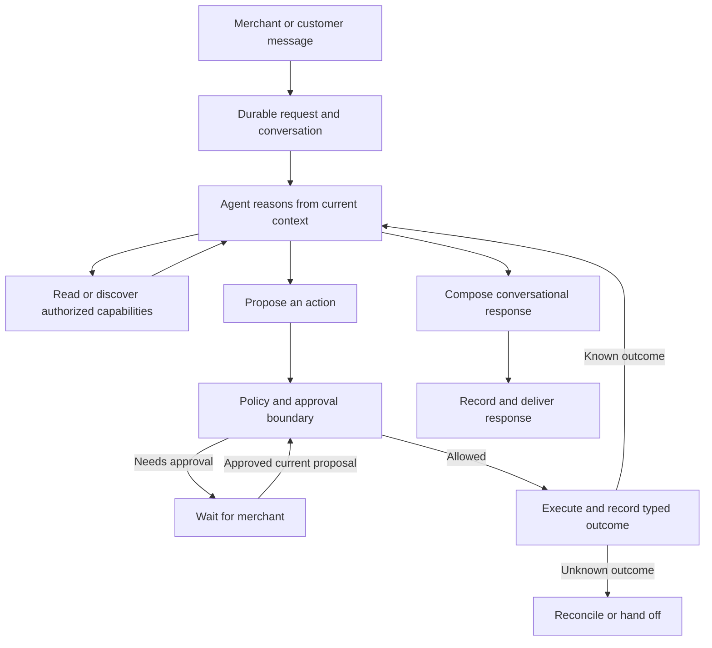

# Conversational agent runtime

Last reviewed: 2026-10-05.

Retirement shipped in [PR #165](https://github.com/walledog11/shopkeeper/pull/165)
as `17afc644` on dashboard, gateway and worker. Required PR checks and production
verification passed; deployment identities are in the release evidence.

Runtime 2 is the sole executable agent runtime. New dashboard, composer,
iMessage, and customer requests persist `runtimeVersion=2`; organization
allowlists and the proposal/discovery rollout flags no longer select behavior.
A persisted task on another version must be regenerated before execution or
continuation. Its version is never rewritten.

This is the active owner of the runtime architecture, standing decisions and
change procedure extracted from the
[archived overhaul plan](archive/conversational-agent-overhaul-plan.md).
[Agent follow-ups](agent-follow-ups.md) tracks known defects and behavior still
unobserved in ordinary use; the
[release evidence](conversational-agent-overhaul-p6-release-evidence.md) retains
manual results. This document grants no production authorization by itself.
It supersedes the [maintainability audit](agent-maintainability-audit-2026-09-11.md)
where they differ: conversation remains model-authored and discovery adaptive.

## Design boundaries

| Model owns | Runtime owns |
| --- | --- |
| Understanding requests and conversational references | Tenant, member, customer, and order access |
| Choosing relevant investigations and discovering tools | Tool availability and execution-time authorization |
| Proposing actions and alternatives | Approval binding and current-state policy checks |
| Deciding whether clarification is useful | Durable suspension and resumption |
| Adapting after new information or a definite failure | Retry limits and unknown-outcome reconciliation |
| Natural explanations, brand voice, and summaries | Verified result fields and delivery records |

Non-goals:

- No fixed intent-to-workflow catalog, mandatory conversation script, or template-only assistant.
- No multi-agent team, new agent framework, generic plugin platform, or giant catch-all tool.
- New commercial capabilities require a separate scope decision. Preserve the support wedge and existing merchant operations.
- No broad rewrite of working provider adapters, identity checks, or channel integrations.
- No promise of perfect factual correctness for arbitrary generated prose. Structured evidence improves grounding; language quality still needs evaluation.

### Execution path

Use the existing gateway, queue, database, and shared agent package. Support and operator turns retain different authorities and interaction styles, but share request identity, budgets, receipts, and recovery semantics. A policy decision may require approval even when the model wants to proceed.

The model investigates, combines existing capabilities and authors natural
responses; the runtime does not prescribe a script for each support situation.
Execute independent reads together. Persist write proposals before execution
and preserve dependencies between writes. Several related actions can share one
reviewed bundle; provider outcomes inform subsequent reasoning and merchant
responses, while customer messages retain their exact approved draft.

Evolve the existing tool definitions. Each capability owns its input schema,
required evidence, actor/context authority, provider requirements, approval and
policy metadata, execution adapter, typed result and recovery behavior. Extend
existing records where their semantics fit; do not repurpose a provider-specific
event table as a generic task table without validating its claim and recovery
contracts.

Keep conversational memory separate from authority. Explicit preferences and
useful task facts retain source and scope in the existing memory system.
Summaries, preferences and customer claims cannot grant permissions or establish
provider facts. Evidence is scoped to the task, entity and observation time;
recheck provider preconditions after waits. Persist observable facts and
references rather than hidden reasoning or a parallel speculative transcript.
Action completion and delivery remain separate: a refunded order stays refunded
when its customer email fails.

## Requests, planning, and approval

Dashboard chat and composer submissions persist a request before returning 202.
iMessage work uses the same task ledger through the operator-event worker.
Customer planning accepts the source message as a durable request. Claims,
revision checks, leases, cumulative budgets, and cancellation govern each
attempt. Reloading or retrying a request does not refill its budget.

Customer planning starts with the authorized reads and controls appropriate to
its classification. Missing or stale classification uses the compact starter
set with `discover_capabilities`. Discovery adds capabilities from that actor's
authorized registry within the same bounded loop; no full-registry retry exists.
Merchant instructions and operator/storefront contexts retain their own
authorized tool sets. Discovery grants no additional authority.

Support request refusal checks use classifier intents and `requestFacts` aligned
to the latest customer message, rather than English words in instructions or
conversation history. Cancellation, address-change and refund checks resolve
the primary or alternative ask's named order; an unnamed request may use the
customer's sole order. An explicit missing order never selects a different one.
Proposed write targets are checked independently, including when classification
is missing or stale. Classification establishes neither provider state nor
permission; execution still checks identity, grants, approval and current state.

Classifier version 6 adds `compensation_request` for explicit refunds, money
back, gift cards or store credit. A complaint or policy question alone does not
set it. Older persisted rows default that flag to false; an aligned mutative
refund ask still supplies the older compensation signal. Approval-card request
displays retain version-5 and version-6 facts. A failed lookup consults the
current request and proposed actions, without reviving an earlier request.
This cleanup shipped in [PR #170](https://github.com/walledog11/shopkeeper/pull/170)
as `4bfd1258` on dashboard, gateway and worker; required CI and production health
verification passed. Ordinary-use observations are tracked in
[agent-follow-ups.md](agent-follow-ups.md).

A customer message is an `exact_draft`, bound with its destination and action
bundle into the durable proposal's hash. Only labeled placeholders explicitly
bound to successful receipts may change after approval. Missing receipt values,
a failed write, or an unknown outcome withholds the message. A definite failure
may produce a separately reviewed message follow-up; an uncertain write is
reconciled without replaying it.

All approval surfaces call the shared proposal authorization and execution
boundary. Authenticated membership, recorded approver scope, current source,
proposal identity, and execution ownership are checked before dispatch. Approval
of a taskless historical cache is refused with regeneration guidance. Approval
never falls through to an untracked execution.

Dashboard answers and phone answers/revisions claim the exact durable wait,
persist the merchant's continuation, renew the claim while planning, and settle
the proposal and cache together. These existing continuation handlers await
planning in their host process; they are not queued HTTP submissions. The
private `/api/agent/ask` surface remains a bounded, synchronous, read-only query.
It cannot execute writes or authorize a proposal.

Continuations retain the customer-message source on their durable request and
use the same base instruction in the cache, card and proposal hash. Cancellation,
lost or expired claims, and a newer customer message prevent publication.
Reply-only continuations await approval until the reviewed reply executes.

Revisions deliver the canonical full card to the answering iMessage device and
other bindings. Drafts too long to display require dashboard review and cannot
be approved from the phone. Keep the operator's pending question until the answer
succeeds, without clearing a replacement question. Revision guidance reaches the
planner even without a question; a label URL does not prove a return was opened.

The authenticated continuation host passes `merchantContinuation: "answer"`
or `"revision"` after claiming the corresponding durable wait. Planner behavior
uses that metadata; generated instructions and customer text cannot identify a
merchant answer. An answer removes `ask_operator` and supplies the missing fact
for knowledge-base routing. A revision retains normal clarification behavior.
Current plans' explicit routing evidence takes precedence over an advisory KB
search miss; the older fallback remains for plans without routing evidence.

## Durable execution contracts

### Persistence decisions: identity is not status

The schema (`packages/db/prisma/schema.prisma`) is the source of truth for fields.
The rules that still bind:

- A conversation (`Thread`), a request (`AgentRequest`), a task (`AgentTask`), a
  proposal (`AgentProposal`), a proposal execution (`PlanExecution`), an action
  with its receipt (`AgentAction`) and a delivery (`Message`) are distinct
  identities. `OperatorContext` pending state is a projection that cards read.
  It is not authority, and trimming it never deletes work.
- Do not widen `OperatorEventStatus` or `PlanExecutionStatus` to carry task or
  conversation state. Do not add one table per conceptual word.
- A task checkpoint holds short observable facts and references, never the
  transcript, provider payloads or model reasoning.
- Every lookup and mutation is scoped by organization and parent ownership. New
  records join workspace deletion, redaction and retention. Nothing cascades
  away evidence of an unresolved provider write.

### Task transitions and concurrency

Use a task-specific state set: `queued`, `running`, `waiting_input`, `waiting_approval`, `reconciling`, `completed`, `failed`, `cancelled`. These are task states, not replacements for existing execution enums.

| From | Event and guard | To / required write |
| --- | --- | --- |
| queued | Worker wins conditional claim | running; store token and lease |
| running | Model asks a relevant question | waiting_input; persist question and response before releasing claim |
| running | Policy requires approval for persisted proposal | waiting_approval; persist proposal and notification intent |
| waiting_input | Scoped answer matched to question/task | queued; attach request and increment revision |
| waiting_approval | Valid decision for current proposal/hash | queued; record approval atomically, then enqueue |
| waiting_approval | Revision/dismissal | queued or cancelled according to instruction; invalidate pending proposal |
| running | Submitted write has uncertain outcome | reconciling; retain operation key, receipt if available and spend reservation |
| reconciling | Provider probe establishes outcome | queued to observe known outcome, or cancelled after recording outcome if cancellation was requested |
| running | Objective satisfied; required response persisted | completed; delivery can still be pending/failed |
| waiting_approval | Approved execution withheld its exact draft — a write definitely failed, or a placeholder had no receipt value — and no outcome is unknown | queued, revision incremented, the follow-up and its execution recorded on the checkpoint |
| queued (follow-up) | Worker wins the follow-up claim; every write settled, no execution claimed or unknown | running; the attempt may only read and draft, and its draft requires review. With nothing to draft against — conversation closed, customer answered or wrote again — completed or failed as the execution was |
| queued/running/waiting_* | Authorized stop | cancelled if no uncertain submitted write; otherwise reconciling with cancellation recorded |
| waiting_input/waiting_approval | Conversation closed, unless its proposal is already approved (decision C) | Authorized stop, in the transaction that closes the conversation; the pending proposal is superseded |
| running | Definite unrecoverable failure or exhausted budget | failed with reason and resumable facts; uncertainty still takes precedence as reconciling |

Completed/cancelled/failed tasks are not reset by a duplicate request. A deliberate new instruction can create a new task referencing prior work. A known partial result remains visible even when the overall task fails or is cancelled.

Concurrency implementation rules:

1. PostgreSQL conditional updates/transactions decide ownership; Redis locks and queue job IDs are optimizations. Claim task status and token atomically. Every state mutation from a worker must verify its token and expected revision.
2. Renew leases while work runs. A replacement worker may reclaim expired reasoning/read work. If any action reached dispatch, inspect its durable operation state first; lease expiry never authorizes replay.
3. Persist inbound revisions and action-dispatch authorization through a shared task-row ordering point. If a stop/revision wins before dispatch authorization, the old action cannot start. Once dispatch authorization wins, report that the action may already be underway; attempt abort where supported but still reconcile its outcome.
4. Do not hold a database transaction across model or provider network calls. Persist dispatch intent under the transaction, then call the provider. This introduces a conservative crash window: a crash after intent but before the call is treated as potentially submitted unless the adapter can prove otherwise.
5. A stale worker that receives a provider result may record evidence against the exact operation through the reconciliation path. It must not update the current task revision, overwrite a newer result, send a new reply, or start another action.
6. Recovery scans durable rows for accepted-but-not-enqueued requests, expired claims, unknown operations, and unsent responses. Queue publication after a database commit can fail; the sweep is required, not optional cleanup.

### Typed receipts and operation identity

`ReceiptV1` and its per-tool validators live in
`packages/agent/src/tools/result.ts` and `packages/agent/src/shopify/receipts.ts`.
Preserve these rules through changes and compatibility retirement:

- Keep `ToolStatus` values at compatibility boundaries. The mapping is
  `succeeded → ok`, `not_found → not_found`, local `rejected → policy_block`,
  `failed → error`, `unknown → unknown`. If a legacy status and a receipt
  disagree, validation fails and the uncertainty is preserved. Never pick the
  more optimistic value.
- Facts come from the provider: exact decimal money, currency, canonical target
  and provider reference. Never take them from the requested input, parse them
  from a `message`, or infer a currency from locale. Missing required success
  fields after a possible write means `unknown`.
- The operation identity is runtime-assigned, never a model tool-call ID. It is
  created before dispatch and reused on every attempt of that action. A fresh
  proposal or tool-call ID cannot bypass a committed or unknown operation on the
  same target and effect.
- Persist the receipt before a dependent write or a success message. Retry a
  definite failure only when the adapter documents that no effect occurred.
  Unknown outcomes go to reconciliation, and a single empty probe is not proof
  of failure.
- In a bundle, writes run sequentially in dependency order. A succeeds and B
  fails means A stays successful. Dependents of B are blocked, and no
  compensation is invented. Delivery retries separately from commercial
  actions.

### Approval and communication contract

Use a canonical server-generated hash of the immutable proposal. Extend the existing `hashPlan` / instruction-hash machinery rather than hand-building hashes in channel code. Canonicalization must sort object keys, preserve meaningful array order, normalize input with the registered parser, and preserve exact approved draft bytes. Reordered object keys retain the same identity; changed amount, recipient, draft or dependencies invalidate it.

The approved snapshot binds organization, task and revision, proposal ID/version, actor scope, normalized tool names/inputs/targets, ordered action dependencies, communication mode, destination, approved draft (if any), and allowed result bindings. Keep existing policy and instruction binding at least as strict as today. Record approver identity and decision time from authentication, never from model arguments.

Communication approval has two modes; decision A fixes customer messages to
`exact_draft`:

- `exact_draft`: display the destination and exact draft before approval. After execution, only explicitly displayed placeholders may be substituted from validated successful receipts. If an action fails or a binding is unavailable, do not send the success draft; compose a new status/proposal and apply normal communication policy.
- `intent`: record what the merchant authorized communicating, to whom, and any wording limits. Compose after actual outcomes. This mode is available only where existing policy allows it; it is not an automatic replacement for exact-draft approval.

Approval execution must load the persisted proposal, verify current membership and proposal revision/hash, recheck applicable policy and provider state, and acquire the existing execution claim. Buttons and conversational approval call this same boundary. A terse “yes” with two plausible pending proposals triggers clarification; never use “latest card wins” to authorize money or recipient changes.

A changed amount, order, address, recipient, action set, dependency, or exact draft supersedes the proposal and needs whatever approval the replacement requires. A changed display label does not change authority. Recheck refundable balance, fulfillment/cancellation state, customer/order ownership, grant health, and applicable limits after any wait. If current state no longer permits the exact approved action, return a rejection or propose a revision; do not silently adjust the amount.

For several known related actions, persist and display one bundle and approve its complete snapshot once. Use the existing plan claim as the bundle owner and individual operation records for partial results. This is not an atomic provider transaction.

### Dashboard submission and recovery contract

`POST /api/agent/chat` takes a client-generated
`clientRequestId`, persists before acknowledging, and returns 202 with a durable
`requestId`. The status route is `GET /api/agent/requests/:requestId`. A
duplicate with the same payload returns the original; a changed payload under
the same key is 409. Cancel and approve persist a scoped decision. Answer/revision handlers persist
a scoped continuation and claim the existing task before awaiting planning in
the host; they renew its lease and settle the proposal/cache together. These
handlers remain synchronous. The private ask route is bounded and read-only.
A browser disconnect stops observation, not execution. Server history is the authority when client
state is lost.

### Adaptive-loop implementation recipe

Keep one model loop with ordinary registered
tools. Investigation may precede a proposal; decision A requires a proposed
customer message to be an exact draft with receipt-bound placeholders. A model-provided proposal is untrusted
until the runtime parses and persists it. Budgets are persisted, reserved before
dispatch, and never replenished by a restart or a human wait. Reconciliation and
delivery keep their own bounded recovery, so exhausting model calls never
abandons a submitted write. The frozen values are recorded in the
[Package 0 baseline](conversational-agent-overhaul-p0-baseline.md), with one
configuration owner.

### Discovery, evidence and continuity

- **Discovery.** `discover_capabilities` returns only tools from the caller's
  authorized set. It never falls back to the full registry, and repeated
  fruitless discovery hits the shared budget. A model-selected label is a
  relevance hint, never authorization. Discovery cannot turn support into
  merchant mode or supply a missing verification credential.
- **Evidence.** Evidence records carry source kind, organization, entity,
  observation time and source identity. User claims and summaries never become
  provider evidence by being copied. Freshness is per operation: each write
  adapter names its preflight reads.
- **Continuity.** A consequential reference that is ambiguous gets a
  clarification. Customer text is never a merchant preference or a permission
  change.

### Response grounding and delivery

New completion facts must come from stored, schema-valid receipts or authoritative provider observations with explicit provenance. A current order state can support “the order is cancelled”; it does not prove “I cancelled it” without a matching operation receipt. An input field or proposed action can support future-tense proposal wording only.

Reuse and narrow the existing completion-binding mechanism. Bind a specific receipt/operation, target and allowed field; reject mismatched tenant/task/target/outcome or unsupported field paths. Give the model structured outcomes and let it author surrounding prose. Amounts and provider references shown as consequential bindings are rendered by validated code. Prose checks remain heuristics: do not claim that field bindings prove the truth of every sentence.

Persist the composed response and its destination before attempting delivery. Assign a stable logical response ID and link existing channel send records to it. Retry the stored approved/composed text, not a new model generation. Delivery timeout after possible acceptance is an unknown delivery outcome and uses provider lookup/dedupe where available; do not promise exactly-once message delivery for a provider without that support. Never mark an email delivered just because it was queued. Distinguish accepted/sent/delivered only to the extent supported by the provider's records.

### Known limitations, accepted and not scheduled

Each was recorded when its package closed and is not a defect against a
contract. It is listed so nobody rediscovers it as new.

- A continuation (an answer, a revision) is a new attempt on the same task that
  re-derives its context from the conversation. It does not resume from the
  task checkpoint, which is not updated after the task is created.
- A stale question cleared from one member's pending projection
  (`loadLiveOperatorContext`) stays parked on the organization-wide task until
  the customer writes again. One member's card must not close a task, so this is
  intended.
- A stop is observed at loop-iteration boundaries, so a tool call already in
  flight finishes. This is the intended bound.

## Outcomes and compatibility

Mutation completion facts come from validated successful receipts. Current
Shopify order reads may establish an already observed state; mutation inputs,
result prose, cached plans, and customer messages cannot prove a completed write.
Activity labels distinguish blocked, failed, and unknown calls. Request polling
shows a failed/reconciling summary only when its stored response belongs to that
request, and does not restore approval controls on it.

Versioned cache/receipt decoders, historical journal rows, provider operation
keys, unknown-action reconciliation, and attributed delivery recovery remain.
`Thread.cachedPlan` is a presentation projection, not execution authority.
Cache digest and missing-plan recovery maintenance still serve current durable
work. Their presence does not enable the retired runtime.

The read-only `audit:agent-runtime-retirement -- --strict` gate reports task
versions/statuses, historical proposals, unknown actions, and current taskless
caches. Run it with the intended database target before deploying retirement.
The 2026-10-04 production inventory found no v1 tasks/proposals or v1/taskless
unknown actions. Five current taskless caches require regeneration and review;
two unknown actions on runtime 2 remain under reconciliation. No production
rows were rewritten or deleted. See the [release evidence](conversational-agent-overhaul-p6-release-evidence.md#runtime-retirement-inventory-2026-10-04).

## Deployment and rollback

Deploy gateway, worker, and dashboard from the same reviewed retirement commit.
No schema rollback or data migration is required. The current image ignores
`AGENT_RUNTIME_VERSION`, `AGENT_RUNTIME_V2_ORG_IDS`,
`AGENT_PROPOSAL_SUSPENSION_MODE`, and `AGENT_CAPABILITY_DISCOVERY_MODE`. The
rollback image below does not: it picks each new task's runtime from the first
two, and starts it on runtime 1 when `AGENT_RUNTIME_VERSION` is unset. Until the
rollback target includes #165, keep `AGENT_RUNTIME_VERSION=2` and leave
`AGENT_RUNTIME_V2_ORG_IDS` unset on the `shopkeeper` gateway and `Gateway Worker`
Railway services. A task started on runtime 1 during a rollback is refused as
retired once the current image is redeployed.

Rollback means redeploying the previous known-good application revision
`ecb514bbe531116dd94ed5317f37aaf95da7ccfd` (#164) to all three hosts. That revision
contains both runtime implementations and understands the retained additive
schema and runtime-2 records. With the variables above it runs new work on
runtime 2. Setting runtime 1 on the retirement image cannot restore deleted code.

Do not rewrite task versions, drop ledger/receipt columns, resubmit unknown
provider operations, or retry an uncertain customer delivery. Preserve the
operation and delivery identities and use their existing reconciliation paths.
The release owner waived a staged rollback rehearsal under decision L; this
runbook does not claim one occurred.

## Settled decisions

The release owner's decisions retain their letters because commits and evidence
cite them. The rules below remain binding. E, F and L also record the completed
migration's scope; they create no new work queue or production authorization.

- **A. What the merchant approves is what the customer receives.** Every
  customer message proposed alongside a write is an `exact_draft`, shown on the
  card and bound into its hash with destination and labeled result placeholders.
  Only those placeholders may change, using the approved write's successful
  receipt. A failed write or missing binding withholds the message. The model
  writes the draft before approval; merchant messages may compose after outcomes.
- **B. A flagged reply is never sent.** Display flags on approval cards. A flag
  on an otherwise unreviewed reply holds it as a proposal. Do not delete the
  flagged sentence and send the rest: validate, do not repair.
- **C. Closing a conversation cancels all of its waiting tasks.** In the same
  transaction, prevent new actions and invalidate pending proposals/cards. An
  uncertain submitted write remains `reconciling`. Preserve the already-approved
  proposal exception in the task-transition contract above.
- **D. Unreviewed writes still follow A and B.** Fix the exact customer draft
  before the write; a flag requires review, and only receipt placeholders may
  be filled afterward.
- **E. Phone instructions use durable tasks.** Reuse `OperatorEvent` claims and
  sweeps. The synchronous operator execution path was retired.
- **F. Historical Gate C scope.** The original fourteen-effect live-run
  requirement was superseded by L. Do not reopen that checklist.
- **G. A withheld-message follow-up drafts; it does not escalate.** After a
  definite write failure, the bounded follow-up only reads and drafts a
  replacement message for review. Key that behavior on its typed follow-up
  flag, not phrasing. An unknown outcome does not permit replanning.
- **H. Cancellation refunds the order's payment.** On a paid order,
  `cancel_order` refunds the full paid amount to the original payment method as
  part of the same approved write. Display it on the card, record it on the
  receipt and bind the customer message to that fact. It stays outside per-call
  and daily compensation limits: returning payment for unshipped goods is not
  goodwill.
- **I. Paid model comparison is advisory.** Run it only when the release owner
  asks. It does not block rollout, which rests on the accepted real-provider
  observations. A failed invocation does not authorize another paid run.
- **Task budget.** The accepted comparison targets are active latency p95 at
  most 10 seconds and mean task cost at most $0.035, measured by the eval
  report's `[eval:task]` line. These targets do not authorize an eval run.
- **J. Ship through working flows.** Manual app verification is the default.
  Use proportional local checks and the existing aggregate release/CI check.
  New tests need a concrete change-specific reason; broad test cleanup does not
  precede implementation. Unverified behavior remains explicitly unverified.
- **K. Shopkeeper opens a return and leaves the label to the merchant.** No
  label-purchase provider is integrated. Do not ask for a label URL or promise
  a label the agent cannot send. Approval and confirmation tell the merchant to
  send the label themselves. A merchant-supplied label can still be attached;
  buying labels would be a new paid capability requiring its own decision.
- **L. Accepted migration verification scope.** Migration closed on
  2026-10-04. Gift cards and merchant-supplied labels remain available without
  dedicated live runs. Unseen acceptance cases and unsafe or unreliable failure
  demonstrations are observed only in normal use, with no staged tickets,
  induced failures or paid eval campaigns. iMessage is the main phone channel;
  Telegram and stop-by-text are excluded unless the owner reopens them. The
  staged rollback rehearsal was waived; rollback now redeploys #164. Current
  observations are tracked in [agent-follow-ups.md](agent-follow-ups.md).
- **M. Sale names and free replacements go to the merchant.** Ask whether the
  merchant wants to name a sale unless they already have. The title shoppers see
  in Shopify is their name or a generic one such as "20% off everything",
  without Shopkeeper branding. Before creating a free replacement, ask how the
  merchant wants to handle payment. `create_shopify_order` leaves the full total
  pending and cannot make it free. The tool schema requires `payment` for new
  model inputs (optional for persisted inputs); static policy refuses `"free"`.

## Verification scope

Existing local regression checks cover receipt grounding, durable approvals,
continuation ownership, stale-source refusal, budget persistence, unknown
outcomes, and delivery recovery. They use controlled model/provider responses
and do not establish live conversational quality. The prior dev-store/phone
observations are recorded in the
[release evidence](conversational-agent-overhaul-p6-release-evidence.md). Accepted
exclusions are in decision L; current defects and still-unobserved ordinary-use
checks are tracked in [agent-follow-ups.md](agent-follow-ups.md).

No paid comparison ran for retirement. The last historical comparison measured
v2 at p95 8.2 seconds and mean $0.0233 per task, within the recorded task budget;
it also cost approximately 44% more than v1. Deleting a widening retry removes a
possible second planning attempt, but does not establish a new cost/latency
measurement.

## How to finish a change

1. Implement the missing behavior in its existing owner.
2. Run relevant cheap checks. Documentation-only changes need structure/docs
   checks. For code, typecheck the affected workspace and use targeted existing
   tests or a build where they help verify the change.
3. Exercise the affected flow in the dashboard, dev store or phone, using
   existing authorized test destinations. Check actual provider state and
   delivery as applicable.
4. Record: commit, request/surface, expected result, observed result, references,
   and any remaining issue. Update [agent-follow-ups.md](agent-follow-ups.md)
   as applicable and put manual results in the release evidence. No test-count narrative.
5. Move to the next implementation item. A missing manual input leaves that
   verification open but does not prevent unrelated code work.

`npm run verify:pr` remains the aggregate release/CI check. A failure is
investigated for its relation to the change; resolve a real product defect or
the specific broken check. Do not start a suite-wide audit or add tests to
satisfy coverage. A required check cannot be silently bypassed or called passed.

Deliver the affected flow in its existing owner. Reuse the registry, task ledger,
workers, approvals, providers and existing functions for tenant checks, policy,
claims, refund reservations, sending and reconciliation. Extract a shared
function when concrete callers need it; do not introduce another registry,
runtime, service container or workflow framework. Keep historical plan
interpretation behind additive, versioned compatibility boundaries. Preserve
existing merchant capabilities unless a documented scope decision changes them;
lack of usage data does not establish that a capability is unused.

Diagnose from code, stored data or a dev-store reproduction. Fix the owning
contract rather than compensating for missing claims, receipts or tool selection
with prompt patches or prose-matcher exceptions. Land agent-path work through
PRs. Keep model/provider changes distinct when needed to isolate a runtime
regression. Preserve the deployed behavior and compatibility of existing callers.

New automated tests are an exception: first check existing coverage, then add a
case only for a concrete defect or change-specific failure that manual checks
cannot safely or reliably reproduce, when it shortens diagnosis or prevents a
meaningful recurrence. Broad cleanup is deferred. Fix or remove a particular
misleading check only when it blocks the current change, falsely fails working
behavior or demonstrably delays required verification. Do not audit, trim,
restore or rewrite the suite as a prerequisite for shipping.

### Deterministic failure and race cases

The existing D01–D20 cases describe contracts to preserve, not a new test list.
Reuse `task-ledger.integration.test.ts`, `task-approval.integration.test.ts`,
`plan-execution.integration.test.ts` and
`unknown-outcome-reconciliation.integration.test.ts` when they cover the
changed decision. The principal invariants are:

- Duplicate/redelivered requests and concurrent approvals have one owner;
  changed payloads or obsolete approvals do not gain authority.
- Stop/revision ordered before dispatch prevents that dispatch; after dispatch
  it preserves actual or unknown outcomes and prevents subsequent work.
- A crash or timeout cannot authorize blind write replay; reconcile the stored
  operation and preserve its provider identity.
- A committed action survives response failure; retry the stored delivery
  without repeating the action.
- Tenant, member, provider grants, current-state policy and budgets remain
  authoritative through waits, continuations and runtime routing changes.

Do not manufacture an actual uncertain write for a manual demonstration.
A small diagnostic or automated regression is warranted only when it resolves
a concrete change-specific problem that cannot be reproduced manually.
Existing historical case descriptions remain in git.

Use the workspace scripts in [TESTING.md](../TESTING.md). Documentation-only
changes use `npm run lint:structure`; code changes typecheck the affected
workspace and use relevant existing tests or a build. Reserve aggregate local
checks for the release candidate or a concrete unresolved failure. Repeat broad
checks only when subsequent changes or a failure justify them. Paid comparisons,
new fixtures and fixture expansion require the release owner's request; reuse
the existing harnesses and do not tune against held-out inputs. C08 needs a new
unseen variant only if a new comparison is requested, because #125 fixed the
original input. No paid eval is implicit in a documentation or code change.

Manual sessions assess investigation, clarification, reference resolution,
instruction adherence, outcomes, delivery and natural communication. An
unauthorized or duplicate effect or a known false completion claim is a defect
regardless of wording quality. Record observed latency and cost when available;
do not build instrumentation just to fill a scorecard. A missing manual input
leaves that verification open without blocking unrelated work.
