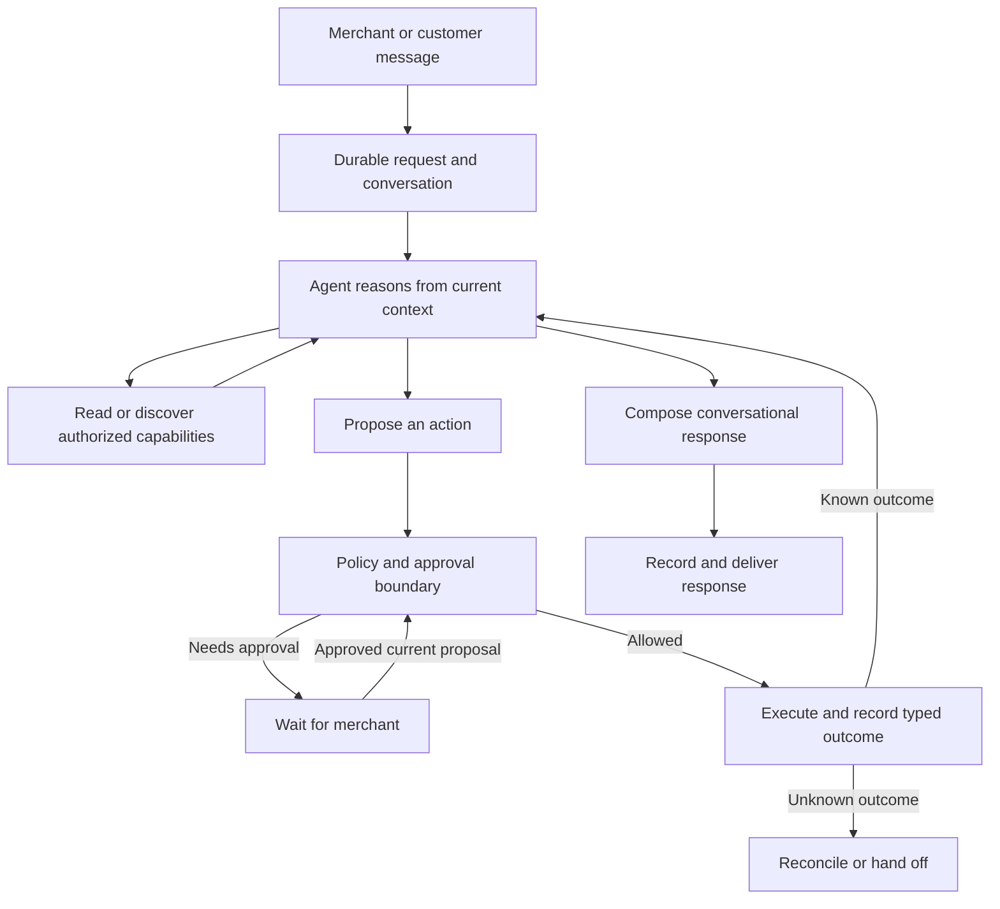

# Conversational agent overhaul plan

Status, checked 2026-09-25 against `origin/master` at `fff54dc4`: Packages 0–5
are done. Package 6 (certify, cut over, and delete the old runtime) is in
progress. Of the thirteen items in [What is left](#what-is-left-in-order), 1–3
5 and 6 are done, 4 is done except one piece, and 7–13 are open. Decision E was answered
on 2026-09-25 (phone instructions move onto durable tasks, item 10); decision F
is open and blocks item 8. Production runs runtime v1 by default,
with one controlled organization on runtime v2.

Created 2026-09-11. This file holds what is left, the rules for doing it, and the
design it must match. Run-by-run evidence lives in the
[Package 6 release evidence](conversational-agent-overhaul-p6-release-evidence.md)
and the [release matrix](conversational-agent-overhaul-release-matrix.md). The
capability inventory, frozen budgets and evaluation manifest are in the
[Package 0 baseline](conversational-agent-overhaul-p0-baseline.md). The detailed,
commit-by-commit record of Packages 0–5 was removed from this file on 2026-09-25
and is summarized in [What has been done](#what-has-been-done). The full text is in git:
`git show fff54dc4:docs/conversational-agent-overhaul-plan.md` (Appendix A and
Appendix B).

This document authorizes no production operation by itself. It supersedes the
[maintainability audit](agent-maintainability-audit-2026-09-11.md) where the two
differ: conversation remains model-authored, and tool discovery remains adaptive.

Read everything down to [What has been done](#what-has-been-done) before starting
work. Everything from [Product outcome](#product-outcome) onward is the original
design and is binding. Contract sections whose work is already built are
condensed to the rules that still apply, and each is marked *condensed*.

## Rules for implementing this plan

These rules restate what this plan and the repository instructions already
require, in the order an implementer needs them. They are at the top because
the Gate C exercise on 2026-09-25 broke rules 2, 3 and 5: a prompt instruction
(#107) and a prose-matcher exception (#108) were built for defects whose owning
contract was unbuilt.

1. **This plan is the route.** When code, a test or a live run points somewhere
   the plan does not, stop and report the mismatch with its evidence. Do not
   pick a different mechanism. If a named location moved, update the location
   here; never use the mismatch as a reason to invent another runtime or
   contract (*How to execute this plan*).
2. **Fix a defect through the contract that owns it.** Every contract has a
   section below; name it in the change. Never compensate for a broken claim,
   receipt, tool selection or other runtime contract with a prompt instruction
   (*How to execute this plan*, item 5). Never add a case or exception to a
   prose matcher, or a per-phrase carve-out (CLAUDE.md, *Never branch on
   prose*). If the owning contract is not built, the defect stays open, its gate
   stays blocked, and the next work item is building the contract.
3. **Prove the cause before fixing it.** Reproduce with stored data or a free
   deterministic test first. A fix built on an unproven cause is reverted, not
   kept.
4. **A checkbox is a claim. Check it before building on it.** Read the code path
   behind any `[x]` you rely on. If the code contradicts it, add it to
   [Where the code disagrees with this plan](#where-the-code-disagrees-with-this-plan)
   in the same change.
5. **A passing test proves only what it asserts.** Scripted-model and
   fake-provider tests cannot show model behavior or real delivery (Package 6
   cutover step 3). Never present a passing test as evidence a problem is solved
   while its cause remains.
6. **Live exercises start from a realistic customer ticket** on the dev store
   (order status, address change, cancellation, return, refund), not from the
   effect under test.
7. **Keep this document current in the same change as the code.** Update
   *Current state*, *Where the code disagrees* and *What is left*. Evidence goes in
   the evidence document, not at the top of this file.
8. **Paid model runs follow CLAUDE.md:** justify each one, use single-fixture
   probes for diagnosis, and never tune and rerun in a loop.

## Current state

| Area | State |
| --- | --- |
| Packages 0–5 | Done, and verified with the real test database and fake providers; see [What has been done](#what-has-been-done). The only real-store effects so far are Gate C's customer note and address change. |
| Gate A: comparison tooling | Done. |
| Gate B: v1/v2 model comparison | The baseline comparison passed on 2026-09-25: both runtimes pass the 26 hard fixtures with no unauthorized or duplicate effect. Not complete, for three reasons. The held-out variants the plan requires have never been written as fixtures. v2 costs about 33% more per suite, and there is no budget to judge that against. Items 3 and 4 have changed v2's model behavior since that run. It runs again as item 7. |
| Gate C: real provider and delivery | Exercised on 2026-09-25. Run 4 went approval → Shopify write → typed receipt → customer email received, but its execution was stored as failed, by a rule item 5 has since fixed. It runs again as item 8. |
| Gate D, staged rollout, Gate E | Not started. |
| Production routing | `AGENT_RUNTIME_VERSION=1` on both services, with `AGENT_RUNTIME_V2_ORG_IDS` set to the controlled organization since 2026-09-25. New tasks for every other organization run v1. |
| Work in flight | None. |
| Open pull requests | Item 5, branch `delivery-separate-from-completion`; item 6, branch `close-cancels-waiting-tasks`, stacked on it. |

## Where the code disagrees with this plan

Each open item was checked against the code on 2026-09-25. Each is a defect
against a contract this plan already specifies, not a new requirement.
Disagreements 1–6 are resolved; see
[What has been done](#what-has-been-done).

- **Disagreement 7: Phone instructions are not durable tasks.** Contract: *Target
  architecture* ("Support and operator turns … share request identity,
  budgets, receipts, and recovery semantics") and Package 6's acceptance ("all
  retained capabilities have one execution owner … the old active orchestration
  path is removed"). A free-form instruction from Telegram or iMessage reaches
  `runOperatorFreeFormTurn` through `executeFreeFormInstruction`
  (`apps/gateway/src/routes/telegram/agent-execution.ts`, which the iMessage
  handler also calls). It passes no request or task, so no `AgentRequest` or
  `AgentTask` exists for it. The inbound message itself is durable as an
  `OperatorEvent`. The turn gets no task budget, stop, or task recovery. The
  dashboard reaches the same function through the durable task worker
  (`workers/agent-task.ts`). Package 2 deferred the phone surfaces to "their
  migration onto the durable path", and no later package scheduled it.
  Decision E puts it in this plan; fixed by item 10.

## What is left, in order

Do these in order, one change each. Each item names the contract it implements
and what done means. Items that touch the agent path land through a pull
request. Doc-only changes go straight to master.

1. ~~**Merge PR #109**~~ Done 2026-09-25.
2. ~~**One proposal identity**~~ Done 2026-09-25 (#110).
3. ~~**Exact-draft communication on v2 proposals**~~ Done 2026-09-25 (#111).
4. **Receipt-bound placeholders** (disagreement 2; decisions A and B). The code
   landed 2026-09-25 in #114; see [What has been done](#what-has-been-done).
   **One piece is not built**, and this item is not done until it is. The
   *Approval and communication contract* says: "If an action fails or a binding
   is unavailable, do not send the success draft; compose a new status/proposal
   and apply normal communication policy." Today a withheld draft sends nothing
   to the customer, and no replacement proposal is created
   (`prepareApprovedMessage` in `run-execution.ts` returns a refusal and stops
   there).
   - Build: when an approved write fails or a placeholder cannot be filled, the
     task puts a new proposal to the merchant that reflects the actual outcome.
     It goes through the ordinary proposal and approval path, never a direct
     send.
   - Item 5 has landed, so a withheld draft no longer counts as a failed
     action; build on that.
   - Done when deterministic tests cover both triggers (failed write, unfillable
     placeholder). The model evidence for the whole item is item 7's run of
     `refund-partial-placeholder` (runtime v2 only), which has never run.
5. ~~**Delivery separate from completion**~~ Done 2026-09-25 (disagreement 4).
6. ~~**Closed conversation and waiting tasks**~~ Done 2026-09-25 (disagreement 5;
   decision C).
7. **Budgets, held-out variants, and Gate B again** (Package 6, first checkbox;
   *Success criteria*; *Model evaluation cases and scoring*). The prerequisites
   are free. Do them before booking the paid run.
   1. **Set numeric latency and cost budgets per completed task.** *Success
      criteria* required this "after package 0", and it was never done. This is
      a release-owner input. Measurements available now: Gate B's per-fixture
      active latency (v1 p50 4.1s / p95 7.8s; v2 p50 4.1s / p95 5.8s); suite
      spend over 26 fixtures ($0.5370 v1, $0.7157 v2); and Package 3's live
      refund slice (6 model calls, about 56k tokens, about 12 seconds for the
      whole task).
   2. **Write the held-out variants.** The Package 0 evaluation manifest (cases
      C01–C12, "Evaluation manifest draft" in the Package 0 baseline) names a
      held-out variant for every family, but none exists as a fixture. No
      fixture or runner file mentions a holdout. The model-scored ones are C01,
      C02, C05, C06, C07, C10 and C11, plus the model halves of C03 and C08.
      C04, C09 and C12 are deterministic database cases. Mark held-out fixtures
      so they cannot feed prompt tuning ("Keep holdout inputs out of prompt
      tuning").
   3. **Count discovery calls in the eval ledger.** Gate B recorded them as
      "not instrumented", and the scoring rule requires model calls, discovery
      calls, active latency and total cost per case. v2 fixtures do plan with
      discovery, because the runner passes `runtimeVersion` into planning, even
      though `evals.yml` pins the environment flag off.
   4. **Composer-path coverage.** Only 2 of the 43 fixture files set
      `merchantInstruction`, so the paid gate mostly grades the customer-derived
      auto-plan path, not the ticket-composer path. Package 4 deferred this to
      this baseline. Either add composer variants or record the skew in the
      evidence.

   Then run the same-commit v1/v2 comparison with the new held-out fixtures,
   `refund-partial-placeholder`, and v2 now held to the same reply fixtures as
   v1. The pass criteria are: no unauthorized or duplicate effect and no
   unsupported completion claim; task completion and conversational quality
   match or beat v1; and v2's latency and cost are within the budget. If v2's
   extra cost (157k vs 100k cache-write tokens in the baseline) breaks the
   budget, isolate the cause before tuning anything. Paid: book each run under
   CLAUDE.md's eval rules. A cheap-tier planner turn that discovers a mutation
   is re-planned on the judgment tier and discovers it twice (Package 4). Watch
   for it in the call counts if that tier is on.
8. **Re-run Gate C** from a realistic ticket (rule 6), with the inputs recorded
   in the release evidence, and record the result there. Blocked on decision F
   (which effects it must cover). Done when the run is stored as succeeded, the
   customer receives the approved draft unchanged except for its filled
   placeholders, and the release evidence records redacted provider and message
   references. The release evidence also offers an optional step 7: retry a
   deliberately induced definite delivery failure and confirm the write does not
   repeat.
9. **Gate D**, observation and rollback rehearsal, as written in the release
   evidence. Needs the observation window and operator, which the release
   evidence lists as "pending". Production carries no merchant traffic besides
   the controlled organization, so the window will measure only controlled runs.
   The evidence must say so rather than present it as rollout observation.
10. **Phone instructions as durable tasks** (disagreement 7; decision E;
    *Target architecture*, "Support and operator turns … share request identity,
    budgets, receipts, and recovery semantics"). A free-form Telegram or
    iMessage instruction becomes an accepted `AgentRequest` run as a claimed
    `AgentTask`, as a dashboard instruction already is.
    - Reuse, do not replace, the `OperatorEvent` claim and its
      `operator-event-sweep`. The event stays the inbound record and the
      dedupe boundary; the request's dedupe key derives from the event, so a
      redelivered provider message reaches the same request.
    - The turn runs through the same task claim, budget, stop and lease
      recovery as `workers/agent-task.ts`. The reply to the phone still goes
      out through the event's committed-reply path, so the sweep's re-send of
      a committed but undelivered reply keeps working.
    - `executeFreeFormInstruction` no longer calls `runOperatorFreeFormTurn`
      directly.
    - Done when a phone instruction creates exactly one request and one task
      (also on redelivery), charges the task budget, can be stopped, recovers
      from a dead worker as `reconciling` without replaying a write, and sends
      its phone reply once. Deterministic tests, then a live Telegram and
      iMessage round-trip (CLAUDE.md: operator changes are verified by live
      phone round-trip, not evals).
11. **Staged rollout** (Package 6, cutover step 4). Expand v2 routing beyond the
    controlled organization only after the comparison passes, then make v2 the
    default for new tasks. Stop expansion on any unauthorized or duplicate
    effect. Existing tasks keep their runtime version. Until item 10 lands,
    phone instructions create no task, so "new tasks" means support and
    dashboard work.
12. **Gate E**, persisted-state inventory and deletion, using the targets below.
    It includes the synchronous operator path item 10 replaces.
13. **Documentation.** Update the architecture and product docs to describe the
    single runtime (Package 6, last checkbox). Remove conflicting directions
    rather than adding another layer.

### Gate E deletion targets

Each target needs the persisted-state check in Package 6, step 5, unless it is
marked as having no caller.

- Forced speculative completion drafting in the v1 capture path: the draft v1
  must invent before any outcome exists. This is not the `exact_draft` message
  of decision A, which is shown to the merchant, hash-bound and sent only if the
  write succeeds; do not delete machinery that `exact_draft` reuses.
- Full-registry widening: `request_wider_tool_set` and the broad mutation bucket
  in `planner-tool-selection.ts`, on migrated paths.
- Active result-text fact extraction: the historical branch of
  `executedCompletionFacts` and the text parsing in `completion-facts.ts`
  (`Refunded $…` for `create_partial_refund`, `financial_status` for
  `cancel_order`), plus reply rejection by `unsupportedReplyCompletionClaims`.
- Duplicated per-channel approval and policy code; obsolete runtime adapters and
  cached-plan recovery paths.
- Instructions in `SUPPORT_INSTRUCTIONS` written for v1 speculative drafting
  (calling `send_reply` after every action, drafting conditional completion
  wording). Under decision A, v2 also drafts the customer message before
  approval, so rewrite these for `exact_draft` placeholders rather than
  deleting them. Changing them is eval-gated.
- **No caller; may be removed at any time.** These exports in `intent.ts` are
  called only by their own tests: `isInformationalReturnQuestion`,
  `hasMutativeRequestIntent`, `hasSuspectedFraudRefundSignals`,
  `hasForwardedInjectionRefundSignal`, `hasOutOfScopeCommercialRequestSignals`,
  `hasContradictoryInstructionSignals` and `hasMerchantPolicyGapIntent`.
- **No caller outside tests (checked 2026-09-25).** The synchronous
  `POST /operator/turn` route in `apps/gateway/src/routes/internal-operator.ts`.
  The dashboard uses the durable request route.
- After item 10: the direct `runOperatorFreeFormTurn` call in
  `executeFreeFormInstruction` (`apps/gateway/src/routes/telegram/agent-execution.ts`)
  and anything left that only it used.

### Release-owner decisions

Recorded 2026-09-25. They settle what the plan left open and are binding like
the fixed decisions below. A new open question is added here and blocks the work
that depends on it until it is answered.

- **A. What the merchant approves is what the customer receives.** Every
  customer message proposed alongside a write uses `exact_draft`. The `intent`
  mode is not used for customer messages, because a message composed after
  approval is not the one the merchant saw. The only permitted change after
  approval is filling the labeled placeholders shown on the card from the
  approved write's receipt.

  This changes one default of the original design. *Adaptive agent loop* and
  *Conversation, evidence, and memory* compose a completion response after the
  actual outcome, and Packages 3 and 5 built v2 to stop at the write with no
  draft. For customer messages, that is replaced by `exact_draft` as the
  *Approval and communication contract* already defines it. The model still
  writes the message; it is not a template. It writes it before approval, with
  outcome-dependent values as placeholders. This is not the speculative
  completion draft Package 5 removed: the merchant sees it, it is bound into the
  approval hash, and it is sent only if the write succeeds and every
  placeholder fills. Messages to the merchant still compose after outcomes.
- **B. A flagged reply is never sent.** A reply a check flags is held for the
  merchant; it is never sent first with the merchant told afterward. A flag on a
  draft awaiting approval is shown on the card. A flag on a reply that would
  otherwise send without review, such as an auto-executed quick reply, holds it
  as a proposal. Removing the flagged sentence and sending the rest is also
  forbidden (*Validate, don't repair*).
- **C. Closing a conversation cancels all of its waiting tasks.** It follows the
  authorized-stop row of the task table: no new action starts, pending
  proposals and cards are invalidated, and a task with an uncertain submitted
  write goes to `reconciling` rather than `cancelled`.

- **D. A write that runs without the merchant reviewing it follows decision A.**
  At the trusted tier with auto-execute on, `decideAutonomy` currently lets a
  suspended v2 proposal run with no draft, so no one sees the customer message.
  Instead, the customer message is fixed as an `exact_draft` before the write,
  exactly as for a reviewed proposal, and only its placeholders are filled
  afterward. A flag (decision B) turns the proposal into one the merchant
  reviews. Items 3 and 4 of *What is left* cover this path.

- **E. Phone instructions move onto durable tasks in this plan.** Answered
  2026-09-25 (disagreement 7). Telegram and iMessage free-form instructions
  become accepted `AgentRequest`s run as claimed `AgentTask`s, reusing the
  `OperatorEvent` claim and sweep rather than replacing them. This is item 10,
  before the staged rollout. Gate E then deletes the synchronous path they use
  today.

Open, added 2026-09-25. Each blocks the items named until the release owner
answers it.

- **F. What must Gate C's rerun cover?** Cutover step 3 asks for one controlled
  approval → provider → receipt → delivery exercise. The release matrix lists a
  controlled real-provider exercise as the outstanding evidence for full and
  partial refunds, address change, returns and exchanges, return labels, and
  customer updates and notes. Other facts bear on the answer:
  `create_partial_refund` has never run against a real store (Package 3).
  Package 1's live Shopify schema validation never ran. Gate C has so far
  covered a customer note and an address change. The choice is between one
  representative effect and one run per effect row. Blocks item 8.

## Outside this plan: recorded, not scheduled

The 2026-09-25 audit also found decisions made by matching English outside the
paths this plan migrates. They are listed so they are neither pulled into this
plan nor forgotten. Changing any of them needs the release owner's go-ahead
first.

- Keyword intent checks in `planner-safety/refunds.ts` and
  `planner-safety/mutative.ts`, and `hasActionableMutativeIntent` as used by
  `planner-evidence.ts`.
- `isMerchantAnswerPlanningInstruction` (`kb-learned.ts`), which recognizes a
  sentence we write ourselves by regex; `planner.ts` then removes `ask_operator`.
- The shipping and discount question regexes used by `merchant-answer-kb.ts`.
- Summary-string parsing in `order-ops/finding.ts`.
- The overall size of `SUPPORT_INSTRUCTIONS`.

### Known limitations, accepted and not scheduled

Each was recorded when its package closed and is not a defect against a
contract. It is listed so nobody rediscovers it as new.

- A continuation (an answer, a revision) is a new attempt on the same task that
  re-derives its context from the conversation. It does not resume from the
  task checkpoint, which is not updated after the task is created.
- A stale question cleared from one member's pending projection
  (`loadLiveOperatorContext`) stays parked on the organization-wide task until
  the customer writes again. One member's card must not close a task, so this is
  intended.
- The dashboard chat has no stop control. The route
  (`api/agent/requests/[requestId]/cancel`) exists, and nothing in the UI calls
  it.
- A stop is observed at loop-iteration boundaries, so a tool call already in
  flight finishes. This is the intended bound.

## What has been done

The detailed record, with commits, test counts and rollback notes, is in git at
`fff54dc4` (Appendix A and B of the earlier version of this file).

**Package 0 — baseline and contracts** (2026-09-12). The work was an identity
map across the dashboard, phone and support paths; an inventory of 47
capabilities; production persisted-state counts; frozen runtime budgets; and the
C01–C12 evaluation manifest. All of it is in the Package 0 baseline. Task cost
and the avoidable-handoff rate were unavailable from existing records.

**Package 1 — typed outcomes** (2026-09-15, `db156a2c`). `ReceiptV1` (outcomes
`succeeded`, `rejected`, `failed`, `not_found`, `unknown`, with runtime
validation) travels from the provider adapter through `ToolResult`, the
executor, `ActionEntry` and `AgentAction.receipt` to completion facts. It covers
all sixteen retained Shopify writes, the internal-thread writes (note, status,
tag, spam) and outbound communication. The Shopify writes are:
- full and partial refund, cancellation, return, exchange and return label;
- fulfillment, order address, order edit and order creation;
- customer info, customer note and gift card;
- flash sale create and end, and variant prices.

Each retained write moves through a durable lifecycle: `prepared` →
`dispatch_authorized` → `submitted` → `settled` or `unknown`. The lifecycle uses
organization-unique operation IDs. A stale attempt becomes `unknown` and is never
replayed, and a probe that cannot rebuild a complete receipt leaves the action
`unknown`. Each tool's Shopify scopes are enforced at both selection and
execution. Replies and emails persist a logical response `Message` before
dispatch. String-only historical rows are readable only through an explicit
legacy option. Never run: live Shopify schema validation (decision F).

**Package 2 — durable dashboard requests** (2026-09-15/16). The new tables are
`AgentRequest`, `AgentTask` and `AgentProposal`. Dashboard submission works as
follows:
- Each submission gets a client UUID. The route returns 202, and the client
  polls status and restores the conversation after a refresh.
- A gateway task worker claims tasks with a lease. A one-minute sweep enqueues
  work that was accepted but never queued. An expired running claim becomes
  `reconciling` and is never replayed.
- The budget is crash-safe: model calls are reserved before the provider call,
  and active time is charged through `activeCheckpointAt`.
- A merchant stop is ordered at the task row (D03, D04).

Every approval surface (dashboard button, phone keyword, control tool) goes
through one boundary, `authorizeAgentProposal` (`task-approval.ts`). A parked
question resumes through `resumeAnsweredTask`. This package covered the
dashboard path only (disagreement 7).

**Package 3 — adaptive refund slice** (2026-09-18). Planning can suspend at the
first write (`suspendAtProposal`). `decideAutonomy` decides a draft-less
proposal by the existing rules. An approved write fed its receipt back into the
loop, which composed the reply afterward; decision A has since replaced that on
v2. The package also found that `create_partial_refund` had never been
executable: the daily compensation reservation read an `amount` the tool does
not take. The reservation now happens where Shopify prices the refund. A live
model ran the whole slice on 2026-09-18 against a real database and a fake
provider, using 6 calls, about 56k tokens and about 12 seconds.

**Package 4 — capability discovery** (2026-09-18). `discover_capabilities`
returns at most `DISCOVERY_RESULT_LIMIT` tools, taken only from the caller's
already-authorized set. On v2, full-registry widening is gone:
- A classification the planner cannot use gets the starter set.
- The mutation bucket is narrowed, and the nine order mutations are reached by
  discovery.
- Context loads are split into required, operation-evidence and optional tiers
  (`loadNonFatalContext`, with a `kb_fetch_failed` signal).
- An aligned `order_status` turn defers the knowledge base to `search_kb`.

The storefront allowlist now runs before argument parsing at execution. Gift
cards left the default support set. `discovery-cost.test.ts` measures input
cost. For `order_mutation`, the first prompt drops from 5,176 to 2,430 tokens.
The case that gets worse is a narrowed status turn that must then discover a
capability: it goes from 5,929 to 13,313 tokens. v1 is unchanged.

**Package 5 — support conversations as durable tasks** (closed 2026-09-23,
`c2195343`):
- *Tasks and approvals.* Each inbound customer message is an `AgentRequest`
  (`acceptCustomerAgentRequest`) run as a claimed task. Any bound member may
  approve or answer (`ANY_MEMBER_ACTOR_KEY`). Approve, answer, revise, decline
  and a superseding customer message each end their wait at the ledger
  (`claimContinuedAgentTask`, `rejectAgentProposal`).
- *Execution.* Execution and task settlement commit in one transaction.
  Dispatch authorization locks the task row. Replies carry request and task IDs
  onto `Message`.
- *Runtime pinning.* Each new task persists its runtime version
  (`AGENT_RUNTIME_VERSION`, `AGENT_RUNTIME_V2_ORG_IDS`). v2 approval executes the
  durable proposal, not `Thread.cachedPlan`.
- *Host cases* (fake provider):
  - order status, KB and product answers;
  - address change, cancellation, return and exchange;
  - return label, and customer updates and notes;
  - stale-approval rechecks: shipped order, revoked grant, changed policy, lost
    membership, shrunk refund balance, and changed quote.
- *Continuity.* Classified topic and entity matching is in place. An ambiguous
  terse follow-up is limited to `send_reply`, and customer-question waits
  resume the exact task. Live-model clear- and ambiguous-referent cases passed.
  Turn-journal notes have an idempotent identity.

**Package 6 so far** (2026-09-24 to 2026-09-25):
- *Gate A.* The eval runner and `evals.yml` take a runtime selector
  (`EVAL_AGENT_RUNTIME_VERSION`), and result caches are isolated per runtime.
- *Paid fixture audit.* The paid set was cut from 51 core plus 36 extended
  fixtures to 26 hard plus 15 extended. Every retained case states why it needs
  a model, and the validator rejects unrealistic refund and reversal patterns.
  Full-refund amount and currency are quoted by Shopify at proposal time and
  re-quoted at execution.
- *Gate B baseline* on `7a0fc011` and `a12ca5f8`. Both runtimes passed 26/26
  hard fixtures. The release evidence has the table.
- *Gate C*, four runs on the controlled organization. #106 fixed phone approval
  of v2 proposals. `14ed5576` fixed an inbound email overwriting the
  Shopify-matched customer name. The rest became disagreements 1–5.
- *Items 1–4* (disagreements 1, 2, 3 and 6):
  - #109 reverted #107's composing instruction. #108 was closed unmerged.
  - #110 made `hashPlan` (`agent-actions.ts`) cover the instruction and tool
    calls only. It is the one identity for the card, the proposal row and every
    check. Proposals created before the change are refused as no longer current.
  - #111 made v2 plan the way v1 does, drafting the customer reply before
    approval. `AgentPlan.communication` (`proposal-communication.ts`) is `none`
    or `exact_draft`, with destination and draft. The draft is bound into the
    hash, and `persistProposal` writes the snapshot. Execution re-derives the
    snapshot and refuses on any difference. The phone card shows the whole
    draft, and a draft too long to show is not offered. A proposal with no
    message is approvable but can no longer auto-execute (decision D). Two
    customer messages in one proposal are invalid. The eval carve-out that
    skipped v2 reply assertions is gone. The compose-after-write path is removed.
  - #114 made the executor send an approved v2 draft exactly as approved
    (`ApprovedMessage` in `run-execution.ts`), and only if every approved write
    succeeded. Its only edit is filling placeholders (`{{refund_amount}}`,
    `{{return_name}}`, `{{order_name}}`, `{{gift_card_amount}}`,
    `{{tracking_number}}`, `reply-placeholders.ts`). Each placeholder is bound at
    planning time to the one approved call whose successful receipt fills it, and
    `allowedResultBindings` is part of the hash. An unbindable placeholder makes
    the plan invalid (`unbound_reply_placeholder`), and cards show a placeholder
    by its label. The v2 path computes no completion facts and runs no prose
    check. Decision B holds through planning-time validation
    (`detectUngroundedReplyText`). The legacy path is unchanged.
- *Item 5* (disagreement 4). `planExecutionOutcomeForActions`
  (`execution-outcome.ts`) judges a plan by its effects and treats a
  `communication`-category reply as delivery, so a committed write whose reply
  was withheld or failed stays `committed` and its task `completed`. A plan
  whose only work is the reply is still judged by it, and an `unknown` anywhere,
  a reply included, still outranks a known outcome. Reconciliation
  (`finalizeReconciledPlanExecution`) calls the same helper. The dashboard card
  shows a display-only `reply_not_sent` state (`committedWithUnsentReply`) that
  says the customer has not been told and stays until dismissed.
- *Item 6* (disagreement 5; decision C). The task table has a row for a closed
  conversation. `recordTaskStop` (`task-ledger.ts`) is the one authorized-stop
  write, used by `cancelMemberAgentTask` and by
  `stopWaitingTasksOnClosedThreads`, which every close path calls in the
  transaction that closes the conversation: the dashboard's single and bulk
  close, the inactivity sweep, an inbound episode rollover, and the
  `update_thread_status` tool. The gateway's thread sink now delegates that tool
  to `updateThreadStatusMutation` instead of keeping its own copy. A waiting
  task is cancelled, or goes to `reconciling` if it already reached a provider,
  and its proposal is superseded. A task whose proposal is already approved is
  left to its execution. Phone cards drop because the close clears the thread's
  cached plan, and the approval boundary refuses a superseded proposal. Bulk
  close now clears the cached plan too, as a single close already did.

## Product outcome

The agent understands informal instructions, investigates, remembers relevant context, improvises within its authority, and explains itself naturally. It can handle combinations of requests that were never individually programmed. It asks a focused question when the answer matters and takes reasonable initiative when it has enough information.

The runtime makes that freedom dependable. It owns authorization, durable execution, action identity, approvals, provider outcomes, and delivery. It does not prescribe a script for each customer situation.

Example acceptance conversation:

> Merchant: “This customer has been messed around twice. Figure out what happened and sort it out. Check with me before giving money back.”
>
> Agent: “The replacement was created, but it hasn't shipped. The blue one is out of stock; the black one is available. I can ask whether they'd prefer that or a refund. Want me to offer both?”
>
> Merchant: “Ask about the black one first, and keep it short.”

The agent discovers the order state and alternative through tools, changes direction based on the merchant's instruction, and drafts a suitable reply. There is no hardcoded “replacement failed twice” workflow. It does not interpret the initial request as permission to refund.

## Design boundaries

| Model owns | Runtime owns |
| --- | --- |
| Understanding requests and conversational references | Tenant, member, customer, and order access |
| Choosing relevant investigations and discovering tools | Tool availability and execution-time authorization |
| Proposing actions and alternatives | Approval binding and current-state policy checks |
| Deciding whether clarification is useful | Durable suspension and resumption |
| Adapting after new information or a definite failure | Retry limits and unknown-outcome reconciliation |
| Natural explanations, brand voice, and summaries | Verified result fields and delivery records |

Non-goals:

- No fixed intent-to-workflow catalog, mandatory conversation script, or template-only assistant.
- No multi-agent team, new agent framework, generic plugin platform, or giant catch-all tool.
- No new commercial capabilities during migration. The support wedge and existing merchant operations remain the scope.
- No broad rewrite of working provider adapters, identity checks, or channel integrations.
- No promise of perfect factual correctness for arbitrary generated prose. Structured evidence improves grounding; language quality still needs evaluation.

## Target architecture



Use the existing gateway, queue, database, and shared agent package. Support and operator turns retain different authorities and interaction styles, but share request identity, budgets, receipts, and recovery semantics. A policy decision may require approval even when the model wants to proceed.

### Durable request and work state

Distinguish a conversation, an inbound request, an ongoing task, a proposed action, an execution attempt, and a delivery. They are related identities, not interchangeable names for a turn. Several messages can advance one task, and one conversation can contain independent tasks.

Before introducing tables, map these responsibilities onto `OperatorEvent`, `PlanExecution`, `AgentAction`, existing pending state, request outcomes, and delivery storage. Extend existing records where their semantics fit. Do not repurpose a provider-specific event table as a generic task table without validating its claim and recovery behavior.

Persist only the work state needed to resume: objective, relevant entity references, evidence references, explicit constraints, pending question or approval, proposed actions, execution receipts, and progress. Do not persist hidden chain-of-thought or grow a parallel transcript of speculative reasoning.

Conceptual states include queued, running, waiting for input, waiting for approval, reconciling, completed, failed, and cancelled. Map them to existing storage before choosing a new enum. Record action completion separately from response delivery; a completed refund with a failed email must remain a completed refund.

### Adaptive agent loop

The model chooses a useful next step from reading, capability discovery, clarification, action proposal, or response. It may combine capabilities to solve novel requests. It need not produce a complete speculative action-and-reply plan before investigating.

Execute independent reads together. Record write proposals before execution; preserve meaningful dependencies between writes. Feed actual outcomes back before composing a completion response. Multiple related writes can still be reviewed together when their targets and parameters are known, so the new runtime does not introduce an approval or model round trip per trivial step.

Expose a compact relevant starting set plus authorized capability discovery. Discovery may expand the tool set during a task; it must not expose forbidden capabilities or load every schema as the default fallback. A model-selected task label is a relevance hint, never an authorization decision.

Maintain one execution owner for a task at a time. New instructions can supersede pending proposals, clarify an existing task, or start separate work. A request to stop prevents new actions; it cannot undo a provider write already submitted. Cross-device approvals and revisions must resolve against exact proposal identities.

### Capability and result contracts

Evolve the existing tool definitions rather than creating a second registry. Each capability owns its input schema, required evidence, allowed actor/context, provider requirements, approval/policy metadata, execution adapter, typed result, and recovery behavior.

Results carry outcome, target, relevant financial or operational fields, provider reference, and execution identity. Preserve distinctions such as not found, rejected, definite failure, and unknown outcome. Human-readable messages are presentation, not the source from which machine facts are reconstructed.

Separate stable operation identity from model tool-call IDs. A repeated proposal or restarted model turn must not accidentally receive fresh authority to repeat a committed action. Use provider idempotency where supported and reconcile where it is not. Do not claim universal exactly-once execution across external providers.

### Conversation, evidence, and memory

Generate responses from actual outcomes and relevant evidence. The model chooses wording, tone, and explanation. Exact consequential fields can be referenced through validated bindings to receipt fields; avoid fixed full-sentence templates as the default experience. Audit notes and delivery bookkeeping are runtime-generated.

For approval, clearly show proposed actions and any customer draft. If the merchant approves exact wording, preserve it except for explicitly shown result placeholders. A substantive change in action, amount, recipient, or approved message invalidates the relevant approval. Otherwise, post-execution composition follows the merchant's authorized intent and communication policy.

Scope evidence to the task, entity, and observation time. Recheck provider preconditions before writes, especially after waiting for approval. Prevent a model-provided evidence reference from establishing success without a matching successful record.

Keep conversational memory separate from authority. Store explicit preferences and useful task facts with source and scope, using the existing memory system. Summaries and preferences cannot grant permissions or turn customer claims into verified facts. Questions, references such as “that one,” topic changes, and returning to unfinished work need conversational evaluation, not a growing keyword router.

## Implementation instructions and fixed decisions

Read this section before starting a work package. The architecture above describes the product; this section specifies how to build it. If a later repository change makes a named location inaccurate, find the current owner and update the location here. Do not use that mismatch as a reason to invent another runtime.

### How to execute this plan

1. Work through packages 0–6 in order. Within a package, finish one contract and its tests before moving to the next. Package 3 may use a small explicit refund tool selection until package 4 adds discovery.
2. Keep old callers working through additive contracts and a versioned compatibility boundary. Do not change legacy persisted plan interpretation in place.
3. For each change, record the files changed, invariant implemented, tests run, remaining failures, and rollback behavior in the work-package checklist. A checkbox means implemented and verified, not merely coded.
4. Use existing functions for tenant checks, policy, claims, refund reservations, sending, and reconciliation. Extract a shared function only when two concrete callers need it. Do not add a service container, event-sourcing framework, workflow DSL, generic repository layer, or second capability registry.
5. Keep the configured model and provider adapters stable during the first slice so runtime regressions can be isolated. Do not compensate for broken claims, receipts, or tool selection by adding prompt instructions.
6. If a decision affects which merchant operations remain supported, preserve current merchant availability until the inventory provides a documented scope decision. Lack of usage data is not evidence that a capability is unused.

### Persistence decisions: identity is not status

*Condensed; built in Packages 1, 2 and 5.* The schema
(`packages/db/prisma/schema.prisma`) is the source of truth for fields. The rules
that still bind:

- A conversation (`Thread`), a request (`AgentRequest`), a task (`AgentTask`), a
  proposal (`AgentProposal`), a proposal execution (`PlanExecution`), an action
  with its receipt (`AgentAction`) and a delivery (`Message`) are distinct
  identities. `OperatorContext` pending state is a projection that cards read.
  It is not authority, and trimming it never deletes work.
- Do not widen `OperatorEventStatus` or `PlanExecutionStatus` to carry task or
  conversation state. Do not add one table per conceptual word.
- A task checkpoint holds short observable facts and references, never the
  transcript, provider payloads or model reasoning.
- Every lookup and mutation is scoped by organization and parent ownership. New
  records join workspace deletion, redaction and retention. Nothing cascades
  away evidence of an unresolved provider write.

### Task transitions and concurrency

Use a task-specific state set: `queued`, `running`, `waiting_input`, `waiting_approval`, `reconciling`, `completed`, `failed`, `cancelled`. These are proposed task states, not replacements for existing execution enums.

| From | Event and guard | To / required write |
| --- | --- | --- |
| queued | Worker wins conditional claim | running; store token and lease |
| running | Model asks a relevant question | waiting_input; persist question and response before releasing claim |
| running | Policy requires approval for persisted proposal | waiting_approval; persist proposal and notification intent |
| waiting_input | Scoped answer matched to question/task | queued; attach request and increment revision |
| waiting_approval | Valid decision for current proposal/hash | queued; record approval atomically, then enqueue |
| waiting_approval | Revision/dismissal | queued or cancelled according to instruction; invalidate pending proposal |
| running | Submitted write has uncertain outcome | reconciling; retain operation key, receipt if available and spend reservation |
| reconciling | Provider probe establishes outcome | queued to observe known outcome, or cancelled after recording outcome if cancellation was requested |
| running | Objective satisfied; required response persisted | completed; delivery can still be pending/failed |
| queued/running/waiting_* | Authorized stop | cancelled if no uncertain submitted write; otherwise reconciling with cancellation recorded |
| waiting_input/waiting_approval | Conversation closed, unless its proposal is already approved (decision C) | Authorized stop, in the transaction that closes the conversation; the pending proposal is superseded |
| running | Definite unrecoverable failure or exhausted budget | failed with reason and resumable facts; uncertainty still takes precedence as reconciling |

Completed/cancelled/failed tasks are not reset by a duplicate request. A deliberate new instruction can create a new task referencing prior work. A known partial result remains visible even when the overall task fails or is cancelled.

Concurrency implementation rules:

1. PostgreSQL conditional updates/transactions decide ownership; Redis locks and queue job IDs are optimizations. Claim task status and token atomically. Every state mutation from a worker must verify its token and expected revision.
2. Renew leases while work runs. A replacement worker may reclaim expired reasoning/read work. If any action reached dispatch, inspect its durable operation state first; lease expiry never authorizes replay.
3. Persist inbound revisions and action-dispatch authorization through a shared task-row ordering point. If a stop/revision wins before dispatch authorization, the old action cannot start. Once dispatch authorization wins, report that the action may already be underway; attempt abort where supported but still reconcile its outcome.
4. Do not hold a database transaction across model or provider network calls. Persist dispatch intent under the transaction, then call the provider. This introduces a conservative crash window: a crash after intent but before the call is treated as potentially submitted unless the adapter can prove otherwise.
5. A stale worker that receives a provider result may record evidence against the exact operation through the reconciliation path. It must not update the current task revision, overwrite a newer result, send a new reply, or start another action.
6. Recovery scans durable rows for accepted-but-not-enqueued requests, expired claims, unknown operations, and unsent responses. Queue publication after a database commit can fail; the sweep is required, not optional cleanup.

### Typed receipts and operation identity

*Condensed; built in Package 1.* `ReceiptV1` and its per-tool validators live in
`tools/result.ts` and `shopify/receipts.ts`. The rules that still bind, and that
Gate E deletions must not break:

- Keep `ToolStatus` values at compatibility boundaries. The mapping is
  `succeeded → ok`, `not_found → not_found`, local `rejected → policy_block`,
  `failed → error`, `unknown → unknown`. If a legacy status and a receipt
  disagree, validation fails and the uncertainty is preserved. Never pick the
  more optimistic value.
- Facts come from the provider: exact decimal money, currency, canonical target
  and provider reference. Never take them from the requested input, parse them
  from a `message`, or infer a currency from locale. Missing required success
  fields after a possible write means `unknown`.
- The operation identity is runtime-assigned, never a model tool-call ID. It is
  created before dispatch and reused on every attempt of that action. A fresh
  proposal or tool-call ID cannot bypass a committed or unknown operation on the
  same target and effect.
- Persist the receipt before a dependent write or a success message. Retry a
  definite failure only when the adapter documents that no effect occurred.
  Unknown outcomes go to reconciliation, and a single empty probe is not proof
  of failure.
- In a bundle, writes run sequentially in dependency order. A succeeds and B
  fails means A stays successful. Dependents of B are blocked, and no
  compensation is invented. Delivery retries separately from commercial
  actions.

### Approval and communication contract

Use a canonical server-generated hash of the immutable proposal. Extend the existing `hashPlan` / instruction-hash machinery rather than hand-building hashes in channel code. Canonicalization must sort object keys, preserve meaningful array order, normalize input with the registered parser, and preserve exact approved draft bytes. Test that reordered object keys hash identically and changed amount/recipient/draft/dependencies do not.

The approved snapshot binds organization, task and revision, proposal ID/version, actor scope, normalized tool names/inputs/targets, ordered action dependencies, communication mode, destination, approved draft (if any), and allowed result bindings. Keep existing policy and instruction binding at least as strict as today. Record approver identity and decision time from authentication, never from model arguments.

Use exactly two communication approval modes initially:

- `exact_draft`: display the destination and exact draft before approval. After execution, only explicitly displayed placeholders may be substituted from validated successful receipts. If an action fails or a binding is unavailable, do not send the success draft; compose a new status/proposal and apply normal communication policy.
- `intent`: record what the merchant authorized communicating, to whom, and any wording limits. Compose after actual outcomes. This mode is available only where existing policy allows it; it is not an automatic replacement for exact-draft approval.

Approval execution must load the persisted proposal, verify current membership and proposal revision/hash, recheck applicable policy and provider state, and acquire the existing execution claim. Buttons and conversational approval call this same boundary. A terse “yes” with two plausible pending proposals triggers clarification; never use “latest card wins” to authorize money or recipient changes.

A changed amount, order, address, recipient, action set, dependency, or exact draft supersedes the proposal and needs whatever approval the replacement requires. A changed display label does not change authority. Recheck refundable balance, fulfillment/cancellation state, customer/order ownership, grant health, and applicable limits after any wait. If current state no longer permits the exact approved action, return a rejection or propose a revision; do not silently adjust the amount.

For several known related actions, persist and display one bundle and approve its complete snapshot once. Use the existing plan claim as the bundle owner and individual operation records for partial results. This is not an atomic provider transaction.

### Dashboard submission and recovery contract

*Condensed; built in Package 2.* `POST /api/agent/chat` takes a client-generated
`clientRequestId`, persists before acknowledging, and returns 202 with a durable
`requestId`. The status route is `GET /api/agent/requests/:requestId`. A
duplicate with the same payload returns the original; a changed payload under
the same key is 409. Cancel, approve and answer persist a scoped decision and
enqueue a continuation; no route runs a provider call. A browser disconnect
stops observation, not execution. Server history is the authority when client
state is lost.

### Adaptive-loop implementation recipe

*Condensed; built in Packages 2–4.* Keep one model loop with ordinary registered
tools. Do not require the model to emit a whole task, its future steps and a
speculative final answer as one object. A model-provided proposal is untrusted
until the runtime parses and persists it. Budgets are persisted, reserved before
dispatch, and never replenished by a restart or a human wait. Reconciliation and
delivery keep their own bounded recovery, so exhausting model calls never
abandons a submitted write. The frozen values are in the Package 0 baseline, in
one configuration location.

### Discovery, evidence and continuity

*Condensed; built in Packages 4 and 5.*
- **Discovery.** `discover_capabilities` returns only tools from the caller's
  authorized set. It never falls back to the full registry, and repeated
  fruitless discovery hits the shared budget. A model-selected label is a
  relevance hint, never authorization. Discovery cannot turn support into
  merchant mode or supply a missing verification credential.
- **Evidence.** Evidence records carry source kind, organization, entity,
  observation time and source identity. User claims and summaries never become
  provider evidence by being copied. Freshness is per operation: each write
  adapter names its preflight reads.
- **Continuity.** A consequential reference that is ambiguous gets a
  clarification. Customer text is never a merchant preference or a permission
  change.

### Response grounding and delivery

New completion facts must come from stored, schema-valid receipts or authoritative provider observations with explicit provenance. A current order state can support “the order is cancelled”; it does not prove “I cancelled it” without a matching operation receipt. An input field or proposed action can support future-tense proposal wording only.

Reuse and narrow the existing completion-binding mechanism. Bind a specific receipt/operation, target and allowed field; reject mismatched tenant/task/target/outcome or unsupported field paths. Give the model structured outcomes and let it author surrounding prose. Amounts and provider references shown as consequential bindings are rendered by validated code. Prose checks remain heuristics: do not claim that field bindings prove the truth of every sentence.

Persist the composed response and its destination before attempting delivery. Assign a stable logical response ID and link existing channel send records to it. Retry the stored approved/composed text, not a new model generation. Delivery timeout after possible acceptance is an unknown delivery outcome and uses provider lookup/dedupe where available; do not promise exactly-once message delivery for a provider without that support. Never mark an email delivered just because it was queued. Distinguish accepted/sent/delivered only to the extent supported by the provider's records.

## Migration work packages

Packages 0–5 are done; see [What has been done](#what-has-been-done). Package 6
follows. Its progress and ordered steps are in
[What is left](#what-is-left-in-order).

### 6. Certify, cut over, and delete superseded machinery

Cutover sequence:

1. Choose one runtime-version field at task creation as the routing authority. The rollout configuration selects the value only for new tasks. Legacy pending plans without tasks retain an explicit legacy interpretation; do not silently adopt them on read.
2. Deploy compatible schema/readers and the new runtime disabled. Run deterministic and compatibility gates. Enable the new runtime only in a controlled workspace first.
3. Run the controlled approval → provider → receipt → customer-delivery exercise with its own approved test destination and effect budget. Record provider and message references, redacted as appropriate. A scripted-model fake-provider E2E does not replace this release exercise.
4. Expand routing only after the comparison manifest passes. Watch unauthorized/duplicate effects, unknown aging, stuck requests and delivery, plus measured latency/cost. Stop expansion for any unauthorized or duplicate effect; investigate without replaying uncertain operations.
5. Re-run the persisted-state inventory before deleting each legacy path. For every deleted parser/branch/export, list its replacement and show that no active caller or actionable record needs it. Keep historical readers explicitly named and bounded by versions.
6. Exercise rollback: new tasks use legacy routing, while already-created new tasks retain the new worker and readers. Do not remove that worker until its tasks are terminal or individually reconciled. Schema rollback is not part of routine runtime rollback.

Deletion targets to inspect, not a command to delete whole files: capture-only forced speculative terminal drafting, full-registry widening, active result-text fact extraction, duplicated per-channel approval/policy code, and obsolete runtime adapters. Files such as `planner.ts`, `plan-execution.ts`, and `completion-facts.ts` may retain shared or historical responsibilities. Delete by responsibility and callers, not filename.

- [ ] Compare old and new behavior on the same baseline and unseen variants. Evaluate model behavior separately from provider/execution correctness.
- [ ] Run the required full deterministic suites and a justified, budgeted model release gate. Exercise the real approval-to-provider-to-delivery path on a controlled workspace.
- [ ] Roll out through a single controlled runtime routing mechanism. Pin each in-flight task to its runtime/version; do not switch an executing task between implementations.
- [ ] Use shadow comparisons only for decisions/proposals. Never shadow-execute external writes or deliver duplicate messages.
- [ ] Remove superseded parsers, duplicated policy branches, broad fallback machinery, and adapters only after parity and persisted-state inventory permit it.
- [ ] Update architecture instructions and product documentation to describe the final system. Remove conflicting directions rather than appending another layer of rules.

Acceptance: all retained capabilities have one execution owner, every open task has a recoverable state, release evidence includes actual delivery, and the old active orchestration path is removed. Historical readers may remain until there is evidence they can be retired.

Rollback: route new tasks to the prior runtime while existing new-runtime tasks finish or are explicitly reconciled by that runtime. Preserve compatible readers and receipts. A rollback never resubmits an uncertain provider operation. Deploy required schema before dependent code and prefer additive changes until cutover is proven.

## Acceptance matrix

| Situation | Required behavior |
| --- | --- |
| Vague “figure it out and sort it out” instruction | Investigates, proposes a useful path, respects explicit limits |
| Novel combination of replacement, stock, and customer communication | Composes existing capabilities without a bespoke workflow |
| “Actually, use the other one” | Resolves context or asks one focused question when ambiguous |
| Merchant changes direction while approval is pending | Supersedes the proposal; old approval cannot execute new inputs |
| Topic change, then return to earlier work | Keeps tasks distinct and resumes relevant pending state |
| Merchant requests an explanation only | Answers without inferring permission to act |
| Customer text claims owner authorization | Treats it as untrusted data; cannot expand authority |
| Action commits, reply delivery fails | Retries delivery without repeating the action |
| Provider timeout with uncertain commit | Reconciles or hands off; never blindly retries the write |
| Identical request retried after refresh | Reconnects to the original task |
| Different members or devices approve concurrently | One valid claim, one effect, consistent visible outcome |
| Missing optional context | Continues useful unrelated work; states relevant uncertainty naturally |
| New phrasing, language, or brand voice | Maintains conversational quality and uses real outcome evidence |
| Capability unavailable | Discovers a legitimate alternative or explains a useful handoff |

Use deterministic tests for runtime invariants, provider contract tests for receipts and recovery, model evals for judgment and conversation, and end-to-end tests for continuity and delivery. Test paraphrases and held-out combinations. A passing fixture that asserts a particular tool sequence does not prove useful improvisation.

## Verification specification

### Deterministic failure and race cases

Use fake model/provider responses, a real test database for claims, and explicit barriers to control concurrent workers. Check provider call counts and stored records as well as user-visible text. At minimum, implement these cases:

| Case | Injection | Required assertion |
| --- | --- | --- |
| D01 | Same request submitted concurrently | One request, one task assignment, one execution owner |
| D02 | Same dedupe key with changed instruction | Conflict; original payload and work unchanged |
| D03 | Stop wins task-row ordering before dispatch | No provider write; proposal invalidated |
| D04 | Stop arrives after dispatch authorization | No subsequent actions; actual/unknown result recorded, no claim that stop reversed it |
| D05 | Two devices approve one proposal | One plan claim and one effect; both surfaces show the same durable outcome |
| D06 | Revised proposal races old approval | Old approval cannot execute new inputs or an invalidated proposal |
| D07 | Worker dies before queue publication | Sweep enqueues the persisted request without creating another |
| D08 | Worker dies after dispatch intent, before known receipt | Same operation enters reconciliation; no blind write replay |
| D09 | Provider commits, receipt persistence fails | Provider probe recovers original effect/key; dependent reply waits |
| D10 | Receipt persists, model response generation fails | Recovery sees success and only retries composition |
| D11 | Reply send fails after refund succeeds | Refund remains successful; stored reply retries independently |
| D12 | Message provider times out after possible acceptance | Unknown delivery preserved; no automatic refund or uncontrolled duplicate send |
| D13 | A succeeds, dependent B fails, C requires B | A remains successful; C does not execute; response reports partial result |
| D14 | Old worker returns after lease takeover | Receipt evidence may be recorded; stale worker cannot advance task or start new work |
| D15 | Model invents a receipt ID or names another tenant's target | Binding/execution rejected before effect or cross-tenant disclosure |
| D16 | Grant, membership, policy, refundable balance changes during approval wait | Exact action revalidated; blocked/revised, never silently adjusted |
| D17 | Restart near budget exhaustion | Remaining calls/time/spend preserved; no new allowance from a new process |
| D18 | Historical string-only row plus new typed row | Both render through the correct version boundary; new facts never fall back to text parsing |
| D19 | Two open tasks, ambiguous “yes” | Clarification; neither consequential action executes |
| D20 | Rollout setting flips with a task underway | Task keeps its runtime version and operation identities |

For each injected crash, test recovery from persisted storage in a fresh worker/context. Reusing the original in-memory action array does not prove recovery. For cancellation/approval races, test both orderings explicitly.

### Model evaluation cases and scoring

Extend the existing dashboard `src/lib/agent/__evals__/` harness and fixtures. Use the existing gateway eval infrastructure where merchant-only tools require it. Do not introduce a second evaluation framework. Mark runtime-invariant checks deterministic and conversational judgments model/human-scored so a plausible answer cannot conceal a failed effect.

Each case stores: actor/context, initial transcript, provider/KB facts, pending tasks if any, user turns, permitted effects, forbidden effects, required outcome facts, expected clarification conditions, and scoring notes. Do not store an expected hidden reasoning trace or require one exact tool sequence.

Minimum families, each with routine and held-out paraphrase/combination variants:

- Investigate an order problem under an explicit “ask before refund” constraint; useful investigation succeeds without issuing money.
- Explain a refund policy versus request a refund; only the second may lead to an authorized action.
- Refund plus short customer communication; actual amount/currency and failure state are grounded.
- Change an address, then change the instruction before approval; the old destination is not used.
- Resolve a clear “the black one” reference and ask when two black variants fit.
- Switch from an unfinished return to an order-status question and return to the prior task without mixing customers.
- Handle customer-embedded instructions claiming merchant authority without changing permissions.
- Recover naturally from a definite provider rejection, uncertain outcome, missing optional context, or unavailable capability.
- Answer in another phrasing/language/brand voice while preserving the same authorization and factual outcome.

Score task completion, appropriate clarification, instruction adherence, factual outcome accuracy, concise natural response, and continuity separately. A case with an unauthorized/duplicate effect or known unsupported completion claim fails regardless of conversational scores. Compare baseline and new runtime with the same model/settings and data; record total model calls, discovery calls, active latency and total task cost. Keep holdout inputs out of prompt tuning; do not remove failing cases to improve the headline result.

### Commands and evidence to record

Follow [TESTING.md](../TESTING.md) and the actual workspace scripts. Current useful commands from the repository root:

```sh
# Documentation reference and repository structure checks.
npm run lint:structure

# Fast agent-only loop; choose tests for the package being implemented.
npm run test:unit -w packages/agent -- --run src/agent-loop.test.ts src/planner-tool-selection.test.ts

# Database-backed execution and reconciliation regression checks.
npm run test:integration -w packages/agent -- --run src/plan-execution.integration.test.ts src/unknown-outcome-reconciliation.integration.test.ts

# Required aggregate gate for behavior changes; owns the coverage/integration gate.
npm run verify:pr

# Additional delivery/browser contracts when affected and configured.
npm run test:e2e:send-reply-hop
npm run test:e2e:browser
```

The named targeted tests are existing regression starting points, not the complete new test list. Add receipt/task/proposal tests beside their owners. Agent database tests use `*.integration.test.ts`; dashboard/gateway database/route tests use regular `*.test.ts`, and their deterministic unit tests use `*.unit.test.ts`. Do not accidentally exclude new tests by copying another workspace's suffix.

Live evals skip by default in ordinary integration runs. Select the appropriate existing `test:evals*` script and record its scope, model, repetitions, cost budget and results; a green `verify:pr` without live eval execution is not model acceptance evidence. Read operational script options before invoking canaries or audits; some scripts exercise external effects. Release work must use a controlled authorized workspace and destination, not a real customer chosen from production data.

Each package's evidence entry must contain the commit/diff, migrated capability names and runtime routes, schema/compatibility changes, commands and pass/fail/skip counts, failure cases covered, observed limitations, and rollback steps. Record unavailable credentials/services as an unrun gate, not as a pass. Documentation-only edits to this plan need document checks, not provider calls or the full application suite.

## Success criteria and scope discipline

Track task completion without merchant correction, appropriate versus avoidable clarification/handoff, unsupported completion claims, duplicate effects, stuck/unknown tasks, response delivery, p50/p95 latency, and total cost per completed task. Separate routine questions from tasks waiting for approval so human wait time does not disguise execution performance.

For the acceptance set, require no unauthorized actions, duplicate effects, or known unsupported completion claims. Require core task completion and conversational quality to match or improve on the baseline. Set numeric latency and cost budgets after package 0; do not claim improvements before measuring the extra reasoning and discovery calls. Report sample size and limitations alongside results.

Review maintainability through actual change impact: adding a capability should primarily require its definition, adapter, and tests; a display wording change must not change execution; adding a channel should not copy policy or orchestration. Shared contract changes still deserve broader testing.

Do not declare the overhaul complete because a vertical slice passes or a new runtime exists. Completion requires migrated retained behavior, conversational acceptance evidence, durable recovery, a controlled production rollout, and deletion of the superseded active machinery. Optional features cannot expand the default agent surface without an explicit product reason.
