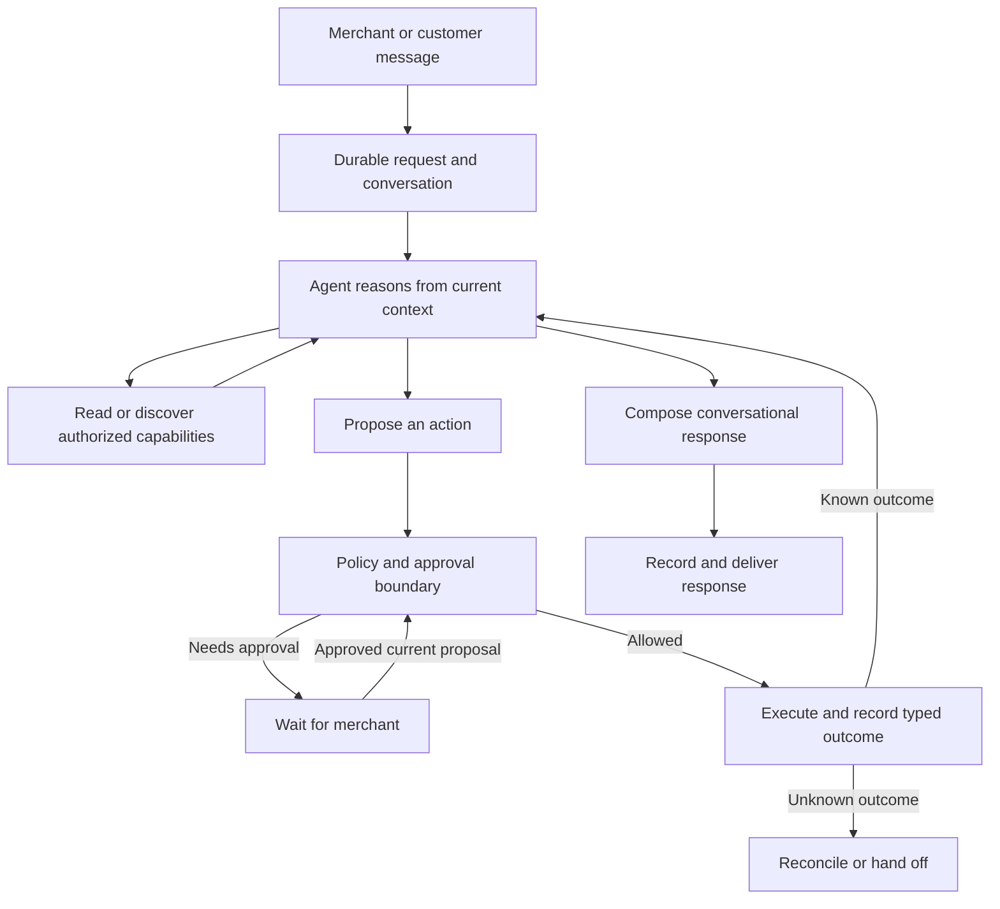

# Conversational agent overhaul plan

Status: in progress. Packages 0 and 1 are complete. Package 1 now covers the
shared receipt boundary, durable action dispatch/recovery lifecycle, all retained
Shopify writes, retained internal-thread writes, and durable communication
outcomes. Package 2 now has additive persistence, ownership helpers, durable
dashboard submission/status retrieval, a claimed gateway worker, queue-gap and
stale-claim recovery, refresh reconnection, a crash-safe cumulative budget,
merchant cancellation ordered at the task row, durable writers for the proposal
or question a suspended task waits on, one shared boundary that authorizes
an approved proposal for every surface, and scoped continuation of a parked
question. Package 2 is complete for the dashboard request path.
Package 3's step 3 landed with that boundary because the two overlap, followed by
step 1's deterministic bed, step 2's capture-mode suspension, step 4's autonomy
decision for a proposal that composes from the receipt, step 5's composition
of that reply from what the write returned, and step 6's compound case — all
and step 7's gate that lets a caller set it. Step 6 also repaired the capability
it needed: `create_partial_refund` had never been executable. Package 3's steps
are all landed, and on 2026-09-18 a live model ran the whole slice end to end
against a real database and a fake provider; a real store is still owed.
Package 4's steps are all landed: registry-derived bounded
discovery, the caller that replaced the full-registry widening, the narrowed
mutation bucket, the three declared context-dependency tiers with the knowledge
base deferred on a status question, gift-card issuance out of the default support
selection and its prompt branch, and the input-side cost measurement. Persisted
runtime-v2 tasks now select bounded discovery from their immutable task version;
`AGENT_CAPABILITY_DISCOVERY_MODE` remains only for taskless/manual and v1
compatibility callers. The same live run is the first time a model planned
against discovery, and it found the capability it needed by name on its second
call. Package 5 has started with the
contract every one
of its rows is written against: a support conversation now accepts each inbound
customer message as a durable request and runs it as a claimed task, which also
closes Package 3's outstanding attribution item. That contract shipped with the
approval side missing, and fixing it is the second thing Package 5 has done: a
parked proposal now records who may approve it, and approving one closes its
task. The third is the other half of that wait: a parked support question now
records who may answer it, and an answer from either surface ends that wait and
continues the same task instead of re-planning untracked. The fourth closes the
approval wait's other two exits: revising a card continues the task it was parked
on and supersedes it, and declining one ends the task at the ledger instead of
only in the merchant's queue. The fifth binds task authority through action
dispatch and execution settlement, removes the remaining untracked retry paths,
and makes cancellation win before dispatch without losing an effect that was
already submitted. The cutover spine now lets an exact runtime-v2 proposal
authorize and enter execution without a cached-plan record. The first retained
safe-read row — order status plus policy/product questions and delivery — now
runs on that spine with discovery selected by the persisted task runtime.
Package 6 implementation has started with the additive runtime router, immutable
task version, v1 compatibility path, and direct v2 proposal entry. Controlled
production rollout, comparison, rollback rehearsal, and deletion have not
started. The first retained Package 5 row is complete through its delivery
invariant:
customer replies carry the durable request/task identity through the gateway to
the persisted `Message`, including pending/unknown delivery records, and the
dashboard send boundary rejects identity from another tenant or thread. The
order-status and KB/product host matrix now covers catalog reads, missing
information, revised instructions, delivery, and bounded discovery selected by
the persisted runtime version.
Since that first row, support planning and bounded failure replanning charge
model calls and measured usage to the claimed task. Classified topic/entity
matching can keep independent pending tasks on one thread and return to the
relevant one; missing or ambiguous runtime-v2 classification opens separate
work rather than superseding an unrelated wait. Merchant answers, revisions,
and proposal dismissals are accepted as durable requests. Address change,
cancellation, return, and exchange each have a database-backed fake-provider
approval-to-receipt-to-gateway-send host case. A delayed cancellation approval also
rejects an order that shipped during the wait without sending a cancellation
POST. A merchant-supplied return-label URL now continues its parked task through
approval, typed receipt, and gateway send. Turn-journal notes have an idempotent
identity, while ordinary action
auditing is no longer a required model tool step. These are incremental Package
5 results, not completion of its capability or conversational matrix.
Created 2026-09-11; last updated 2026-09-22.

Current checkpoint:

The concise [release evidence matrix](conversational-agent-overhaul-release-matrix.md)
tracks the remaining capability, conversation, and cutover gates by row.

- [x] Packages 0–4 are implemented, with the real-store Package 3 release
  exercise still required before production cutover.
- [x] The common Package 5 support-task spine is durable from request intake
  through task claim, waits, approval, action authority, settlement, and
  attributed reply persistence.
- [x] Support planning and failure replanning reserve task model calls and
  record measured tokens/spend against the durable claim.
- [x] The first Package 5 capability row — order status and policy/product
  questions — satisfies the availability-through-compatibility evidence table.
- [ ] Package 5 mutative rows remain: address change, cancellation, return, and
  exchange now cover approval, typed outcomes, stale provider state, unknown
  outcomes, reply suppression, and shared delivery recovery in deterministic
  host tests. Return-label continuation has an approval-to-receipt-to-gateway-send
  host case after a merchant answer. Revised-instruction variants, retained
  merchant operations, and the controlled provider exercise remain.
- [ ] Package 5 continuity remains: classified topic/entity matches keep
  independent tasks and resume a matching one, while missing or ambiguous
  runtime-v2 classification preserves parked work. Merchant answers, revisions,
  and dismissals have accepted request records. Clear referents, customer waits,
  and switching across channels still need acceptance evidence.
- [ ] Package 5 bookkeeping cleanup remains: turn audit notes now have a stable,
  idempotent identity, and the model is no longer instructed to add a routine
  note after each action. Receipt-driven status consequences and the remaining
  automatic-note surface need review before marking this complete.
- [x] A delayed cancellation approval rechecks live fulfillment state before
  provider dispatch; a shipped or partially shipped order produces a rejected
  receipt, preserves its policy-block action status, and sends no cancellation
  POST. A revoked Shopify write grant now records a policy-block action without
  dispatch, and a changed workspace cancellation policy rejects the approval
  before an action starts. Lost membership also refuses approval at the durable
  proposal boundary. A full refund whose provider-calculated balance shrank
  during the wait now records a rejected receipt and sends no refund mutation;
  this exposed and fixed a policy-block path that dropped typed receipts.
  A cancellation host case now runs sent, definite-failed, and unknown customer
  delivery outcomes; all three retain one confirmed cancellation effect, with
  separate reply action and task states. A cross-boundary recovery test retries
  the same failed attributed message through the real dashboard route and gateway
  worker without repeating cancellation. Partial-refund approval when Shopify's
  calculated amount changes without a prior refund remains an open contract
  question.
- [x] The Package 6 code path can pin new tasks to runtime v1 or v2 and lets an
  exact v2 proposal authorize execution without `Thread.cachedPlan`. New support
  and dashboard tasks can now select v2 for named workspaces via
  `AGENT_RUNTIME_V2_ORG_IDS` while other new tasks stay v1.
- [ ] Package 6 operational work remains: controlled real-provider exercise,
  old/new comparison, staged routing, rollback rehearsal, persisted-state
  inventory, and deletion of superseded active paths.
- [x] `npm run verify:pr` passed after these local changes, and the new
  database-backed concurrent journal-note test passed separately. Live-model
  evals and a controlled real-provider/customer-delivery exercise were not run;
  the local environment had no model API key, and no controlled provider
  workspace/destination was selected.

Implementation detail expanded 2026-09-11 against the current repository. Names marked **proposed** describe work to implement, not APIs or tables that already exist. This document authorizes no production operation by itself.

This is the implementation plan for the architecture discussed with the user: speaking to Shopkeeper should feel like speaking to a capable senior intern. It builds on the [maintainability audit](agent-maintainability-audit-2026-09-11.md). Where that audit suggests fixed completion sentences or rigid task tool sets, this plan supersedes those recommendations: conversation remains model-authored, and tool discovery remains adaptive.

## Product outcome

The agent understands informal instructions, investigates, remembers relevant context, improvises within its authority, and explains itself naturally. It can handle combinations of requests that were never individually programmed. It asks a focused question when the answer matters and takes reasonable initiative when it has enough information.

The runtime makes that freedom dependable. It owns authorization, durable execution, action identity, approvals, provider outcomes, and delivery. It does not prescribe a script for each customer situation.

Example acceptance conversation:

> Merchant: “This customer has been messed around twice. Figure out what happened and sort it out. Check with me before giving money back.”
>
> Agent: “The replacement was created, but it hasn't shipped. The blue one is out of stock; the black one is available. I can ask whether they'd prefer that or a refund. Want me to offer both?”
>
> Merchant: “Ask about the black one first, and keep it short.”

The agent discovers the order state and alternative through tools, changes direction based on the merchant's instruction, and drafts a suitable reply. There is no hardcoded “replacement failed twice” workflow. It does not interpret the initial request as permission to refund.

## Design boundaries

| Model owns | Runtime owns |
| --- | --- |
| Understanding requests and conversational references | Tenant, member, customer, and order access |
| Choosing relevant investigations and discovering tools | Tool availability and execution-time authorization |
| Proposing actions and alternatives | Approval binding and current-state policy checks |
| Deciding whether clarification is useful | Durable suspension and resumption |
| Adapting after new information or a definite failure | Retry limits and unknown-outcome reconciliation |
| Natural explanations, brand voice, and summaries | Verified result fields and delivery records |

Non-goals:

- No fixed intent-to-workflow catalog, mandatory conversation script, or template-only assistant.
- No multi-agent team, new agent framework, generic plugin platform, or giant catch-all tool.
- No new commercial capabilities during migration. The support wedge and existing merchant operations remain the scope.
- No broad rewrite of working provider adapters, identity checks, or channel integrations.
- No promise of perfect factual correctness for arbitrary generated prose. Structured evidence improves grounding; language quality still needs evaluation.

## Target architecture



Use the existing gateway, queue, database, and shared agent package. Support and operator turns retain different authorities and interaction styles, but share request identity, budgets, receipts, and recovery semantics. A policy decision may require approval even when the model wants to proceed.

### Durable request and work state

Distinguish a conversation, an inbound request, an ongoing task, a proposed action, an execution attempt, and a delivery. They are related identities, not interchangeable names for a turn. Several messages can advance one task, and one conversation can contain independent tasks.

Before introducing tables, map these responsibilities onto `OperatorEvent`, `PlanExecution`, `AgentAction`, existing pending state, request outcomes, and delivery storage. Extend existing records where their semantics fit. Do not repurpose a provider-specific event table as a generic task table without validating its claim and recovery behavior.

Persist only the work state needed to resume: objective, relevant entity references, evidence references, explicit constraints, pending question or approval, proposed actions, execution receipts, and progress. Do not persist hidden chain-of-thought or grow a parallel transcript of speculative reasoning.

Conceptual states include queued, running, waiting for input, waiting for approval, reconciling, completed, failed, and cancelled. Map them to existing storage before choosing a new enum. Record action completion separately from response delivery; a completed refund with a failed email must remain a completed refund.

### Adaptive agent loop

The model chooses a useful next step from reading, capability discovery, clarification, action proposal, or response. It may combine capabilities to solve novel requests. It need not produce a complete speculative action-and-reply plan before investigating.

Execute independent reads together. Record write proposals before execution; preserve meaningful dependencies between writes. Feed actual outcomes back before composing a completion response. Multiple related writes can still be reviewed together when their targets and parameters are known, so the new runtime does not introduce an approval or model round trip per trivial step.

Expose a compact relevant starting set plus authorized capability discovery. Discovery may expand the tool set during a task; it must not expose forbidden capabilities or load every schema as the default fallback. A model-selected task label is a relevance hint, never an authorization decision.

Maintain one execution owner for a task at a time. New instructions can supersede pending proposals, clarify an existing task, or start separate work. A request to stop prevents new actions; it cannot undo a provider write already submitted. Cross-device approvals and revisions must resolve against exact proposal identities.

### Capability and result contracts

Evolve the existing tool definitions rather than creating a second registry. Each capability owns its input schema, required evidence, allowed actor/context, provider requirements, approval/policy metadata, execution adapter, typed result, and recovery behavior.

Results carry outcome, target, relevant financial or operational fields, provider reference, and execution identity. Preserve distinctions such as not found, rejected, definite failure, and unknown outcome. Human-readable messages are presentation, not the source from which machine facts are reconstructed.

Separate stable operation identity from model tool-call IDs. A repeated proposal or restarted model turn must not accidentally receive fresh authority to repeat a committed action. Use provider idempotency where supported and reconcile where it is not. Do not claim universal exactly-once execution across external providers.

### Conversation, evidence, and memory

Generate responses from actual outcomes and relevant evidence. The model chooses wording, tone, and explanation. Exact consequential fields can be referenced through validated bindings to receipt fields; avoid fixed full-sentence templates as the default experience. Audit notes and delivery bookkeeping are runtime-generated.

For approval, clearly show proposed actions and any customer draft. If the merchant approves exact wording, preserve it except for explicitly shown result placeholders. A substantive change in action, amount, recipient, or approved message invalidates the relevant approval. Otherwise, post-execution composition follows the merchant's authorized intent and communication policy.

Scope evidence to the task, entity, and observation time. Recheck provider preconditions before writes, especially after waiting for approval. Prevent a model-provided evidence reference from establishing success without a matching successful record.

Keep conversational memory separate from authority. Store explicit preferences and useful task facts with source and scope, using the existing memory system. Summaries and preferences cannot grant permissions or turn customer claims into verified facts. Questions, references such as “that one,” topic changes, and returning to unfinished work need conversational evaluation, not a growing keyword router.

## Implementation instructions and fixed decisions

Read this section before starting a work package. The architecture above describes the product; this section specifies how to build it. If a later repository change makes a named location inaccurate, find the current owner and update the location here. Do not use that mismatch as a reason to invent another runtime.

### How to execute this plan

1. Work through packages 0–6 in order. Within a package, finish one contract and its tests before moving to the next. Package 3 may use a small explicit refund tool selection until package 4 adds discovery.
2. Keep old callers working through additive contracts and a versioned compatibility boundary. Do not change legacy persisted plan interpretation in place.
3. For each change, record the files changed, invariant implemented, tests run, remaining failures, and rollback behavior in the work-package checklist. A checkbox means implemented and verified, not merely coded.
4. Use existing functions for tenant checks, policy, claims, refund reservations, sending, and reconciliation. Extract a shared function only when two concrete callers need it. Do not add a service container, event-sourcing framework, workflow DSL, generic repository layer, or second capability registry.
5. Keep the configured model and provider adapters stable during the first slice so runtime regressions can be isolated. Do not compensate for broken claims, receipts, or tool selection by adding prompt instructions.
6. If a decision affects which merchant operations remain supported, preserve current merchant availability until the inventory provides a documented scope decision. Lack of usage data is not evidence that a capability is unused.

### Current code ownership and intended changes

The following are observations of current code, followed by implementation directions. Recheck them in package 0; the audit is supporting context, not a substitute for reading the callers.

| Responsibility | Current owner / limitation | Implementation direction |
| --- | --- | --- |
| Tool definitions | `tools/registry/types.ts`, `tools/registry/index.ts`; `AgentToolDefinition` already has parse, execute, policy, capabilities, scopes | Extend these definitions; derive discovery from them |
| Provider result | `tools/result.ts`; `ToolResult` has status, message, optional untyped data | Preserve status compatibility; introduce validated versioned receipts for retained writes |
| Execution and journaling | `tools/executor.ts`, `run-execution.ts`, `agent-actions.ts`, `ActionEntry` in `agent-context.ts` | Carry receipt data through every boundary and persist it before dependent work |
| Completion evidence | `completion-facts.ts` accepts string results and action inputs | New facts read validated receipts; historical text handling remains isolated |
| Shared model loop | `agent-loop.ts` has execute, capture, and read-only modes; capture can require a terminal draft | Reuse the loop; allow the new runtime to suspend on an action proposal without fabricating a completion draft |
| Planning selection | `planner-tool-selection.ts` includes a broad mutation bucket and `request_wider_tool_set` | Replace full-registry widening on migrated paths with bounded discovery |
| Approval execution | `plan-execution.ts`, `execution-ledger.ts`, `agent-actions.ts` | Retain current hash and claim checks; add task revision and immutable proposal binding |
| Unknown effects | `unknown-outcome-reconciliation.ts`, provider operation keys, refund spend reservations | Extend existing probes and receipts; never reset an uncertain operation to unattempted |
| Dashboard ingestion | Dashboard `api/agent/chat/route.ts` → `gateway-operator-turn.ts` → gateway `/operator/turn` | Replace HTTP-owned execution with durable submission and status retrieval |
| Messaging ingestion | Gateway `operator-event-ingest.ts`, `operator-event-store.ts`, `workers/operator-event.ts`, `maintenance/operator-event-sweep.ts` | Reuse persist/claim/sweep patterns; keep provider event identity intact |
| Approval surfaces | Dashboard pending/quick-approve routes, gateway `pending-plan-actions.ts`, `operator-context.ts` | Adapt surfaces to the same proposal identity and server-side decision function |
| Delivery | `message-dispatch.ts`, gateway `operator-event-reply.ts`, `message-handlers/outbound-email.ts`, persisted messages | Reuse channel senders and delivery recovery; link their records to task and response identity |

Paths without a prefix in the first eight rows are under `packages/agent/src/`. Gateway paths are under `apps/gateway/src/`; dashboard paths are under `apps/dashboard/src/`.

### Persistence decisions: identity is not status

Use the following mapping as the default schema design. Package 0 must turn it into exact Prisma fields, relations, indexes, and migration steps before implementation. Changes to this mapping require a concrete existing constraint or recovery test that the default cannot satisfy; naming preference is insufficient.

| Identity | Storage decision | Required meaning |
| --- | --- | --- |
| Conversation | Reuse `Thread` and current operator/member thread resolution | Transcript and access boundary; not a single task |
| Inbound messaging event | Retain `OperatorEvent` and inbound `Message` identities | Deduplicate provider delivery; never fabricate a provider message ID for dashboard work |
| Request | Add proposed `AgentRequest` | One accepted instruction, client/provider dedupe key, immutable normalized payload, actor, conversation, status and linked task |
| Task | Add proposed `AgentTask` | Durable objective and revision across multiple requests; task state, runtime version, claim, budget and bounded checkpoint |
| Proposal | Add proposed `AgentProposal` | Immutable versioned action bundle and communication approval snapshot; multiple proposals can belong to a task |
| Proposal execution | Retain `PlanExecution`; link to proposal/task | One existing claim boundary for an approved/allowed bundle; do not make its enum represent conversational waiting |
| Action and receipt | Extend `AgentAction` | Durable operation identity and dispatch state created before a write; validated outcome after execution |
| Pending UI | Retain `OperatorContext` as a compatibility projection | Cards/questions reference durable task/proposal IDs; a trimmed pending queue cannot delete authoritative work |
| Request analytics | Retain `RequestEpisodeOutcome` | Existing support episode/plan analytics; not a generic task queue |
| Response / delivery | Reuse `Message` and current delivery storage where their semantics fit | Persist text, destination, response identity and send state; use a small linked delivery record only where the existing sender lacks durable identity |

Do not add one new table for every conceptual word. These three proposed models address specific gaps: dashboard request dedupe, multi-request task state, and proposals that must survive cache/queue replacement. Do not widen `OperatorEventStatus` or `PlanExecutionStatus` to serve all three roles.

Minimum fields and constraints for the proposed records:

- `AgentRequest`: ID, organization ID, authenticated actor key and actor kind, channel, conversation ID, dedupe key, payload version/hash, normalized instruction, source event/message reference, accepted time, processing state, task ID. Enforce uniqueness over organization + actor + channel + dedupe key. Same key and same payload returns the existing record; same key with changed payload returns conflict. Provider event keys retain their existing dedupe boundary as well.
- `AgentTask`: ID, organization/conversation IDs, initiating actor, objective, runtime version, status, monotonically increasing revision, active proposal reference, pending question, checkpoint version/JSON, claim token/lease expiry, cancellation time, model-call and usage counters, active-time budget, last progress time. Persist a question ID and intended answerer scope; an unrelated message must not silently answer it.
- `AgentProposal`: ID, organization/task IDs, task revision, schema version, immutable canonical actions, explicit dependencies, communication mode/draft, proposal hash, source instruction references, creation time, status, approver identity/time and approved hash when applicable. The executable snapshot must survive removal of a UI card or cached plan.
- `AgentAction` extensions: task/proposal references, stable operation ID, action index, dispatch state, submission time, nullable versioned receipt JSON. Keep existing `status`/`output` readers working during migration. Introduce a separate dispatch-state field rather than overloading display-oriented action status. Review `executedAt`/`durationMs` defaults before creating pre-dispatch rows so they do not falsely report an execution.
- Add indexes for task recovery by status/lease expiry, requests awaiting processing, proposals by task/revision, and operation lookup. Enforce operation uniqueness per organization in the database. Audit/backfill old rows before adding a constraint; existing `providerOperationKey` is indexed, not unique.
- Scope all lookups and mutations by organization and enforce parent ownership. Add the new records to workspace deletion, customer/thread redaction, and retention handling. Do not cascade away evidence for unresolved provider writes without the existing lifecycle policy handling them.

The task checkpoint contains short observable facts: objective, entity IDs, source message/evidence IDs, explicit user constraints with sources, pending question, active proposal IDs, action/receipt IDs, and next work category. Keep the transcript in existing message storage. Bound checkpoint text and reference counts with schema validation; do not serialize the entire provider context or model reasoning into JSON.

### Task transitions and concurrency

Use a task-specific state set: `queued`, `running`, `waiting_input`, `waiting_approval`, `reconciling`, `completed`, `failed`, `cancelled`. These are proposed task states, not replacements for existing execution enums.

| From | Event and guard | To / required write |
| --- | --- | --- |
| queued | Worker wins conditional claim | running; store token and lease |
| running | Model asks a relevant question | waiting_input; persist question and response before releasing claim |
| running | Policy requires approval for persisted proposal | waiting_approval; persist proposal and notification intent |
| waiting_input | Scoped answer matched to question/task | queued; attach request and increment revision |
| waiting_approval | Valid decision for current proposal/hash | queued; record approval atomically, then enqueue |
| waiting_approval | Revision/dismissal | queued or cancelled according to instruction; invalidate pending proposal |
| running | Submitted write has uncertain outcome | reconciling; retain operation key, receipt if available and spend reservation |
| reconciling | Provider probe establishes outcome | queued to observe known outcome, or cancelled after recording outcome if cancellation was requested |
| running | Objective satisfied; required response persisted | completed; delivery can still be pending/failed |
| queued/running/waiting_* | Authorized stop | cancelled if no uncertain submitted write; otherwise reconciling with cancellation recorded |
| running | Definite unrecoverable failure or exhausted budget | failed with reason and resumable facts; uncertainty still takes precedence as reconciling |

Completed/cancelled/failed tasks are not reset by a duplicate request. A deliberate new instruction can create a new task referencing prior work. A known partial result remains visible even when the overall task fails or is cancelled.

Concurrency implementation rules:

1. PostgreSQL conditional updates/transactions decide ownership; Redis locks and queue job IDs are optimizations. Claim task status and token atomically. Every state mutation from a worker must verify its token and expected revision.
2. Renew leases while work runs. A replacement worker may reclaim expired reasoning/read work. If any action reached dispatch, inspect its durable operation state first; lease expiry never authorizes replay.
3. Persist inbound revisions and action-dispatch authorization through a shared task-row ordering point. If a stop/revision wins before dispatch authorization, the old action cannot start. Once dispatch authorization wins, report that the action may already be underway; attempt abort where supported but still reconcile its outcome.
4. Do not hold a database transaction across model or provider network calls. Persist dispatch intent under the transaction, then call the provider. This introduces a conservative crash window: a crash after intent but before the call is treated as potentially submitted unless the adapter can prove otherwise.
5. A stale worker that receives a provider result may record evidence against the exact operation through the reconciliation path. It must not update the current task revision, overwrite a newer result, send a new reply, or start another action.
6. Recovery scans durable rows for accepted-but-not-enqueued requests, expired claims, unknown operations, and unsent responses. Queue publication after a database commit can fail; the sweep is required, not optional cleanup.

### Typed receipts and operation identity

Retain current `ToolStatus` values (`ok`, `error`, `not_found`, `policy_block`, `escalated`, `unknown`) at compatibility boundaries. Add a discriminated receipt for writes rather than a second competing success boolean. The following is a proposed minimum contract; implement runtime validation as well as TypeScript types in the existing result/registry area:

```ts
type ReceiptV1 = {
  version: 1;
  operationId: string;       // runtime-assigned; never a model tool-call ID
  executionId: string;      // existing PlanExecution identity
  tool: string;             // registered tool name
  target: { kind: string; id: string };
  observedAt: string;       // ISO timestamp from runtime
} & (
  | { outcome: "succeeded"; providerReference: string | null;
      facts: Record<string, unknown> }
  | { outcome: "not_found" | "rejected" | "failed";
      code: string; providerReference: string | null }
  | { outcome: "unknown"; code: string;
      providerReference: string | null }
);
```

`facts` is shorthand in this example only. In code, use a per-tool validated discriminated union, not unconstrained JSON cast to the expected type. Refund facts require actual refunded amount as an exact decimal string, currency, canonical order ID, and the provider refund reference. Cancellation facts require order ID and the provider-confirmed cancellation state/time where available; cancellation does not imply a refund. A null reference is allowed only for capabilities whose provider contract has another documented verification method. Missing required success fields after a possible write is an unknown outcome, not permission to claim success or retry.

Map outcomes once: `succeeded → ok`, `not_found → not_found`, `rejected → policy_block` for local policy rejection (otherwise documented provider rejection/error), `failed → error`, `unknown → unknown`. A handoff (`escalated`) is a control outcome, not proof of a commercial write. If legacy status and a receipt disagree, fail validation and preserve the uncertainty; do not choose the more optimistic value.

Data path to implement and test:

`provider adapter → ToolResult receipt → executor result → ActionEntry → AgentAction receipt JSON → CompletionFact → model-visible observation / response binding`

Do not populate refunded amount from the requested input, parse it from `message`, or infer a currency from the merchant's locale. Use provider-confirmed monetary values and the provider/currency precision rules; do not round with binary floating-point or assume every currency has two decimal places.

Operation lifecycle:

1. Normalize and validate proposal inputs; assign a durable operation ID per action when the proposal is persisted. Repeated attempts to execute that action reuse the ID and provider key.
2. Before accepting a newly generated proposal, compare its target, normalized effect, and task history with committed or unknown operations. If it duplicates one, link to the prior result or reconciliation state. A fresh model tool-call ID or new proposal ID cannot bypass this check. An intentional additional refund requires new explicit intent and current remaining-refundable evidence; identical parameters alone must not dedupe unrelated legitimate tasks forever.
3. Create/journal the action before network submission. Reuse the current refund-spend reservation and policy enforcement path. Do not release an unknown reservation as if the write failed.
4. Revalidate authority and provider preconditions, then atomically mark dispatch authorized. Call the existing adapter with the stable provider operation key when supported.
5. Persist the typed receipt before scheduling a dependent write or composing a success message. If the provider succeeded but persistence fails, recover via the same operation key/probe; do not resubmit using another identity.
6. A definite failure may be retried only when the adapter documents that no effect occurred and the error is retryable, within the persisted retry budget. Unknown outcomes go to the existing reconciliation mechanism. A single empty probe is not proof of failure when the provider is eventually consistent.
7. For a bundle, execute writes sequentially in declared dependency order. If A succeeds and B fails, keep A successful. Block dependent actions; allow unrelated investigation. Do not invent compensation/undo operations. Retry delivery separately from commercial actions.

### Approval and communication contract

Use a canonical server-generated hash of the immutable proposal. Extend the existing `hashPlan` / instruction-hash machinery rather than hand-building hashes in channel code. Canonicalization must sort object keys, preserve meaningful array order, normalize input with the registered parser, and preserve exact approved draft bytes. Test that reordered object keys hash identically and changed amount/recipient/draft/dependencies do not.

The approved snapshot binds organization, task and revision, proposal ID/version, actor scope, normalized tool names/inputs/targets, ordered action dependencies, communication mode, destination, approved draft (if any), and allowed result bindings. Keep existing policy and instruction binding at least as strict as today. Record approver identity and decision time from authentication, never from model arguments.

Use exactly two communication approval modes initially:

- `exact_draft`: display the destination and exact draft before approval. After execution, only explicitly displayed placeholders may be substituted from validated successful receipts. If an action fails or a binding is unavailable, do not send the success draft; compose a new status/proposal and apply normal communication policy.
- `intent`: record what the merchant authorized communicating, to whom, and any wording limits. Compose after actual outcomes. This mode is available only where existing policy allows it; it is not an automatic replacement for exact-draft approval.

Approval execution must load the persisted proposal, verify current membership and proposal revision/hash, recheck applicable policy and provider state, and acquire the existing execution claim. Buttons and conversational approval call this same boundary. A terse “yes” with two plausible pending proposals triggers clarification; never use “latest card wins” to authorize money or recipient changes.

A changed amount, order, address, recipient, action set, dependency, or exact draft supersedes the proposal and needs whatever approval the replacement requires. A changed display label does not change authority. Recheck refundable balance, fulfillment/cancellation state, customer/order ownership, grant health, and applicable limits after any wait. If current state no longer permits the exact approved action, return a rejection or propose a revision; do not silently adjust the amount.

For several known related actions, persist and display one bundle and approve its complete snapshot once. Use the existing plan claim as the bundle owner and individual operation records for partial results. This is not an atomic provider transaction.

### Dashboard submission and recovery contract

Implement this additive API shape on the existing dashboard/gateway route owners; the status route is proposed and must be added. Keep old response handling behind the legacy runtime route until its callers migrate.

| Request | Contract |
| --- | --- |
| Dashboard `POST /api/agent/chat` | Client sends `clientRequestId`, instruction, and optional task/question references; server derives org/member and validates access |
| Gateway internal submission | Dashboard forwards authenticated context and stable request ID; gateway persists before acknowledging, then enqueues |
| Accepted response | HTTP 202 with durable `requestId`, `taskId` when assigned, status and status URL; no provider/model work in the HTTP lifetime |
| Duplicate submission | Return original request and current state; changed payload under same key is HTTP 409 |
| Proposed `GET /api/agent/requests/:requestId` | Authenticated status, linked task/proposal/question IDs, observable progress, persisted response and delivery state; no provider secrets or hidden reasoning |
| Resume after refresh | Fetch recent/pending tasks for the authorized conversation and restore transcript/cards from server storage, even when the original POST response was lost |
| Cancel / approve / answer | Persist a scoped decision referencing exact task revision/proposal/question, then enqueue continuation; do not execute the provider in the route |

Generate `clientRequestId` once when the user submits, preserve it through transport retries, and clear the pending client submission only after acknowledgement/recovery. Two intentional clicks/submissions are not deduped by text alone. Persist recovery identifiers in client state that survives refresh; avoid putting customer message bodies in browser storage just to dedupe. Server-side history remains the authority if local state is lost or another device is used.

Use existing event facilities to notify clients, with status polling as the recovery fallback. A lost event must not lose a result. A browser disconnect stops observation, not task execution. Dashboard response availability means text is durably available for retrieval; it does not prove the merchant has read it or that an external customer message was delivered.

### Adaptive-loop implementation recipe

Keep a single model loop and ordinary registered tools. The following specifies runtime ordering, not a fixed conversation/tool sequence:

```text
claim task and load current revision, budget, checkpoint and authorized context
recover any submitted/unknown operation before permitting an overlapping write
while active work budget remains:
    recheck ownership, revision, cancellation and budget
    call model with relevant observations and currently available tools
    if independent reads: execute bounded parallel reads; append typed observations
    if discovery: authorize candidates; add bounded schemas; append discovery result
    if writes: validate and persist proposal; evaluate existing policy
        if approval required: persist waiting state and notification; release claim
        otherwise: claim proposal, execute allowed operations, persist receipts
        append actual outcomes and let the model continue
    if question: persist scoped question and response intent; release claim
    if response: validate consequential bindings; persist text and delivery intent
        finish or suspend according to unresolved work, then release claim
on deadline / lease loss: stop scheduling; preserve/reconcile submitted operations
```

Use existing native tool-call schemas for actions. Do not require the model to emit a giant JSON object containing the entire task, all future steps, and a speculative final answer. A model-provided proposal is untrusted until parsed and persisted by the runtime. Response delivery itself passes through messaging policy and durable sending; a final-text model block is not authorization to send to an arbitrary customer.

Maintain one persisted budget through planning, discovery, retries, and final composition. Count calls before dispatch so a crashed attempt cannot reset them; record actual usage through the existing spend accounting. Reserve capacity for a final status response. If that capacity is unavailable, expose a runtime status to the operator rather than fabricate a model answer. Human waiting does not consume active model/provider time; resume with remaining active budget and a newly derived attempt deadline, without replenishing total call/spend limits. Reconciliation and delivery use their own bounded existing recovery policies so exhausting model calls does not abandon a submitted refund.

Package 0 must freeze concrete values for call count, active deadline, read concurrency, retry count, discovery result limit, tool-schema cap, checkpoint bounds, and reconciliation escalation age in one configuration location. Start from current configured execution limits; changes require baseline measurements. Do not scatter fresh constants across the dashboard, planner, and gateway or invent unmeasured release targets here.

### Discovery, evidence and continuity

Implement a proposed `discover_capabilities` loop control with a validated input such as `{ query: string }`. It reads the existing registry and returns only authorized capability names, short descriptions, and why a result is unavailable when that explanation is safe. Add the selected schemas to the next model call in the same task. It performs no commercial effect and is not stored as an executable plan step.

Default selection rules:

- Start with authorized question/reply controls, relevant KB/product/order reads, and discovery. Identity-sensitive order/customer reads remain subject to verified context. A strong current relevance hint may add the specific needed mutation, such as address update, but not the whole mutation group.
- For absent or stale classification, use the compact authorized starter set. Never load the full registry as an error fallback. Preserve observations and budget when discovery expands tools.
- Derive candidates from the same availability, actor/context, connection, grant and policy eligibility checks used for selection. Execution rechecks these; a tool absent from the current model schema cannot be executed merely because the model names it.
- Keep anonymous storefront, verified storefront, support, and merchant boundaries explicit. Discovery cannot turn support into merchant mode or supply a missing verification credential.
- If no candidate is useful, return an empty result with a typed reason; the model may ask, investigate differently, or hand off. Do not recursively widen until something appears. Repeated identical discovery with no new evidence must hit the shared budget/limit.

Evidence records must identify source kind (provider read, execution receipt, user claim, KB/policy, preference), organization, relevant entity, observation time, and source identity. User claims and summaries never acquire provider-evidence status by being copied. Resolve evidence references server-side with ownership checks. Freshness is operation-specific: a write adapter names its necessary preflight reads; there is no global “all evidence younger than five minutes is safe” rule. Persist enough evidence to explain a proposal without retaining unnecessary provider payloads.

For continuity, provide the model a bounded list of open tasks with IDs, short objectives, entities, pending question/proposal and recent source messages. Let it propose continuation or a new task; validate the chosen ID's ownership. Explicit UI replies carry task/question/proposal IDs. Conversational references may resolve from clear context; ambiguous consequential references require clarification. Preferences use existing merchant memory with source and scope; “always refund me” in customer text is not a merchant preference or a permission update.

### Response grounding and delivery

New completion facts must come from stored, schema-valid receipts or authoritative provider observations with explicit provenance. A current order state can support “the order is cancelled”; it does not prove “I cancelled it” without a matching operation receipt. An input field or proposed action can support future-tense proposal wording only.

Reuse and narrow the existing completion-binding mechanism. Bind a specific receipt/operation, target and allowed field; reject mismatched tenant/task/target/outcome or unsupported field paths. Give the model structured outcomes and let it author surrounding prose. Amounts and provider references shown as consequential bindings are rendered by validated code. Prose checks remain heuristics: do not claim that field bindings prove the truth of every sentence.

Persist the composed response and its destination before attempting delivery. Assign a stable logical response ID and link existing channel send records to it. Retry the stored approved/composed text, not a new model generation. Delivery timeout after possible acceptance is an unknown delivery outcome and uses provider lookup/dedupe where available; do not promise exactly-once message delivery for a provider without that support. Never mark an email delivered just because it was queued. Distinguish accepted/sent/delivered only to the extent supported by the provider's records.

## Migration work packages

All packages are initially unchecked. Each ships through review with scoped evidence and a rollback path. Packages are ordered by dependencies, not calendar estimates; estimate after the first complete vertical slice establishes migration cost.

### 0. Establish baseline and contract decisions

Working evidence: [Package 0 baseline and contract inventory](conversational-agent-overhaul-p0-baseline.md).
Package 0 completed 2026-09-12: repository ownership, the 47-capability
caller/authority matrix, production persisted-state counts, available
current-window measurements, unavailable-data labels, final schema fields, and
frozen first-slice runtime budgets are recorded in the working evidence.

Deliverables, in order:

1. Trace one dashboard instruction, one operator-channel message, and one support approval from authenticated ingress through provider execution to stored reply. Record actual IDs and owners using synthetic/redacted examples. Include every approve/dismiss/replan caller; the dashboard chat route is not the only execution entrance.
2. Produce a capability inventory from active and retired registry definitions plus operator-only module tools. For each, record actor modes, current callers, observed usage or `unknown`, provider requirements, write/read/control category, success schema, idempotency/probe support, and retained/default/discoverable/historical disposition. Enumerate the retained tools by name; “merchant operations” is not a complete migration list.
3. Inspect persisted plan versions, pending queues, claimed/unknown executions, unknown actions/reservations, and undelivered responses with existing read-only audit tooling. Record count, environment, timestamp and query scope. Do not run recovery, canaries or cleanup as a side effect of inventory.
4. Finalize the proposed persistence mapping above in this document, including the relation from proposal ID to existing `PlanExecution.planId`. Default: use the proposal UUID as the new-runtime plan ID, preserving the current organization/plan unique claim. Record old-row decoding and deletion/retention behavior for each additive field.
5. Freeze the configuration values listed under adaptive-loop budgets and a baseline sample window. Mark unavailable measurements explicitly. Produce an evaluation manifest with case IDs, baseline runtime/model/settings, deterministic versus live execution mode, repetitions, and held-out status.

Exit gate: no unresolved storage-owner choice, no unnamed retained write, and no assumption that unavailable provider evidence or usage data is present. A product-scope question may remain explicitly deferred only if the existing merchant capability stays supported and isolated.

- [x] Map current request, approval, execution, action, and delivery identities across dashboard, messaging, and customer support.
- [x] Inventory actionable persisted plans, unresolved outcomes, live grants, and capability usage before retiring behavior or storage formats. Production aggregate recorded 2026-09-12 in the Package 0 baseline; missing action rows and scope metadata remain explicit limitations.
- [x] Capture current latency, model calls, avoidable handoffs, delivery failures, and cost per completed task from existing records. Production turn proxies and delivery counts are recorded; task cost and avoidable-handoff rate are explicitly unavailable from current records.
- [x] Create an evaluation set covering routine tasks, unfamiliar combinations, conversational follow-ups, and execution failures. Reserve unseen variants for acceptance.
- [x] Document the smallest required changes to persistence and contracts, including approval semantics for post-execution replies.

Acceptance: a reviewed ownership map, reproducible baseline where data exists, and explicit compatibility decisions. No new abstractions justified only by hypothetical future modules.

Primary locations: [agent package](../packages/agent/README.md), [database schema](../packages/db/prisma/schema.prisma), [turn execution](../packages/agent/src/turn.ts), [plan execution](../packages/agent/src/plan-execution.ts).

### 1. Preserve typed outcomes through the existing execution path

Progress as of 2026-09-15:

- [x] Add a versioned receipt union with runtime validation for `succeeded`,
  `rejected`, `failed`, `not_found`, and `unknown`, including exact decimal
  money, currency, target, operation/execution identity, observation time, and
  provider reference.
- [x] Propagate receipts through executor results, `ActionEntry`, run execution,
  action journaling, and additive `AgentAction.receiptVersion`/`receipt` JSONB
  storage. Migration `20260912120000_add_agent_action_receipts` enforces the
  nullable field pair and version 1.
- [x] Validate tool, operation, execution, legacy action status, target, and
  provider-reference agreement before a receipt is persisted. A malformed or
  missing required receipt becomes observable `unknown`, never success.
- [x] Make completion facts receipt-first. New-runtime callers do not infer
  success from display text or proposed inputs; the pinned legacy runtime is the
  only caller that explicitly enables historical string inference.
- [x] Create a durable `AgentAction` attempt before a non-read tool call and
  complete that same row afterward. The row is now a lifecycle record rather
  than a terminal-looking placeholder: preparation, dispatch authorization,
  submission, and outcome are persisted separately.
- [x] Migrate `create_refund`, `create_partial_refund`, and `cancel_order` to
  typed receipts. Successful refunds carry provider-confirmed amount, currency,
  refund and transaction references, and full/partial classification. Partial
  refunds also carry line-item IDs and quantities. Successful cancellation
  carries provider-confirmed cancellation time, reason, financial status, and
  restock result without inferring a refund amount.
- [x] Migrate `create_return` to a version-1 receipt with provider-confirmed
  return identity, name, status, returned fulfillment-line-item quantities, and
  explicit `refundIssued: false`. Preserve the existing `returnWatch`
  compatibility record. Missing success state remains unknown, and a recovery
  probe that cannot rebuild every required receipt fact cannot promote a
  lifecycle action to success.
- [x] Migrate `create_exchange` to a version-1 receipt with provider-confirmed
  return identity/name/status and both returned and replacement variant
  identities/quantities. Require `read_products` plus `write_returns`, preserve
  the return-watch projection, and do not turn catalog price comparison into a
  claimed financial outcome. The current provider response exposes no money or
  transaction set, so the receipt records `financialConsequence: null`.
- [x] Migrate `attach_return_label` to a version-1 receipt with the order,
  return, reverse-fulfillment-order, and reverse-delivery identities; a SHA-256
  label fingerprint under the retention boundary; optional tracking number; and
  explicit provider-observed `attached` state. Require `write_returns`, keep the
  customer-facing label URL out of the receipt, and preserve incomplete or
  interrupted mutation responses as unknown. The tracking-based recovery probe
  can identify a likely commit, but cannot rebuild the label fingerprint and
  complete receipt, so lifecycle reconciliation conservatively leaves it
  unknown.
- [x] Migrate `update_shopify_order_address` to a version-1 receipt carrying the
  canonical order and customer IDs, the provider-normalized order address, and a
  separately typed customer-default-address outcome, so a committed order
  address stays visible when the customer profile half fails or cannot be
  confirmed. Require `write_orders` plus `write_customers`. Preconditions are
  `rejected`, a missing order is `not_found`, and an unconfirmed or failed
  customer sync keeps the whole receipt `unknown` while retaining the committed
  order-address facts. The existing read-after-write probe reads only the
  order's shipping address, so it can observe the order half but cannot
  reconstruct the compound receipt, and lifecycle reconciliation leaves it
  unknown. Runtime validation permits these partial compound facts only on an
  unknown outcome and binds their provider reference to the canonical order.
- [x] Migrate `fulfill_order` to a version-1 receipt with provider-confirmed
  fulfillment identity, status/time, fulfillment and order line-item
  identities/quantities, returned tracking fields, and the customer-notification
  request flag. Require `write_merchant_managed_fulfillment_orders`, retain the
  Shopify-user `fulfill_and_ship_orders` provider precondition, and describe
  notification as requested rather than delivered. Missing post-mutation state
  remains unknown.
- [x] Migrate `edit_shopify_order` to a version-1 receipt with the canonical
  order and an ordered addition/removal change list carrying provider line-item
  and variant identities, requested quantities, provider-observed final
  quantities, and per-change outcomes. Preserve staged/rejected compound state
  on unknown receipts, require `write_order_edits` plus `read_orders`, and keep
  a probe-observed commit unknown when recovery cannot reconstruct the complete
  receipt.
- [x] Migrate `create_shopify_order` to a version-1 receipt with the canonical
  created-order identity/name, deterministic operation tag, provider-observed
  financial status, exact total/currency, and admin URL. Require `write_orders`,
  preserve legacy identity-less adapter compatibility, and keep incomplete or
  unconfirmed creation unknown when recovery cannot reconstruct the receipt.
- [x] Migrate `update_shopify_customer_info` to a version-1 receipt with the
  canonical customer identity and an ordered list of exact provider-observed
  changed fields. Require `write_customers`, reconcile incomplete or ambiguous
  PUT responses with a customer read, and keep later lifecycle reconciliation
  unknown when it cannot rebuild the persisted receipt.
- [x] Migrate `add_shopify_customer_note` to a version-1 receipt with the
  canonical customer identity and SHA-256 bindings for the previous, appended,
  and provider-returned final note. Require `write_customers`, issue only one
  append attempt, reconcile against the exact constructed final note, and never
  promote a later text-only observation without the hash-bound receipt.
- [x] Migrate `create_gift_card` to a version-1 receipt with the provider gift-card
  identity, exact initial value/currency, customer identity, expiration date,
  notification-request flag, last four code characters, and a SHA-256 code
  fingerprint without copying the one-time code into the receipt. Require
  `write_gift_cards` plus `write_customers`, and `read_gift_cards` for exact
  recovery lookup (the matching write grant satisfies that read). Reconcile an
  interrupted response or stable-code collision only when exactly one complete
  card matches the operation code, note, customer, amount, and expiration.
- [x] Migrate the isolated operator `create_flash_sale` write to a version-1
  receipt with the provider discount identity, application scope, exact variant
  identities, percentage, start/end times, and provider status. Require
  `write_discounts` for catalog sales and add `read_products` for variant-scoped
  sales. Bind identity-bearing attempts to a stable operation marker in the
  title, submit the mutation only once, and reconcile an interrupted response
  only when exactly one complete automatic discount matches that marker.
- [x] Migrate the isolated operator `end_flash_sale` write to a version-1
  receipt with the exact automatic-discount identity and whether Shopify
  confirmed deletion directly or a targeted post-interruption read confirmed
  absence. Require an explicit ID and `write_discounts`, preserve malformed,
  rejected, missing, incomplete, and uncertain outcomes, and never repeat an
  ambiguous delete. Expose active-sale discovery separately as the read-only
  `list_flash_sales` operator tool while retaining the adapter's legacy no-ID
  listing behavior.
- [x] Migrate the isolated operator `set_variant_prices` write to a version-1
  receipt with ordered product batches and exact per-variant product/variant
  identities, original/requested/provider-observed prices, store currency when
  Shopify returns it, batch outcome, and confirmation source. Require
  `write_products`, preserve the legacy `priceChanges` projection, and treat a
  mixed multi-product result as unknown while retaining confirmed batches.
  Submit each product batch once; after an interrupted or incomplete mutation
  response, read all named prices and settle success only when every requested
  price is observed. A partial, mismatched, or unobservable result remains
  unknown and is never replayed.
- [x] Migrate `add_internal_note`, `update_thread_status`,
  `update_thread_tag`, and the isolated operator `mark_ticket_spam` through the
  same operation/dispatch/receipt boundary. Receipts bind the tenant-owned
  thread and preserve the created note message/hash, observed before/after
  status or tag, or observed spam-filter transition and decision time.
- [x] Migrate `send_reply`, `send_email`, and `send_ticket_reply` to durable
  communication receipts. Persist a logical response `Message` before provider
  dispatch, hash the exact text, retain destination and provider identity, and
  distinguish accepted, sent, delivered, and unknown states without treating
  queue admission as delivery. Retrying delivery reuses persisted text; an
  ambiguous provider response remains unknown and does not authorize resend.
- [x] Preserve ambiguous or incomplete post-write outcomes as `unknown` for all
  sixteen migrated retained Shopify writes. Cancellation reuses its existing
  reconciliation read;
  refund operation identities remain available to existing reconciliation
  machinery; return, exchange, return-label, fulfillment, order-address, and
  order-edit probes cannot promote a commit unless they can reconstruct the
  complete required receipt; order creation reconciles by its deterministic
  operation tag; gift-card creation performs an exact receipt lookup during the
  adapter call; flash-sale creation performs an operation-tag lookup and
  flash-sale ending performs an exact-ID absence lookup during the adapter call;
  variant repricing performs a same-call exact price read after an interrupted
  or incomplete result; later lifecycle recovery remains unknown if it cannot
  reconstruct the applicable receipt.
- [x] Emit versioned definitive outcomes for the migrated operations:
  precondition/policy refusals are `rejected`, confirmed missing cancellation
  targets are `not_found`, and errors known to have made no provider change are
  `failed`.
- [x] Preserve the successful provider receipt as an `unknown` receipt if later
  local refund-budget finalization fails, so reconciliation retains the stable
  operation and provider reference.
- [x] Register version-1 receipts as required for identity-bearing executions of
  all sixteen migrated Shopify tools. Full refund, partial refund, cancellation, and order
  creation require `write_orders`; return and return-label attachment require `write_returns`;
  exchange requires `read_products` plus `write_returns`; fulfillment requires
  `write_merchant_managed_fulfillment_orders`; order address requires
  `write_orders` plus `write_customers`; and order edit requires
  `write_order_edits` plus `read_orders`; customer info requires
  `write_customers`; customer notes also require `write_customers`; gift-card
  creation requires `write_gift_cards`, `write_customers`, and a
  `read_gift_cards` recovery grant satisfied by `write_gift_cards`; flash-sale
  creation requires `write_discounts` and conditionally requires
  `read_products` for variant targeting; flash-sale ending requires
  `write_discounts`; variant repricing requires `write_products`. Selection withholds tools from
  insufficient grants and execution rechecks the same metadata.
- [x] Change partial refund creation to Shopify's `@idempotent` directive and
  register its exact exported mutation beside the full-refund mutation in
  `SHOPIFY_MUTATION_DOCUMENTS`.
- [x] Add the durable action dispatch lifecycle. New mutative attempts receive
  an organization-scoped UUID operation identity and action index, then move by
  conditional writes through `prepared`, `dispatch_authorized`, `submitted`,
  and `settled`/`unknown`. Prepared rows have no execution timestamp or
  duration; historical rows retain their nullable lifecycle fields.
- [x] Add submission/completion timestamps, organization-scoped uniqueness for
  stable operation and non-null provider-operation identities, and a migration
  preflight that aborts on duplicate provider keys instead of deleting or
  merging evidence.
- [x] Recover stale authorized/submitted attempts as unknown and include
  standalone actions in the existing reconciliation sweep. Recovery probes the
  stored operation identity and never replays the write. A probe that observes
  a commit but cannot construct the required typed receipt remains unknown.
- [x] Cover fresh-context recovery on both sides of submission, invalid/replayed
  state transitions, provider-key uniqueness, lifecycle receipt binding, and
  compatibility readers that exclude nonterminal rows from completed-action
  history.

Completed Package 1 work at this checkpoint:

| Contract | Completed implementation |
| --- | --- |
| Typed result boundary | `ReceiptV1` discriminates succeeded, rejected, failed, not-found, and unknown outcomes; runtime validation binds tool, target, operation, execution, provider reference, legacy status, and per-tool facts. |
| Receipt propagation | Structured receipts travel from the Shopify adapter through `ToolResult`, executor results, `ActionEntry`, run execution, `AgentAction` JSONB, completion facts, and model-visible completion evidence. |
| Compatibility | Historical string-only actions remain readable only through the explicit pinned-legacy option. New receipt-aware facts never infer consequential success from display prose or proposed inputs. |
| Migrated provider writes | `create_refund`, `create_partial_refund`, `cancel_order`, `create_return`, `create_exchange`, `attach_return_label`, `fulfill_order`, `update_shopify_order_address`, `edit_shopify_order`, `create_shopify_order`, `update_shopify_customer_info`, `add_shopify_customer_note`, `create_gift_card`, and the isolated operator `create_flash_sale`, `end_flash_sale`, and `set_variant_prices` writes emit version-1 receipts for definitive and uncertain outcomes with provider-observed facts. |
| Refund correctness | Full and partial refunds use Shopify-returned amount/currency/refund/transaction facts; partial refunds also preserve line-item quantities. Later budget-finalization failure retains an unknown receipt and reservation rather than erasing provider success evidence. |
| Cancellation correctness | Cancellation records provider-confirmed cancellation state/time, reason, financial status, and restock result. It never fabricates refund evidence. |
| Return/exchange correctness | Return and exchange receipts preserve provider return identity/state and exact affected item identities/quantities while retaining the existing `returnWatch` projection. Exchange price comparison remains a precondition rather than fabricated provider financial evidence. Return-label receipts retain exact reverse-delivery identity and a label fingerprint without persisting the URL. |
| Fulfillment correctness | Fulfillment receipts preserve Shopify-returned fulfillment identity, status/time, fulfillment and order line-item identities/quantities, and tracking fields. The receipt records whether Shopify was asked to notify the customer without claiming delivery. |
| Compound order writes | Order-address receipts preserve the committed order half when customer synchronization is uncertain. Order-edit receipts preserve ordered addition/removal legs and distinguish staged, rejected, unknown, and committed changes; only provider-observed committed quantities ground completion. |
| Order creation correctness | Created-order receipts bind the provider ID/name to the deterministic operation tag and preserve the observed financial status, exact total/currency, and admin URL. Incomplete direct or reconciled state remains unknown. |
| Customer-info correctness | Customer-info receipts bind the canonical customer and preserve an ordered list of the returned name, email, or phone fields that exactly match the request. Missing or mismatched provider state remains unknown. |
| Customer-note correctness | Customer-note receipts bind the customer and exact old/append/final note transformation by SHA-256 without copying note plaintext into the receipt. Missing or mismatched read-back remains unknown, and later recovery does not infer authorship from matching text alone. |
| Gift-card correctness | Gift-card receipts bind the provider card and customer, preserve the returned value/currency and expiry, and fingerprint the one-time code without persisting it as a receipt fact. Exact read-after-interruption reconciliation can produce a receipt; incomplete or non-unique state remains unknown. |
| Flash-sale correctness | Flash-sale receipts bind the provider discount, exact percentage and schedule, provider status, and either the entire catalog or the returned variant identities. The adapter submits once and can reconcile an interrupted response by its operation-tagged title; incomplete, mismatched, or non-unique state remains unknown. |
| End-sale correctness | End-sale receipts bind the requested and returned automatic-discount identity and distinguish direct deletion confirmation from absence observed after an interrupted response. Active-sale discovery is a separate read tool; an inconclusive end is never replayed. |
| Variant-price correctness | Repricing receipts preserve ordered per-product batches and exact old/requested/observed prices per variant. Direct mutation results and read-after-interruption confirmation are distinguished; partial, mismatched, and unobservable batches remain unknown without replay. |
| Internal-thread correctness | Note, status, tag, and spam writes bind the organization-owned thread and record database-observed results. Note content is represented by the created message identity and SHA-256 hash rather than copied into receipt JSON. |
| Communication correctness | Replies and emails persist a stable logical response before dispatch and record the message, destination, exact-text hash, provider message identity where available, and accepted/sent/delivered/unknown state. Provider ambiguity is recoverable separately from the preceding action. |
| Shopify contracts | `create_refund`, `create_partial_refund`, `cancel_order`, and `create_shopify_order` require `write_orders`; `create_return` and `attach_return_label` require `write_returns`; `create_exchange` requires `read_products` plus `write_returns`; `fulfill_order` requires `write_merchant_managed_fulfillment_orders` and retains Shopify's `fulfill_and_ship_orders` user-permission check; order address requires `write_orders` plus `write_customers`; order edit requires `write_order_edits` plus `read_orders`; customer info and customer notes require `write_customers`; gift-card creation requires `write_gift_cards` plus `write_customers`, with `read_gift_cards` declared for its recovery query and satisfied by the write grant; flash-sale creation and ending require `write_discounts`, variant-targeted creation adds `read_products`, and variant repricing requires `write_products`. Selection and execution enforce grant metadata. Both refund mutations use Shopify 2026-04 `@idempotent`; the fulfillment, order-edit, gift-card, flash-sale, and variant-price query documents remain registered for schema validation. |
| Durable operation identity | Every new non-read attempt receives a UUID operation ID and action index. Organization/operation and organization/non-null-provider-key uniqueness are database-enforced after an abort-on-duplicate migration preflight. |
| Dispatch lifecycle | Conditional writes enforce `prepared → dispatch_authorized → submitted → settled/unknown`. Prepared rows have null execution fields; submitted and terminal rows carry the appropriate timestamps. A receipt must match the durable operation before settlement. |
| Crash recovery | Stale authorized or submitted attempts become unknown, never prepared. The existing recovery sweep includes taskless/standalone lifecycle actions and probes using their stored provider identity without replaying the write. |
| Conservative reconciliation | A no-effect probe may settle failure. A provider commit observed without enough facts to construct the required typed receipt remains unknown instead of being promoted from reconciliation prose. |
| Read compatibility | Action history, return lifecycle, order-attention, and operator inspection readers exclude nonterminal rows with null `executedAt`; historical completed rows remain visible. |
| Persistence | Migration `20260912120000_add_agent_action_receipts` adds the validated nullable receipt pair. Migration `20260912160000_add_agent_action_dispatch_lifecycle` adds lifecycle identity/state/timestamps, nullable completion fields, checks, indexes, and uniqueness. |

Checkpoint evidence:

- Changed owners: `tools/result.ts`, `tools/registry/{types,schema,order}.ts`,
  `tools/executor.ts`, `run.ts`, `run-execution.ts`, `agent-context.ts`,
  `agent-actions.ts`, `completion-facts.ts`, `unknown-outcome-reconciliation.ts`,
  the gateway unknown-outcome sweep, the refund, partial-refund, cancellation,
  return, exchange, return-label, fulfillment, order-address, and order-edit
  Shopify adapters, plus order creation, customer info, customer notes, and gift
  cards and flash sales, `shopify/receipts.ts`,
  `shopify/{mutation,query}-documents.ts`, the gateway operator shop-tool owner,
  Shopify integration-health scope metadata and app configuration, Prisma schema
  and two migrations, affected dashboard/gateway completed-action readers, plus
  their adjacent tests.
- Invariants covered: display wording cannot change receipt-derived facts;
  requested refund money cannot replace provider-confirmed money; cancellation
  does not imply refund evidence; not-found and unknown remain distinct;
  incomplete provider success remains unknown; malformed, mismatched, or
  missing required receipts cannot be journaled as success; historical
  string-only actions remain readable through the explicit compatibility path;
  transition replay cannot advance an action twice; stale dispatch never resets
  to prepared; durable and provider operation identities cannot be reused within
  an organization; nonterminal attempts do not appear as completed history; a
  recovery probe never substitutes human-readable text for a required receipt.
  Gift-card completion facts likewise use only provider-observed receipt money
  and customer identity, never requested inputs or display text; the secret code
  is fingerprinted rather than duplicated into receipt storage. Flash-sale
  completion facts likewise use the validated receipt percentage, and catalog
  versus variant targeting is internally consistent and provider-observed.
  End-sale completion likewise requires an identity-bound receipt; a direct
  deletion and absence after an interrupted response remain distinguishable.
  Internal-thread writes likewise require organization-owned targets and bind
  receipts to database-observed message or state transitions. Communication
  receipts bind a pre-dispatch logical response to its destination and exact
  text hash; an ambiguous provider response remains unknown and is never
  converted into permission to send again.
- Foundational checkpoint verification passed: `npm run verify:pr`, including
  all 1,046 agent unit tests across 86 files, 1,147 agent coverage tests across
  99 files, repository lint,
  typecheck, Node tests, browser smoke tests, coverage/critical-coverage gates,
  and production builds. The focused dispatch/recovery/plan-execution database
  suite passed 51 tests across three files; the complete agent integration suite
  passed 102 tests across 13 files after the final operation-binding assertion.
- Not run: live Shopify no-effect schema validation, provider canaries, and live
  model gates. These remain unrun gates, not passes.
- Rollback: nullable receipt columns and historical readers stay compatible.
  Lifecycle fields are additive and remain null on historical rows. Route code
  may return to the legacy writer while retaining lifecycle readers and the
  unknown-outcome sweep for rows already created. Disable required receipt
  registration and adapter emission together if code rollback is necessary.
  Never reinterpret, reset, or resubmit an operation already stored as
  authorized, submitted, or unknown.

Incremental `create_return` evidence: `npm run verify:pr` passed, including
repository lint/structure, typecheck, all 1,050 agent unit tests across 86 files,
coverage and critical-coverage gates, browser smoke tests, and production
builds. The focused unknown-outcome integration suite passed 8 tests, including
a fresh-storage assertion that an observed return commit without reconstructable
receipt facts remains unknown. The local Postgres and Redis test services were
started for those runs. No live Shopify or model operation was run.

Incremental `create_exchange` evidence: `npm run verify:pr` passed, including
repository lint/structure, typecheck, all 1,055 agent unit tests across 86 files,
coverage and critical-coverage gates, browser smoke tests, and production
builds. The focused unknown-outcome integration suite passed 9 tests, including
fresh-storage assertions that observed return and exchange commits without
reconstructable receipt facts remain unknown. No live Shopify or model
operation was run.

Incremental `attach_return_label` evidence: `npm run verify:pr` passed,
including repository lint/structure, typecheck, all 1,059 agent unit tests
across 86 files, coverage and critical-coverage gates, browser smoke tests, and
production builds. The focused unknown-outcome integration suite passed 10
tests, including a fresh-storage assertion that a tracking-matched label commit
without reconstructable label fingerprint and receipt facts remains unknown.
No live Shopify or model operation was run.

Incremental `fulfill_order` evidence: `npm run verify:pr` passed, including
repository lint/structure, typecheck, all 1,064 agent unit tests across 86 files,
1,170 agent coverage tests across 99 files, coverage and critical-coverage
gates, browser smoke tests, and production builds. The focused fulfillment,
receipt, grounding, registry, mutation-document, integration-health, and
executor unit suites passed 203 tests across seven files. The focused
fresh-storage unknown-outcome integration suite passed 11 tests, including a
fulfillment commit that remains unknown when the probe cannot reconstruct the
complete receipt. The first full-gate attempt was blocked by sandbox denial of
a local ephemeral test port. A later rerun hit a transient pre-existing
Shopify-simulator fixture uniqueness collision; its isolated two-test suite
passed, and the final clean aggregate rerun passed with local test-port access.
No live Shopify or model operation was run.

Incremental `update_shopify_order_address` evidence: `npm run verify:pr` passed,
including repository lint/structure, typecheck, unit suites across every
workspace, coverage and critical-coverage gates, browser and send-reply E2E
suites, and production builds. Agent suites: 1,080 unit tests across 86 files,
1,187 coverage tests across 99 files, and 107 integration tests across 13 files.
Focused suites: 19 order-address adapter tests, 18 receipt-validation tests, 14
completion-fact tests, 114 registry tests, and 12 unknown-outcome integration
tests, including a fresh-storage assertion that an observed order-address commit
whose probe cannot rebuild the compound receipt remains unknown. The first
full-gate attempt failed in the dashboard coverage project under workspace
concurrency; that project passed 1,453 of 1,455 tests in isolation with 2
skipped, and the clean aggregate rerun passed. No source change was needed for
this slice beyond the adapter, registry, receipt, and completion-fact edits; the
`observedAddress` non-null assertions were reviewed and are guarded by
`addressMatches`, which requires a superset of the fields the receipt needs. No
live Shopify or model operation was run.

Follow-up `update_shopify_order_address` hardening added receipt-validation and
completion-fact regressions for partial compound outcomes. Partial address facts
are accepted only for `unknown`, and their target and provider reference must
both match the canonical order ID.

Incremental `edit_shopify_order` evidence: `npm run verify:pr` passed, including
repository lint/structure, typecheck, unit suites across every workspace,
coverage and critical-coverage gates, 12 browser smoke tests, and production
builds. Agent suites: 1,091 unit tests across 86 files, 1,199 coverage tests
across 99 files, and 108 integration tests across 13 files. The focused
order-edit adapter suite covers exact committed addition/removal observations,
definitive input rejection, interrupted begin/add/remove/commit boundaries,
partial staged swaps, and read-after-write confirmation. The focused
unknown-outcome suite passed 13 tests, including a fresh-storage assertion that
an observed order-edit commit remains unknown when its probe cannot rebuild the
complete per-change receipt. The GraphQL result selections use Shopify-returned
calculated and committed line-item IDs; no live Shopify or model operation was
run.

Incremental `create_shopify_order` evidence: all 1,096 agent unit tests across
86 files, all 1,204 agent coverage tests across 99 files, and all 108 agent
integration tests across 13 files passed. The focused unknown-outcome suite
passed 13 tests. Dashboard coverage passed in isolation with 1,453 tests and 2
skipped; gateway coverage passed in isolation with 1,360 tests and 1 skipped.
Analytics, email, and integrations coverage, the critical-coverage gates, 12
browser smoke tests, repository lint/structure, typecheck, Node tests, and the
production build also passed. Three aggregate `npm run verify:pr` attempts were
interrupted by distinct pre-existing concurrency flakes: two dashboard database
uniqueness races and one gateway socket hang-up. Each affected project passed
when rerun in isolation. No live Shopify or model operation was run.

Incremental `update_shopify_customer_info` evidence: all 1,105 agent unit tests
across 86 files, all 1,216 agent coverage tests across 99 files, and all 109
agent integration tests across 13 files passed. The six focused receipt,
grounding, registry, adapter, and reconciliation-probe suites passed 268 tests;
the fresh-storage unknown-outcome suite passed 14 tests. Repository lint and
typecheck passed. The aggregate `npm run verify:pr` reached the gateway unit
project and stopped because the sandbox denied its Supertest listener on
`0.0.0.0`; this was an environment restriction outside the changed slice, not a
test assertion failure. No live Shopify or model operation was run.

Incremental `add_shopify_customer_note` evidence: all 1,114 agent unit tests
across 86 files, all 1,224 agent coverage tests across 99 files, and all 110
agent integration tests across 13 files passed. The six focused receipt,
grounding, registry, adapter, and reconciliation-probe suites passed 275 tests;
the fresh-storage unknown-outcome suite passed 15 tests. Agent lint and
typecheck passed. Sandbox-only attempts at the aggregate and integration gates
could not open local listeners or reach local Postgres; the same changed and
database suites passed with the required local-service access. No live Shopify
or model operation was run.

Incremental `create_gift_card` evidence: all 1,119 agent unit tests across 86
files, all 1,230 agent coverage tests across 99 files, and all 111 agent
integration tests across 13 files passed. The five focused adapter, receipt,
grounding, registry, and reconciliation-probe suites passed 226 tests. Agent
lint and typecheck passed. Coverage includes exact success reconciliation after
an interrupted response, typed provider rejection and invalid-input outcomes,
receipt-derived value/currency/customer grounding, scope gating, query-document
registration, and a fresh-storage assertion that a probe-observed gift-card
commit remains unknown when the lifecycle cannot reconstruct its required
receipt. No live Shopify or model operation was run.

Incremental `create_flash_sale` evidence: `npm run verify:pr` passed, including
repository lint/structure, typecheck, Node tests, all workspace unit and coverage
suites, critical-coverage gates, 12 browser smoke tests, and production builds.
Agent suites passed 1,126 unit tests across 86 files and 1,237 coverage tests
across 99 files; gateway coverage passed 1,362 tests with 1 skipped, and
dashboard coverage passed 1,453 tests with 2 skipped. The five focused agent
receipt, flash-sale adapter, grounding, mutation-document, and query-document
suites passed 85 tests; the focused gateway operator shop-tool suite passed 11.
Coverage includes typed invalid-input, missing-variant, provider-rejection,
definite-failure, and unknown outcomes; exact provider-returned sale facts;
display-independent completion grounding; conditional scope gating; one-shot
operation-tag reconciliation; and a regression proving that an inconclusive
lookup does not repeat the mutation. No live Shopify or model operation was run.

Incremental `end_flash_sale` evidence: `npm run verify:pr` passed, including
repository lint/structure, typecheck, Node tests, all workspace unit and coverage
suites, critical-coverage gates, 12 browser smoke tests, and production builds.
Agent suites passed 1,134 unit tests across 86 files and 1,245 coverage tests
across 99 files; gateway unit passed 453 tests, gateway coverage passed 1,364
tests with 1 skipped, and dashboard coverage passed 1,453 tests with 2 skipped.
The five focused agent receipt, flash-sale adapter, grounding,
mutation-document, and query-document suites passed 93 tests; the focused
gateway shop-tool suite passed 13, and the two affected gateway route suites
passed 20 integration tests. Coverage includes exact deletion receipts,
bare-ID normalization, typed invalid-input, provider-rejection, missing-target,
incomplete-result, mismatched-identity, and uncertain outcomes; exact-ID
read-after-interruption reconciliation; no delete replay; the separate read-only
listing surface; scope gating; and display-independent completion grounding. No
live Shopify or model operation was run.

Incremental `set_variant_prices` evidence: `npm run verify:pr` passed, including
repository lint/structure, typecheck, Node tests, all workspace unit and coverage
suites, critical-coverage gates, 12 browser smoke tests, and production builds.
Agent suites passed 1,141 unit tests across 86 files and 1,252 coverage tests
across 99 files; gateway unit passed 454 tests, gateway coverage passed 1,365
tests with 1 skipped, and dashboard coverage passed 1,453 tests with 2 skipped.
The focused receipt, variant-pricing adapter, grounding, mutation-document, and
query-document suites passed 117 tests; the focused gateway shop-tool suite
passed 14. Coverage includes exact direct success, typed invalid-input,
missing-variant, provider-rejection, definite-failure, partial, and unknown
outcomes; ordered multi-product batches; exact old/requested/observed prices;
store currency; read-after-interruption confirmation without mutation replay;
scope gating; compatibility data; and display-independent completion grounding.
No live Shopify or model operation was run.

Incremental internal-thread and communication evidence: `npm run verify:pr`
passed, including repository lint/structure, typecheck, Node tests, every
workspace unit and coverage suite, critical-coverage gates, all 12 browser
tests, and production builds. The agent unit suite passed 1,143 tests across 86
files, the gateway unit suite passed 455 tests across 51 files, and the
dashboard unit suite passed 786 tests across 136 files. Focused gateway
operator-inbox integration passed 29 tests; focused dashboard thread,
internal-hop, message-route, and dispatch coverage passed 59 tests. The browser
send-reply hop verified that the durable logical response settles to `sent`.
No live provider or model operation was run.

Implementation checkpoints committed so far:

| Commit | Completed scope | Verification recorded here |
| --- | --- | --- |
| `2681204e` | Package 0 baseline plus the shared version-1 receipt boundary, receipt persistence/grounding, exact scope gate for the first three writes, durable operation identity, action dispatch lifecycle, and crash recovery. | Full PR gate; 1,046 agent unit tests; 51 focused database tests; 102 complete agent integration tests. |
| `588844c2` | `create_return` typed outcomes, exact return facts, `write_returns`, return-watch compatibility, and conservative recovery. | Full PR gate; 1,050 agent unit tests; 8 focused reconciliation tests. |
| `3092dffa` | `create_exchange` typed outcomes, returned/replacement facts, `read_products` + `write_returns`, return-watch compatibility, and conservative recovery. | Full PR gate; 1,055 agent unit tests; 9 focused reconciliation tests. |
| `0e143143` | `attach_return_label` typed outcomes, reverse-delivery facts, URL-free label fingerprint, `write_returns`, receipt-grounded completion facts, and conservative recovery. | Full PR gate; 1,059 agent unit tests; 10 focused reconciliation tests. |
| `915b92e4` | `fulfill_order` typed outcomes, fulfillment and line-item facts, tracking fields, requested-notification flag, and `write_merchant_managed_fulfillment_orders`. | Full PR gate; 1,064 agent unit tests; 11 focused reconciliation tests. |
| `7256ef19` | `update_shopify_order_address` typed outcomes, compound order/customer address facts with partial success preserved, typed preconditions, `write_orders` + `write_customers`, and conservative recovery. | Full PR gate; 1,080 agent unit tests; 12 focused reconciliation tests. |
| `fa6ff09c` | Harden partial `update_shopify_order_address` receipts so facts are valid only for unknown outcomes and both target and provider reference bind to the canonical order. | Receipt-validation and completion-fact regression coverage added. |
| `c2351a1a` | `edit_shopify_order` typed outcomes, ordered provider-observed change facts, `write_order_edits` + `read_orders`, receipt-grounded completion facts, and conservative recovery. | Full PR gate; 1,091 agent unit tests; 13 focused reconciliation tests. |
| `7a7a96c5` | `create_shopify_order` typed outcomes, deterministic operation-tag reconciliation, provider-observed order facts, `write_orders`, and receipt-grounded completion facts. | All component gates passed; 1,096 agent unit tests; 13 focused reconciliation tests. |
| `e77b51f0` | `update_shopify_customer_info` typed outcomes, exact provider-observed changed fields, `write_customers`, customer-profile grounding, and conservative recovery. | Agent lint/typecheck/unit/integration/coverage passed; 1,105 agent unit tests; 14 focused reconciliation tests. |
| `337291ac` | `add_shopify_customer_note` typed outcomes, hash-bound append facts, `write_customers`, customer-note grounding, and no-replay recovery. | Agent lint/typecheck/unit/integration/coverage passed; 1,114 agent unit tests; 15 focused reconciliation tests. |
| `8af92e82` | `create_gift_card` typed outcomes, secret-safe exact provider facts, interrupted-response reconciliation, receipt-grounded completion facts, and `write_gift_cards` + `write_customers` + recovery-read scope metadata. | Agent lint/typecheck/unit/integration/coverage passed; 1,119 unit, 111 integration, and 1,230 coverage tests. |
| `729e4efa` | Complete the isolated operator Shopify write migration, including typed flash-sale creation/ending and ordered variant-price outcomes. | Full PR gate and the focused receipt, grounding, document, reconciliation, scope, and gateway tool suites recorded above. |
| `db156a2c` | Complete Package 1 with organization-bound internal-thread receipts and pre-dispatch durable logical responses for replies and emails. | Full PR gate; 1,143 agent, 455 gateway, and 786 dashboard unit tests; 29 focused gateway integration tests; 59 focused dashboard tests; 12 browser tests. |

Current verified checkpoint: Package 1 is complete. All retained Shopify and
internal-thread writes cross the version-1 receipt boundary, and outbound
replies/emails persist a stable logical response before provider dispatch and
settle it with a durable delivery outcome. The full PR gate passed with the
counts recorded above.

Current next step: finish Package 2 by binding dashboard approval, answers,
cancellation, and revision changes to exact durable task/proposal identities.
Make budget accounting survive interruption within an attempt before enabling a
continuation to start more model work. Keep the synchronous legacy route for
unmigrated callers until those continuation paths are verified.

Implementation order:

1. Add receipt types and runtime validators in the existing result/registry area. Add receipt propagation to `ActionEntry`, executor return types, and persisted-action types. Introduce additive nullable receipt storage and pre-dispatch operation fields; old rows remain readable.
2. Update refund/partial-refund adapters and cancellation to emit actual structured provider facts. Read their current provider implementations before editing; document which failures prove no effect and which are ambiguous. Verify exact scopes against the operations actually called during implementation; do not copy scope guesses from tool names.
3. Thread receipts through executor → run execution → journal → completion facts. Add a single compatibility reader for old string-only results, clearly tagged as historical. New-runtime success facts cannot use its inferred fields.
4. Make malformed/missing receipts and persistence failures observable. Ensure write results are saved before dependent sends, even if existing code currently batches action logging at turn completion.
5. Migrate remaining retained write adapters one at a time using the inventory. Do not claim package completion when only refunds work.

Required tests: same typed result with completely different display text produces identical facts; a requested $50 refund whose provider receipt confirms $40 reports $40; cancellation without refund evidence makes no refund claim; not-found is not a generic failure; missing success fields after possible commit remain uncertain; historical rows still render and pending legacy plans still follow their existing claim path. Seed old-format rows in an integration test rather than testing only newly created objects.

- [x] Extend tool/executor/action contracts so typed data reaches persistence and completion facts without being converted to message text.
- [x] Migrate full refund, partial refund, cancellation, return, exchange,
  return-label, fulfillment, order-address, order-edit, and order-creation
  results, plus customer-info, customer-note, gift-card, isolated flash-sale
  creation and ending, and variant repricing, including exact provider facts and
  unknown outcomes.
- [x] Cover every remaining retained write capability with the same receipt contract.
- [x] Make new receipt records for the migrated capabilities versioned and keep their historical string decoding at the compatibility boundary only.
- [x] Extend the versioned-only result rule to every remaining retained write.
- [x] Add explicit provider requirements for all sixteen migrated Shopify capabilities
  and test missing or insufficient grants.
- [x] Add and test explicit provider requirements for every remaining retained capability. Internal thread and communication capabilities require tenant-owned thread/message boundaries rather than a Shopify OAuth grant.
- [x] Verify common operation identity, dispatch, receipt binding, and crash-outcome semantics before changing conversation behavior. Per-capability outcome verification remains part of each retained-write migration above.

Acceptance: changing display wording does not change stored facts or execution decisions; not-found and unknown outcomes remain distinguishable; existing reviewed plans still execute safely.

Primary locations: [tool results](../packages/agent/src/tools/result.ts), [registry](../packages/agent/src/tools/registry/index.ts), [executor](../packages/agent/src/tools/executor.ts), [run execution](../packages/agent/src/run-execution.ts), [completion facts](../packages/agent/src/completion-facts.ts).

### 2. Make dashboard requests durable and resumable

Persistence milestone (2026-09-15):

- [x] Add request/task/proposal tables and nullable links from actions,
  executions, messages, and operator events. Preserve legacy taskless rows.
- [x] Add database tenant/parent constraints, immutable request/proposal
  snapshots, exact active-proposal/task binding, approval-hash checks, and
  monotonic runtime/budget fields.
- [x] Add authenticated-member request acceptance/retrieval and serialized
  initial task attachment. Concurrent retries create one request/task;
  changed normalized payload under the same key conflicts. Request hashes
  are server-generated, and membership/conversation ownership is rechecked.
- [x] Add revision/token-bound initial task claims and lease renewal. Expired
  running tasks are deliberately not reclaimed by this helper; dispatch and
  interrupted legacy-attempt recovery must be implemented before requeueing.
- [x] Integrate terminal-work retention and explicit customer erasure. Normal
  retention preserves pending requests, nonterminal tasks, uncertain writes,
  and pending delivery; organization deletion still cascades.

Files changed: `packages/db/prisma/schema.prisma` and migration
`20260915160000_add_durable_agent_requests/migration.sql`;
`packages/agent/src/task-ledger.ts`, its integration suite, and the agent
package export; gateway `maintenance/agent-work-retention.ts`,
`maintenance/purge.ts`, `maintenance/retention.ts`,
`routes/shopify-compliance.ts`, and the purge/compliance integration suites.

The Package 0 contract remains the schema source of truth. Required
thread/request-to-task foreign keys use SQL `NO ACTION` so deletion of an entire
organization can complete its cascades while ordinary thread deletion remains
blocked until durable work is explicitly handled; the integration suite verifies
both cases. This is the concrete deletion-order refinement to its `Restrict`
wording.

Verification: migration applied successfully to local PostgreSQL; all 121 agent
integration tests passed, including ten new persistence tests. Fourteen gateway
retention/compliance tests, eighteen legacy internal-operator tests, and eleven
dashboard chat/workspace-deletion tests passed. All 1,143 agent and 455 gateway
unit tests passed (gateway required local HTTP-listener permission).
Repository-wide typecheck,
affected-package lint, and structure/document checks passed. No production
migration or runtime cutover was performed.

At this persistence-only checkpoint, remaining work was dashboard client
IDs/202/status/recent lookup, gateway scheduling and sweeps, cumulative runtime
budget accounting, cancellation/revision dispatch
ordering, UI refresh recovery, and executable proposal normalization/approval
integration. The initial checkpoint is a bounded, server-created request
reference; arbitrary checkpoint writes and customer/system request acceptance
are not exposed by these helpers. This milestone does not complete Package 2.

Rollback for this checkpoint was to keep the existing synchronous
dashboard/operator callers. New helpers had no active route callers. Leave the
additive schema in place; never drop
durable work or reinterpret new tasks as legacy attempts during rollback.

Durable dashboard milestone (2026-09-15):

- [x] Generate a stable UUID per client submission and reuse it after a lost
  response. Accept and attach the request/task atomically; changed content under
  one identity conflicts without changing the original work.
- [x] Return HTTP 202 after persistence, publish only durable IDs/revision to a
  dedicated queue, claim one worker, and persist the response independently of
  the POST connection. The bridge remains pinned to runtime version 1.
- [x] Add member-scoped single-request and recent-request retrieval. The response
  exposes task state separately from durable dashboard response availability;
  the client polls after POST and restores queued/running work after refresh.
- [x] Add a one-minute recovery sweep for persisted queued work missing a job.
  An expired running claim becomes `reconciling` and is never automatically
  replayed. BullMQ also performs no automatic task-attempt retry.
- [x] Link request/task IDs to transcript messages, link turn actions to the
  claimed task, and roll completed turn usage into monotonic task counters. A
  later attempt cannot start after a persisted budget is exhausted.

Files changed: agent `task-ledger.ts` and `turn.ts`; gateway task ingestion,
worker, recovery sweep, internal operator routes, queue registration, and the
operator runtime adapter; dashboard gateway adapter, chat/status routes, chat
session state, validation, and refresh recovery. Checkpoint review also made the
durable request identity take precedence over a transport turn identity and
prevented a stale persisted response from being presented as success while its
task requires reconciliation.

Verification: all 14 task-ledger integration tests passed; the focused gateway
route suite passed 21 tests; the dashboard route suite passed 6 tests; the new
gateway queue/worker/sweep unit suites passed 8 tests; the dashboard session
suite passed 8 tests. The full `npm run verify:pr` gate passed: static checks,
lint, typechecks, 1,143 agent unit tests, 463 gateway unit tests, 789 dashboard
unit tests, 79 Node integration tests, 12 browser tests, all coverage thresholds,
and all seven production builds. Coverage runs included 1,268 agent tests, 1,381
gateway tests (one skipped), and 1,457 dashboard tests (two skipped). No live
model/provider operation was run.

Remaining work at that checkpoint: exact task/proposal approval and answer
continuation, cancellation/revision ordering, and persistence of partial usage
when a process dies before the existing completed-turn usage row is written. The
last two are closed by the budget and cancellation milestone below. Exact
proposal approval is closed by the shared approval boundary milestone; question
continuation is still open. The synchronous
`/operator/turn` endpoint remains available for unmigrated callers; dashboard
chat uses the durable route. Rollback routes dashboard chat back to that endpoint
while leaving additive work rows and the version-1 worker readable.

Budget and cancellation milestone (2026-09-15):

Active time has one owner and the model counters have another. `AgentTask`
gained `activeCheckpointAt`: the start of the current claim's unaccounted
interval, charged by lease renewal, settle, fail, and the expiry sweep, so a
worker that dies mid-attempt still spends the wall-clock time it held. It
replaces the previous settle-time roll-up of `AgentTurnUsage.durationMs`, which
charged the same milliseconds twice. Model calls are now reserved before the
provider is contacted (`reserveAgentTaskModelCall`) and charged as soon as the
response is measured (`recordAgentTaskModelUsage`), both bound to the exact
claim token and revision, so a crashed attempt costs one call's accounting
rather than returning the task to a fresh allowance. `settleAgentTaskClaim` no
longer accepts a usage payload at all.

The hooks reach the loop through `BaseAgentContext.taskBudget`, the same
injection pattern as `assertExecutionAllowed`: the gateway task worker owns the
object, `executeAgentTurn` puts it on the context, and `runAgentLoop` reserves
before `anthropic.messages.create` and records after. A host without a durable
task supplies nothing and its budgets stay turn-scoped, so the support planner
path is unchanged.

`cancelMemberAgentTask` records a merchant stop under the task-row lock that
action dispatch already orders against. A claimed attempt keeps its claim so an
in-flight model response can still be recorded; the next reservation returns
`cancelled` and ends the turn. What the stop resolves to is decided by what
reached the provider, identically in settle, fail, and the expiry sweep: nothing
dispatched ends `cancelled` with no failure code, anything dispatched ends
`reconciling` with `cancelled_after_dispatch`. The sweep previously cancelled
every stopped attempt outright, which reported an interrupted write as
definitely over.

This milestone also resolved an unverified work-in-progress state it inherited:
the migration existed but had never been applied to any database, so the
task-ledger suite could not run, and the same ledger had one active-time
double count and a sweep that cancelled interrupted writes. Both are the defects
described above; the third inherited helper, a read-only claim inspector, had no
caller once the reservation path existed and was removed rather than shipped
dead.

Files changed: `packages/db/prisma/schema.prisma` and migration
`20260915210000_add_agent_task_active_checkpoint`; `packages/agent/src/task-ledger.ts`,
`agent-context.ts`, `agent-loop.ts`, `turn.ts`; gateway `workers/agent-task.ts`,
`routes/internal-operator.ts`, `message-handlers/operator-free-form-turn.ts`,
`message-handlers/execute-operator-agent-turn.ts`; dashboard
`lib/agent/api/gateway-operator-turn.ts` and the new
`api/agent/requests/[requestId]/cancel` route; plus their tests.

Verification: `npm run verify:pr` passed — static checks, lint, typecheck,
1,145 agent, 464 gateway, and 789 dashboard unit tests, Node tests, 12 browser
tests, all coverage projects (1,275 agent, 1,383 gateway, 1,459 dashboard) and
thresholds, and all seven production builds. The full `npm run test:integration`
passed separately: 130 agent, 919 gateway, and 670 dashboard tests. New cases
cover D03 (a stop before dispatch cancels), D04 (a stop after dispatch
reconciles and records no reversal), D17 (a crashed attempt resumes with its
calls, tokens, spend, and active time intact and is refused at the limit), the
expiry sweep deciding a stopped attempt by what it dispatched, stops refused
from another member or against a stale revision, the loop bracketing each
provider call with reserve/record, and a refused reservation ending the turn
before any provider call. No live model or provider operation was run; the loop
change is a no-op without `ctx.taskBudget`, touches no prompt or tool
description, and therefore owes no eval run.

Migration status: `20260915210000_add_agent_task_active_checkpoint` is applied
to the local test database only. It has not been applied to production, and the
column is required by the running-task shape check, so it must be deployed
before the code that writes `activeCheckpointAt`.

Not done in this milestone: no cancel control is wired into the dashboard chat
UI — the route exists and the durable decision is what the checkbox required.
Cancellation is observed at iteration boundaries, so a stop arriving mid-tool-batch
takes effect at the next reservation rather than interrupting a call already in
flight; that is the intended bound, not a gap. `AgentProposal`,
`AgentTask.activeProposalId`, and the pending-question fields had no writers at
this checkpoint, so a stop resolved against the task, not against an exact
proposal or question. The two milestones below close that for proposals; an
unrelated message answering a pending question is what remains.

Rollback: the column and helpers are additive. Reverting the worker to the
previous settle-time roll-up leaves recorded counters intact and only loses
crash-safety; a stopped task already marked `reconciling` must be reconciled,
never reset.

Proposal and question writer milestone (2026-09-15):

A suspended task now names what it is suspended on. `AgentProposal`,
`AgentTask.activeProposalId`, and the four pending-question columns had no
writer: the worker inferred `waiting_approval` / `waiting_input` from
`OperatorContext.pendingPlans` / `pendingQuestion`, so the durable task knew
*that* it was waiting and nothing durable knew *what on*. `settleAgentTaskClaim`
now takes a `TaskSettlement` instead of a bare status, and writes the status and
the record naming the wait in the same transaction, under the same claim-token
and revision check. `waiting_approval` persists the executable bundle;
`waiting_input` writes the question text with the task's initiating actor as the
only actor scoped to answer it, satisfying the database's all-four-or-none
pending-question check.

Proposal identity is `hashPlan` over the snapshot's own instruction and tool
calls, so canonicalization is the existing machinery and reordered keys hash
identically — a replayed attempt at the same revision re-proposes the same
bundle and reuses the row rather than conflicting on
`agent_proposals_snapshot_key`. Proposals are written `ready` and their status is
not maintained here: which one the merchant is being asked about is
`activeProposalId` and nothing else, so a superseded snapshot cannot contradict
its task. Approval owns the later status transitions.

Every other exit from `running` leaves the task waiting on nothing — settle after
a stop, `failAgentTaskClaim`, the expiry sweep, and a stop that lands on unclaimed
`waiting_*` work. The snapshot itself survives; only the task's claim on it ends.

Files changed: `packages/agent/src/task-ledger.ts` and its integration suite;
gateway `workers/agent-task.ts` and its unit suite.

Verification: `npm run verify:pr` passed — static checks, lint, typechecks, 1,145
agent, 466 gateway and 789 dashboard unit tests, coverage projects (1,279 agent,
1,385 gateway, 1,459 dashboard) and thresholds, and all seven production builds.
The full `npm run test:integration` passed separately: 134 agent, 919 gateway,
670 dashboard. New cases cover the proposal bound to its exact task, a replayed
attempt reusing one row, the answerer scope on a parked question, and a stopped,
failed or expired attempt left waiting on nothing. This completes the "proposal
invalidated" half of D03, which the budget milestone could only record against
the task. No new migration. No live model or provider operation was run; the
change touches no prompt, tool description or planner surface, and therefore
owes no eval run.

Not done in this milestone: nothing reads these rows yet. Approval and answers
still resolve through the `OperatorContext` projection, so a terse "yes" is still
matched to a parked card rather than to an exact proposal hash, and an unrelated
message can still answer a pending question despite the answerer scope now being
recorded. Closing that for proposals is the shared approval boundary below, which
is both the remaining Package 2 item and package 3 step 3; questions stay open
after it.

Rollback: the writers are additive and no reader depends on them. Reverting
`settleAgentTaskClaim` to a bare status leaves written proposals and questions
readable and orphans nothing; a task already marked `reconciling` must be
reconciled, never reset.

Shared approval boundary milestone (2026-09-15):

Dashboard buttons, the phone keyword fast path, and the `approve_pending_plan`
control tool already approve through one function — `runApprovedPendingPlan`.
What it lacked was durable authority: it took the approver from its caller and
checked only the plan cache, so nothing compared what was about to run against
the snapshot the merchant was shown, and no approver identity was recorded.
`authorizeAgentProposal` (`packages/agent/src/task-approval.ts`) now runs before
anything executes, and because all three surfaces already route through that
seam, none of them needed a second implementation.

A card names its proposal by the identity it already carries. The parked plan's
`planId` becomes the proposal's ID, which the schema already required —
`plan_executions_proposal_identity_check` asserts `plan_id = proposal_id` — so no
new field, no write-back, and no inference from a hash join. A plan ID that
cannot be a proposal ID, including every plan parked before this existed, names
no proposal and takes the legacy path unchanged. That guard is load-bearing
rather than defensive: `AgentProposal.id` is `@db.Uuid`, and asking Postgres to
compare a non-UUID plan ID against it raises `Inconsistent column data` rather
than returning no rows, so an unguarded lookup turns every legacy approval into
an error. A gateway control-tool test caught it.

What the boundary verifies, in the transaction that locks the task row action
dispatch and stops already serialize on: current membership, that the task is the
approver's own, that the bundle about to run hashes to the stored
`proposalHash`, and that this proposal is still the one the task is waiting on
and the task is not stopped. Approver key and decision time come from the
authenticated member. The hash is checked before any task-state test, so a
revised bundle is refused as the wrong proposal whatever else changed. Five
concurrent approvals produce one approval row and report one identical outcome:
the second decision through the lock sees the standing approval and returns it
rather than conflicting.

Approval is not completion. As of the 2026-09-19 hardening pass, the claimed
`PlanExecution` is linked to the exact task and proposal before dispatch. Its
terminal transaction advances the task to `completed`, `failed`, or
`reconciling` from the typed execution outcome. This replaced the earlier
`completeApprovedAgentTask` follow-up, whose separate transaction could leave an
approved proposal permanently parked after a crash.

That pass also closed the task/dispatch ordering gap: migrated action rows carry
their task authority when prepared, and dispatch authorization locks the task
row and rechecks revision, claim or approved proposal, lease, and cancellation
before changing the action to `dispatch_authorized`. Focused database tests
cover cancellation winning before dispatch, approved execution settlement, and
unknown execution entering reconciliation. Cancellation after dispatch preserves
the known execution outcome and the stop timestamp. Duplicate support jobs now
read the current durable result without planning or executing again, and
continuation planning preserves proposal suspension on both answer surfaces.

Files changed: new `packages/agent/src/task-approval.ts` and its integration
suite, plus the package export map; `packages/agent/src/task-ledger.ts` (the
proposal takes the plan's ID; `requireMemberActorKey` and `NO_SUSPENSION` are now
shared rather than copied); gateway `message-handlers/pending-plan-actions.ts`
and `workers/agent-task.ts`.

Verification: `npm run verify:pr` passed — static checks, lint, typechecks,
1,145 agent, 466 gateway and 789 dashboard unit tests, coverage projects (1,287
agent, 1,385 gateway, 1,459 dashboard) and thresholds, and all seven production
builds. The full `npm run test:integration` passed separately: 142 agent, 919
gateway, 670 dashboard. One `verify:pr` run was red on an unrelated SocialAPI
webhook unit test and green on re-run and in isolation; that is the known
workspace-concurrency flake, not this change. Eight new integration cases cover
the approver recorded from authentication, changed inputs and a changed
instruction refused, a reordered-but-identical bundle authorized, five
concurrent approvals with one effect, another tenant/another member/a removed
member refused, a superseded or stopped proposal refused, and a non-durable plan
ID left to the legacy path. That is D06 in full, the authorization half of D05 —
one approval row and one reported outcome, with the single plan claim still owned
by the existing execution ledger — and the membership clause of D16 only.
D16's grant, policy and refundable-balance revalidation stays with the executor,
and D19 is not addressed: the boundary takes an explicit proposal identity, so
resolving an ambiguous "yes" across two open tasks belongs to the caller that
maps a bare word to a card. No new migration. No live model or provider
operation was run; no prompt, tool description or planner surface changed, so
no eval run is owed.

Not done in this milestone: scoped question continuation. `pendingAnswererKind`
and `pendingAnswererKey` are written but nothing reads them, so an unrelated
message can still answer a pending question. Answering also needs the task
worker to resume from the newest request rather than the oldest — it currently
selects the task's first `AgentRequest` by `acceptedAt` ascending, which would
replay the original instruction instead of the answer. Rejection is still the
existing `cancelMemberAgentTask` stop, which clears the task's pointer at the
proposal; no proposal is written `rejected`, by the same rule that makes
`activeProposalId` the only liveness signal.

Rollback: `authorizeAgentProposal` returning null is the pre-existing behavior,
so reverting the two calls in `pending-plan-actions.ts` restores the previous
approval path exactly and leaves recorded approvals readable as audit. A task
already `completed` must not be reopened.

Scoped question continuation milestone (2026-09-16):

A parked question can now be answered. `pendingAnswererKind` and
`pendingAnswererKey` had a writer and no reader, so a task could suspend on a
question that nothing could ever resume: every accepted request created its own
`AgentTask`, and the merchant's answer started unrelated work while the question
sat in `waiting_input` forever. `resumeAnsweredTask` in
`packages/agent/src/task-ledger.ts` now runs before `acceptMemberAgentRequest`
creates a task — the actor's next request continues the one task in this
conversation that is waiting on *them*, moving it `waiting_input` → `queued`,
incrementing the revision, and clearing the pending-question columns in the same
transaction that attaches the request.

The conditional update is the ordering, not a new lock: `status: "waiting_input"`
in the `updateMany` predicate means a concurrent answer, stop, or sweep that
moved the task first simply leaves this request to open its own task. That is
also what makes two concurrent answers resolve to one resumption and one new
task rather than two attempts on one revision.

Two matches are not a match. A merchant with two parked questions saying "yes"
is D19: resuming either would act on a proposal they may not have meant, so
neither is resumed and the answer becomes its own task, where the model can ask
which one. That is D19's runtime half — neither consequential action executes;
the clarification itself stays a conversational judgment, not a keyword rule. A
task that already dispatched a write is skipped for the reason `claimAgentTask`
already refuses it: it cannot be replayed from the top, so attaching an answer
would only queue work no worker may claim.

The worker then had to run the answer rather than the question it had already
asked. `apps/gateway/src/workers/agent-task.ts` selected the task's requests
`acceptedAt` ascending, which on a resumed task is the original instruction; it
now selects newest-first. The four copies of the dispatched-state list that
decide "has this task touched a provider" became one `DISPATCHED_STATES`
constant rather than a fifth copy.

Files changed: `packages/agent/src/task-ledger.ts` and its integration suite;
gateway `workers/agent-task.ts` and its unit suite. No schema change — the
columns and the revision counter were already there.

Verification: `npm run verify:pr` passed — static checks, lint, typechecks, 1,145
agent, 467 gateway and 789 dashboard unit tests, coverage projects (1,292 agent,
1,386 gateway, 1,459 dashboard) and thresholds, and all seven production builds.
The full `npm run test:integration` passed separately: 147 agent, 919 gateway,
670 dashboard. Five new integration cases cover the answer continuing its own
task, a question parked for another actor left unanswered, two parked questions
resuming neither, a dispatched write refusing continuation, and two racing
answers resuming once. No live model or provider operation was run; no prompt,
tool description or planner surface changed, so no eval run is owed.

Not done in this milestone: continuation is scoped to the durable dashboard
request path. Telegram and iMessage still reach the agent through
`OperatorEvent` and do not create `AgentRequest` rows, so a question parked by a
phone turn is not resumable this way — that arrives with their migration onto
the durable path. Nothing distinguishes an answer from an unrelated new
instruction beyond the answerer scope: the merchant's next message continues the
waiting task, and a genuinely new topic reaches the model as that task's next
turn rather than as its own task.

Rollback: removing the `resumeAnsweredTask` call restores one-task-per-request
exactly, and the worker's ordering can revert with it; both leave every written
row readable. A task already resumed must not be re-parked at its old revision.

Implementation order:

1. Land additive request/task/proposal schema and ownership tests before switching routes. Add database-backed helpers alongside the existing agent execution/ledger modules; gateway code owns queue scheduling, not the task's authorization rules.
2. Add stable request IDs to the dashboard submission owner and gateway adapter. Persist the normalized request before enqueue/202. Implement the status endpoint and server-side recent/pending lookup before removing synchronous response handling.
3. Add a gateway job handler that claims a task and invokes the shared runtime. Reuse queue bootstrap/worker registration and recovery patterns from operator events. Queue payloads carry durable IDs, not the only copy of the instruction or approved proposal.
4. Add accepted-but-not-enqueued recovery and stale-claim sweeps. Use fake time and controlled database transitions to test lease behavior; do not rely on sleeping until a race happens.
5. Update the dashboard to render queued/running/waiting/reconciling states, restore transcript and approval cards after refresh, and distinguish a failed task from a completed action with pending delivery. Keep status state independent from the POST connection.
6. Carry existing runtime configuration/version and budget through every attempt. Until package 3 is ready, durable submission may invoke the pinned legacy runtime, but must not replay a legacy attempt that may have submitted a write.

Required tests: two concurrent submissions with one key create one request; altered body under the same key conflicts; another tenant/member cannot read or approve it; crash between database commit and enqueue recovers; queue redelivery has one winner; provider takes longer than the old 55-second HTTP timeout and the eventual result is retrievable; refresh after a lost POST response reconnects without another provider call.

- [x] Give each submitted request a stable client-generated identity, scoped to the authenticated organization and member. Reuse it on retries; an intentional new request gets a new identity.
- [x] Persist and claim requests before running them. Return a request identity promptly and expose progress through existing event/polling facilities.
- [x] Restore pending and completed work after refresh or reconnect. Display execution state separately from response delivery state.
- [x] Reuse messaging ingestion and claim patterns where appropriate; keep one active executor for a task.
- [x] Carry one time/call/usage budget across attempts. Propagate cancellation and deadlines to new work without treating an interrupted write as a definite failure.

Acceptance: a slow provider call, browser disconnect, duplicate submission, and worker restart do not cause a lost task or blind replay. A task can complete visibly after the original HTTP request ends.

Primary locations: [dashboard gateway adapter](../apps/dashboard/src/lib/agent/api/gateway-operator-turn.ts), [dashboard chat route](../apps/dashboard/src/app/api/agent/chat/route.ts), [gateway operator route](../apps/gateway/src/routes/internal-operator.ts), [operator turn](../apps/gateway/src/message-handlers/execute-operator-agent-turn.ts).

### 3. Ship one adaptive vertical slice

Step 3 of this list landed ahead of the rest, under Package 2 (see the shared
approval boundary milestone): the immutable proposal is persisted, every
approval surface passes through one boundary, and the task revision check lives
in that boundary rather than in separate dashboard and phone implementations.
Step 1 landed next, in `adaptive-slice-ordering.test.ts`: scripted model turns
and a URL-routed fake provider record one event per observable step, so the
assertion is the interleaving — read, propose, commit, observe the receipt, then
compose — rather than a count of calls. Routing the provider by URL rather than
by call order is deliberate; steps 2 and 5 insert reads, and a call-order stub
answers every later request with the wrong response while still passing. A
second case cuts the order read off at the provider and asserts the negative:
nothing commits, nothing is sent, no completion is composed. That path already
held, because the refund resolves `unknown` and the executor then skips
`send_reply` on the chance an earlier action committed.

Verified by `npm run typecheck`, `npm run lint`, `npm run test:unit` (87 agent
files) and `npm run test:integration` (15 agent, 94 gateway, 93 dashboard
files, 2 skipped), all green. Limitation: this is ordering only, and it
exercises the *existing* loop. Rollback is deleting the test file; it adds no
runtime code and no schema.

Step 2 landed next. Capture mode ended an attempt only at a terminal tool, and
re-prompted once for one when the turn stalled, so a plan that refunded had to
carry the sentence describing the refund before the refund existed. Planning
called with `suspendAtProposal` now ends at the first `action`-category call
and is not asked for a terminal draft: `captureSuspendAtProposal` adds that
clause to the stop condition `captureStopToolNames` already shares, and the
re-prompt is switched off with it. The proposal is the capture parser's own
normalized `rawToolCalls` — no second extractor, and nothing else about
planning changes.

Every current caller omits the option and keeps the terminal requirement and
its re-prompt exactly, which is what pins legacy plans. Two cases cover it: a
read then a refund stops there with the reply the legacy path would have
collected scripted and never asked for, and a stalled turn on that path is not
re-prompted. Verified by `npm run typecheck`, `npm run lint` (which found and
fixed a `planner.ts` line citation in `docs/to-do-list.md` that this insertion
drifted), `npm run test:unit` (1,149 agent, 467 gateway, 789 dashboard) and
`npm run test:integration` (147 agent, 919 gateway, 670 dashboard; one dashboard
case failed on a first run and passed on re-run, the known workspace-concurrency
flake). No prompt,
tool description or planner surface changed — the option is unreachable without
a caller — so no eval run is owed.

Not done: nothing sets `suspendAtProposal`, so no production plan suspends yet.
A suspended proposal also cannot be approved as it stands — `decideAutonomy`
answers `missing_customer_reply` with `approvalAllowed: false` for a write with
no draft, which is correct for a plan whose draft was its last chance to say
anything and wrong for one composing from a receipt. Deciding that belongs with
step 4, where automatic permission and required approval are exercised as
separate cases, and the composition it waits on is step 5.

Step 4 landed next, in `autonomy.ts`. A plan now records which kind of
draft-less proposal it is rather than leaving `decideAutonomy` to guess from
its shape: `planAgent` returns `suspendedAtProposal` when it ran with the
option, `plan-cache-shape.ts` type-checks that field the way it already checks
`namespaceMiss`, and the draft requirement applies to every plan that does not
carry it. A suspended proposal is then decided by the rules that already
surround that requirement — tier, rollout mode, business hours, and the static
policy check ahead of them — so required approval and automatic permission are
two outcomes of the existing rules rather than a new permission path, and the
model having chosen `create_refund` still decides neither. The `auto_execute`
verdict's `replyText` and `sendReplyToolCall` are nullable for that case; the
one surface that reads them already returns `string | null`.

Four cases cover it: the guarded tier makes the proposal the merchant's to
approve, trusted and live lets it run without one, rollout-off, out-of-hours
and an over-cap refund each still hold it, and the legacy draft-less plan keeps
its own unapprovable verdict. Verified by `npm run typecheck`, `npm run lint`,
`npm run test:unit` (1,152 agent, 467 gateway, 789 dashboard) and
`npm run test:integration` (147 agent, 919 gateway, 670 dashboard; one dashboard
case failed on a first run and passed both alone and on a full re-run, the known
workspace-concurrency flake). No prompt, tool description or planner surface
changed, and no fixture produces a suspended plan, so no eval run is owed.
Rollback is reverting the commit: the field is additive and no plan a current
caller produces carries it.

Not done: the slice is still unreachable, because nothing sets
`suspendAtProposal`. A suspended proposal that reached the existing execution
path today would run its write and say nothing, since composing the reply from
the receipt is step 5.

Step 5 landed next. The approved-execution path in `run.ts` ran its tool calls
and returned without ever calling the model, which is why a suspended proposal
would have refunded in silence. It now keeps the results `executeAgentToolCalls`
already returned and, when the caller asks for it, seeds them into the same
shared loop as the turn the model is answering: the executed proposal as an
assistant `tool_use` turn, its receipts as the `tool_result` turn under it. The
completion is then written by the ordinary loop through the ordinary
`send_reply`, so grounding, dispatch and delivery are the ones already there —
`executedCompletionFacts` binds the reply's claims to the receipt the write
actually produced, and no new persistence or delivery path exists.

Three things bound it. Only a committed execution composes:
`planExecutionOutcomeForActions` already owns that question, an unknown outcome
stays the executor's to escalate and a definite failure stays the caller's
bounded replan, and both keep the summary they have today. The composing call is
offered every tool except the `action` category, because the merchant's approval
covered the writes that ran and not another one. And a composition that throws
does not throw out of the run: the write is committed and its receipt stored, so
reporting the turn as an error would make the caller record a known outcome as
unknown.

`plan-execution.ts` sets the option for a plan carrying `suspendedAtProposal`,
and nothing else sets it, so every current plan executes exactly as before. The
gateway's `runAgent` wrapper enumerates its options rather than spreading them,
so it forwards the new one explicitly.

Four cases in the step-1 bed cover the loop: an approved refund commits before
the model is asked for a word and the transcript it is asked with answers the
executed proposal; the composing call is not offered `create_refund`; a rejected
refund composes nothing, asserted definite rather than unknown so the silence
proves something; and a composition that throws leaves one commit, one
successful action and no reply. Two cases in
`plan-execution.integration.test.ts` cover the wiring in both directions.
Verified by `npm run typecheck`, `npm run lint`, `npm run test:unit` (1,156
agent, 471 gateway, 789 dashboard) and `npm run test:integration` (149 agent,
919 gateway, 670 dashboard). No prompt, tool description or planner surface
changed, and no fixture produces a suspended plan, so no eval run is owed.
Rollback is reverting the commit.

Not done: the recovery half of the crash case. A failed composition leaves the
write committed and correctly recorded and nothing re-runs it, but nothing
resumes it either — retrying the composition needs the durable task resumption
in packages 2 and 5, so D10's "recovery composes" is not yet true. The slice is
also still unreachable: nothing sets `suspendAtProposal`, which is step 7.

Step 6 landed next, and the compound case it asks for found that its own
capability could not run. `create_partial_refund` names line items and lets
Shopify price them, deliberately carrying no `amount` — and the executor's daily
compensation reservation read `input.amount` for every tool declaring
`dailyRefundSpendLimit`, so every execution of it returned "compensation amount
must be a positive currency amount" before dispatch. The guard landed 2026-08-05
in `26531b55`; the tool landed three weeks later in `0780cb34`, and
`registry.test.ts` routes each tool by calling `definition.execute` directly,
which is why nothing caught that the tool had never been executable at all.

The fix puts the reservation where the amount is. `dailyRefundSpendLimit` is now
`"input" | "provider"` rather than a boolean: an amount the model named is still
reserved before dispatch, and an amount Shopify prices is reserved by the adapter
that priced it, through a `reserveCompensation` callback the executor hangs on
`ShopifyContext`. One reservation per execution either way, settled by the
executor's existing commit/release/unknown path. `createPartialRefund` reserves
after the per-call cap check and before the mutation — the same place the
per-call cap already lived, for the same reason — and refuses the refund when the
callback is absent rather than committing an unchecked amount.

The compound case then runs end to end: the order and the store's policy are
read, one line of a two-line order is proposed, the approved proposal commits,
and the completion is composed from the figure Shopify priced rather than one the
model named. Its two branches are the merchant changing the instruction before
approving — the revised selection is what commits, exactly once — and the
provider refusing the write, after which nothing is composed and the customer
hears nothing.

Verified by `npm run typecheck`, `npm run lint`, `npm run test:unit` (1,166
agent, 471 gateway, 789 dashboard) and `npm run test:integration` (149 agent,
919 gateway with 1 skipped, 670 dashboard with 2 skipped). The tool description
is unchanged and `policy` never reaches the model — `AGENT_TOOLS` carries name,
description and `input_schema` — and `refund-partial.json` grades the plan and
the reply rather than execution, so no eval run is owed. Rollback is reverting
the commit.

Not done: `create_partial_refund` has still never run against a real store, so
its first production execution is ahead of it. The slice also remains
unreachable — nothing sets `suspendAtProposal`, which is step 7.

Step 7 landed next: the gate that lets a caller set `suspendAtProposal`.
`resolveProposalSuspensionMode` reads `AGENT_PROPOSAL_SUSPENSION_MODE` the way
`resolvePlannerTierMode` reads its own — off unless explicitly enabled, throwing
on any other value — and `suspendsAtProposal()` is what the two callers that
produce the plan behind an approval card ask: the inbound auto-plan in
`generate-thread-plan.ts` and the merchant's own plan request in the dashboard's
`api/agent/plan` route. Both, because a thread must not draft a reply for one
and compose from the receipt for the other. The replan paths are left alone.

Off is the default because the flag changes what the merchant is shown to
approve: actions without the draft reply that travels with a plan today. That
also makes it the cutover switch package 6 owns, not this step.

Nothing downstream needed changing. Every approval surface already enters
`executeCurrentCachedHomePlan`, which has set `composeFromReceipt` for a
suspended plan since step 5 — the dashboard card through `api/agent` and
`api/agent/quick-approve`, the Telegram/iMessage card through
`executeOperatorApprovedCachedPlan`, and gateway auto-execute through
`maybeAutoExecuteCurrentCachedHomePlan`.

Five cases cover it: the resolver's own values, each of the two planning callers
passing the option only when the mode is on, and a suspended cached plan
approved from the dashboard route and from the operator card reaching execution
with `composeFromReceipt` — both asserted to fail when the plan is not suspended,
so neither passes vacuously. Verified by `npm run typecheck`, `npm run lint`,
`npm run test:unit` (1,167 agent, 471 gateway, 789 dashboard) and
`npm run test:integration` (149 agent, 921 gateway with 1 skipped, 672 dashboard
with 2 skipped; the gateway suite was red once on a different file and green on
re-run, the known workspace-concurrency flake). No prompt, tool description or
planner surface changed and the default is off, so no eval run is owed. Rollback
is unsetting the variable.

Closed 2026-09-18 by a live-model run of the whole slice, on a real database
with a URL-routed fake provider and both gates on. The model was offered the
starter set with no refund tool, asked for the capability by name
(`discover_capabilities` with "create a partial refund on specific line items"),
proposed `create_partial_refund` against the damaged line only and stopped there
with no draft; the approved run committed once and the reply it then composed
named the figure Shopify priced, which the model had not seen before the write.
Six model calls, roughly 56k tokens, about twelve seconds of wall time — the
first latency and cost datapoints this plan has for a whole task. The run also
found what Package 5's approval fix below repairs.

Still owed: a real store. `create_partial_refund` has never run against one, so
its first production execution is still ahead of it. The flag stays off in both
apps — turning it on changes the approval card, and the eval fixtures that
assert `send_reply` inside a mutative plan (`refund-partial.json` among them) are
written against the drafting planner. Package 4 changes fixtures and defaults
together; package 6 owns the cutover.

Build the slice in this order:

1. Use a fake provider and scripted model outputs to exercise the loop ordering without live-model variability. Start with order reads, refund proposal, optional approval, actual refund result, and post-result composition.
2. Reuse capture parsing to obtain normalized proposed actions, but let a migrated turn suspend at a proposal. Remove the requirement to invent a terminal success draft for this path. Keep the old behavior for pinned legacy plans.
3. Persist the immutable proposal and pass it through the shared policy/approval boundary. Add task revision checks to that boundary, not separate dashboard and phone implementations.
4. Exercise automatic permission and required approval as separate cases. Existing autonomy rules decide the first; “the model chose the refund tool” is never sufficient permission.
5. Execute with the existing plan claim and operation journal. Feed the resulting receipt back to the same shared model loop, then persist and deliver the response using the communication contract.
6. Add a compound case using existing capabilities: read order and policy, propose a partial refund, then communicate the actual outcome. Add changed merchant instructions before approval and a failure branch. Do not implement the illustrative stock/replacement conversation as a special workflow.
7. Run the same slice through dashboard and an existing operator approval surface. Support customer-facing approval must also reach the same execution boundary before expanding support tasks in package 5.

Required tests: approval of proposal A cannot run revised proposal B; a removed member cannot approve; a grant revoked after preview blocks dispatch; refund succeeds then model composition crashes and recovery composes without refunding again; an unknown refund blocks an equivalent fresh proposal; multiple writes preserve partial success. Add conversational evals only after these deterministic invariants pass.

- [x] Implement the investigate → propose → approve if necessary → execute → observe → respond loop for a refund task using existing provider operations. Reachable solely through `AGENT_PROPOSAL_SUSPENSION_MODE`, which is off in both apps. Run end to end by a live model on 2026-09-18 against a real database and a fake provider; no live store has run it.
- [x] Support missing information, changed merchant instructions, approval from another surface, definite failure, and unknown outcome. Changed instructions, approval from either surface, definite failure and unknown outcome held already; the clarifying question was closed by the durable suspension in package 5 below — the question is parked with the scope that may answer it, either answer surface ends that wait and continues the same task, and the card the continuation parks is a proposal on it. What the continuation does not do is resume the model turn: it is a new attempt on the same task, re-derived from the conversation rather than from the task's checkpoint.
- [x] Keep the model free to investigate and explain. Do not encode a refund conversation script.
- [x] Compose completion wording after execution from receipts; preserve exact approved drafts where applicable.
- [x] Attribute request outcome and response delivery to the durable task. A support conversation now accepts its inbound message as an `AgentRequest` and runs it as a claimed `AgentTask`, so the attempt's outcome is the task's status and its actions and audit note name the request that authorized them. Closed by Package 5's first contract below.

Acceptance: both a straightforward refund and an unfamiliar compound request succeed through the same primitives. An approval cannot authorize revised inputs. A failed refund never becomes a successful receipt, and an unknown refund is not reissued. The merchant experiences a natural conversation, not a state-machine menu.

Primary locations: [agent loop](../packages/agent/src/agent-loop.ts), [planner](../packages/agent/src/planner.ts), [runner](../packages/agent/src/run.ts), [autonomy](../packages/agent/src/autonomy.ts), [execution ledger](../packages/agent/src/execution-ledger.ts).

### 4. Add adaptive capability discovery and task-relevant context

Implementation order:

1. Add registry-derived discovery with bounded results and tests for each authority mode. Reuse `AgentToolDefinition` eligibility metadata; isolate operator module schemas without creating a parallel authority mechanism.
2. Replace new-runtime full-registry fallbacks in `planner-tool-selection.ts`, including missing/misaligned classifier and widening paths. Keep legacy fallback only for tasks explicitly pinned to the old runtime until cutover.
3. Split context dependencies into required identity/policy, required-for-this-operation evidence, and optional conversational context. Prefer lazy calls to existing loaders. Do not wrap all context loading in one catch-and-continue handler.
4. Change gift-card default selection, shared instructions and core eval fixtures together. Keep historical receipt/read/reconciliation support. Preserve isolated merchant availability while adoption/scope is unresolved.
5. Measure schemas loaded, discovery/model calls, total tokens/spend and end-to-end active latency for the same cases. A smaller first prompt alone does not pass this package.

Step 1 landed first: `discoverCapabilityTools` in `planner-tool-selection.ts`.
It answers "what can I use for this?" from `TOOL_DEFINITIONS` — the tool's name,
its two merchant-facing labels, its group and its description are scored against
the requested capability, and the highest scores are returned up to
`DISCOVERY_RESULT_LIMIT`. Candidacy comes from the caller's already-authorized
tool set, the one `planAgent` computes from the storefront allowlist, the
settings category filter and the store's OAuth grant. Relevance therefore orders
that set and nothing more, so a capability string cannot reach a tool the set
does not hold — the plan's rule that a model-selected label is a hint and never
an authorization decision, expressed as the shape of the function rather than as
a check inside it.

Two exclusions are structural rather than scored. A retired definition is never
returned even when a caller authorizes it, and a tool absent from the registry is
invisible to discovery — which is what isolates the operator module schemas:
`create_flash_sale` sits in the gateway's own tool set, so asking discovery for a
flash sale is not a second way into it. Nothing matching returns nothing; there
is deliberately no fall-through to the registry, since that is the widening this
package replaces.

Eight cases cover it, one per authority mode and one per bound. Support finds
`create_refund`; a merchant turn finds `get_support_stats` while its module tool
stays out; an anonymous visitor asking to refund, cancel, or look up an account
gets only guest-set tools back, never `create_refund`, `cancel_order`,
`find_customer`, `get_shopify_orders` or `get_order_by_name`; a verified visitor
gets `get_order_tracking` and still no mutation. The bound is asserted in both
directions, exhaustion returns empty rather than the registry, and the retired
case was checked against a build with the availability guard removed so it fails
when the guard goes.

Verified by `npm run typecheck`, `npm run lint` and `npm run test:unit` (1,174
agent, 471 gateway, 789 dashboard). `npm run test:integration` (15 agent, 94
gateway, 93 dashboard with 2 skipped) was red once on a dashboard cross-tenant
integration case and green alone and on a full re-run — the known
workspace-concurrency flake, in a file this change cannot reach. No prompt, tool
description or planner surface changed, and the function has no caller, so no
eval run is owed. Rollback is reverting the commit.

Not done: nothing calls it. The model-facing tool that offers discovery belongs
with step 2, which is where the full-registry widening it replaces is removed —
adding it here would have left an unoffered schema sitting in the planning
surface. `NAMESPACE_MISS_TOOL` and `widenNamespace` are untouched, so planning
still widens to the full registry exactly as before.

Step 2 landed next: the caller, and the widening it replaces. `DISCOVERY_TOOL`
is a planning-only control like the namespace-miss tool it supersedes — never in
the executable registry, never a plan step — and `selectPlanningTools` appends
one or the other, never both, from a new `capabilityDiscovery` input that
`planAgent` sets from `resolveCapabilityDiscoveryMode`. That reads
`AGENT_CAPABILITY_DISCOVERY_MODE` the way the suspension gate reads its own: off
unless explicitly enabled, throwing on any other value. Off is the default
because what it changes is which schemas the model is offered, which is the
cutover's decision rather than this step's.

What moves under the gate is the answer to a classification the planner cannot
use. `no_classifier_signals`, `classifier_unaligned` and `unclassified_request`
— and the structural guard that falls back to that last reason — returned the
whole authorized registry, and now return the compact starter set: the
question/reply controls plus the KB, product and order reads, with every
mutation left out and discovery in its place. The four authority modes are
deliberately untouched. An operator turn, a storefront shopper, a merchant-answer
replan and a merchant-authored instruction are not classification failures but an
actor planning against their own set, so they keep it whole and are offered no
discovery tool at all — which is also what keeps the gateway's operator module
tools isolated, since they reach the model through that set and never through
discovery.

The widening goes with them. `widenNamespace` now runs only when the selection
actually offered the namespace-miss tool, so under the gate there is no second
full-registry planning call behind either the model's signal or an empty plan.
The replacement happens inside the turn: a resolved discovery call appends the
matching schemas to the loop's tool set and the attempt continues from the same
transcript, budget and observations, where the retry discarded all three and
re-planned against everything from a clean transcript. A no-match stays a
no-match — it names what to do instead rather than inviting a broader ask,
because a retry that widens on failure is the full-registry fallback with a
search step in front of it.

The loop seam is the one structural change outside selection. `runAgentLoop`
held one immutable tool array for its lifetime; it now carries a set that a
resolved discovery extends mid-turn, and capture mode keeps the discovery call
out of `rawToolCalls`, the read executor and the terminal check. Discovery has no
effect to approve, so the merchant sees what it found through the actions the
model then proposes, not as a step of its own.

Nine cases cover it. Three assert each classification failure takes the starter
set with no compensation schema in it, one that a narrowed bucket swaps the
retry for discovery, three that each authority mode keeps its whole set, and the
resolver's own cases cover reaching `create_refund` from a starter set that
withheld it, not re-handing a schema the model already holds, a guest whose
words match reads but whose answer can still contain no mutation, exhaustion as
a dead end, and an unnamed capability asking again rather than guessing. Four
planner cases run the gate end to end: the resolver's values, an unclassified
turn opening on the starter set, a discovered `create_refund` arriving in the
second call of the same continuing transcript, a no-match answered in-loop, and
an empty plan that does not widen.

Verified by `npm run typecheck`, `npm run lint` (structure, knip baseline and
per-workspace lint), `npm run test:unit` (1,191 agent, 471 gateway, 789
dashboard) and `npm run test:integration` (149 agent, 921 gateway with 1 skipped,
672 dashboard with 2 skipped), all green. The gate is off in both apps, so every
fixture plans against exactly the tool set and prompt it did before — no prompt
file changed, and both control-tool descriptions are unreachable with the flag
off — and no eval run is owed. The baseline that matters is the one the cutover
takes with the flag on. Rollback is reverting the commit; nothing persisted
changes shape.

The mutation bucket closed next, and with it the package's first checkbox. Under
the gate a `mutative_request` classification adds `MUTATION_COMMON_TOOL_NAMES`
alone — the KB, product, inventory and order reads any write is proposed from —
and `BROAD_ORDER_MUTATION_TOOL_NAMES` becomes reachable only through discovery.
The legacy runtime keeps all nine, so nothing production plans today changes.
That makes the address question the package's acceptance sentence names finally
true: it shares one coarse bucket with refunds today, so it arrives holding
`create_refund`, `create_partial_refund` and `create_gift_card`, and under the
gate it arrives holding none of them.

Two things the bucket change had to keep. The narrowed mutative set is byte-identical
to the starter set, so `bucket` is the only thing left that says whether the
classifier was used at all — `order_mutation` against `starter` — and the cost
measurement below groups by it. And the registry-coverage test that caught
`fulfill_order`'s orphaning runs with discovery off, so it still proves the
legacy buckets name every active tool; its twin proves that under the gate every
tool a bucket stopped loading is reachable from its own merchant-facing label,
with a non-vacuity check that the mutations really did leave.

Step 3 split the context dependencies, and found the tiers were accidental. A
knowledge-base query that rejected took the whole turn down; so did the
open-thread count and image hydration; merchant preferences did not, because a
`.catch` was added after the M5 outage. Nothing in the code said which was
intended. `loadNonFatalContext` now wraps each non-fatal load individually —
deliberately not the assembly, since one catch-and-continue cannot say which
tier failed — and the three tiers are declared at its definition. Identity and
policy (thread, organization, Shopify integration, storefront verification) stay
awaited and uncaught: a failed read of the Shopify grant must not become
`shopify: null`, which would have the agent tell a customer the store is
disconnected and refuse every dependent write for the wrong reason, and a failed
verification read must not answer a shopper who proved control of their order as
a guest. Operation evidence (recent orders, knowledge base) continues without
blocking unrelated work and reports itself: `kb_fetch_failed` joins
`recent_orders_fetch_failed` as a typed plan signal, blocking rather than
advisory, and distinct from `kb_no_match` because the store may well have the
article and the reply was written without ever seeing it. Conversational context
(open-thread count, merchant preferences, hydrated images) takes its neutral
value and logs.

The on-demand half is one classification, deliberately. The knowledge-base
pre-fetch is the largest variable input in a support prompt — `kbTotalChars` is
14,000, about 3,500 tokens, more than the entire starter tool set — and a "where
is my order" question has never needed it. So under the gate a turn classified
`order_status` and nothing else, from a classification aligned to the latest
customer message, skips the pre-fetch and leaves the knowledge base to
`search_kb`, which is in every one of these sets; the prompt already says nothing
is pre-loaded and to search. `KB_DEPENDENT_INTENTS` is listed rather than
inverted so a new intent defaults to pre-loading, and every classification the
planner cannot use still pre-loads — not knowing what a turn needs is a reason to
carry the evidence, not to drop it.

Step 3 also turned up a defect in the execution recheck this package's second
checkbox owns. `checkStorefrontToolAllowed` is documented to run before and after
parsing, because "a shopper must not learn that a tool exists from a validation
error" — and it ran pre-parse only on the preview path. At execution
`prepareToolCall` parses first, so a guest naming `find_customer` was answered
"input.by is required": refused, but told the tool exists and what it takes. The
executor's three entry points now check the allowlist before parsing, from that
same function rather than a second composition of it.

Step 4 followed the package-0 inventory's disposition for `create_gift_card` —
remove from support default, retain as an isolated merchant capability, usage
unknown. The selection half came free with the mutation bucket. The instruction
half did not: the compensation decision tree names a tool per allowed case, and a
tree that names a tool the turn does not hold is how a fabricated tool call gets
invited, which execution now refuses. So under the gate the gift-card branch
names the capability to discover instead of the tool, keeps the case enumerated —
dropping it turns an explicit store-credit request into a refund — and says
plainly that an unavailable capability is the escalate case rather than a refund
in its place. A test pins that exactly one line of the cached prefix differs
between the two runtimes, so the gate cannot carry a second prompt change in with
it. The legacy prompt and bucket are untouched: gift cards still work there
exactly as they do today, and changing what production plans before the cutover
is not this package's decision.

One fixture changed, and not to make anything pass. `gift-card-goodwill` is the
isolated-merchant-capability case — "send them a $20 gift card as a goodwill
gesture" is a ticket-composer instruction, and `api/agent/plan` sets
`merchantInstruction: true` for every caller it has. The fixture did not set it,
so it graded a path that input cannot take in production. It does now.

The wider version of that is worth naming and is not this package's to fix: one
fixture of eighty-five sets `merchantInstruction`, and it was added for the
`fulfill_order` regression. The paid gate therefore grades almost every case as
customer-derived narrowing, which is the gateway auto-plan's path, not the
composer's. That belongs with package 6's baseline, where the fixture suite is
re-captured anyway.

Step 5 measured the trade, on the input side, without a provider call. Schemas
and prompts are exactly computable, and the call counts are structural rather
than empirical: the legacy runtime answers a namespace miss by discarding the
attempt and re-planning against the whole registry from a clean transcript, so
its second call repeats the first call's input; the discovery runtime answers it
inside the turn, so its second call is the first call's transcript plus one
discovery result and at most `DISCOVERY_RESULT_LIMIT` schemas.

The first prompt shrinks only where the starter set replaces something wider,
which is narrower than "discovery makes the prompt smaller". Measured in
estimated input tokens: `order_status` 1,910 to 1,944 and `policy` 1,106 to
1,140 — same tools, and the difference is the control tool that was swapped.
`order_mutation` 5,176 to 2,430 and an unusable classification 6,362 to 2,430,
both a little over 60% smaller. Whole turns at Sonnet-5 list input prices: a
mutative request that needs a withheld capability costs 19,576 tokens
($0.0392) on the legacy widened replan against 14,041 ($0.0281) through
discovery; the same request answered from the starter set costs 9,195 against
6,494. The case that goes the other way is the one to watch — a correctly
narrowed `order_status` turn where the model asks for something the bucket
withheld runs 5,929 to 13,313, more than double, because it pays a second call
the legacy turn never made.

Where each saving applies is almost disjoint, and neither change subsumes the
other. A status turn keeps its bucket, so the tool set saves it 34 tokens and
the deferred knowledge base is worth up to 3,500; the classifications that take
the starter set save 3,932 on schemas and still pre-load the knowledge base.

What the measurement cannot say, and the cutover baseline still owes: output
tokens, wall-clock latency, and how often a real model reaches for discovery when
it did not need to. A first prompt 60% smaller on the cases it replaces does not
pay for a discovery call on the cases it does not, and only a live run fixes that
rate. The specific case to watch there is unchanged from step 2 — a cheap-tier
turn that discovers a mutation and proposes it is re-planned on the judgment tier
from a clean transcript with the starter set, so it discovers the same capability
twice.

Verified by `npm run typecheck`, `npm run lint` (structure, repo, knip baseline
and per-workspace lint), `npm run lint:structure`, `npm run test:unit` (1,214
agent, 471 gateway, 789 dashboard, 68 analytics, 101 email, 65 integrations) and
`npm run test:integration` (166 agent, 921 gateway with 1 skipped, 672 dashboard
with 2 skipped). The integration suite was red once on a dashboard Shopify
customer-search route this change cannot reach, and green alone and on a full
re-run — the known workspace-concurrency flake. Both gates are off in both apps, so
every fixture plans against the tool set, prompt and context it did before, and
no eval run is owed; the baseline that matters is the one the cutover takes with
the flags on. Rollback is reverting the commits — nothing persisted changes
shape, and `kbFetchFailed` is an optional context field with an optional signal
code behind it.

Not done: the live half of every one of these. No model has planned against the
narrowed mutation bucket, the discovery-shaped gift-card branch or the deferred
knowledge base, and the three fixtures asserting a customer-requested
`create_gift_card` (`store-credit-goodwill-over-refund` in the core suite,
`tier-guarded-store-credit-approval` and
`merchant-preference-store-credit-over-refund` in the extended one) are
satisfiable under the gate only if the model actually discovers the capability
rather than escalating or substituting a refund. That is a model-behavior claim,
it is exactly what this package's acceptance sentence asserts, and nothing here
establishes it.

Required tests: address-only context excludes compensation schemas; a legitimate later refund can be discovered with sufficient authority; anonymous discovery cannot reveal customer/order data; a fabricated forbidden tool call is rejected at execution; unavailable optional KB/count data does not block unrelated allowed reads; unavailable policy evidence blocks its dependent write; discovery exhaustion yields a recoverable status or question rather than a full-registry retry.

- [x] Replace the broad order-mutation default with a compact initial selection and an explicit way to discover additional authorized capabilities. On the discovery runtime only: `mutative_request` and every classification the planner cannot use take the starter set, and `discover_capabilities` is the explicit way to reach the nine order mutations. The legacy bucket is unchanged until cutover.
- [x] Keep support, verified storefront, anonymous storefront, and merchant authority distinct in both selection and execution. Execution refuses a fabricated call in each mode — an operator module tool named from a support turn, mutations and customer-wide reads for a guest, mutations and out-of-scope order reads for a verified visitor, and a category the workspace disabled. The storefront allowlist now runs before argument parsing there as it already did on the preview path, so a forbidden call is no longer answered with the tool's own schema requirements.
- [x] Load relevant evidence on demand; preserve required identity and policy dependencies while allowing unrelated work to continue when optional context fails. The three tiers are declared per load rather than inherited from whether someone remembered a catch; the knowledge base is deferred to `search_kb` on an aligned `order_status` classification under the gate. Deferral covers that one classification: the other unconditional loads stay eager, because not knowing what a turn needs is a reason to carry the evidence.
- [x] Remove gift-card issuance from default support selection and shared default instructions. Done on the discovery runtime, following the package-0 inventory's disposition: out of the default set, retained as an isolated merchant capability reached by discovery or a merchant-authored instruction, and the compensation tree's branch names the capability rather than the tool. Receipt, read and reconciliation handling is untouched, and the legacy runtime keeps both the bucket entry and the branch verbatim until cutover.
- [x] Keep existing operator-only shop-management capabilities isolated. Do not rebuild or expand them during this overhaul. They reach the model through the operator turn's own tool set, which discovery is not offered on, and they are not in the registry discovery reads.
- [x] Evaluate the complete cost of discovery and follow-up calls, not just the smaller initial prompt. Whole turns measured on the input side in `discovery-cost.test.ts`, which asserts the comparisons rather than only printing them, including the case where discovery costs more than double. Output tokens, latency and the real discovery rate are unmeasured and owed to the cutover baseline.

Acceptance: an address question does not load compensation schemas by default; an unexpected legitimate need can discover the correct capability; discovery cannot increase authority. Adding an isolated optional capability does not alter default support prompts or tool lists.

Primary locations: [tool selection](../packages/agent/src/planner-tool-selection.ts), [context assembly](../packages/agent/src/context.ts), [prompt](../packages/agent/src/prompt.ts), [runtime gates](../packages/agent/src/runtime-modes.ts), [cost measurement](../packages/agent/src/discovery-cost.test.ts), [operator composition](../apps/gateway/src/message-handlers/operator-free-form-turn.ts).

### 5. Migrate retained tasks and conversational continuity

Migrate in this concrete order: order status and KB/product answers → address update → cancellation → basic returns → each retained merchant operation from the package-0 inventory. Refund is already the reference slice. For each capability, complete the following row before marking it migrated:

The first contract landed before any capability row, because every row on that
table and every continuity case below is written against a task the support path
did not have. Package 2 built the request/task/proposal ledger for the merchant's
own submissions; a customer's message reached the planner, cached a plan on the
thread and left no durable work behind it. `acceptCustomerAgentRequest` is the
second actor boundary on that ledger: the member path proves its actor from Clerk
membership, and a customer has no session to prove, so the inbound `Message` row
is the identity — an authenticated provider webhook persisted it against a thread
this organization owns, and it is also the dedupe key, so one message is one
request however many times the planning job runs.

Two decisions in it are not the member path's, and both are forced.

The payload hashed is the message, not the objective. A member submits the
instruction their task runs on; a support task's objective is `requestSummary`,
which the summary job fills in *after* the message lands, so hashing it would
make the second planning job for one message conflict with its own first attempt
under D02's rule. What the customer said cannot change, so the request is
immutable by construction rather than by that check.

And a support question names its own answerer. `suspensionWrite` parked a
question on `initiatingActorKey`, which is right when the merchant asked for the
work and wrong here: the customer initiated the task and the merchant answers it,
fanned out to every bound operator at once. `TaskSettlement`'s `waiting_input`
now carries an explicit answerer and support passes `ANY_MEMBER_ACTOR_KEY`, which
records the scope the product actually has instead of naming one member who was
no more asked than the others.

A thread advances one task rather than accumulating them — that is the shape the
plan cache it records already had, and the revision increment is the supersede
the cache performed by overwriting itself, so a customer's second message
invalidates the proposal parked on their first. Two tasks are left alone: a
terminal one is not reset by new work, and one that reached a provider is not
replayed from the top, for the same reason `claimAgentTask` refuses it.

`generateThreadPlan` accepts and claims after the checks that decide whether to
do agent work at all — a filtered sender, a superseded job, an answered thread
and an unroutable mailbox each leave before a request exists, because none of
them is a request the agent accepted — and settles on the way out:
`readParkedProposalForThread` reads the same cached plan and the same
`decideAutonomy` verdict the approval surfaces read, so the recorded proposal is
the one the card renders rather than a second derivation of who may approve
what. A parked question and a parked card become `waiting_input` and
`waiting_approval`; everything else is `completed`; a thrown attempt is `failed`
and still throws.

One landmine closed with it. `findQueuedAgentTasks` had no actor filter, so the
task sweep would have handed every support task to the durable task worker, which
runs a member's own request and fails anything else as `invalid_task_owner` — a
minute after the first support task existed, the queue would have started
manufacturing failures. It now selects member-initiated work only, which is the
queue it was always feeding.

Verified by `npm run typecheck`, `npm run lint`, `npm run lint:structure`,
`npm run test:unit` (1,214 agent, 471 gateway, 789 dashboard, 68 analytics, 101
email, 65 integrations) and `npm run test:integration` (178 agent, 929 gateway
with 1 skipped, 672 dashboard with 2 skipped), all green. Twelve new cases, each
checked against a build with its own guard removed: the operator-channel refusal,
the queue filter, the whole gateway wiring, and the turn identity all fail when
the thing they assert is taken away. No prompt, tool description or planner
surface changed and the planner is mocked in the new gateway file, so no eval run
is owed. Rollback is reverting the commit; the rows are additive and nothing
reads them for control flow.

That contract shipped with its approval side broken, which the live slice run
above found. A support task is initiated by the customer and approved by any
bound member, and `authorizeAgentProposal` re-derived the approver instead — the
member who initiated the task, on their own operator thread — which is true of no
support task. From the phone every approval was refused outright and the merchant
was told to try again; the dashboard routes never reached the boundary at all, so
they executed the write and left the task claiming it was still waiting for
permission. One cause, two opposite failures, neither in production: the durable
tables do not exist there, which was read before choosing the migration shape.

The fix gives `waiting_approval` the field `waiting_input` already had. A parked
proposal records its approver scope the way a parked question records its
answerer: the same optional actor on `TaskSettlement`, defaulted to the task's
initiator so a member's own work is unchanged by construction, with support
passing `ANY_MEMBER_ACTOR_KEY` — the value it already passes for the question it
parks, because the card is pushed to every bound operator at once. Authorizing
moved into `executeCurrentCachedHomePlan` and out of `runApprovedPendingPlan`,
since all three approval surfaces already enter it and the phone owning the
decision while the dashboard skipped it was one decision with two owners. The
task then closes on the execution's typed terminal status rather than on whether
its summary starts with `Error:`, and the approved run's actions and messages
name the task and proposal that authorized them — `AgentAction.proposalId` had no
writer anywhere before it.

Two further defects surfaced while proving that one. `readParkedProposalForThread`
snapshotted the autonomy verdict's executable subset while every surface approves
the calls the card renders, reads included, so the two hashes could never match
and an approval that got past the actor check would have conflicted instead; it
snapshots the plan's own bundle now. And `authorizeAgentProposal` read the
proposal before taking the task lock and decided from that row, so under READ
COMMITTED a second approval still saw `ready` after the first had committed — one
member racing itself writes the same approver either way, which is why five
concurrent approvals never showed it and two different members on one support
card do. The row is re-read inside the lock.

Verified by `npm run typecheck`, `npm run lint`, `npm run lint:structure`,
`npm run test:unit` (1,214 agent, 471 gateway, 789 dashboard, 68 analytics, 101
email, 65 integrations) and `npm run test:integration` (183 agent, 929 gateway
with 1 skipped, 672 dashboard with 2 skipped), all green. Six new cases, each
checked against a build with its own fix removed: the support approval, the
non-member refusal, two different members racing one card, the action link, the
proposal snapshot's hash, and the gateway settlement's scope all fail when the
thing they assert is taken away. Production was read before the migration shape
was chosen — `agent_proposals`, `agent_tasks` and `agent_requests` are all absent
there and neither durable-agent migration is recorded — so the columns are NOT
NULL and the backfill exists for development databases that already applied the
create-table migration. The ALTER is a separate migration rather than an edit to
that one, which would fail every already-migrated machine on a checksum mismatch.
No prompt, tool description or planner surface changed, so no eval run is owed.
Rollback is reverting the commit and the migration together; nothing outside this
plan's own tables reads the new columns.

The gaps recorded after that contract now have explicit outcomes. Runtime-v2
approval executes the durable proposal bundle rather than the cached plan, while
runtime v1 remains pinned to cached-plan interpretation. Customer-facing replies
now carry both request and task identity through the sink and persistence
boundaries, including pending and unknown delivery rows. Durable approval
execution writes `PlanExecution.taskId` and `PlanExecution.proposalId`; legacy
plans continue to leave both null. Still open: the task budget is limits without
complete meters. The attempt's active time is
charged on settle, but nothing reserves model calls or spend against a support
task, so `modelCallLimit` and `spendNanoUsdLimit` are recorded and unenforced.
The bounded failure replan keeps its own turn identity, so its actions reach the
task through the thread rather than through `taskId`. A second planning job for
one message now returns only the exact cached result and never plans or executes
outside the claim. And a support task whose
worker dies is recovered by `reconcileExpiredAgentTaskClaims` into `reconciling`
rather than being re-enqueued, because the planning job owns its own retries.

The third thing Package 5 has done is the other half of that wait. The contract
landed with the approval side broken and the answer side missing, and they were
the same omission: `waiting_approval` and `waiting_input` are both waits a
merchant ends, and only one of them could be ended. A support question was parked
on every bound operator and nothing anywhere resumed it. `resumeAnsweredTask`
runs inside `acceptMemberAgentRequest`, matches an exact actor key and filters on
the requester's own thread, so it could not match a support task on any axis —
the merchant answers from their operator thread about the customer's. Both answer
surfaces went around the ledger entirely: the phone's `answer_operator_question`
cleared the per-member `OperatorContext.pendingQuestion` and re-planned, and the
dashboard's `api/agent/answer` route did its own equivalent. So the task sat
`waiting_input` until the customer happened to write again, since
`reconcileExpiredAgentTaskClaims` only sweeps `running`. Worse, the card the
re-plan parked carried a fresh plan ID naming no proposal, and approving it fell
through `authorizeAgentProposal`'s null to the path that predates durable
approvals — so every support conversation that asked the merchant anything lost
its durable approval for the rest of its life. `ask_operator` is not a corner
case.

`claimAnsweredAgentTask` is the answer counterpart to `authorizeAgentProposal`:
tenant membership proves the actor — deliberately without the thread check the
member path uses, because the conversation is the customer's and not this
member's own operator thread — and `actorMayEndWait`'s scope decides the rest, so
`ANY_MEMBER_ACTOR_KEY` finally means for a question what it already meant for a
card. That predicate and the query that finds the task are now written from one
list of scope keys rather than two expressions of the same rule; the rewrite was
diffed against the old implementation over every kind/key combination before
landing, which is how the one case it would have loosened — a non-member actor
whose key was literally the sentinel — was caught and kept refused.

Ending the wait and claiming it are one transition rather than a resume followed
by `claimAgentTask`, because a support task left `queued` between the two would
be picked up by nothing: `findQueuedAgentTasks` hands the durable worker
member-initiated work only. A claim whose process dies expires on its lease
instead, which something does sweep.

What the attempt then settles on is one derivation, `supportAttemptSettlement`,
which the inbound planning job now shares with both answer surfaces — a thread's
task cannot say one thing on the phone and another in the dashboard. A re-drafted
plan that asks again records the new question rather than closing the task, so
the next answer continues the same task; an already-handled ticket completes,
because the wait is over and there is nothing to come back to; and a re-plan that
produces nothing fails the claim rather than leaving it to the lease. Every exit
after the claim settles or fails, on both surfaces, which is why the dashboard
claims below the note and knowledge-base writes that do not depend on it.

Verified by `npm run typecheck`, `npm run lint` (knip baseline clean),
`npm run lint:structure`, `npm run test:unit` (1,214 agent, 471 gateway, 789
dashboard, 68 analytics, 101 email, 65 integrations), `npm run test:integration`
(190 agent, 933 gateway with 1 skipped, 677 dashboard with 2 skipped) and
`npm run verify:pr --stage coverage` and `--stage build`, all green. Three files this change
cannot reach were red once each across those runs — two gateway webhook files on
a first coverage run, an Instagram OAuth callback on a full dashboard
integration run — and each passed alone and on a re-run of its whole suite, the
known workspace-concurrency flake. Sixteen new cases across the three owners, each
checked against a build with its own guard removed: the answerer-scope filter,
the ambiguity refusal, the dispatched-actions refusal, the conditional claim, the
tenant membership check, and — for each host — settling after the re-plan,
failing a thrown one, closing an already-handled ticket, and recording a re-asked
question all fail when the thing they assert is taken away. The approval-wait
case was additionally checked against a build with both of its guards removed, so
it does not pass vacuously. No prompt, tool description or planner surface
changed, so no eval run is owed. `test:e2e:smoke` was not run: this change
touches no delivery or browser path. Rollback is reverting the commit; no schema
changed and nothing outside this plan's tables reads the new transition.

Not done by that commit. The answer itself is not an `AgentRequest` — the attempt
advances the customer's message, which is the request the task is already running
— so a crash between recording the answer and re-planning loses the attempt but
not the answer; accepting a member's instruction on a customer's conversation is
the "multiple requests advance one task" item below. The re-plan re-derives from
the thread rather than from the task's checkpoint, which is not updated. And
`loadLiveOperatorContext` still resolves a stale question on one member's
projection without touching the org-wide task, which is correct — one member's
card must not close a task — but means a question whose thread moved on is
cleared for the merchant and left parked on the task until a customer message
advances it.

The fourth thing Package 5 has done is the other two exits from that wait. An
approval wait ends three ways and only approval ended it: a revision left the
task pointing at the proposal it had just superseded while the new card named
none, and a dismissal did not reach the ledger at all — the merchant's draft was
destroyed and the task sat `waiting_approval` on a proposal they had already
refused, swept by nothing, because `reconcileExpiredAgentTaskClaims` only touches
`running`. The revision case was the answer bug in its other half: a card naming
no proposal falls through `authorizeAgentProposal`'s null to the path that
predates durable approvals, so every conversation the merchant re-drafted lost
its durable approval for the rest of its life exactly as every conversation the
agent asked about did.

`claimContinuedAgentTask` is the answer claim widened to the wait it did not
cover, with the caller naming which wait its merchant input ends — `question` or
`proposal` — because they are two waits and a model reaching for the wrong
control tool must not silently end the other one. The scopes live in different
places and the predicate says so: a question records its answerer on the task,
while a card records its approver on the proposal it was rendered from, which is
also where `ready` is checked. That check is what separates a card still waiting
from one whose approval has already decided it, and it is load-bearing rather
than tidy: approval writes the proposal and leaves the task `waiting_approval`
with its revision untouched until the run completes, so the revision check the
answer path relies on sees nothing. The candidate scan and the re-read are
written from one predicate for the same reason `endsWaitScopeKeys` is one list,
and the task row is locked between them, which is the ordering point approval,
dispatch and stops already share.

`rejectAgentProposal` is the refusal half of `authorizeAgentProposal`: the same
recorded scope decides who may decline a card as decides who may approve it, and
it runs inside `dismissCurrentCachedPlan`'s own transaction so that a member the
proposal refuses cannot have destroyed the draft on the way to being refused.
Declining ends the task rather than only the wait — there is nothing further for
the agent to do on that request, and `cancelledAt` is what every later claim and
dispatch reads to stay stopped. It also closes a race the cached plan could not
see: between authorization and the run claiming it the `PlanExecution` row is
still `pending`, so the proposal's own `approved` status is the only thing
standing between a second device's "no" and a plan that is about to run. Every
dismissal surface now names the member deciding — the control tool, the phone's
keyword path, the dashboard's plan-decision button and its `DELETE` — because a
surface that could dismiss without saying who would be a second owner of a
decision the approval boundary already owns.

`AgentProposalStatus` had `rejected` and `superseded` and no writer for either.
One helper writes the supersede at all three sites that end an approval wait
without deciding it — a superseding customer message in `advanceOrOpenThreadTask`,
the revision claim, and a stop in `cancelMemberAgentTask` — because a status
written at two of three places is worse than one written nowhere: it reads as
evidence. Only a `ready` proposal is superseded; an approved one belongs to the
run it authorized.

Verified by `npm run typecheck`, `npm run lint`, `npm run lint:structure`,
`npm run test:unit` (1,214 agent, 471 gateway, 789 dashboard, 68 analytics, 101
email, 65 integrations), `npm run test:integration` (206 agent, 938 gateway with
1 skipped, 677 dashboard with 2 skipped) and `npm run verify:pr --stage coverage`
and `--stage build`, all green. Two files this change cannot reach were red once
each across those runs — a Shopify customer-search route on one dashboard
coverage run, a gateway internal-queue route on one gateway run — and each
passed alone and on a re-run of its whole suite, the known workspace-concurrency
flake. Fifteen new cases across the agent core and the gateway tools, each
checked against a build with its own guard removed: the `ready` filter, the
proposal's approver scope, the supersede at each of the three sites, each wait
kind refusing the other's input, the tenant check, the dismissal's scope refusal,
the refusal landing before the draft is destroyed, the dismissal-after-approval
conflict, the task stop, and — for each control tool — the wait it names and the
member it names. The scope refusal was additionally rewritten after that check
showed it passing vacuously: the test spread a seed carrying a `threadId` into
`rejectAgentProposal`, so the refusal came from `requireMemberActorKey`'s thread
condition rather than the recorded scope, and the boundary now names the two
fields it passes rather than forwarding a caller's object. No prompt, tool
description or planner surface changed, so no eval run is owed. `test:e2e:smoke`
was not run: this change touches no delivery or browser path. Rollback is
reverting the commit; no schema changed, and `AgentProposalStatus` values that
nothing read before are still read by nothing outside this plan's own tables.

The fifth Package 5 contract hardened the execution ordering underneath all four
wait exits. A claimed `PlanExecution` now names the exact task and proposal before
the first write is prepared. Every migrated action carries either the current
task claim or the approved proposal plus execution claim; dispatch authorization
locks the task row and rechecks revision, lease or proposal, cancellation, and
the execution claim before the action can leave `prepared`. Losing authority is
a definite pre-dispatch failure, while anything that passed that boundary keeps
the existing unknown-outcome rules.

Execution and task settlement are now one transaction in the normal case:
committed, failed, and unknown execution outcomes advance the linked task to
completed, failed, and reconciling. A stop that wins before dispatch prevents the
effect. A stop after dispatch records its timestamp and waits in reconciliation;
the exact execution's later known outcome resolves the task without rolling the
execution record back. Stale claimed executions move their linked tasks to
reconciliation and final reconciliation closes both records.

The host paths fail closed with that boundary. The task worker passes its claim
into every action, durable proposal approval refuses to proceed unless the
execution ledger is enforced, duplicate support jobs return only an exact cached
result, and ledger errors no longer fall back to untracked planning. Both answer
surfaces claim before recording the answer-dependent work and preserve proposal
suspension when they re-plan, so every post-claim exit settles or fails the task.

Verified by `npm run lint`; the agent and gateway typechecks; `npm run test:unit`
(1,214 agent, 471 gateway, 783 dashboard, 68 analytics, 101 email, 65
integrations); `npm run test:integration` (212 agent, 938 gateway with 1 skipped,
680 dashboard with 2 skipped); and `npm run verify:pr -- --stage coverage`. The
first coverage run hit the known cross-workspace uniqueness flake in the Shopify
customer-search route; the complete rerun passed. Full typecheck and the build
stage reach one unrelated concurrent onboarding edit and stop on its
`tiktok-shop`/`OnboardingOAuthProvider` mismatch; all other build targets pass.
No prompt, tool description, or model surface changed, so no eval run is owed.
Rollback is reverting this commit; there is no schema change, and legacy plans
without task/proposal identity retain their existing interpretation.

The proposal-side authorization gap is closed for runtime v2. Approval reads the
immutable instruction, canonical actions, proposal hash, task revision, and
source request from the durable proposal/task records; the execution claim
revalidates them under the task lock, and provider dispatch no longer depends on
`Thread.cachedPlan`. Runtime v1 deliberately retains cached-plan interpretation.
A dismissal is recorded against the proposal but is not an `AgentRequest`, so it
still shares the answer's crash window. `claimContinuedAgentTask` deliberately
does not apply the operator-thread condition `authorizeAgentProposal` adds for a
member-scoped proposal, which is the rule the answer side already shipped:
ending a wait is tenant membership plus the recorded scope, while approving
additionally requires the thread still be that member's own.

The sixth Package 5 contract starts the first retained capability row at the
delivery end. `executeAgentTurn` now places its server-owned request and task IDs
on the execution context; `send_reply` carries them across the gateway's
internal dashboard hop and every logical-response persistence path writes them
on `Message`. This includes synchronous pending-before-provider delivery,
asynchronous email admission, immediate success, and an unknown provider result,
so delivery recovery can read the task from the response row without repeating
the effect. The internal route resolves each supplied identity against the same
organization and thread and, when both are supplied, requires the request's task
to be the supplied task before it calls a provider.

Verified by the agent, gateway, and dashboard typechecks; `npm run test:unit`
for the three affected workspaces (1,216 agent, 472 gateway, 783 dashboard);
and the database-backed storefront delivery test (2 cases) proving the saved
message links to both rows. Targeted lint is green. The test services were
started with `npm run test:services:up`.
No prompt, tool description, or model surface changed, so no eval run is owed.
Rollback is reverting this contract; it has no schema change and old callers
simply omit both nullable identities.

The order-read and knowledge-base host cases now follow that identity through
the next layer. With the discovery runtime enabled, a fake model selects
`get_order_by_name` or `search_kb`; the real planner runs the real Shopify read
adapter against a fake provider response or searches the real test database and
records its citation; the real plan cache and autonomy boundary execute the
resulting safe reply; and the gateway delivery hop receives the request/task
IDs. The two database-backed cases also prove each task completes, and the order
case proves its successful `send_reply` action names the same request and task.
Product-catalog coverage, missing order information, missing policy evidence,
and revised-instruction cases now run through the same host suite. The six-case
database-backed suite passes and proves task-attributed delivery or the intended
wait for each result.

The first cutover-spine contract landed beside that matrix. New tasks persist a
single runtime version selected at creation. Runtime v1 retains cached-plan
interpretation; runtime v2 enables proposal suspension from the task's immutable
version. `AgentProposal` now persists the instruction already covered by its
hash, and authorization returns that instruction, the canonical actions and the
proposal hash from the locked snapshot. V2 provider execution and its
`PlanExecution` identity use those returned fields, and the execution claim
validates the approved proposal/task/revision under the task lock rather than
validating its executable hash against `Thread.cachedPlan`. V1 claims retain the
cache validation. Safe read-and-reply plans no longer receive a spurious
post-write composition call merely because their task uses v2.
The additive
`packages/db/prisma/migrations/20260920150000_add_agent_proposal_instruction`
migration backfills the instruction from the owning task before enforcing the
new non-null proposal field.

Verified by the agent and gateway typechecks; the runtime-routing unit test; 135
database-backed agent cases across task persistence, proposal approval, plan
execution and execution-ledger concurrency; and 15 gateway host cases covering
the support task and order/KB/product matrix. Runtime-v2 approval now enters
directly from an exact durable proposal ID: it reconstructs the executable plan
from the proposal, resolves its source message from the recorded requests, and
still executes when the thread cache has been removed. Home, walkthrough,
conversation, and inbox quick-approval surfaces submit that exact ID; v1 callers
without it retain the cache path. Cache consumption also checks the plan ID so
an older completion cannot erase a newer projection. The focused execution
suite has 49 passing database-backed cases and the dashboard quick-approve route
has 7. Bounded discovery now follows the claimed task's runtime version through
initial planning, merchant-answer continuation, and bounded failure replanning;
the legacy environment flag remains only for taskless/manual compatibility.
The gateway order/KB/product and merchant-continuation suites have 15 passing
database-backed cases with both legacy process flags off. This completes the
first safe-read capability row. The v1 compatibility proof, v2 executable-
envelope proof, cache-independent entry proof, and persisted discovery-routing
proof are explicit.

2026-09-21 incremental evidence: the gateway host suite now includes approved
address update, cancellation, return, and exchange effects, each with a
provider-confirmed version-1 receipt, task/proposal attribution, and an
assertion at the mocked gateway delivery hop. The return case exposed a
reply-grounding false positive for “no refund has been issued”; the shared
guard now treats that negated effect as non-completion while still checking any
positive claim in the same sentence. The cancellation adapter now re-reads
fulfillment immediately before dispatch and rejects a fully or partially
shipped order. Its host case changes Shopify state *after* proposal creation
and confirms no cancellation POST; the rejected receipt remains a
`policy_block` action even when the runtime
also escalates it. Agent adapter/grounding unit cases and the 11-case gateway
order/KB/product/mutation host file pass. This proves selected paths, not the
complete availability-through-compatibility row for those mutations.

Continuity evidence now covers two pending classified topics on one thread,
return to a single matching ask/entity, and a terse or unclassified follow-up
that chooses neither ambiguous task. The latter opens separate work and leaves
older proposals intact; it does not yet demonstrate a useful clarification or
customer-wait resumption. Merchant answers, revisions, and proposal dismissals
now create idempotent accepted member requests tied to the exact wait/task.
Support planning and its bounded failure replan use the claimed task's durable
model-call and usage budget. Automatic turn-journal notes use an idempotent
`agent-audit:<turnId>` identity; a concurrent database test proves one note for
three retries. The support prompt no longer directs the model to add a routine
note after an action, while explicit merchant-requested notes remain available.

For each capability, complete the following row before marking it migrated:

| Item | Evidence required |
| --- | --- |
| Availability | Correct initial/discoverable placement for every relevant actor mode |
| Inputs/evidence | Registered validator and operation-specific preflight checks |
| Authority | Existing policy preserved; preview and execution grant changes covered |
| Effect | Stable operation identity, pre-dispatch record, validated receipt |
| Recovery | Adapter-specific retry/probe/handoff behavior tested |
| Conversation | Missing information, paraphrase, revised instruction, and explanation-only cases |
| Delivery | Result persisted, sent through existing transport, failure recoverable without repeated effect |
| Compatibility | Live old proposals stay pinned; new active caller bypasses obsolete speculative draft path |

Add continuity after the common task lookup is present: two independent open tasks in one conversation; “that one” with a clear referent; ambiguous “yes”; an answer from the intended merchant on another device; a topic change then return; cancellation while a provider write is underway. Assert the selected task/entity and authorized effect, not a keyword match or exact tool sequence.

Move automatic audit notes/status consequences to the successful-receipt path with idempotent bookkeeping identity. Keep an explicit merchant-requested note capability if the inventory retains that user-facing operation; automatic journaling and deliberate note-taking are different behaviors.

- [ ] Move order status, policy/product questions, address changes, cancellation,
  basic returns, and retained merchant operations onto the same runtime
  contracts. Order status plus policy/product answers complete the safe-read
  evidence row. Address update, cancellation, return, and exchange now pass
  approval-to-gateway-send fake-provider host cases; cancellation also passes a
  stale-fulfillment rejection case. Return-label attachment now has a
  merchant-answer continuation host cases through approval and typed receipt:
  confirmed attachment reaches the gateway send, while an ambiguous provider
  outcome leaves the task reconciling and sends no label link.
  Retained merchant operations and the remaining matrix cells are still open;
  fulfillment remains isolated from default support selection.
- [ ] Support multiple requests, task switching, terse follow-ups, explicit preferences, and resumption after waiting for the merchant or customer. Classified ask/entity matching now keeps distinct pending tasks and can return to a single match. An unclassified or ambiguous runtime-v2 follow-up preserves the pending tasks rather than guessing. Merchant answers and revisions from an authorized member continue the exact wait/task and are accepted requests; dismissals are accepted requests that end their proposal wait. Clear-referent handling, useful ambiguity clarification, explicit preferences, customer waits, and cross-channel task switching remain unproved.
- [ ] Stop new actions on cancellation or superseding instructions. Revalidate pending approvals and stale evidence when work resumes. An approval wait ends at the ledger on approval, decline, revision, stop, or superseding customer instruction; stale cards cannot approve a replacement proposal. Cancellation now rechecks live fulfillment before dispatch and records a rejected receipt without a provider POST when the order shipped during the wait. Host cases also cover revoked Shopify write grant, changed workspace cancellation policy, lost member authority, and reduced full-refund balance. Ownership, partial-refund balance, and the remaining operation-specific evidence transitions still need host coverage.
- [ ] Move audit notes and other mechanical bookkeeping out of the model tool surface where they are consequences of execution. Turn-journal notes are now written once per turn identity, and routine action-note prompting is removed. Receipt-driven status consequences and any remaining automatic note/status calls still need review; explicit requested notes remain a separate capability.
- [ ] Remove obsolete speculative completion-draft behavior as each path gains receipt-based composition. Keep any residual prose checks explicitly labeled as heuristics, not guarantees.

Acceptance: the agent handles the conversational matrix below across relevant channels. Task memory improves continuity without leaking tenant/customer data or silently changing authority.

### 6. Certify, cut over, and delete superseded machinery

Cutover sequence:

1. Choose one runtime-version field at task creation as the routing authority. The rollout configuration selects the value only for new tasks. Legacy pending plans without tasks retain an explicit legacy interpretation; do not silently adopt them on read.
2. Deploy compatible schema/readers and the new runtime disabled. Run deterministic and compatibility gates. Enable the new runtime only in a controlled workspace first.
3. Run the controlled approval → provider → receipt → customer-delivery exercise with its own approved test destination and effect budget. Record provider and message references, redacted as appropriate. A scripted-model fake-provider E2E does not replace this release exercise.
4. Expand routing only after the comparison manifest passes. Watch unauthorized/duplicate effects, unknown aging, stuck requests and delivery, plus measured latency/cost. Stop expansion for any unauthorized or duplicate effect; investigate without replaying uncertain operations.
5. Re-run the persisted-state inventory before deleting each legacy path. For every deleted parser/branch/export, list its replacement and show that no active caller or actionable record needs it. Keep historical readers explicitly named and bounded by versions.
6. Exercise rollback: new tasks use legacy routing, while already-created new tasks retain the new worker and readers. Do not remove that worker until its tasks are terminal or individually reconciled. Schema rollback is not part of routine runtime rollback.

Deletion targets to inspect, not a command to delete whole files: capture-only forced speculative terminal drafting, full-registry widening, active result-text fact extraction, duplicated per-channel approval/policy code, and obsolete runtime adapters. Files such as `planner.ts`, `plan-execution.ts`, and `completion-facts.ts` may retain shared or historical responsibilities. Delete by responsibility and callers, not filename.

- [ ] Compare old and new behavior on the same baseline and unseen variants. Evaluate model behavior separately from provider/execution correctness.
- [ ] Run the required full deterministic suites and a justified, budgeted model release gate. Exercise the real approval-to-provider-to-delivery path on a controlled workspace.
- [ ] Roll out through a single controlled runtime routing mechanism. Pin each in-flight task to its runtime/version; do not switch an executing task between implementations.
- [ ] Use shadow comparisons only for decisions/proposals. Never shadow-execute external writes or deliver duplicate messages.
- [ ] Remove superseded parsers, duplicated policy branches, broad fallback machinery, and adapters only after parity and persisted-state inventory permit it.
- [ ] Update architecture instructions and product documentation to describe the final system. Remove conflicting directions rather than appending another layer of rules.

Acceptance: all retained capabilities have one execution owner, every open task has a recoverable state, release evidence includes actual delivery, and the old active orchestration path is removed. Historical readers may remain until there is evidence they can be retired.

Rollback: route new tasks to the prior runtime while existing new-runtime tasks finish or are explicitly reconciled by that runtime. Preserve compatible readers and receipts. A rollback never resubmits an uncertain provider operation. Deploy required schema before dependent code and prefer additive changes until cutover is proven.

## Acceptance matrix

| Situation | Required behavior |
| --- | --- |
| Vague “figure it out and sort it out” instruction | Investigates, proposes a useful path, respects explicit limits |
| Novel combination of replacement, stock, and customer communication | Composes existing capabilities without a bespoke workflow |
| “Actually, use the other one” | Resolves context or asks one focused question when ambiguous |
| Merchant changes direction while approval is pending | Supersedes the proposal; old approval cannot execute new inputs |
| Topic change, then return to earlier work | Keeps tasks distinct and resumes relevant pending state |
| Merchant requests an explanation only | Answers without inferring permission to act |
| Customer text claims owner authorization | Treats it as untrusted data; cannot expand authority |
| Action commits, reply delivery fails | Retries delivery without repeating the action |
| Provider timeout with uncertain commit | Reconciles or hands off; never blindly retries the write |
| Identical request retried after refresh | Reconnects to the original task |
| Different members or devices approve concurrently | One valid claim, one effect, consistent visible outcome |
| Missing optional context | Continues useful unrelated work; states relevant uncertainty naturally |
| New phrasing, language, or brand voice | Maintains conversational quality and uses real outcome evidence |
| Capability unavailable | Discovers a legitimate alternative or explains a useful handoff |

Use deterministic tests for runtime invariants, provider contract tests for receipts and recovery, model evals for judgment and conversation, and end-to-end tests for continuity and delivery. Test paraphrases and held-out combinations. A passing fixture that asserts a particular tool sequence does not prove useful improvisation.

## Verification specification

### Deterministic failure and race cases

Use fake model/provider responses, a real test database for claims, and explicit barriers to control concurrent workers. Check provider call counts and stored records as well as user-visible text. At minimum, implement these cases:

| Case | Injection | Required assertion |
| --- | --- | --- |
| D01 | Same request submitted concurrently | One request, one task assignment, one execution owner |
| D02 | Same dedupe key with changed instruction | Conflict; original payload and work unchanged |
| D03 | Stop wins task-row ordering before dispatch | No provider write; proposal invalidated |
| D04 | Stop arrives after dispatch authorization | No subsequent actions; actual/unknown result recorded, no claim that stop reversed it |
| D05 | Two devices approve one proposal | One plan claim and one effect; both surfaces show the same durable outcome |
| D06 | Revised proposal races old approval | Old approval cannot execute new inputs or an invalidated proposal |
| D07 | Worker dies before queue publication | Sweep enqueues the persisted request without creating another |
| D08 | Worker dies after dispatch intent, before known receipt | Same operation enters reconciliation; no blind write replay |
| D09 | Provider commits, receipt persistence fails | Provider probe recovers original effect/key; dependent reply waits |
| D10 | Receipt persists, model response generation fails | Recovery sees success and only retries composition |
| D11 | Reply send fails after refund succeeds | Refund remains successful; stored reply retries independently |
| D12 | Message provider times out after possible acceptance | Unknown delivery preserved; no automatic refund or uncontrolled duplicate send |
| D13 | A succeeds, dependent B fails, C requires B | A remains successful; C does not execute; response reports partial result |
| D14 | Old worker returns after lease takeover | Receipt evidence may be recorded; stale worker cannot advance task or start new work |
| D15 | Model invents a receipt ID or names another tenant's target | Binding/execution rejected before effect or cross-tenant disclosure |
| D16 | Grant, membership, policy, refundable balance changes during approval wait | Exact action revalidated; blocked/revised, never silently adjusted |
| D17 | Restart near budget exhaustion | Remaining calls/time/spend preserved; no new allowance from a new process |
| D18 | Historical string-only row plus new typed row | Both render through the correct version boundary; new facts never fall back to text parsing |
| D19 | Two open tasks, ambiguous “yes” | Clarification; neither consequential action executes |
| D20 | Rollout setting flips with a task underway | Task keeps its runtime version and operation identities |

For each injected crash, test recovery from persisted storage in a fresh worker/context. Reusing the original in-memory action array does not prove recovery. For cancellation/approval races, test both orderings explicitly.

### Model evaluation cases and scoring

Extend the existing dashboard `src/lib/agent/__evals__/` harness and fixtures. Use the existing gateway eval infrastructure where merchant-only tools require it. Do not introduce a second evaluation framework. Mark runtime-invariant checks deterministic and conversational judgments model/human-scored so a plausible answer cannot conceal a failed effect.

Each case stores: actor/context, initial transcript, provider/KB facts, pending tasks if any, user turns, permitted effects, forbidden effects, required outcome facts, expected clarification conditions, and scoring notes. Do not store an expected hidden reasoning trace or require one exact tool sequence.

Minimum families, each with routine and held-out paraphrase/combination variants:

- Investigate an order problem under an explicit “ask before refund” constraint; useful investigation succeeds without issuing money.
- Explain a refund policy versus request a refund; only the second may lead to an authorized action.
- Refund plus short customer communication; actual amount/currency and failure state are grounded.
- Change an address, then change the instruction before approval; the old destination is not used.
- Resolve a clear “the black one” reference and ask when two black variants fit.
- Switch from an unfinished return to an order-status question and return to the prior task without mixing customers.
- Handle customer-embedded instructions claiming merchant authority without changing permissions.
- Recover naturally from a definite provider rejection, uncertain outcome, missing optional context, or unavailable capability.
- Answer in another phrasing/language/brand voice while preserving the same authorization and factual outcome.

Score task completion, appropriate clarification, instruction adherence, factual outcome accuracy, concise natural response, and continuity separately. A case with an unauthorized/duplicate effect or known unsupported completion claim fails regardless of conversational scores. Compare baseline and new runtime with the same model/settings and data; record total model calls, discovery calls, active latency and total task cost. Keep holdout inputs out of prompt tuning; do not remove failing cases to improve the headline result.

### Commands and evidence to record

Follow [TESTING.md](../TESTING.md) and the actual workspace scripts. Current useful commands from the repository root:

```sh
# Documentation reference and repository structure checks.
npm run lint:structure

# Fast agent-only loop; choose tests for the package being implemented.
npm run test:unit -w packages/agent -- --run src/agent-loop.test.ts src/planner-tool-selection.test.ts

# Database-backed execution and reconciliation regression checks.
npm run test:integration -w packages/agent -- --run src/plan-execution.integration.test.ts src/unknown-outcome-reconciliation.integration.test.ts

# Required aggregate gate for behavior changes; owns the coverage/integration gate.
npm run verify:pr

# Additional delivery/browser contracts when affected and configured.
npm run test:e2e:send-reply-hop
npm run test:e2e:browser
```

The named targeted tests are existing regression starting points, not the complete new test list. Add receipt/task/proposal tests beside their owners. Agent database tests use `*.integration.test.ts`; dashboard/gateway database/route tests use regular `*.test.ts`, and their deterministic unit tests use `*.unit.test.ts`. Do not accidentally exclude new tests by copying another workspace's suffix.

Live evals skip by default in ordinary integration runs. Select the appropriate existing `test:evals*` script and record its scope, model, repetitions, cost budget and results; a green `verify:pr` without live eval execution is not model acceptance evidence. Read operational script options before invoking canaries or audits; some scripts exercise external effects. Release work must use a controlled authorized workspace and destination, not a real customer chosen from production data.

Each package's evidence entry must contain the commit/diff, migrated capability names and runtime routes, schema/compatibility changes, commands and pass/fail/skip counts, failure cases covered, observed limitations, and rollback steps. Record unavailable credentials/services as an unrun gate, not as a pass. Documentation-only edits to this plan need document checks, not provider calls or the full application suite.

## Success criteria and scope discipline

Track task completion without merchant correction, appropriate versus avoidable clarification/handoff, unsupported completion claims, duplicate effects, stuck/unknown tasks, response delivery, p50/p95 latency, and total cost per completed task. Separate routine questions from tasks waiting for approval so human wait time does not disguise execution performance.

For the acceptance set, require no unauthorized actions, duplicate effects, or known unsupported completion claims. Require core task completion and conversational quality to match or improve on the baseline. Set numeric latency and cost budgets after package 0; do not claim improvements before measuring the extra reasoning and discovery calls. Report sample size and limitations alongside results.

Review maintainability through actual change impact: adding a capability should primarily require its definition, adapter, and tests; a display wording change must not change execution; adding a channel should not copy policy or orchestration. Shared contract changes still deserve broader testing.

Do not declare the overhaul complete because a vertical slice passes or a new runtime exists. Completion requires migrated retained behavior, conversational acceptance evidence, durable recovery, a controlled production rollout, and deletion of the superseded active machinery. Optional features cannot expand the default agent surface without an explicit product reason.
