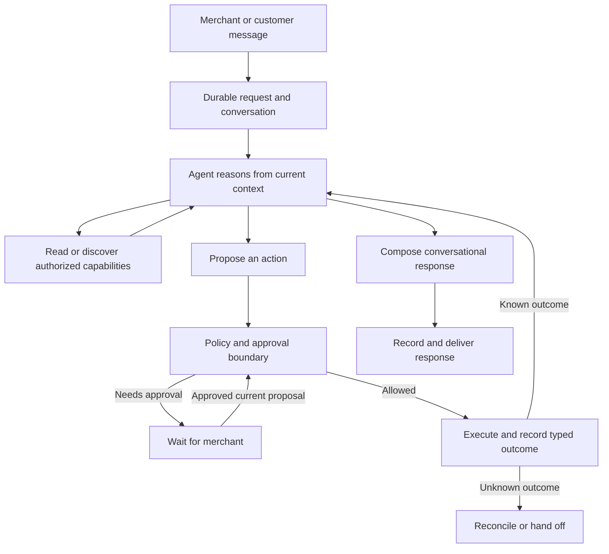

# Conversational agent overhaul plan

Status: in progress. Packages 0 and 1 are complete. Package 1 now covers the
shared receipt boundary, durable action dispatch/recovery lifecycle, all retained
Shopify writes, retained internal-thread writes, and durable communication
outcomes. Package 2 now has additive persistence, ownership helpers, durable
dashboard submission/status retrieval, a claimed gateway worker, queue-gap and
stale-claim recovery, refresh reconnection, a crash-safe cumulative budget,
merchant cancellation ordered at the task row, durable writers for the proposal
or question a suspended task waits on, and one shared boundary that authorizes
an approved proposal for every surface. Scoped question continuation remains.
Package 3's step 3 landed with that boundary because the two overlap; the rest of
packages 3–6 has not started.
Created 2026-09-11; last updated 2026-09-15.

Implementation detail expanded 2026-09-11 against the current repository. Names marked **proposed** describe work to implement, not APIs or tables that already exist. This document authorizes no production operation by itself.

This is the implementation plan for the architecture discussed with the user: speaking to Shopkeeper should feel like speaking to a capable senior intern. It builds on the [maintainability audit](agent-maintainability-audit-2026-09-11.md). Where that audit suggests fixed completion sentences or rigid task tool sets, this plan supersedes those recommendations: conversation remains model-authored, and tool discovery remains adaptive.

## Product outcome

The agent understands informal instructions, investigates, remembers relevant context, improvises within its authority, and explains itself naturally. It can handle combinations of requests that were never individually programmed. It asks a focused question when the answer matters and takes reasonable initiative when it has enough information.

The runtime makes that freedom dependable. It owns authorization, durable execution, action identity, approvals, provider outcomes, and delivery. It does not prescribe a script for each customer situation.

Example acceptance conversation:

> Merchant: “This customer has been messed around twice. Figure out what happened and sort it out. Check with me before giving money back.”
>
> Agent: “The replacement was created, but it hasn't shipped. The blue one is out of stock; the black one is available. I can ask whether they'd prefer that or a refund. Want me to offer both?”
>
> Merchant: “Ask about the black one first, and keep it short.”

The agent discovers the order state and alternative through tools, changes direction based on the merchant's instruction, and drafts a suitable reply. There is no hardcoded “replacement failed twice” workflow. It does not interpret the initial request as permission to refund.

## Design boundaries

| Model owns | Runtime owns |
| --- | --- |
| Understanding requests and conversational references | Tenant, member, customer, and order access |
| Choosing relevant investigations and discovering tools | Tool availability and execution-time authorization |
| Proposing actions and alternatives | Approval binding and current-state policy checks |
| Deciding whether clarification is useful | Durable suspension and resumption |
| Adapting after new information or a definite failure | Retry limits and unknown-outcome reconciliation |
| Natural explanations, brand voice, and summaries | Verified result fields and delivery records |

Non-goals:

- No fixed intent-to-workflow catalog, mandatory conversation script, or template-only assistant.
- No multi-agent team, new agent framework, generic plugin platform, or giant catch-all tool.
- No new commercial capabilities during migration. The support wedge and existing merchant operations remain the scope.
- No broad rewrite of working provider adapters, identity checks, or channel integrations.
- No promise of perfect factual correctness for arbitrary generated prose. Structured evidence improves grounding; language quality still needs evaluation.

## Target architecture



Use the existing gateway, queue, database, and shared agent package. Support and operator turns retain different authorities and interaction styles, but share request identity, budgets, receipts, and recovery semantics. A policy decision may require approval even when the model wants to proceed.

### Durable request and work state

Distinguish a conversation, an inbound request, an ongoing task, a proposed action, an execution attempt, and a delivery. They are related identities, not interchangeable names for a turn. Several messages can advance one task, and one conversation can contain independent tasks.

Before introducing tables, map these responsibilities onto `OperatorEvent`, `PlanExecution`, `AgentAction`, existing pending state, request outcomes, and delivery storage. Extend existing records where their semantics fit. Do not repurpose a provider-specific event table as a generic task table without validating its claim and recovery behavior.

Persist only the work state needed to resume: objective, relevant entity references, evidence references, explicit constraints, pending question or approval, proposed actions, execution receipts, and progress. Do not persist hidden chain-of-thought or grow a parallel transcript of speculative reasoning.

Conceptual states include queued, running, waiting for input, waiting for approval, reconciling, completed, failed, and cancelled. Map them to existing storage before choosing a new enum. Record action completion separately from response delivery; a completed refund with a failed email must remain a completed refund.

### Adaptive agent loop

The model chooses a useful next step from reading, capability discovery, clarification, action proposal, or response. It may combine capabilities to solve novel requests. It need not produce a complete speculative action-and-reply plan before investigating.

Execute independent reads together. Record write proposals before execution; preserve meaningful dependencies between writes. Feed actual outcomes back before composing a completion response. Multiple related writes can still be reviewed together when their targets and parameters are known, so the new runtime does not introduce an approval or model round trip per trivial step.

Expose a compact relevant starting set plus authorized capability discovery. Discovery may expand the tool set during a task; it must not expose forbidden capabilities or load every schema as the default fallback. A model-selected task label is a relevance hint, never an authorization decision.

Maintain one execution owner for a task at a time. New instructions can supersede pending proposals, clarify an existing task, or start separate work. A request to stop prevents new actions; it cannot undo a provider write already submitted. Cross-device approvals and revisions must resolve against exact proposal identities.

### Capability and result contracts

Evolve the existing tool definitions rather than creating a second registry. Each capability owns its input schema, required evidence, allowed actor/context, provider requirements, approval/policy metadata, execution adapter, typed result, and recovery behavior.

Results carry outcome, target, relevant financial or operational fields, provider reference, and execution identity. Preserve distinctions such as not found, rejected, definite failure, and unknown outcome. Human-readable messages are presentation, not the source from which machine facts are reconstructed.

Separate stable operation identity from model tool-call IDs. A repeated proposal or restarted model turn must not accidentally receive fresh authority to repeat a committed action. Use provider idempotency where supported and reconcile where it is not. Do not claim universal exactly-once execution across external providers.

### Conversation, evidence, and memory

Generate responses from actual outcomes and relevant evidence. The model chooses wording, tone, and explanation. Exact consequential fields can be referenced through validated bindings to receipt fields; avoid fixed full-sentence templates as the default experience. Audit notes and delivery bookkeeping are runtime-generated.

For approval, clearly show proposed actions and any customer draft. If the merchant approves exact wording, preserve it except for explicitly shown result placeholders. A substantive change in action, amount, recipient, or approved message invalidates the relevant approval. Otherwise, post-execution composition follows the merchant's authorized intent and communication policy.

Scope evidence to the task, entity, and observation time. Recheck provider preconditions before writes, especially after waiting for approval. Prevent a model-provided evidence reference from establishing success without a matching successful record.

Keep conversational memory separate from authority. Store explicit preferences and useful task facts with source and scope, using the existing memory system. Summaries and preferences cannot grant permissions or turn customer claims into verified facts. Questions, references such as “that one,” topic changes, and returning to unfinished work need conversational evaluation, not a growing keyword router.

## Implementation instructions and fixed decisions

Read this section before starting a work package. The architecture above describes the product; this section specifies how to build it. If a later repository change makes a named location inaccurate, find the current owner and update the location here. Do not use that mismatch as a reason to invent another runtime.

### How to execute this plan

1. Work through packages 0–6 in order. Within a package, finish one contract and its tests before moving to the next. Package 3 may use a small explicit refund tool selection until package 4 adds discovery.
2. Keep old callers working through additive contracts and a versioned compatibility boundary. Do not change legacy persisted plan interpretation in place.
3. For each change, record the files changed, invariant implemented, tests run, remaining failures, and rollback behavior in the work-package checklist. A checkbox means implemented and verified, not merely coded.
4. Use existing functions for tenant checks, policy, claims, refund reservations, sending, and reconciliation. Extract a shared function only when two concrete callers need it. Do not add a service container, event-sourcing framework, workflow DSL, generic repository layer, or second capability registry.
5. Keep the configured model and provider adapters stable during the first slice so runtime regressions can be isolated. Do not compensate for broken claims, receipts, or tool selection by adding prompt instructions.
6. If a decision affects which merchant operations remain supported, preserve current merchant availability until the inventory provides a documented scope decision. Lack of usage data is not evidence that a capability is unused.

### Current code ownership and intended changes

The following are observations of current code, followed by implementation directions. Recheck them in package 0; the audit is supporting context, not a substitute for reading the callers.

| Responsibility | Current owner / limitation | Implementation direction |
| --- | --- | --- |
| Tool definitions | `tools/registry/types.ts`, `tools/registry/index.ts`; `AgentToolDefinition` already has parse, execute, policy, capabilities, scopes | Extend these definitions; derive discovery from them |
| Provider result | `tools/result.ts`; `ToolResult` has status, message, optional untyped data | Preserve status compatibility; introduce validated versioned receipts for retained writes |
| Execution and journaling | `tools/executor.ts`, `run-execution.ts`, `agent-actions.ts`, `ActionEntry` in `agent-context.ts` | Carry receipt data through every boundary and persist it before dependent work |
| Completion evidence | `completion-facts.ts` accepts string results and action inputs | New facts read validated receipts; historical text handling remains isolated |
| Shared model loop | `agent-loop.ts` has execute, capture, and read-only modes; capture can require a terminal draft | Reuse the loop; allow the new runtime to suspend on an action proposal without fabricating a completion draft |
| Planning selection | `planner-tool-selection.ts` includes a broad mutation bucket and `request_wider_tool_set` | Replace full-registry widening on migrated paths with bounded discovery |
| Approval execution | `plan-execution.ts`, `execution-ledger.ts`, `agent-actions.ts` | Retain current hash and claim checks; add task revision and immutable proposal binding |
| Unknown effects | `unknown-outcome-reconciliation.ts`, provider operation keys, refund spend reservations | Extend existing probes and receipts; never reset an uncertain operation to unattempted |
| Dashboard ingestion | Dashboard `api/agent/chat/route.ts` → `gateway-operator-turn.ts` → gateway `/operator/turn` | Replace HTTP-owned execution with durable submission and status retrieval |
| Messaging ingestion | Gateway `operator-event-ingest.ts`, `operator-event-store.ts`, `workers/operator-event.ts`, `maintenance/operator-event-sweep.ts` | Reuse persist/claim/sweep patterns; keep provider event identity intact |
| Approval surfaces | Dashboard pending/quick-approve routes, gateway `pending-plan-actions.ts`, `operator-context.ts` | Adapt surfaces to the same proposal identity and server-side decision function |
| Delivery | `message-dispatch.ts`, gateway `operator-event-reply.ts`, `message-handlers/outbound-email.ts`, persisted messages | Reuse channel senders and delivery recovery; link their records to task and response identity |

Paths without a prefix in the first eight rows are under `packages/agent/src/`. Gateway paths are under `apps/gateway/src/`; dashboard paths are under `apps/dashboard/src/`.

### Persistence decisions: identity is not status

Use the following mapping as the default schema design. Package 0 must turn it into exact Prisma fields, relations, indexes, and migration steps before implementation. Changes to this mapping require a concrete existing constraint or recovery test that the default cannot satisfy; naming preference is insufficient.

| Identity | Storage decision | Required meaning |
| --- | --- | --- |
| Conversation | Reuse `Thread` and current operator/member thread resolution | Transcript and access boundary; not a single task |
| Inbound messaging event | Retain `OperatorEvent` and inbound `Message` identities | Deduplicate provider delivery; never fabricate a provider message ID for dashboard work |
| Request | Add proposed `AgentRequest` | One accepted instruction, client/provider dedupe key, immutable normalized payload, actor, conversation, status and linked task |
| Task | Add proposed `AgentTask` | Durable objective and revision across multiple requests; task state, runtime version, claim, budget and bounded checkpoint |
| Proposal | Add proposed `AgentProposal` | Immutable versioned action bundle and communication approval snapshot; multiple proposals can belong to a task |
| Proposal execution | Retain `PlanExecution`; link to proposal/task | One existing claim boundary for an approved/allowed bundle; do not make its enum represent conversational waiting |
| Action and receipt | Extend `AgentAction` | Durable operation identity and dispatch state created before a write; validated outcome after execution |
| Pending UI | Retain `OperatorContext` as a compatibility projection | Cards/questions reference durable task/proposal IDs; a trimmed pending queue cannot delete authoritative work |
| Request analytics | Retain `RequestEpisodeOutcome` | Existing support episode/plan analytics; not a generic task queue |
| Response / delivery | Reuse `Message` and current delivery storage where their semantics fit | Persist text, destination, response identity and send state; use a small linked delivery record only where the existing sender lacks durable identity |

Do not add one new table for every conceptual word. These three proposed models address specific gaps: dashboard request dedupe, multi-request task state, and proposals that must survive cache/queue replacement. Do not widen `OperatorEventStatus` or `PlanExecutionStatus` to serve all three roles.

Minimum fields and constraints for the proposed records:

- `AgentRequest`: ID, organization ID, authenticated actor key and actor kind, channel, conversation ID, dedupe key, payload version/hash, normalized instruction, source event/message reference, accepted time, processing state, task ID. Enforce uniqueness over organization + actor + channel + dedupe key. Same key and same payload returns the existing record; same key with changed payload returns conflict. Provider event keys retain their existing dedupe boundary as well.
- `AgentTask`: ID, organization/conversation IDs, initiating actor, objective, runtime version, status, monotonically increasing revision, active proposal reference, pending question, checkpoint version/JSON, claim token/lease expiry, cancellation time, model-call and usage counters, active-time budget, last progress time. Persist a question ID and intended answerer scope; an unrelated message must not silently answer it.
- `AgentProposal`: ID, organization/task IDs, task revision, schema version, immutable canonical actions, explicit dependencies, communication mode/draft, proposal hash, source instruction references, creation time, status, approver identity/time and approved hash when applicable. The executable snapshot must survive removal of a UI card or cached plan.
- `AgentAction` extensions: task/proposal references, stable operation ID, action index, dispatch state, submission time, nullable versioned receipt JSON. Keep existing `status`/`output` readers working during migration. Introduce a separate dispatch-state field rather than overloading display-oriented action status. Review `executedAt`/`durationMs` defaults before creating pre-dispatch rows so they do not falsely report an execution.
- Add indexes for task recovery by status/lease expiry, requests awaiting processing, proposals by task/revision, and operation lookup. Enforce operation uniqueness per organization in the database. Audit/backfill old rows before adding a constraint; existing `providerOperationKey` is indexed, not unique.
- Scope all lookups and mutations by organization and enforce parent ownership. Add the new records to workspace deletion, customer/thread redaction, and retention handling. Do not cascade away evidence for unresolved provider writes without the existing lifecycle policy handling them.

The task checkpoint contains short observable facts: objective, entity IDs, source message/evidence IDs, explicit user constraints with sources, pending question, active proposal IDs, action/receipt IDs, and next work category. Keep the transcript in existing message storage. Bound checkpoint text and reference counts with schema validation; do not serialize the entire provider context or model reasoning into JSON.

### Task transitions and concurrency

Use a task-specific state set: `queued`, `running`, `waiting_input`, `waiting_approval`, `reconciling`, `completed`, `failed`, `cancelled`. These are proposed task states, not replacements for existing execution enums.

| From | Event and guard | To / required write |
| --- | --- | --- |
| queued | Worker wins conditional claim | running; store token and lease |
| running | Model asks a relevant question | waiting_input; persist question and response before releasing claim |
| running | Policy requires approval for persisted proposal | waiting_approval; persist proposal and notification intent |
| waiting_input | Scoped answer matched to question/task | queued; attach request and increment revision |
| waiting_approval | Valid decision for current proposal/hash | queued; record approval atomically, then enqueue |
| waiting_approval | Revision/dismissal | queued or cancelled according to instruction; invalidate pending proposal |
| running | Submitted write has uncertain outcome | reconciling; retain operation key, receipt if available and spend reservation |
| reconciling | Provider probe establishes outcome | queued to observe known outcome, or cancelled after recording outcome if cancellation was requested |
| running | Objective satisfied; required response persisted | completed; delivery can still be pending/failed |
| queued/running/waiting_* | Authorized stop | cancelled if no uncertain submitted write; otherwise reconciling with cancellation recorded |
| running | Definite unrecoverable failure or exhausted budget | failed with reason and resumable facts; uncertainty still takes precedence as reconciling |

Completed/cancelled/failed tasks are not reset by a duplicate request. A deliberate new instruction can create a new task referencing prior work. A known partial result remains visible even when the overall task fails or is cancelled.

Concurrency implementation rules:

1. PostgreSQL conditional updates/transactions decide ownership; Redis locks and queue job IDs are optimizations. Claim task status and token atomically. Every state mutation from a worker must verify its token and expected revision.
2. Renew leases while work runs. A replacement worker may reclaim expired reasoning/read work. If any action reached dispatch, inspect its durable operation state first; lease expiry never authorizes replay.
3. Persist inbound revisions and action-dispatch authorization through a shared task-row ordering point. If a stop/revision wins before dispatch authorization, the old action cannot start. Once dispatch authorization wins, report that the action may already be underway; attempt abort where supported but still reconcile its outcome.
4. Do not hold a database transaction across model or provider network calls. Persist dispatch intent under the transaction, then call the provider. This introduces a conservative crash window: a crash after intent but before the call is treated as potentially submitted unless the adapter can prove otherwise.
5. A stale worker that receives a provider result may record evidence against the exact operation through the reconciliation path. It must not update the current task revision, overwrite a newer result, send a new reply, or start another action.
6. Recovery scans durable rows for accepted-but-not-enqueued requests, expired claims, unknown operations, and unsent responses. Queue publication after a database commit can fail; the sweep is required, not optional cleanup.

### Typed receipts and operation identity

Retain current `ToolStatus` values (`ok`, `error`, `not_found`, `policy_block`, `escalated`, `unknown`) at compatibility boundaries. Add a discriminated receipt for writes rather than a second competing success boolean. The following is a proposed minimum contract; implement runtime validation as well as TypeScript types in the existing result/registry area:

```ts
type ReceiptV1 = {
  version: 1;
  operationId: string;       // runtime-assigned; never a model tool-call ID
  executionId: string;      // existing PlanExecution identity
  tool: string;             // registered tool name
  target: { kind: string; id: string };
  observedAt: string;       // ISO timestamp from runtime
} & (
  | { outcome: "succeeded"; providerReference: string | null;
      facts: Record<string, unknown> }
  | { outcome: "not_found" | "rejected" | "failed";
      code: string; providerReference: string | null }
  | { outcome: "unknown"; code: string;
      providerReference: string | null }
);
```

`facts` is shorthand in this example only. In code, use a per-tool validated discriminated union, not unconstrained JSON cast to the expected type. Refund facts require actual refunded amount as an exact decimal string, currency, canonical order ID, and the provider refund reference. Cancellation facts require order ID and the provider-confirmed cancellation state/time where available; cancellation does not imply a refund. A null reference is allowed only for capabilities whose provider contract has another documented verification method. Missing required success fields after a possible write is an unknown outcome, not permission to claim success or retry.

Map outcomes once: `succeeded → ok`, `not_found → not_found`, `rejected → policy_block` for local policy rejection (otherwise documented provider rejection/error), `failed → error`, `unknown → unknown`. A handoff (`escalated`) is a control outcome, not proof of a commercial write. If legacy status and a receipt disagree, fail validation and preserve the uncertainty; do not choose the more optimistic value.

Data path to implement and test:

`provider adapter → ToolResult receipt → executor result → ActionEntry → AgentAction receipt JSON → CompletionFact → model-visible observation / response binding`

Do not populate refunded amount from the requested input, parse it from `message`, or infer a currency from the merchant's locale. Use provider-confirmed monetary values and the provider/currency precision rules; do not round with binary floating-point or assume every currency has two decimal places.

Operation lifecycle:

1. Normalize and validate proposal inputs; assign a durable operation ID per action when the proposal is persisted. Repeated attempts to execute that action reuse the ID and provider key.
2. Before accepting a newly generated proposal, compare its target, normalized effect, and task history with committed or unknown operations. If it duplicates one, link to the prior result or reconciliation state. A fresh model tool-call ID or new proposal ID cannot bypass this check. An intentional additional refund requires new explicit intent and current remaining-refundable evidence; identical parameters alone must not dedupe unrelated legitimate tasks forever.
3. Create/journal the action before network submission. Reuse the current refund-spend reservation and policy enforcement path. Do not release an unknown reservation as if the write failed.
4. Revalidate authority and provider preconditions, then atomically mark dispatch authorized. Call the existing adapter with the stable provider operation key when supported.
5. Persist the typed receipt before scheduling a dependent write or composing a success message. If the provider succeeded but persistence fails, recover via the same operation key/probe; do not resubmit using another identity.
6. A definite failure may be retried only when the adapter documents that no effect occurred and the error is retryable, within the persisted retry budget. Unknown outcomes go to the existing reconciliation mechanism. A single empty probe is not proof of failure when the provider is eventually consistent.
7. For a bundle, execute writes sequentially in declared dependency order. If A succeeds and B fails, keep A successful. Block dependent actions; allow unrelated investigation. Do not invent compensation/undo operations. Retry delivery separately from commercial actions.

### Approval and communication contract

Use a canonical server-generated hash of the immutable proposal. Extend the existing `hashPlan` / instruction-hash machinery rather than hand-building hashes in channel code. Canonicalization must sort object keys, preserve meaningful array order, normalize input with the registered parser, and preserve exact approved draft bytes. Test that reordered object keys hash identically and changed amount/recipient/draft/dependencies do not.

The approved snapshot binds organization, task and revision, proposal ID/version, actor scope, normalized tool names/inputs/targets, ordered action dependencies, communication mode, destination, approved draft (if any), and allowed result bindings. Keep existing policy and instruction binding at least as strict as today. Record approver identity and decision time from authentication, never from model arguments.

Use exactly two communication approval modes initially:

- `exact_draft`: display the destination and exact draft before approval. After execution, only explicitly displayed placeholders may be substituted from validated successful receipts. If an action fails or a binding is unavailable, do not send the success draft; compose a new status/proposal and apply normal communication policy.
- `intent`: record what the merchant authorized communicating, to whom, and any wording limits. Compose after actual outcomes. This mode is available only where existing policy allows it; it is not an automatic replacement for exact-draft approval.

Approval execution must load the persisted proposal, verify current membership and proposal revision/hash, recheck applicable policy and provider state, and acquire the existing execution claim. Buttons and conversational approval call this same boundary. A terse “yes” with two plausible pending proposals triggers clarification; never use “latest card wins” to authorize money or recipient changes.

A changed amount, order, address, recipient, action set, dependency, or exact draft supersedes the proposal and needs whatever approval the replacement requires. A changed display label does not change authority. Recheck refundable balance, fulfillment/cancellation state, customer/order ownership, grant health, and applicable limits after any wait. If current state no longer permits the exact approved action, return a rejection or propose a revision; do not silently adjust the amount.

For several known related actions, persist and display one bundle and approve its complete snapshot once. Use the existing plan claim as the bundle owner and individual operation records for partial results. This is not an atomic provider transaction.

### Dashboard submission and recovery contract

Implement this additive API shape on the existing dashboard/gateway route owners; the status route is proposed and must be added. Keep old response handling behind the legacy runtime route until its callers migrate.

| Request | Contract |
| --- | --- |
| Dashboard `POST /api/agent/chat` | Client sends `clientRequestId`, instruction, and optional task/question references; server derives org/member and validates access |
| Gateway internal submission | Dashboard forwards authenticated context and stable request ID; gateway persists before acknowledging, then enqueues |
| Accepted response | HTTP 202 with durable `requestId`, `taskId` when assigned, status and status URL; no provider/model work in the HTTP lifetime |
| Duplicate submission | Return original request and current state; changed payload under same key is HTTP 409 |
| Proposed `GET /api/agent/requests/:requestId` | Authenticated status, linked task/proposal/question IDs, observable progress, persisted response and delivery state; no provider secrets or hidden reasoning |
| Resume after refresh | Fetch recent/pending tasks for the authorized conversation and restore transcript/cards from server storage, even when the original POST response was lost |
| Cancel / approve / answer | Persist a scoped decision referencing exact task revision/proposal/question, then enqueue continuation; do not execute the provider in the route |

Generate `clientRequestId` once when the user submits, preserve it through transport retries, and clear the pending client submission only after acknowledgement/recovery. Two intentional clicks/submissions are not deduped by text alone. Persist recovery identifiers in client state that survives refresh; avoid putting customer message bodies in browser storage just to dedupe. Server-side history remains the authority if local state is lost or another device is used.

Use existing event facilities to notify clients, with status polling as the recovery fallback. A lost event must not lose a result. A browser disconnect stops observation, not task execution. Dashboard response availability means text is durably available for retrieval; it does not prove the merchant has read it or that an external customer message was delivered.

### Adaptive-loop implementation recipe

Keep a single model loop and ordinary registered tools. The following specifies runtime ordering, not a fixed conversation/tool sequence:

```text
claim task and load current revision, budget, checkpoint and authorized context
recover any submitted/unknown operation before permitting an overlapping write
while active work budget remains:
    recheck ownership, revision, cancellation and budget
    call model with relevant observations and currently available tools
    if independent reads: execute bounded parallel reads; append typed observations
    if discovery: authorize candidates; add bounded schemas; append discovery result
    if writes: validate and persist proposal; evaluate existing policy
        if approval required: persist waiting state and notification; release claim
        otherwise: claim proposal, execute allowed operations, persist receipts
        append actual outcomes and let the model continue
    if question: persist scoped question and response intent; release claim
    if response: validate consequential bindings; persist text and delivery intent
        finish or suspend according to unresolved work, then release claim
on deadline / lease loss: stop scheduling; preserve/reconcile submitted operations
```

Use existing native tool-call schemas for actions. Do not require the model to emit a giant JSON object containing the entire task, all future steps, and a speculative final answer. A model-provided proposal is untrusted until parsed and persisted by the runtime. Response delivery itself passes through messaging policy and durable sending; a final-text model block is not authorization to send to an arbitrary customer.

Maintain one persisted budget through planning, discovery, retries, and final composition. Count calls before dispatch so a crashed attempt cannot reset them; record actual usage through the existing spend accounting. Reserve capacity for a final status response. If that capacity is unavailable, expose a runtime status to the operator rather than fabricate a model answer. Human waiting does not consume active model/provider time; resume with remaining active budget and a newly derived attempt deadline, without replenishing total call/spend limits. Reconciliation and delivery use their own bounded existing recovery policies so exhausting model calls does not abandon a submitted refund.

Package 0 must freeze concrete values for call count, active deadline, read concurrency, retry count, discovery result limit, tool-schema cap, checkpoint bounds, and reconciliation escalation age in one configuration location. Start from current configured execution limits; changes require baseline measurements. Do not scatter fresh constants across the dashboard, planner, and gateway or invent unmeasured release targets here.

### Discovery, evidence and continuity

Implement a proposed `discover_capabilities` loop control with a validated input such as `{ query: string }`. It reads the existing registry and returns only authorized capability names, short descriptions, and why a result is unavailable when that explanation is safe. Add the selected schemas to the next model call in the same task. It performs no commercial effect and is not stored as an executable plan step.

Default selection rules:

- Start with authorized question/reply controls, relevant KB/product/order reads, and discovery. Identity-sensitive order/customer reads remain subject to verified context. A strong current relevance hint may add the specific needed mutation, such as address update, but not the whole mutation group.
- For absent or stale classification, use the compact authorized starter set. Never load the full registry as an error fallback. Preserve observations and budget when discovery expands tools.
- Derive candidates from the same availability, actor/context, connection, grant and policy eligibility checks used for selection. Execution rechecks these; a tool absent from the current model schema cannot be executed merely because the model names it.
- Keep anonymous storefront, verified storefront, support, and merchant boundaries explicit. Discovery cannot turn support into merchant mode or supply a missing verification credential.
- If no candidate is useful, return an empty result with a typed reason; the model may ask, investigate differently, or hand off. Do not recursively widen until something appears. Repeated identical discovery with no new evidence must hit the shared budget/limit.

Evidence records must identify source kind (provider read, execution receipt, user claim, KB/policy, preference), organization, relevant entity, observation time, and source identity. User claims and summaries never acquire provider-evidence status by being copied. Resolve evidence references server-side with ownership checks. Freshness is operation-specific: a write adapter names its necessary preflight reads; there is no global “all evidence younger than five minutes is safe” rule. Persist enough evidence to explain a proposal without retaining unnecessary provider payloads.

For continuity, provide the model a bounded list of open tasks with IDs, short objectives, entities, pending question/proposal and recent source messages. Let it propose continuation or a new task; validate the chosen ID's ownership. Explicit UI replies carry task/question/proposal IDs. Conversational references may resolve from clear context; ambiguous consequential references require clarification. Preferences use existing merchant memory with source and scope; “always refund me” in customer text is not a merchant preference or a permission update.

### Response grounding and delivery

New completion facts must come from stored, schema-valid receipts or authoritative provider observations with explicit provenance. A current order state can support “the order is cancelled”; it does not prove “I cancelled it” without a matching operation receipt. An input field or proposed action can support future-tense proposal wording only.

Reuse and narrow the existing completion-binding mechanism. Bind a specific receipt/operation, target and allowed field; reject mismatched tenant/task/target/outcome or unsupported field paths. Give the model structured outcomes and let it author surrounding prose. Amounts and provider references shown as consequential bindings are rendered by validated code. Prose checks remain heuristics: do not claim that field bindings prove the truth of every sentence.

Persist the composed response and its destination before attempting delivery. Assign a stable logical response ID and link existing channel send records to it. Retry the stored approved/composed text, not a new model generation. Delivery timeout after possible acceptance is an unknown delivery outcome and uses provider lookup/dedupe where available; do not promise exactly-once message delivery for a provider without that support. Never mark an email delivered just because it was queued. Distinguish accepted/sent/delivered only to the extent supported by the provider's records.

## Migration work packages

All packages are initially unchecked. Each ships through review with scoped evidence and a rollback path. Packages are ordered by dependencies, not calendar estimates; estimate after the first complete vertical slice establishes migration cost.

### 0. Establish baseline and contract decisions

Working evidence: [Package 0 baseline and contract inventory](conversational-agent-overhaul-p0-baseline.md).
Package 0 completed 2026-09-12: repository ownership, the 47-capability
caller/authority matrix, production persisted-state counts, available
current-window measurements, unavailable-data labels, final schema fields, and
frozen first-slice runtime budgets are recorded in the working evidence.

Deliverables, in order:

1. Trace one dashboard instruction, one operator-channel message, and one support approval from authenticated ingress through provider execution to stored reply. Record actual IDs and owners using synthetic/redacted examples. Include every approve/dismiss/replan caller; the dashboard chat route is not the only execution entrance.
2. Produce a capability inventory from active and retired registry definitions plus operator-only module tools. For each, record actor modes, current callers, observed usage or `unknown`, provider requirements, write/read/control category, success schema, idempotency/probe support, and retained/default/discoverable/historical disposition. Enumerate the retained tools by name; “merchant operations” is not a complete migration list.
3. Inspect persisted plan versions, pending queues, claimed/unknown executions, unknown actions/reservations, and undelivered responses with existing read-only audit tooling. Record count, environment, timestamp and query scope. Do not run recovery, canaries or cleanup as a side effect of inventory.
4. Finalize the proposed persistence mapping above in this document, including the relation from proposal ID to existing `PlanExecution.planId`. Default: use the proposal UUID as the new-runtime plan ID, preserving the current organization/plan unique claim. Record old-row decoding and deletion/retention behavior for each additive field.
5. Freeze the configuration values listed under adaptive-loop budgets and a baseline sample window. Mark unavailable measurements explicitly. Produce an evaluation manifest with case IDs, baseline runtime/model/settings, deterministic versus live execution mode, repetitions, and held-out status.

Exit gate: no unresolved storage-owner choice, no unnamed retained write, and no assumption that unavailable provider evidence or usage data is present. A product-scope question may remain explicitly deferred only if the existing merchant capability stays supported and isolated.

- [x] Map current request, approval, execution, action, and delivery identities across dashboard, messaging, and customer support.
- [x] Inventory actionable persisted plans, unresolved outcomes, live grants, and capability usage before retiring behavior or storage formats. Production aggregate recorded 2026-09-12 in the Package 0 baseline; missing action rows and scope metadata remain explicit limitations.
- [x] Capture current latency, model calls, avoidable handoffs, delivery failures, and cost per completed task from existing records. Production turn proxies and delivery counts are recorded; task cost and avoidable-handoff rate are explicitly unavailable from current records.
- [x] Create an evaluation set covering routine tasks, unfamiliar combinations, conversational follow-ups, and execution failures. Reserve unseen variants for acceptance.
- [x] Document the smallest required changes to persistence and contracts, including approval semantics for post-execution replies.

Acceptance: a reviewed ownership map, reproducible baseline where data exists, and explicit compatibility decisions. No new abstractions justified only by hypothetical future modules.

Primary locations: [agent package](../packages/agent/README.md), [database schema](../packages/db/prisma/schema.prisma), [turn execution](../packages/agent/src/turn.ts), [plan execution](../packages/agent/src/plan-execution.ts).

### 1. Preserve typed outcomes through the existing execution path

Progress as of 2026-09-15:

- [x] Add a versioned receipt union with runtime validation for `succeeded`,
  `rejected`, `failed`, `not_found`, and `unknown`, including exact decimal
  money, currency, target, operation/execution identity, observation time, and
  provider reference.
- [x] Propagate receipts through executor results, `ActionEntry`, run execution,
  action journaling, and additive `AgentAction.receiptVersion`/`receipt` JSONB
  storage. Migration `20260912120000_add_agent_action_receipts` enforces the
  nullable field pair and version 1.
- [x] Validate tool, operation, execution, legacy action status, target, and
  provider-reference agreement before a receipt is persisted. A malformed or
  missing required receipt becomes observable `unknown`, never success.
- [x] Make completion facts receipt-first. New-runtime callers do not infer
  success from display text or proposed inputs; the pinned legacy runtime is the
  only caller that explicitly enables historical string inference.
- [x] Create a durable `AgentAction` attempt before a non-read tool call and
  complete that same row afterward. The row is now a lifecycle record rather
  than a terminal-looking placeholder: preparation, dispatch authorization,
  submission, and outcome are persisted separately.
- [x] Migrate `create_refund`, `create_partial_refund`, and `cancel_order` to
  typed receipts. Successful refunds carry provider-confirmed amount, currency,
  refund and transaction references, and full/partial classification. Partial
  refunds also carry line-item IDs and quantities. Successful cancellation
  carries provider-confirmed cancellation time, reason, financial status, and
  restock result without inferring a refund amount.
- [x] Migrate `create_return` to a version-1 receipt with provider-confirmed
  return identity, name, status, returned fulfillment-line-item quantities, and
  explicit `refundIssued: false`. Preserve the existing `returnWatch`
  compatibility record. Missing success state remains unknown, and a recovery
  probe that cannot rebuild every required receipt fact cannot promote a
  lifecycle action to success.
- [x] Migrate `create_exchange` to a version-1 receipt with provider-confirmed
  return identity/name/status and both returned and replacement variant
  identities/quantities. Require `read_products` plus `write_returns`, preserve
  the return-watch projection, and do not turn catalog price comparison into a
  claimed financial outcome. The current provider response exposes no money or
  transaction set, so the receipt records `financialConsequence: null`.
- [x] Migrate `attach_return_label` to a version-1 receipt with the order,
  return, reverse-fulfillment-order, and reverse-delivery identities; a SHA-256
  label fingerprint under the retention boundary; optional tracking number; and
  explicit provider-observed `attached` state. Require `write_returns`, keep the
  customer-facing label URL out of the receipt, and preserve incomplete or
  interrupted mutation responses as unknown. The tracking-based recovery probe
  can identify a likely commit, but cannot rebuild the label fingerprint and
  complete receipt, so lifecycle reconciliation conservatively leaves it
  unknown.
- [x] Migrate `update_shopify_order_address` to a version-1 receipt carrying the
  canonical order and customer IDs, the provider-normalized order address, and a
  separately typed customer-default-address outcome, so a committed order
  address stays visible when the customer profile half fails or cannot be
  confirmed. Require `write_orders` plus `write_customers`. Preconditions are
  `rejected`, a missing order is `not_found`, and an unconfirmed or failed
  customer sync keeps the whole receipt `unknown` while retaining the committed
  order-address facts. The existing read-after-write probe reads only the
  order's shipping address, so it can observe the order half but cannot
  reconstruct the compound receipt, and lifecycle reconciliation leaves it
  unknown. Runtime validation permits these partial compound facts only on an
  unknown outcome and binds their provider reference to the canonical order.
- [x] Migrate `fulfill_order` to a version-1 receipt with provider-confirmed
  fulfillment identity, status/time, fulfillment and order line-item
  identities/quantities, returned tracking fields, and the customer-notification
  request flag. Require `write_merchant_managed_fulfillment_orders`, retain the
  Shopify-user `fulfill_and_ship_orders` provider precondition, and describe
  notification as requested rather than delivered. Missing post-mutation state
  remains unknown.
- [x] Migrate `edit_shopify_order` to a version-1 receipt with the canonical
  order and an ordered addition/removal change list carrying provider line-item
  and variant identities, requested quantities, provider-observed final
  quantities, and per-change outcomes. Preserve staged/rejected compound state
  on unknown receipts, require `write_order_edits` plus `read_orders`, and keep
  a probe-observed commit unknown when recovery cannot reconstruct the complete
  receipt.
- [x] Migrate `create_shopify_order` to a version-1 receipt with the canonical
  created-order identity/name, deterministic operation tag, provider-observed
  financial status, exact total/currency, and admin URL. Require `write_orders`,
  preserve legacy identity-less adapter compatibility, and keep incomplete or
  unconfirmed creation unknown when recovery cannot reconstruct the receipt.
- [x] Migrate `update_shopify_customer_info` to a version-1 receipt with the
  canonical customer identity and an ordered list of exact provider-observed
  changed fields. Require `write_customers`, reconcile incomplete or ambiguous
  PUT responses with a customer read, and keep later lifecycle reconciliation
  unknown when it cannot rebuild the persisted receipt.
- [x] Migrate `add_shopify_customer_note` to a version-1 receipt with the
  canonical customer identity and SHA-256 bindings for the previous, appended,
  and provider-returned final note. Require `write_customers`, issue only one
  append attempt, reconcile against the exact constructed final note, and never
  promote a later text-only observation without the hash-bound receipt.
- [x] Migrate `create_gift_card` to a version-1 receipt with the provider gift-card
  identity, exact initial value/currency, customer identity, expiration date,
  notification-request flag, last four code characters, and a SHA-256 code
  fingerprint without copying the one-time code into the receipt. Require
  `write_gift_cards` plus `write_customers`, and `read_gift_cards` for exact
  recovery lookup (the matching write grant satisfies that read). Reconcile an
  interrupted response or stable-code collision only when exactly one complete
  card matches the operation code, note, customer, amount, and expiration.
- [x] Migrate the isolated operator `create_flash_sale` write to a version-1
  receipt with the provider discount identity, application scope, exact variant
  identities, percentage, start/end times, and provider status. Require
  `write_discounts` for catalog sales and add `read_products` for variant-scoped
  sales. Bind identity-bearing attempts to a stable operation marker in the
  title, submit the mutation only once, and reconcile an interrupted response
  only when exactly one complete automatic discount matches that marker.
- [x] Migrate the isolated operator `end_flash_sale` write to a version-1
  receipt with the exact automatic-discount identity and whether Shopify
  confirmed deletion directly or a targeted post-interruption read confirmed
  absence. Require an explicit ID and `write_discounts`, preserve malformed,
  rejected, missing, incomplete, and uncertain outcomes, and never repeat an
  ambiguous delete. Expose active-sale discovery separately as the read-only
  `list_flash_sales` operator tool while retaining the adapter's legacy no-ID
  listing behavior.
- [x] Migrate the isolated operator `set_variant_prices` write to a version-1
  receipt with ordered product batches and exact per-variant product/variant
  identities, original/requested/provider-observed prices, store currency when
  Shopify returns it, batch outcome, and confirmation source. Require
  `write_products`, preserve the legacy `priceChanges` projection, and treat a
  mixed multi-product result as unknown while retaining confirmed batches.
  Submit each product batch once; after an interrupted or incomplete mutation
  response, read all named prices and settle success only when every requested
  price is observed. A partial, mismatched, or unobservable result remains
  unknown and is never replayed.
- [x] Migrate `add_internal_note`, `update_thread_status`,
  `update_thread_tag`, and the isolated operator `mark_ticket_spam` through the
  same operation/dispatch/receipt boundary. Receipts bind the tenant-owned
  thread and preserve the created note message/hash, observed before/after
  status or tag, or observed spam-filter transition and decision time.
- [x] Migrate `send_reply`, `send_email`, and `send_ticket_reply` to durable
  communication receipts. Persist a logical response `Message` before provider
  dispatch, hash the exact text, retain destination and provider identity, and
  distinguish accepted, sent, delivered, and unknown states without treating
  queue admission as delivery. Retrying delivery reuses persisted text; an
  ambiguous provider response remains unknown and does not authorize resend.
- [x] Preserve ambiguous or incomplete post-write outcomes as `unknown` for all
  sixteen migrated retained Shopify writes. Cancellation reuses its existing
  reconciliation read;
  refund operation identities remain available to existing reconciliation
  machinery; return, exchange, return-label, fulfillment, order-address, and
  order-edit probes cannot promote a commit unless they can reconstruct the
  complete required receipt; order creation reconciles by its deterministic
  operation tag; gift-card creation performs an exact receipt lookup during the
  adapter call; flash-sale creation performs an operation-tag lookup and
  flash-sale ending performs an exact-ID absence lookup during the adapter call;
  variant repricing performs a same-call exact price read after an interrupted
  or incomplete result; later lifecycle recovery remains unknown if it cannot
  reconstruct the applicable receipt.
- [x] Emit versioned definitive outcomes for the migrated operations:
  precondition/policy refusals are `rejected`, confirmed missing cancellation
  targets are `not_found`, and errors known to have made no provider change are
  `failed`.
- [x] Preserve the successful provider receipt as an `unknown` receipt if later
  local refund-budget finalization fails, so reconciliation retains the stable
  operation and provider reference.
- [x] Register version-1 receipts as required for identity-bearing executions of
  all sixteen migrated Shopify tools. Full refund, partial refund, cancellation, and order
  creation require `write_orders`; return and return-label attachment require `write_returns`;
  exchange requires `read_products` plus `write_returns`; fulfillment requires
  `write_merchant_managed_fulfillment_orders`; order address requires
  `write_orders` plus `write_customers`; and order edit requires
  `write_order_edits` plus `read_orders`; customer info requires
  `write_customers`; customer notes also require `write_customers`; gift-card
  creation requires `write_gift_cards`, `write_customers`, and a
  `read_gift_cards` recovery grant satisfied by `write_gift_cards`; flash-sale
  creation requires `write_discounts` and conditionally requires
  `read_products` for variant targeting; flash-sale ending requires
  `write_discounts`; variant repricing requires `write_products`. Selection withholds tools from
  insufficient grants and execution rechecks the same metadata.
- [x] Change partial refund creation to Shopify's `@idempotent` directive and
  register its exact exported mutation beside the full-refund mutation in
  `SHOPIFY_MUTATION_DOCUMENTS`.
- [x] Add the durable action dispatch lifecycle. New mutative attempts receive
  an organization-scoped UUID operation identity and action index, then move by
  conditional writes through `prepared`, `dispatch_authorized`, `submitted`,
  and `settled`/`unknown`. Prepared rows have no execution timestamp or
  duration; historical rows retain their nullable lifecycle fields.
- [x] Add submission/completion timestamps, organization-scoped uniqueness for
  stable operation and non-null provider-operation identities, and a migration
  preflight that aborts on duplicate provider keys instead of deleting or
  merging evidence.
- [x] Recover stale authorized/submitted attempts as unknown and include
  standalone actions in the existing reconciliation sweep. Recovery probes the
  stored operation identity and never replays the write. A probe that observes
  a commit but cannot construct the required typed receipt remains unknown.
- [x] Cover fresh-context recovery on both sides of submission, invalid/replayed
  state transitions, provider-key uniqueness, lifecycle receipt binding, and
  compatibility readers that exclude nonterminal rows from completed-action
  history.

Completed Package 1 work at this checkpoint:

| Contract | Completed implementation |
| --- | --- |
| Typed result boundary | `ReceiptV1` discriminates succeeded, rejected, failed, not-found, and unknown outcomes; runtime validation binds tool, target, operation, execution, provider reference, legacy status, and per-tool facts. |
| Receipt propagation | Structured receipts travel from the Shopify adapter through `ToolResult`, executor results, `ActionEntry`, run execution, `AgentAction` JSONB, completion facts, and model-visible completion evidence. |
| Compatibility | Historical string-only actions remain readable only through the explicit pinned-legacy option. New receipt-aware facts never infer consequential success from display prose or proposed inputs. |
| Migrated provider writes | `create_refund`, `create_partial_refund`, `cancel_order`, `create_return`, `create_exchange`, `attach_return_label`, `fulfill_order`, `update_shopify_order_address`, `edit_shopify_order`, `create_shopify_order`, `update_shopify_customer_info`, `add_shopify_customer_note`, `create_gift_card`, and the isolated operator `create_flash_sale`, `end_flash_sale`, and `set_variant_prices` writes emit version-1 receipts for definitive and uncertain outcomes with provider-observed facts. |
| Refund correctness | Full and partial refunds use Shopify-returned amount/currency/refund/transaction facts; partial refunds also preserve line-item quantities. Later budget-finalization failure retains an unknown receipt and reservation rather than erasing provider success evidence. |
| Cancellation correctness | Cancellation records provider-confirmed cancellation state/time, reason, financial status, and restock result. It never fabricates refund evidence. |
| Return/exchange correctness | Return and exchange receipts preserve provider return identity/state and exact affected item identities/quantities while retaining the existing `returnWatch` projection. Exchange price comparison remains a precondition rather than fabricated provider financial evidence. Return-label receipts retain exact reverse-delivery identity and a label fingerprint without persisting the URL. |
| Fulfillment correctness | Fulfillment receipts preserve Shopify-returned fulfillment identity, status/time, fulfillment and order line-item identities/quantities, and tracking fields. The receipt records whether Shopify was asked to notify the customer without claiming delivery. |
| Compound order writes | Order-address receipts preserve the committed order half when customer synchronization is uncertain. Order-edit receipts preserve ordered addition/removal legs and distinguish staged, rejected, unknown, and committed changes; only provider-observed committed quantities ground completion. |
| Order creation correctness | Created-order receipts bind the provider ID/name to the deterministic operation tag and preserve the observed financial status, exact total/currency, and admin URL. Incomplete direct or reconciled state remains unknown. |
| Customer-info correctness | Customer-info receipts bind the canonical customer and preserve an ordered list of the returned name, email, or phone fields that exactly match the request. Missing or mismatched provider state remains unknown. |
| Customer-note correctness | Customer-note receipts bind the customer and exact old/append/final note transformation by SHA-256 without copying note plaintext into the receipt. Missing or mismatched read-back remains unknown, and later recovery does not infer authorship from matching text alone. |
| Gift-card correctness | Gift-card receipts bind the provider card and customer, preserve the returned value/currency and expiry, and fingerprint the one-time code without persisting it as a receipt fact. Exact read-after-interruption reconciliation can produce a receipt; incomplete or non-unique state remains unknown. |
| Flash-sale correctness | Flash-sale receipts bind the provider discount, exact percentage and schedule, provider status, and either the entire catalog or the returned variant identities. The adapter submits once and can reconcile an interrupted response by its operation-tagged title; incomplete, mismatched, or non-unique state remains unknown. |
| End-sale correctness | End-sale receipts bind the requested and returned automatic-discount identity and distinguish direct deletion confirmation from absence observed after an interrupted response. Active-sale discovery is a separate read tool; an inconclusive end is never replayed. |
| Variant-price correctness | Repricing receipts preserve ordered per-product batches and exact old/requested/observed prices per variant. Direct mutation results and read-after-interruption confirmation are distinguished; partial, mismatched, and unobservable batches remain unknown without replay. |
| Internal-thread correctness | Note, status, tag, and spam writes bind the organization-owned thread and record database-observed results. Note content is represented by the created message identity and SHA-256 hash rather than copied into receipt JSON. |
| Communication correctness | Replies and emails persist a stable logical response before dispatch and record the message, destination, exact-text hash, provider message identity where available, and accepted/sent/delivered/unknown state. Provider ambiguity is recoverable separately from the preceding action. |
| Shopify contracts | `create_refund`, `create_partial_refund`, `cancel_order`, and `create_shopify_order` require `write_orders`; `create_return` and `attach_return_label` require `write_returns`; `create_exchange` requires `read_products` plus `write_returns`; `fulfill_order` requires `write_merchant_managed_fulfillment_orders` and retains Shopify's `fulfill_and_ship_orders` user-permission check; order address requires `write_orders` plus `write_customers`; order edit requires `write_order_edits` plus `read_orders`; customer info and customer notes require `write_customers`; gift-card creation requires `write_gift_cards` plus `write_customers`, with `read_gift_cards` declared for its recovery query and satisfied by the write grant; flash-sale creation and ending require `write_discounts`, variant-targeted creation adds `read_products`, and variant repricing requires `write_products`. Selection and execution enforce grant metadata. Both refund mutations use Shopify 2026-04 `@idempotent`; the fulfillment, order-edit, gift-card, flash-sale, and variant-price query documents remain registered for schema validation. |
| Durable operation identity | Every new non-read attempt receives a UUID operation ID and action index. Organization/operation and organization/non-null-provider-key uniqueness are database-enforced after an abort-on-duplicate migration preflight. |
| Dispatch lifecycle | Conditional writes enforce `prepared → dispatch_authorized → submitted → settled/unknown`. Prepared rows have null execution fields; submitted and terminal rows carry the appropriate timestamps. A receipt must match the durable operation before settlement. |
| Crash recovery | Stale authorized or submitted attempts become unknown, never prepared. The existing recovery sweep includes taskless/standalone lifecycle actions and probes using their stored provider identity without replaying the write. |
| Conservative reconciliation | A no-effect probe may settle failure. A provider commit observed without enough facts to construct the required typed receipt remains unknown instead of being promoted from reconciliation prose. |
| Read compatibility | Action history, return lifecycle, order-attention, and operator inspection readers exclude nonterminal rows with null `executedAt`; historical completed rows remain visible. |
| Persistence | Migration `20260912120000_add_agent_action_receipts` adds the validated nullable receipt pair. Migration `20260912160000_add_agent_action_dispatch_lifecycle` adds lifecycle identity/state/timestamps, nullable completion fields, checks, indexes, and uniqueness. |

Checkpoint evidence:

- Changed owners: `tools/result.ts`, `tools/registry/{types,schema,order}.ts`,
  `tools/executor.ts`, `run.ts`, `run-execution.ts`, `agent-context.ts`,
  `agent-actions.ts`, `completion-facts.ts`, `unknown-outcome-reconciliation.ts`,
  the gateway unknown-outcome sweep, the refund, partial-refund, cancellation,
  return, exchange, return-label, fulfillment, order-address, and order-edit
  Shopify adapters, plus order creation, customer info, customer notes, and gift
  cards and flash sales, `shopify/receipts.ts`,
  `shopify/{mutation,query}-documents.ts`, the gateway operator shop-tool owner,
  Shopify integration-health scope metadata and app configuration, Prisma schema
  and two migrations, affected dashboard/gateway completed-action readers, plus
  their adjacent tests.
- Invariants covered: display wording cannot change receipt-derived facts;
  requested refund money cannot replace provider-confirmed money; cancellation
  does not imply refund evidence; not-found and unknown remain distinct;
  incomplete provider success remains unknown; malformed, mismatched, or
  missing required receipts cannot be journaled as success; historical
  string-only actions remain readable through the explicit compatibility path;
  transition replay cannot advance an action twice; stale dispatch never resets
  to prepared; durable and provider operation identities cannot be reused within
  an organization; nonterminal attempts do not appear as completed history; a
  recovery probe never substitutes human-readable text for a required receipt.
  Gift-card completion facts likewise use only provider-observed receipt money
  and customer identity, never requested inputs or display text; the secret code
  is fingerprinted rather than duplicated into receipt storage. Flash-sale
  completion facts likewise use the validated receipt percentage, and catalog
  versus variant targeting is internally consistent and provider-observed.
  End-sale completion likewise requires an identity-bound receipt; a direct
  deletion and absence after an interrupted response remain distinguishable.
  Internal-thread writes likewise require organization-owned targets and bind
  receipts to database-observed message or state transitions. Communication
  receipts bind a pre-dispatch logical response to its destination and exact
  text hash; an ambiguous provider response remains unknown and is never
  converted into permission to send again.
- Foundational checkpoint verification passed: `npm run verify:pr`, including
  all 1,046 agent unit tests across 86 files, 1,147 agent coverage tests across
  99 files, repository lint,
  typecheck, Node tests, browser smoke tests, coverage/critical-coverage gates,
  and production builds. The focused dispatch/recovery/plan-execution database
  suite passed 51 tests across three files; the complete agent integration suite
  passed 102 tests across 13 files after the final operation-binding assertion.
- Not run: live Shopify no-effect schema validation, provider canaries, and live
  model gates. These remain unrun gates, not passes.
- Rollback: nullable receipt columns and historical readers stay compatible.
  Lifecycle fields are additive and remain null on historical rows. Route code
  may return to the legacy writer while retaining lifecycle readers and the
  unknown-outcome sweep for rows already created. Disable required receipt
  registration and adapter emission together if code rollback is necessary.
  Never reinterpret, reset, or resubmit an operation already stored as
  authorized, submitted, or unknown.

Incremental `create_return` evidence: `npm run verify:pr` passed, including
repository lint/structure, typecheck, all 1,050 agent unit tests across 86 files,
coverage and critical-coverage gates, browser smoke tests, and production
builds. The focused unknown-outcome integration suite passed 8 tests, including
a fresh-storage assertion that an observed return commit without reconstructable
receipt facts remains unknown. The local Postgres and Redis test services were
started for those runs. No live Shopify or model operation was run.

Incremental `create_exchange` evidence: `npm run verify:pr` passed, including
repository lint/structure, typecheck, all 1,055 agent unit tests across 86 files,
coverage and critical-coverage gates, browser smoke tests, and production
builds. The focused unknown-outcome integration suite passed 9 tests, including
fresh-storage assertions that observed return and exchange commits without
reconstructable receipt facts remain unknown. No live Shopify or model
operation was run.

Incremental `attach_return_label` evidence: `npm run verify:pr` passed,
including repository lint/structure, typecheck, all 1,059 agent unit tests
across 86 files, coverage and critical-coverage gates, browser smoke tests, and
production builds. The focused unknown-outcome integration suite passed 10
tests, including a fresh-storage assertion that a tracking-matched label commit
without reconstructable label fingerprint and receipt facts remains unknown.
No live Shopify or model operation was run.

Incremental `fulfill_order` evidence: `npm run verify:pr` passed, including
repository lint/structure, typecheck, all 1,064 agent unit tests across 86 files,
1,170 agent coverage tests across 99 files, coverage and critical-coverage
gates, browser smoke tests, and production builds. The focused fulfillment,
receipt, grounding, registry, mutation-document, integration-health, and
executor unit suites passed 203 tests across seven files. The focused
fresh-storage unknown-outcome integration suite passed 11 tests, including a
fulfillment commit that remains unknown when the probe cannot reconstruct the
complete receipt. The first full-gate attempt was blocked by sandbox denial of
a local ephemeral test port. A later rerun hit a transient pre-existing
Shopify-simulator fixture uniqueness collision; its isolated two-test suite
passed, and the final clean aggregate rerun passed with local test-port access.
No live Shopify or model operation was run.

Incremental `update_shopify_order_address` evidence: `npm run verify:pr` passed,
including repository lint/structure, typecheck, unit suites across every
workspace, coverage and critical-coverage gates, browser and send-reply E2E
suites, and production builds. Agent suites: 1,080 unit tests across 86 files,
1,187 coverage tests across 99 files, and 107 integration tests across 13 files.
Focused suites: 19 order-address adapter tests, 18 receipt-validation tests, 14
completion-fact tests, 114 registry tests, and 12 unknown-outcome integration
tests, including a fresh-storage assertion that an observed order-address commit
whose probe cannot rebuild the compound receipt remains unknown. The first
full-gate attempt failed in the dashboard coverage project under workspace
concurrency; that project passed 1,453 of 1,455 tests in isolation with 2
skipped, and the clean aggregate rerun passed. No source change was needed for
this slice beyond the adapter, registry, receipt, and completion-fact edits; the
`observedAddress` non-null assertions were reviewed and are guarded by
`addressMatches`, which requires a superset of the fields the receipt needs. No
live Shopify or model operation was run.

Follow-up `update_shopify_order_address` hardening added receipt-validation and
completion-fact regressions for partial compound outcomes. Partial address facts
are accepted only for `unknown`, and their target and provider reference must
both match the canonical order ID.

Incremental `edit_shopify_order` evidence: `npm run verify:pr` passed, including
repository lint/structure, typecheck, unit suites across every workspace,
coverage and critical-coverage gates, 12 browser smoke tests, and production
builds. Agent suites: 1,091 unit tests across 86 files, 1,199 coverage tests
across 99 files, and 108 integration tests across 13 files. The focused
order-edit adapter suite covers exact committed addition/removal observations,
definitive input rejection, interrupted begin/add/remove/commit boundaries,
partial staged swaps, and read-after-write confirmation. The focused
unknown-outcome suite passed 13 tests, including a fresh-storage assertion that
an observed order-edit commit remains unknown when its probe cannot rebuild the
complete per-change receipt. The GraphQL result selections use Shopify-returned
calculated and committed line-item IDs; no live Shopify or model operation was
run.

Incremental `create_shopify_order` evidence: all 1,096 agent unit tests across
86 files, all 1,204 agent coverage tests across 99 files, and all 108 agent
integration tests across 13 files passed. The focused unknown-outcome suite
passed 13 tests. Dashboard coverage passed in isolation with 1,453 tests and 2
skipped; gateway coverage passed in isolation with 1,360 tests and 1 skipped.
Analytics, email, and integrations coverage, the critical-coverage gates, 12
browser smoke tests, repository lint/structure, typecheck, Node tests, and the
production build also passed. Three aggregate `npm run verify:pr` attempts were
interrupted by distinct pre-existing concurrency flakes: two dashboard database
uniqueness races and one gateway socket hang-up. Each affected project passed
when rerun in isolation. No live Shopify or model operation was run.

Incremental `update_shopify_customer_info` evidence: all 1,105 agent unit tests
across 86 files, all 1,216 agent coverage tests across 99 files, and all 109
agent integration tests across 13 files passed. The six focused receipt,
grounding, registry, adapter, and reconciliation-probe suites passed 268 tests;
the fresh-storage unknown-outcome suite passed 14 tests. Repository lint and
typecheck passed. The aggregate `npm run verify:pr` reached the gateway unit
project and stopped because the sandbox denied its Supertest listener on
`0.0.0.0`; this was an environment restriction outside the changed slice, not a
test assertion failure. No live Shopify or model operation was run.

Incremental `add_shopify_customer_note` evidence: all 1,114 agent unit tests
across 86 files, all 1,224 agent coverage tests across 99 files, and all 110
agent integration tests across 13 files passed. The six focused receipt,
grounding, registry, adapter, and reconciliation-probe suites passed 275 tests;
the fresh-storage unknown-outcome suite passed 15 tests. Agent lint and
typecheck passed. Sandbox-only attempts at the aggregate and integration gates
could not open local listeners or reach local Postgres; the same changed and
database suites passed with the required local-service access. No live Shopify
or model operation was run.

Incremental `create_gift_card` evidence: all 1,119 agent unit tests across 86
files, all 1,230 agent coverage tests across 99 files, and all 111 agent
integration tests across 13 files passed. The five focused adapter, receipt,
grounding, registry, and reconciliation-probe suites passed 226 tests. Agent
lint and typecheck passed. Coverage includes exact success reconciliation after
an interrupted response, typed provider rejection and invalid-input outcomes,
receipt-derived value/currency/customer grounding, scope gating, query-document
registration, and a fresh-storage assertion that a probe-observed gift-card
commit remains unknown when the lifecycle cannot reconstruct its required
receipt. No live Shopify or model operation was run.

Incremental `create_flash_sale` evidence: `npm run verify:pr` passed, including
repository lint/structure, typecheck, Node tests, all workspace unit and coverage
suites, critical-coverage gates, 12 browser smoke tests, and production builds.
Agent suites passed 1,126 unit tests across 86 files and 1,237 coverage tests
across 99 files; gateway coverage passed 1,362 tests with 1 skipped, and
dashboard coverage passed 1,453 tests with 2 skipped. The five focused agent
receipt, flash-sale adapter, grounding, mutation-document, and query-document
suites passed 85 tests; the focused gateway operator shop-tool suite passed 11.
Coverage includes typed invalid-input, missing-variant, provider-rejection,
definite-failure, and unknown outcomes; exact provider-returned sale facts;
display-independent completion grounding; conditional scope gating; one-shot
operation-tag reconciliation; and a regression proving that an inconclusive
lookup does not repeat the mutation. No live Shopify or model operation was run.

Incremental `end_flash_sale` evidence: `npm run verify:pr` passed, including
repository lint/structure, typecheck, Node tests, all workspace unit and coverage
suites, critical-coverage gates, 12 browser smoke tests, and production builds.
Agent suites passed 1,134 unit tests across 86 files and 1,245 coverage tests
across 99 files; gateway unit passed 453 tests, gateway coverage passed 1,364
tests with 1 skipped, and dashboard coverage passed 1,453 tests with 2 skipped.
The five focused agent receipt, flash-sale adapter, grounding,
mutation-document, and query-document suites passed 93 tests; the focused
gateway shop-tool suite passed 13, and the two affected gateway route suites
passed 20 integration tests. Coverage includes exact deletion receipts,
bare-ID normalization, typed invalid-input, provider-rejection, missing-target,
incomplete-result, mismatched-identity, and uncertain outcomes; exact-ID
read-after-interruption reconciliation; no delete replay; the separate read-only
listing surface; scope gating; and display-independent completion grounding. No
live Shopify or model operation was run.

Incremental `set_variant_prices` evidence: `npm run verify:pr` passed, including
repository lint/structure, typecheck, Node tests, all workspace unit and coverage
suites, critical-coverage gates, 12 browser smoke tests, and production builds.
Agent suites passed 1,141 unit tests across 86 files and 1,252 coverage tests
across 99 files; gateway unit passed 454 tests, gateway coverage passed 1,365
tests with 1 skipped, and dashboard coverage passed 1,453 tests with 2 skipped.
The focused receipt, variant-pricing adapter, grounding, mutation-document, and
query-document suites passed 117 tests; the focused gateway shop-tool suite
passed 14. Coverage includes exact direct success, typed invalid-input,
missing-variant, provider-rejection, definite-failure, partial, and unknown
outcomes; ordered multi-product batches; exact old/requested/observed prices;
store currency; read-after-interruption confirmation without mutation replay;
scope gating; compatibility data; and display-independent completion grounding.
No live Shopify or model operation was run.

Incremental internal-thread and communication evidence: `npm run verify:pr`
passed, including repository lint/structure, typecheck, Node tests, every
workspace unit and coverage suite, critical-coverage gates, all 12 browser
tests, and production builds. The agent unit suite passed 1,143 tests across 86
files, the gateway unit suite passed 455 tests across 51 files, and the
dashboard unit suite passed 786 tests across 136 files. Focused gateway
operator-inbox integration passed 29 tests; focused dashboard thread,
internal-hop, message-route, and dispatch coverage passed 59 tests. The browser
send-reply hop verified that the durable logical response settles to `sent`.
No live provider or model operation was run.

Implementation checkpoints committed so far:

| Commit | Completed scope | Verification recorded here |
| --- | --- | --- |
| `2681204e` | Package 0 baseline plus the shared version-1 receipt boundary, receipt persistence/grounding, exact scope gate for the first three writes, durable operation identity, action dispatch lifecycle, and crash recovery. | Full PR gate; 1,046 agent unit tests; 51 focused database tests; 102 complete agent integration tests. |
| `588844c2` | `create_return` typed outcomes, exact return facts, `write_returns`, return-watch compatibility, and conservative recovery. | Full PR gate; 1,050 agent unit tests; 8 focused reconciliation tests. |
| `3092dffa` | `create_exchange` typed outcomes, returned/replacement facts, `read_products` + `write_returns`, return-watch compatibility, and conservative recovery. | Full PR gate; 1,055 agent unit tests; 9 focused reconciliation tests. |
| `0e143143` | `attach_return_label` typed outcomes, reverse-delivery facts, URL-free label fingerprint, `write_returns`, receipt-grounded completion facts, and conservative recovery. | Full PR gate; 1,059 agent unit tests; 10 focused reconciliation tests. |
| `915b92e4` | `fulfill_order` typed outcomes, fulfillment and line-item facts, tracking fields, requested-notification flag, and `write_merchant_managed_fulfillment_orders`. | Full PR gate; 1,064 agent unit tests; 11 focused reconciliation tests. |
| `7256ef19` | `update_shopify_order_address` typed outcomes, compound order/customer address facts with partial success preserved, typed preconditions, `write_orders` + `write_customers`, and conservative recovery. | Full PR gate; 1,080 agent unit tests; 12 focused reconciliation tests. |
| `fa6ff09c` | Harden partial `update_shopify_order_address` receipts so facts are valid only for unknown outcomes and both target and provider reference bind to the canonical order. | Receipt-validation and completion-fact regression coverage added. |
| `c2351a1a` | `edit_shopify_order` typed outcomes, ordered provider-observed change facts, `write_order_edits` + `read_orders`, receipt-grounded completion facts, and conservative recovery. | Full PR gate; 1,091 agent unit tests; 13 focused reconciliation tests. |
| `7a7a96c5` | `create_shopify_order` typed outcomes, deterministic operation-tag reconciliation, provider-observed order facts, `write_orders`, and receipt-grounded completion facts. | All component gates passed; 1,096 agent unit tests; 13 focused reconciliation tests. |
| `e77b51f0` | `update_shopify_customer_info` typed outcomes, exact provider-observed changed fields, `write_customers`, customer-profile grounding, and conservative recovery. | Agent lint/typecheck/unit/integration/coverage passed; 1,105 agent unit tests; 14 focused reconciliation tests. |
| `337291ac` | `add_shopify_customer_note` typed outcomes, hash-bound append facts, `write_customers`, customer-note grounding, and no-replay recovery. | Agent lint/typecheck/unit/integration/coverage passed; 1,114 agent unit tests; 15 focused reconciliation tests. |
| `8af92e82` | `create_gift_card` typed outcomes, secret-safe exact provider facts, interrupted-response reconciliation, receipt-grounded completion facts, and `write_gift_cards` + `write_customers` + recovery-read scope metadata. | Agent lint/typecheck/unit/integration/coverage passed; 1,119 unit, 111 integration, and 1,230 coverage tests. |
| `729e4efa` | Complete the isolated operator Shopify write migration, including typed flash-sale creation/ending and ordered variant-price outcomes. | Full PR gate and the focused receipt, grounding, document, reconciliation, scope, and gateway tool suites recorded above. |
| `db156a2c` | Complete Package 1 with organization-bound internal-thread receipts and pre-dispatch durable logical responses for replies and emails. | Full PR gate; 1,143 agent, 455 gateway, and 786 dashboard unit tests; 29 focused gateway integration tests; 59 focused dashboard tests; 12 browser tests. |

Current verified checkpoint: Package 1 is complete. All retained Shopify and
internal-thread writes cross the version-1 receipt boundary, and outbound
replies/emails persist a stable logical response before provider dispatch and
settle it with a durable delivery outcome. The full PR gate passed with the
counts recorded above.

Current next step: finish Package 2 by binding dashboard approval, answers,
cancellation, and revision changes to exact durable task/proposal identities.
Make budget accounting survive interruption within an attempt before enabling a
continuation to start more model work. Keep the synchronous legacy route for
unmigrated callers until those continuation paths are verified.

Implementation order:

1. Add receipt types and runtime validators in the existing result/registry area. Add receipt propagation to `ActionEntry`, executor return types, and persisted-action types. Introduce additive nullable receipt storage and pre-dispatch operation fields; old rows remain readable.
2. Update refund/partial-refund adapters and cancellation to emit actual structured provider facts. Read their current provider implementations before editing; document which failures prove no effect and which are ambiguous. Verify exact scopes against the operations actually called during implementation; do not copy scope guesses from tool names.
3. Thread receipts through executor → run execution → journal → completion facts. Add a single compatibility reader for old string-only results, clearly tagged as historical. New-runtime success facts cannot use its inferred fields.
4. Make malformed/missing receipts and persistence failures observable. Ensure write results are saved before dependent sends, even if existing code currently batches action logging at turn completion.
5. Migrate remaining retained write adapters one at a time using the inventory. Do not claim package completion when only refunds work.

Required tests: same typed result with completely different display text produces identical facts; a requested $50 refund whose provider receipt confirms $40 reports $40; cancellation without refund evidence makes no refund claim; not-found is not a generic failure; missing success fields after possible commit remain uncertain; historical rows still render and pending legacy plans still follow their existing claim path. Seed old-format rows in an integration test rather than testing only newly created objects.

- [x] Extend tool/executor/action contracts so typed data reaches persistence and completion facts without being converted to message text.
- [x] Migrate full refund, partial refund, cancellation, return, exchange,
  return-label, fulfillment, order-address, order-edit, and order-creation
  results, plus customer-info, customer-note, gift-card, isolated flash-sale
  creation and ending, and variant repricing, including exact provider facts and
  unknown outcomes.
- [x] Cover every remaining retained write capability with the same receipt contract.
- [x] Make new receipt records for the migrated capabilities versioned and keep their historical string decoding at the compatibility boundary only.
- [x] Extend the versioned-only result rule to every remaining retained write.
- [x] Add explicit provider requirements for all sixteen migrated Shopify capabilities
  and test missing or insufficient grants.
- [x] Add and test explicit provider requirements for every remaining retained capability. Internal thread and communication capabilities require tenant-owned thread/message boundaries rather than a Shopify OAuth grant.
- [x] Verify common operation identity, dispatch, receipt binding, and crash-outcome semantics before changing conversation behavior. Per-capability outcome verification remains part of each retained-write migration above.

Acceptance: changing display wording does not change stored facts or execution decisions; not-found and unknown outcomes remain distinguishable; existing reviewed plans still execute safely.

Primary locations: [tool results](../packages/agent/src/tools/result.ts), [registry](../packages/agent/src/tools/registry/index.ts), [executor](../packages/agent/src/tools/executor.ts), [run execution](../packages/agent/src/run-execution.ts), [completion facts](../packages/agent/src/completion-facts.ts).

### 2. Make dashboard requests durable and resumable

Persistence milestone (2026-09-15):

- [x] Add request/task/proposal tables and nullable links from actions,
  executions, messages, and operator events. Preserve legacy taskless rows.
- [x] Add database tenant/parent constraints, immutable request/proposal
  snapshots, exact active-proposal/task binding, approval-hash checks, and
  monotonic runtime/budget fields.
- [x] Add authenticated-member request acceptance/retrieval and serialized
  initial task attachment. Concurrent retries create one request/task;
  changed normalized payload under the same key conflicts. Request hashes
  are server-generated, and membership/conversation ownership is rechecked.
- [x] Add revision/token-bound initial task claims and lease renewal. Expired
  running tasks are deliberately not reclaimed by this helper; dispatch and
  interrupted legacy-attempt recovery must be implemented before requeueing.
- [x] Integrate terminal-work retention and explicit customer erasure. Normal
  retention preserves pending requests, nonterminal tasks, uncertain writes,
  and pending delivery; organization deletion still cascades.

Files changed: `packages/db/prisma/schema.prisma` and migration
`20260915160000_add_durable_agent_requests/migration.sql`;
`packages/agent/src/task-ledger.ts`, its integration suite, and the agent
package export; gateway `maintenance/agent-work-retention.ts`,
`maintenance/purge.ts`, `maintenance/retention.ts`,
`routes/shopify-compliance.ts`, and the purge/compliance integration suites.

The Package 0 contract remains the schema source of truth. Required
thread/request-to-task foreign keys use SQL `NO ACTION` so deletion of an entire
organization can complete its cascades while ordinary thread deletion remains
blocked until durable work is explicitly handled; the integration suite verifies
both cases. This is the concrete deletion-order refinement to its `Restrict`
wording.

Verification: migration applied successfully to local PostgreSQL; all 121 agent
integration tests passed, including ten new persistence tests. Fourteen gateway
retention/compliance tests, eighteen legacy internal-operator tests, and eleven
dashboard chat/workspace-deletion tests passed. All 1,143 agent and 455 gateway
unit tests passed (gateway required local HTTP-listener permission).
Repository-wide typecheck,
affected-package lint, and structure/document checks passed. No production
migration or runtime cutover was performed.

At this persistence-only checkpoint, remaining work was dashboard client
IDs/202/status/recent lookup, gateway scheduling and sweeps, cumulative runtime
budget accounting, cancellation/revision dispatch
ordering, UI refresh recovery, and executable proposal normalization/approval
integration. The initial checkpoint is a bounded, server-created request
reference; arbitrary checkpoint writes and customer/system request acceptance
are not exposed by these helpers. This milestone does not complete Package 2.

Rollback for this checkpoint was to keep the existing synchronous
dashboard/operator callers. New helpers had no active route callers. Leave the
additive schema in place; never drop
durable work or reinterpret new tasks as legacy attempts during rollback.

Durable dashboard milestone (2026-09-15):

- [x] Generate a stable UUID per client submission and reuse it after a lost
  response. Accept and attach the request/task atomically; changed content under
  one identity conflicts without changing the original work.
- [x] Return HTTP 202 after persistence, publish only durable IDs/revision to a
  dedicated queue, claim one worker, and persist the response independently of
  the POST connection. The bridge remains pinned to runtime version 1.
- [x] Add member-scoped single-request and recent-request retrieval. The response
  exposes task state separately from durable dashboard response availability;
  the client polls after POST and restores queued/running work after refresh.
- [x] Add a one-minute recovery sweep for persisted queued work missing a job.
  An expired running claim becomes `reconciling` and is never automatically
  replayed. BullMQ also performs no automatic task-attempt retry.
- [x] Link request/task IDs to transcript messages, link turn actions to the
  claimed task, and roll completed turn usage into monotonic task counters. A
  later attempt cannot start after a persisted budget is exhausted.

Files changed: agent `task-ledger.ts` and `turn.ts`; gateway task ingestion,
worker, recovery sweep, internal operator routes, queue registration, and the
operator runtime adapter; dashboard gateway adapter, chat/status routes, chat
session state, validation, and refresh recovery. Checkpoint review also made the
durable request identity take precedence over a transport turn identity and
prevented a stale persisted response from being presented as success while its
task requires reconciliation.

Verification: all 14 task-ledger integration tests passed; the focused gateway
route suite passed 21 tests; the dashboard route suite passed 6 tests; the new
gateway queue/worker/sweep unit suites passed 8 tests; the dashboard session
suite passed 8 tests. The full `npm run verify:pr` gate passed: static checks,
lint, typechecks, 1,143 agent unit tests, 463 gateway unit tests, 789 dashboard
unit tests, 79 Node integration tests, 12 browser tests, all coverage thresholds,
and all seven production builds. Coverage runs included 1,268 agent tests, 1,381
gateway tests (one skipped), and 1,457 dashboard tests (two skipped). No live
model/provider operation was run.

Remaining work at that checkpoint: exact task/proposal approval and answer
continuation, cancellation/revision ordering, and persistence of partial usage
when a process dies before the existing completed-turn usage row is written. The
last two are closed by the budget and cancellation milestone below. Exact
proposal approval is closed by the shared approval boundary milestone; question
continuation is still open. The synchronous
`/operator/turn` endpoint remains available for unmigrated callers; dashboard
chat uses the durable route. Rollback routes dashboard chat back to that endpoint
while leaving additive work rows and the version-1 worker readable.

Budget and cancellation milestone (2026-09-15):

Active time has one owner and the model counters have another. `AgentTask`
gained `activeCheckpointAt`: the start of the current claim's unaccounted
interval, charged by lease renewal, settle, fail, and the expiry sweep, so a
worker that dies mid-attempt still spends the wall-clock time it held. It
replaces the previous settle-time roll-up of `AgentTurnUsage.durationMs`, which
charged the same milliseconds twice. Model calls are now reserved before the
provider is contacted (`reserveAgentTaskModelCall`) and charged as soon as the
response is measured (`recordAgentTaskModelUsage`), both bound to the exact
claim token and revision, so a crashed attempt costs one call's accounting
rather than returning the task to a fresh allowance. `settleAgentTaskClaim` no
longer accepts a usage payload at all.

The hooks reach the loop through `BaseAgentContext.taskBudget`, the same
injection pattern as `assertExecutionAllowed`: the gateway task worker owns the
object, `executeAgentTurn` puts it on the context, and `runAgentLoop` reserves
before `anthropic.messages.create` and records after. A host without a durable
task supplies nothing and its budgets stay turn-scoped, so the support planner
path is unchanged.

`cancelMemberAgentTask` records a merchant stop under the task-row lock that
action dispatch already orders against. A claimed attempt keeps its claim so an
in-flight model response can still be recorded; the next reservation returns
`cancelled` and ends the turn. What the stop resolves to is decided by what
reached the provider, identically in settle, fail, and the expiry sweep: nothing
dispatched ends `cancelled` with no failure code, anything dispatched ends
`reconciling` with `cancelled_after_dispatch`. The sweep previously cancelled
every stopped attempt outright, which reported an interrupted write as
definitely over.

This milestone also resolved an unverified work-in-progress state it inherited:
the migration existed but had never been applied to any database, so the
task-ledger suite could not run, and the same ledger had one active-time
double count and a sweep that cancelled interrupted writes. Both are the defects
described above; the third inherited helper, a read-only claim inspector, had no
caller once the reservation path existed and was removed rather than shipped
dead.

Files changed: `packages/db/prisma/schema.prisma` and migration
`20260915210000_add_agent_task_active_checkpoint`; `packages/agent/src/task-ledger.ts`,
`agent-context.ts`, `agent-loop.ts`, `turn.ts`; gateway `workers/agent-task.ts`,
`routes/internal-operator.ts`, `message-handlers/operator-free-form-turn.ts`,
`message-handlers/execute-operator-agent-turn.ts`; dashboard
`lib/agent/api/gateway-operator-turn.ts` and the new
`api/agent/requests/[requestId]/cancel` route; plus their tests.

Verification: `npm run verify:pr` passed — static checks, lint, typecheck,
1,145 agent, 464 gateway, and 789 dashboard unit tests, Node tests, 12 browser
tests, all coverage projects (1,275 agent, 1,383 gateway, 1,459 dashboard) and
thresholds, and all seven production builds. The full `npm run test:integration`
passed separately: 130 agent, 919 gateway, and 670 dashboard tests. New cases
cover D03 (a stop before dispatch cancels), D04 (a stop after dispatch
reconciles and records no reversal), D17 (a crashed attempt resumes with its
calls, tokens, spend, and active time intact and is refused at the limit), the
expiry sweep deciding a stopped attempt by what it dispatched, stops refused
from another member or against a stale revision, the loop bracketing each
provider call with reserve/record, and a refused reservation ending the turn
before any provider call. No live model or provider operation was run; the loop
change is a no-op without `ctx.taskBudget`, touches no prompt or tool
description, and therefore owes no eval run.

Migration status: `20260915210000_add_agent_task_active_checkpoint` is applied
to the local test database only. It has not been applied to production, and the
column is required by the running-task shape check, so it must be deployed
before the code that writes `activeCheckpointAt`.

Not done in this milestone: no cancel control is wired into the dashboard chat
UI — the route exists and the durable decision is what the checkbox required.
Cancellation is observed at iteration boundaries, so a stop arriving mid-tool-batch
takes effect at the next reservation rather than interrupting a call already in
flight; that is the intended bound, not a gap. `AgentProposal`,
`AgentTask.activeProposalId`, and the pending-question fields had no writers at
this checkpoint, so a stop resolved against the task, not against an exact
proposal or question. The two milestones below close that for proposals; an
unrelated message answering a pending question is what remains.

Rollback: the column and helpers are additive. Reverting the worker to the
previous settle-time roll-up leaves recorded counters intact and only loses
crash-safety; a stopped task already marked `reconciling` must be reconciled,
never reset.

Proposal and question writer milestone (2026-09-15):

A suspended task now names what it is suspended on. `AgentProposal`,
`AgentTask.activeProposalId`, and the four pending-question columns had no
writer: the worker inferred `waiting_approval` / `waiting_input` from
`OperatorContext.pendingPlans` / `pendingQuestion`, so the durable task knew
*that* it was waiting and nothing durable knew *what on*. `settleAgentTaskClaim`
now takes a `TaskSettlement` instead of a bare status, and writes the status and
the record naming the wait in the same transaction, under the same claim-token
and revision check. `waiting_approval` persists the executable bundle;
`waiting_input` writes the question text with the task's initiating actor as the
only actor scoped to answer it, satisfying the database's all-four-or-none
pending-question check.

Proposal identity is `hashPlan` over the snapshot's own instruction and tool
calls, so canonicalization is the existing machinery and reordered keys hash
identically — a replayed attempt at the same revision re-proposes the same
bundle and reuses the row rather than conflicting on
`agent_proposals_snapshot_key`. Proposals are written `ready` and their status is
not maintained here: which one the merchant is being asked about is
`activeProposalId` and nothing else, so a superseded snapshot cannot contradict
its task. Approval owns the later status transitions.

Every other exit from `running` leaves the task waiting on nothing — settle after
a stop, `failAgentTaskClaim`, the expiry sweep, and a stop that lands on unclaimed
`waiting_*` work. The snapshot itself survives; only the task's claim on it ends.

Files changed: `packages/agent/src/task-ledger.ts` and its integration suite;
gateway `workers/agent-task.ts` and its unit suite.

Verification: `npm run verify:pr` passed — static checks, lint, typechecks, 1,145
agent, 466 gateway and 789 dashboard unit tests, coverage projects (1,279 agent,
1,385 gateway, 1,459 dashboard) and thresholds, and all seven production builds.
The full `npm run test:integration` passed separately: 134 agent, 919 gateway,
670 dashboard. New cases cover the proposal bound to its exact task, a replayed
attempt reusing one row, the answerer scope on a parked question, and a stopped,
failed or expired attempt left waiting on nothing. This completes the "proposal
invalidated" half of D03, which the budget milestone could only record against
the task. No new migration. No live model or provider operation was run; the
change touches no prompt, tool description or planner surface, and therefore
owes no eval run.

Not done in this milestone: nothing reads these rows yet. Approval and answers
still resolve through the `OperatorContext` projection, so a terse "yes" is still
matched to a parked card rather than to an exact proposal hash, and an unrelated
message can still answer a pending question despite the answerer scope now being
recorded. Closing that for proposals is the shared approval boundary below, which
is both the remaining Package 2 item and package 3 step 3; questions stay open
after it.

Rollback: the writers are additive and no reader depends on them. Reverting
`settleAgentTaskClaim` to a bare status leaves written proposals and questions
readable and orphans nothing; a task already marked `reconciling` must be
reconciled, never reset.

Shared approval boundary milestone (2026-09-15):

Dashboard buttons, the phone keyword fast path, and the `approve_pending_plan`
control tool already approve through one function — `runApprovedPendingPlan`.
What it lacked was durable authority: it took the approver from its caller and
checked only the plan cache, so nothing compared what was about to run against
the snapshot the merchant was shown, and no approver identity was recorded.
`authorizeAgentProposal` (`packages/agent/src/task-approval.ts`) now runs before
anything executes, and because all three surfaces already route through that
seam, none of them needed a second implementation.

A card names its proposal by the identity it already carries. The parked plan's
`planId` becomes the proposal's ID, which the schema already required —
`plan_executions_proposal_identity_check` asserts `plan_id = proposal_id` — so no
new field, no write-back, and no inference from a hash join. A plan ID that
cannot be a proposal ID, including every plan parked before this existed, names
no proposal and takes the legacy path unchanged. That guard is load-bearing
rather than defensive: `AgentProposal.id` is `@db.Uuid`, and asking Postgres to
compare a non-UUID plan ID against it raises `Inconsistent column data` rather
than returning no rows, so an unguarded lookup turns every legacy approval into
an error. A gateway control-tool test caught it.

What the boundary verifies, in the transaction that locks the task row action
dispatch and stops already serialize on: current membership, that the task is the
approver's own, that the bundle about to run hashes to the stored
`proposalHash`, and that this proposal is still the one the task is waiting on
and the task is not stopped. Approver key and decision time come from the
authenticated member. The hash is checked before any task-state test, so a
revised bundle is refused as the wrong proposal whatever else changed. Five
concurrent approvals produce one approval row and report one identical outcome:
the second decision through the lock sees the standing approval and returns it
rather than conflicting.

Approval is not completion. `completeApprovedAgentTask` closes the task only
after the existing execution path reports a non-failure summary, so a failed run
leaves the task waiting rather than recording a success it did not have.

Files changed: new `packages/agent/src/task-approval.ts` and its integration
suite, plus the package export map; `packages/agent/src/task-ledger.ts` (the
proposal takes the plan's ID; `requireMemberActorKey` and `NO_SUSPENSION` are now
shared rather than copied); gateway `message-handlers/pending-plan-actions.ts`
and `workers/agent-task.ts`.

Verification: `npm run verify:pr` passed — static checks, lint, typechecks,
1,145 agent, 466 gateway and 789 dashboard unit tests, coverage projects (1,287
agent, 1,385 gateway, 1,459 dashboard) and thresholds, and all seven production
builds. The full `npm run test:integration` passed separately: 142 agent, 919
gateway, 670 dashboard. One `verify:pr` run was red on an unrelated SocialAPI
webhook unit test and green on re-run and in isolation; that is the known
workspace-concurrency flake, not this change. Eight new integration cases cover
the approver recorded from authentication, changed inputs and a changed
instruction refused, a reordered-but-identical bundle authorized, five
concurrent approvals with one effect, another tenant/another member/a removed
member refused, a superseded or stopped proposal refused, and a non-durable plan
ID left to the legacy path. That is D06 in full, the authorization half of D05 —
one approval row and one reported outcome, with the single plan claim still owned
by the existing execution ledger — and the membership clause of D16 only.
D16's grant, policy and refundable-balance revalidation stays with the executor,
and D19 is not addressed: the boundary takes an explicit proposal identity, so
resolving an ambiguous "yes" across two open tasks belongs to the caller that
maps a bare word to a card. No new migration. No live model or provider
operation was run; no prompt, tool description or planner surface changed, so
no eval run is owed.

Not done in this milestone: scoped question continuation. `pendingAnswererKind`
and `pendingAnswererKey` are written but nothing reads them, so an unrelated
message can still answer a pending question. Answering also needs the task
worker to resume from the newest request rather than the oldest — it currently
selects the task's first `AgentRequest` by `acceptedAt` ascending, which would
replay the original instruction instead of the answer. Rejection is still the
existing `cancelMemberAgentTask` stop, which clears the task's pointer at the
proposal; no proposal is written `rejected`, by the same rule that makes
`activeProposalId` the only liveness signal.

Rollback: `authorizeAgentProposal` returning null is the pre-existing behavior,
so reverting the two calls in `pending-plan-actions.ts` restores the previous
approval path exactly and leaves recorded approvals readable as audit. A task
already `completed` must not be reopened.

Implementation order:

1. Land additive request/task/proposal schema and ownership tests before switching routes. Add database-backed helpers alongside the existing agent execution/ledger modules; gateway code owns queue scheduling, not the task's authorization rules.
2. Add stable request IDs to the dashboard submission owner and gateway adapter. Persist the normalized request before enqueue/202. Implement the status endpoint and server-side recent/pending lookup before removing synchronous response handling.
3. Add a gateway job handler that claims a task and invokes the shared runtime. Reuse queue bootstrap/worker registration and recovery patterns from operator events. Queue payloads carry durable IDs, not the only copy of the instruction or approved proposal.
4. Add accepted-but-not-enqueued recovery and stale-claim sweeps. Use fake time and controlled database transitions to test lease behavior; do not rely on sleeping until a race happens.
5. Update the dashboard to render queued/running/waiting/reconciling states, restore transcript and approval cards after refresh, and distinguish a failed task from a completed action with pending delivery. Keep status state independent from the POST connection.
6. Carry existing runtime configuration/version and budget through every attempt. Until package 3 is ready, durable submission may invoke the pinned legacy runtime, but must not replay a legacy attempt that may have submitted a write.

Required tests: two concurrent submissions with one key create one request; altered body under the same key conflicts; another tenant/member cannot read or approve it; crash between database commit and enqueue recovers; queue redelivery has one winner; provider takes longer than the old 55-second HTTP timeout and the eventual result is retrievable; refresh after a lost POST response reconnects without another provider call.

- [x] Give each submitted request a stable client-generated identity, scoped to the authenticated organization and member. Reuse it on retries; an intentional new request gets a new identity.
- [x] Persist and claim requests before running them. Return a request identity promptly and expose progress through existing event/polling facilities.
- [x] Restore pending and completed work after refresh or reconnect. Display execution state separately from response delivery state.
- [x] Reuse messaging ingestion and claim patterns where appropriate; keep one active executor for a task.
- [x] Carry one time/call/usage budget across attempts. Propagate cancellation and deadlines to new work without treating an interrupted write as a definite failure.

Acceptance: a slow provider call, browser disconnect, duplicate submission, and worker restart do not cause a lost task or blind replay. A task can complete visibly after the original HTTP request ends.

Primary locations: [dashboard gateway adapter](../apps/dashboard/src/lib/agent/api/gateway-operator-turn.ts), [dashboard chat route](../apps/dashboard/src/app/api/agent/chat/route.ts), [gateway operator route](../apps/gateway/src/routes/internal-operator.ts), [operator turn](../apps/gateway/src/message-handlers/execute-operator-agent-turn.ts).

### 3. Ship one adaptive vertical slice

Step 3 of this list landed ahead of the rest, under Package 2 (see the shared
approval boundary milestone): the immutable proposal is persisted, every
approval surface passes through one boundary, and the task revision check lives
in that boundary rather than in separate dashboard and phone implementations.
Nothing else in this package has started — the adaptive loop itself, and the
checklist below, are untouched. Step 2's suspension-at-a-proposal is the
persistence half only; a migrated turn still cannot suspend mid-loop.

Build the slice in this order:

1. Use a fake provider and scripted model outputs to exercise the loop ordering without live-model variability. Start with order reads, refund proposal, optional approval, actual refund result, and post-result composition.
2. Reuse capture parsing to obtain normalized proposed actions, but let a migrated turn suspend at a proposal. Remove the requirement to invent a terminal success draft for this path. Keep the old behavior for pinned legacy plans.
3. Persist the immutable proposal and pass it through the shared policy/approval boundary. Add task revision checks to that boundary, not separate dashboard and phone implementations.
4. Exercise automatic permission and required approval as separate cases. Existing autonomy rules decide the first; “the model chose the refund tool” is never sufficient permission.
5. Execute with the existing plan claim and operation journal. Feed the resulting receipt back to the same shared model loop, then persist and deliver the response using the communication contract.
6. Add a compound case using existing capabilities: read order and policy, propose a partial refund, then communicate the actual outcome. Add changed merchant instructions before approval and a failure branch. Do not implement the illustrative stock/replacement conversation as a special workflow.
7. Run the same slice through dashboard and an existing operator approval surface. Support customer-facing approval must also reach the same execution boundary before expanding support tasks in package 5.

Required tests: approval of proposal A cannot run revised proposal B; a removed member cannot approve; a grant revoked after preview blocks dispatch; refund succeeds then model composition crashes and recovery composes without refunding again; an unknown refund blocks an equivalent fresh proposal; multiple writes preserve partial success. Add conversational evals only after these deterministic invariants pass.

- [ ] Implement the investigate → propose → approve if necessary → execute → observe → respond loop for a refund task using existing provider operations.
- [ ] Support missing information, changed merchant instructions, approval from another surface, definite failure, and unknown outcome.
- [ ] Keep the model free to investigate and explain. Do not encode a refund conversation script.
- [ ] Compose completion wording after execution from receipts; preserve exact approved drafts where applicable.
- [ ] Attribute request outcome and response delivery to the durable task.

Acceptance: both a straightforward refund and an unfamiliar compound request succeed through the same primitives. An approval cannot authorize revised inputs. A failed refund never becomes a successful receipt, and an unknown refund is not reissued. The merchant experiences a natural conversation, not a state-machine menu.

Primary locations: [agent loop](../packages/agent/src/agent-loop.ts), [planner](../packages/agent/src/planner.ts), [runner](../packages/agent/src/run.ts), [autonomy](../packages/agent/src/autonomy.ts), [execution ledger](../packages/agent/src/execution-ledger.ts).

### 4. Add adaptive capability discovery and task-relevant context

Implementation order:

1. Add registry-derived discovery with bounded results and tests for each authority mode. Reuse `AgentToolDefinition` eligibility metadata; isolate operator module schemas without creating a parallel authority mechanism.
2. Replace new-runtime full-registry fallbacks in `planner-tool-selection.ts`, including missing/misaligned classifier and widening paths. Keep legacy fallback only for tasks explicitly pinned to the old runtime until cutover.
3. Split context dependencies into required identity/policy, required-for-this-operation evidence, and optional conversational context. Prefer lazy calls to existing loaders. Do not wrap all context loading in one catch-and-continue handler.
4. Change gift-card default selection, shared instructions and core eval fixtures together. Keep historical receipt/read/reconciliation support. Preserve isolated merchant availability while adoption/scope is unresolved.
5. Measure schemas loaded, discovery/model calls, total tokens/spend and end-to-end active latency for the same cases. A smaller first prompt alone does not pass this package.

Required tests: address-only context excludes compensation schemas; a legitimate later refund can be discovered with sufficient authority; anonymous discovery cannot reveal customer/order data; a fabricated forbidden tool call is rejected at execution; unavailable optional KB/count data does not block unrelated allowed reads; unavailable policy evidence blocks its dependent write; discovery exhaustion yields a recoverable status or question rather than a full-registry retry.

- [ ] Replace the broad order-mutation default with a compact initial selection and an explicit way to discover additional authorized capabilities.
- [ ] Keep support, verified storefront, anonymous storefront, and merchant authority distinct in both selection and execution.
- [ ] Load relevant evidence on demand; preserve required identity and policy dependencies while allowing unrelated work to continue when optional context fails.
- [ ] Remove gift-card issuance from default support selection and shared default instructions. Preserve historical handling; retain an isolated merchant capability only if the scope inventory justifies it.
- [ ] Keep existing operator-only shop-management capabilities isolated. Do not rebuild or expand them during this overhaul.
- [ ] Evaluate the complete cost of discovery and follow-up calls, not just the smaller initial prompt.

Acceptance: an address question does not load compensation schemas by default; an unexpected legitimate need can discover the correct capability; discovery cannot increase authority. Adding an isolated optional capability does not alter default support prompts or tool lists.

Primary locations: [tool selection](../packages/agent/src/planner-tool-selection.ts), [context assembly](../packages/agent/src/context.ts), [prompt](../packages/agent/src/prompt.ts), [operator composition](../apps/gateway/src/message-handlers/operator-free-form-turn.ts).

### 5. Migrate retained tasks and conversational continuity

Migrate in this concrete order: order status and KB/product answers → address update → cancellation → basic returns → each retained merchant operation from the package-0 inventory. Refund is already the reference slice. For each capability, complete the following row before marking it migrated:

| Item | Evidence required |
| --- | --- |
| Availability | Correct initial/discoverable placement for every relevant actor mode |
| Inputs/evidence | Registered validator and operation-specific preflight checks |
| Authority | Existing policy preserved; preview and execution grant changes covered |
| Effect | Stable operation identity, pre-dispatch record, validated receipt |
| Recovery | Adapter-specific retry/probe/handoff behavior tested |
| Conversation | Missing information, paraphrase, revised instruction, and explanation-only cases |
| Delivery | Result persisted, sent through existing transport, failure recoverable without repeated effect |
| Compatibility | Live old proposals stay pinned; new active caller bypasses obsolete speculative draft path |

Add continuity after the common task lookup is present: two independent open tasks in one conversation; “that one” with a clear referent; ambiguous “yes”; an answer from the intended merchant on another device; a topic change then return; cancellation while a provider write is underway. Assert the selected task/entity and authorized effect, not a keyword match or exact tool sequence.

Move automatic audit notes/status consequences to the successful-receipt path with idempotent bookkeeping identity. Keep an explicit merchant-requested note capability if the inventory retains that user-facing operation; automatic journaling and deliberate note-taking are different behaviors.

- [ ] Move order status, policy/product questions, address changes, cancellation,
  basic returns, and retained merchant operations onto the same runtime
  contracts. Partial completion: cancellation, return, exchange, and
  return-label attachment now use the Package 1 receipt/dispatch boundary;
  fulfillment uses the same boundary but remains isolated from default support
  selection; conversation-runtime migration remains Package 5 work.
- [ ] Support multiple requests, task switching, terse follow-ups, explicit preferences, and resumption after waiting for the merchant or customer.
- [ ] Stop new actions on cancellation or superseding instructions. Revalidate pending approvals and stale evidence when work resumes.
- [ ] Move audit notes and other mechanical bookkeeping out of the model tool surface where they are consequences of execution.
- [ ] Remove obsolete speculative completion-draft behavior as each path gains receipt-based composition. Keep any residual prose checks explicitly labeled as heuristics, not guarantees.

Acceptance: the agent handles the conversational matrix below across relevant channels. Task memory improves continuity without leaking tenant/customer data or silently changing authority.

### 6. Certify, cut over, and delete superseded machinery

Cutover sequence:

1. Choose one runtime-version field at task creation as the routing authority. The rollout configuration selects the value only for new tasks. Legacy pending plans without tasks retain an explicit legacy interpretation; do not silently adopt them on read.
2. Deploy compatible schema/readers and the new runtime disabled. Run deterministic and compatibility gates. Enable the new runtime only in a controlled workspace first.
3. Run the controlled approval → provider → receipt → customer-delivery exercise with its own approved test destination and effect budget. Record provider and message references, redacted as appropriate. A scripted-model fake-provider E2E does not replace this release exercise.
4. Expand routing only after the comparison manifest passes. Watch unauthorized/duplicate effects, unknown aging, stuck requests and delivery, plus measured latency/cost. Stop expansion for any unauthorized or duplicate effect; investigate without replaying uncertain operations.
5. Re-run the persisted-state inventory before deleting each legacy path. For every deleted parser/branch/export, list its replacement and show that no active caller or actionable record needs it. Keep historical readers explicitly named and bounded by versions.
6. Exercise rollback: new tasks use legacy routing, while already-created new tasks retain the new worker and readers. Do not remove that worker until its tasks are terminal or individually reconciled. Schema rollback is not part of routine runtime rollback.

Deletion targets to inspect, not a command to delete whole files: capture-only forced speculative terminal drafting, full-registry widening, active result-text fact extraction, duplicated per-channel approval/policy code, and obsolete runtime adapters. Files such as `planner.ts`, `plan-execution.ts`, and `completion-facts.ts` may retain shared or historical responsibilities. Delete by responsibility and callers, not filename.

- [ ] Compare old and new behavior on the same baseline and unseen variants. Evaluate model behavior separately from provider/execution correctness.
- [ ] Run the required full deterministic suites and a justified, budgeted model release gate. Exercise the real approval-to-provider-to-delivery path on a controlled workspace.
- [ ] Roll out through a single controlled runtime routing mechanism. Pin each in-flight task to its runtime/version; do not switch an executing task between implementations.
- [ ] Use shadow comparisons only for decisions/proposals. Never shadow-execute external writes or deliver duplicate messages.
- [ ] Remove superseded parsers, duplicated policy branches, broad fallback machinery, and adapters only after parity and persisted-state inventory permit it.
- [ ] Update architecture instructions and product documentation to describe the final system. Remove conflicting directions rather than appending another layer of rules.

Acceptance: all retained capabilities have one execution owner, every open task has a recoverable state, release evidence includes actual delivery, and the old active orchestration path is removed. Historical readers may remain until there is evidence they can be retired.

Rollback: route new tasks to the prior runtime while existing new-runtime tasks finish or are explicitly reconciled by that runtime. Preserve compatible readers and receipts. A rollback never resubmits an uncertain provider operation. Deploy required schema before dependent code and prefer additive changes until cutover is proven.

## Acceptance matrix

| Situation | Required behavior |
| --- | --- |
| Vague “figure it out and sort it out” instruction | Investigates, proposes a useful path, respects explicit limits |
| Novel combination of replacement, stock, and customer communication | Composes existing capabilities without a bespoke workflow |
| “Actually, use the other one” | Resolves context or asks one focused question when ambiguous |
| Merchant changes direction while approval is pending | Supersedes the proposal; old approval cannot execute new inputs |
| Topic change, then return to earlier work | Keeps tasks distinct and resumes relevant pending state |
| Merchant requests an explanation only | Answers without inferring permission to act |
| Customer text claims owner authorization | Treats it as untrusted data; cannot expand authority |
| Action commits, reply delivery fails | Retries delivery without repeating the action |
| Provider timeout with uncertain commit | Reconciles or hands off; never blindly retries the write |
| Identical request retried after refresh | Reconnects to the original task |
| Different members or devices approve concurrently | One valid claim, one effect, consistent visible outcome |
| Missing optional context | Continues useful unrelated work; states relevant uncertainty naturally |
| New phrasing, language, or brand voice | Maintains conversational quality and uses real outcome evidence |
| Capability unavailable | Discovers a legitimate alternative or explains a useful handoff |

Use deterministic tests for runtime invariants, provider contract tests for receipts and recovery, model evals for judgment and conversation, and end-to-end tests for continuity and delivery. Test paraphrases and held-out combinations. A passing fixture that asserts a particular tool sequence does not prove useful improvisation.

## Verification specification

### Deterministic failure and race cases

Use fake model/provider responses, a real test database for claims, and explicit barriers to control concurrent workers. Check provider call counts and stored records as well as user-visible text. At minimum, implement these cases:

| Case | Injection | Required assertion |
| --- | --- | --- |
| D01 | Same request submitted concurrently | One request, one task assignment, one execution owner |
| D02 | Same dedupe key with changed instruction | Conflict; original payload and work unchanged |
| D03 | Stop wins task-row ordering before dispatch | No provider write; proposal invalidated |
| D04 | Stop arrives after dispatch authorization | No subsequent actions; actual/unknown result recorded, no claim that stop reversed it |
| D05 | Two devices approve one proposal | One plan claim and one effect; both surfaces show the same durable outcome |
| D06 | Revised proposal races old approval | Old approval cannot execute new inputs or an invalidated proposal |
| D07 | Worker dies before queue publication | Sweep enqueues the persisted request without creating another |
| D08 | Worker dies after dispatch intent, before known receipt | Same operation enters reconciliation; no blind write replay |
| D09 | Provider commits, receipt persistence fails | Provider probe recovers original effect/key; dependent reply waits |
| D10 | Receipt persists, model response generation fails | Recovery sees success and only retries composition |
| D11 | Reply send fails after refund succeeds | Refund remains successful; stored reply retries independently |
| D12 | Message provider times out after possible acceptance | Unknown delivery preserved; no automatic refund or uncontrolled duplicate send |
| D13 | A succeeds, dependent B fails, C requires B | A remains successful; C does not execute; response reports partial result |
| D14 | Old worker returns after lease takeover | Receipt evidence may be recorded; stale worker cannot advance task or start new work |
| D15 | Model invents a receipt ID or names another tenant's target | Binding/execution rejected before effect or cross-tenant disclosure |
| D16 | Grant, membership, policy, refundable balance changes during approval wait | Exact action revalidated; blocked/revised, never silently adjusted |
| D17 | Restart near budget exhaustion | Remaining calls/time/spend preserved; no new allowance from a new process |
| D18 | Historical string-only row plus new typed row | Both render through the correct version boundary; new facts never fall back to text parsing |
| D19 | Two open tasks, ambiguous “yes” | Clarification; neither consequential action executes |
| D20 | Rollout setting flips with a task underway | Task keeps its runtime version and operation identities |

For each injected crash, test recovery from persisted storage in a fresh worker/context. Reusing the original in-memory action array does not prove recovery. For cancellation/approval races, test both orderings explicitly.

### Model evaluation cases and scoring

Extend the existing dashboard `src/lib/agent/__evals__/` harness and fixtures. Use the existing gateway eval infrastructure where merchant-only tools require it. Do not introduce a second evaluation framework. Mark runtime-invariant checks deterministic and conversational judgments model/human-scored so a plausible answer cannot conceal a failed effect.

Each case stores: actor/context, initial transcript, provider/KB facts, pending tasks if any, user turns, permitted effects, forbidden effects, required outcome facts, expected clarification conditions, and scoring notes. Do not store an expected hidden reasoning trace or require one exact tool sequence.

Minimum families, each with routine and held-out paraphrase/combination variants:

- Investigate an order problem under an explicit “ask before refund” constraint; useful investigation succeeds without issuing money.
- Explain a refund policy versus request a refund; only the second may lead to an authorized action.
- Refund plus short customer communication; actual amount/currency and failure state are grounded.
- Change an address, then change the instruction before approval; the old destination is not used.
- Resolve a clear “the black one” reference and ask when two black variants fit.
- Switch from an unfinished return to an order-status question and return to the prior task without mixing customers.
- Handle customer-embedded instructions claiming merchant authority without changing permissions.
- Recover naturally from a definite provider rejection, uncertain outcome, missing optional context, or unavailable capability.
- Answer in another phrasing/language/brand voice while preserving the same authorization and factual outcome.

Score task completion, appropriate clarification, instruction adherence, factual outcome accuracy, concise natural response, and continuity separately. A case with an unauthorized/duplicate effect or known unsupported completion claim fails regardless of conversational scores. Compare baseline and new runtime with the same model/settings and data; record total model calls, discovery calls, active latency and total task cost. Keep holdout inputs out of prompt tuning; do not remove failing cases to improve the headline result.

### Commands and evidence to record

Follow [TESTING.md](../TESTING.md) and the actual workspace scripts. Current useful commands from the repository root:

```sh
# Documentation reference and repository structure checks.
npm run lint:structure

# Fast agent-only loop; choose tests for the package being implemented.
npm run test:unit -w packages/agent -- --run src/agent-loop.test.ts src/planner-tool-selection.test.ts

# Database-backed execution and reconciliation regression checks.
npm run test:integration -w packages/agent -- --run src/plan-execution.integration.test.ts src/unknown-outcome-reconciliation.integration.test.ts

# Required aggregate gate for behavior changes; owns the coverage/integration gate.
npm run verify:pr

# Additional delivery/browser contracts when affected and configured.
npm run test:e2e:send-reply-hop
npm run test:e2e:browser
```

The named targeted tests are existing regression starting points, not the complete new test list. Add receipt/task/proposal tests beside their owners. Agent database tests use `*.integration.test.ts`; dashboard/gateway database/route tests use regular `*.test.ts`, and their deterministic unit tests use `*.unit.test.ts`. Do not accidentally exclude new tests by copying another workspace's suffix.

Live evals skip by default in ordinary integration runs. Select the appropriate existing `test:evals*` script and record its scope, model, repetitions, cost budget and results; a green `verify:pr` without live eval execution is not model acceptance evidence. Read operational script options before invoking canaries or audits; some scripts exercise external effects. Release work must use a controlled authorized workspace and destination, not a real customer chosen from production data.

Each package's evidence entry must contain the commit/diff, migrated capability names and runtime routes, schema/compatibility changes, commands and pass/fail/skip counts, failure cases covered, observed limitations, and rollback steps. Record unavailable credentials/services as an unrun gate, not as a pass. Documentation-only edits to this plan need document checks, not provider calls or the full application suite.

## Success criteria and scope discipline

Track task completion without merchant correction, appropriate versus avoidable clarification/handoff, unsupported completion claims, duplicate effects, stuck/unknown tasks, response delivery, p50/p95 latency, and total cost per completed task. Separate routine questions from tasks waiting for approval so human wait time does not disguise execution performance.

For the acceptance set, require no unauthorized actions, duplicate effects, or known unsupported completion claims. Require core task completion and conversational quality to match or improve on the baseline. Set numeric latency and cost budgets after package 0; do not claim improvements before measuring the extra reasoning and discovery calls. Report sample size and limitations alongside results.

Review maintainability through actual change impact: adding a capability should primarily require its definition, adapter, and tests; a display wording change must not change execution; adding a channel should not copy policy or orchestration. Shared contract changes still deserve broader testing.

Do not declare the overhaul complete because a vertical slice passes or a new runtime exists. Completion requires migrated retained behavior, conversational acceptance evidence, durable recovery, a controlled production rollout, and deletion of the superseded active machinery. Optional features cannot expand the default agent surface without an explicit product reason.
