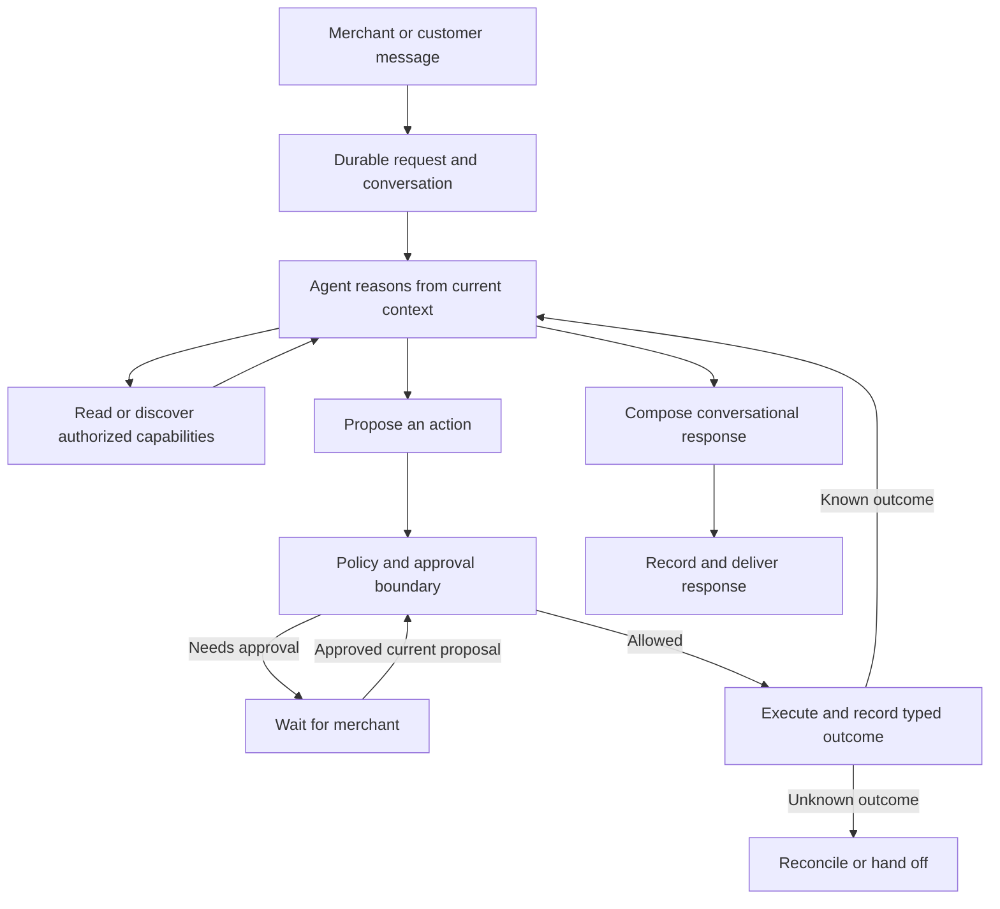

# Conversational agent overhaul plan

Status, 2026-09-30: typed phone outcomes (#137), durable phone instructions and
dashboard Stop (#138), and durable ticket-composer planning (#140) are merged
and deployed. Gateway, worker and dashboard serve `34c98203` (PR #141); required CI and
production health checks passed. The composer instruction → regenerate → reload
→ approval flow passed on the existing reopened #1035 ticket: one cancellation,
a $34.90 refund confirmed by Shopify, and one sent exact-draft email. Recipient
receipt confirmation remains pending. Dashboard Stop after reload passed.
iMessage delivery is restored and manually verified: a fresh #1035 instruction
reached production automatically, ran on one durable v2 task, and its reply
arrived on the owner's phone. The stalled Photon webhook was replaced and the
old production registration retired after that confirmation. The reply's scope
and wording failed acceptance: it revived the earlier stopped five-order
comparison and exposed provider fields. PR #141 preserves task state in history,
separates the current instruction and supplies cancellation/shipping evidence.
Its actual iMessage follow-up stayed on #1035 and arrived, but exposed provider
fields and repeated earlier work. It made no current provider read. The next
small change fixes the operator's conflicting response guidance and labels
historical replies as conversation rather than current provider observations.
The owner removed Telegram from product and release scope on 2026-09-30: it is
a test surface, with no further implementation or verification required.
iMessage is the primary phone channel. Cancellation quote display (8d) was
manually verified on `6616da7f` (#139) on 2026-09-29. One of the fourteen retained
Shopify effects has a clean recorded live run; the other thirteen remain.
Runtime v1 remains the production default, with one controlled organization on v2.

Created 2026-09-11. Shipping priorities revised 2026-09-29 at the release
owner's direction: this app is in development; finish working user flows,
verify them manually, and ship. New tests and repository-wide test cleanup
are exceptions, not work packages.

## Next session

Start with **8h: iMessage conversation scope and response quality**, using the
delivered #1035 reply recorded in the release evidence. A one-order status
question must answer that order briefly in ordinary language. It must not
continue the stopped comparison, list unrelated orders, expose fulfillment
fields/quantities, or infer shipment and return history from a restock flag.
For this request, an appropriate answer is: "Order #1035 is cancelled and fully
refunded. It wasn't shipped."

The cause is established: context loading discarded each message's task state,
and history construction merged the unanswered stopped comparison with the
fresh merchant instruction. The candidate retains task state and renders prior
conversation as reference data, with the current instruction in its own block.
The order adapter now returns cancellation and independently supported shipping
state; restocking alone leaves shipment unknown. PR #141 is deployed; its real
follow-up passed scope/delivery but failed wording and freshness. Finish the
operator response guidance change, then verify the same read-only question
through iMessage. No new tests, broad local suite or paid eval campaign. Short
natural wording remains unverified until that reply arrives.
#1035 is already cancelled/refunded: do not repeat that mutation.

iMessage is the main channel. Telegram is excluded from product and release
acceptance; do not build or test it. Customer-email receipt confirmation,
phone approval, phone-started Stop and definite delivery-failure checks remain
unverified; resume those after the conversation issue, not as prerequisites for
fixing it. The follow-up is in the isolated `codex/operator-status-language`
checkout based on deployed `34c98203`.

**Workspace handoff:** production/main is `34c98203`. The shared root checkout
still has HEAD `606da169` and pre-existing uncommitted phone, marketing and
documentation edits; the deployed composer was implemented in an isolated
worktree. Preserve those edits and use the deployed baseline when starting the
next code change. Do not reset the root or mistake its older files for current
production behavior.

## Shipping objective

A merchant can give Shopkeeper a realistic instruction from the dashboard or
iMessage, review or revise what it proposes, and receive an honest
account of what happened. Customer requests use the same durable execution
contracts. The approved action happens once, Shopify's state agrees with its
receipt, and the intended message reaches its destination.

Telegram is a test-only surface, excluded from the shipping objective at the
release owner's direction (2026-09-30). Existing transport code can remain;
building, linking and verifying Telegram are not completion requirements.

Finish the existing scope using the existing runtime. Preserve the
[settled decisions](#settled-decisions) and contracts below. A narrower release
scope needs an explicit product decision; test cleanup cannot change it.

This document authorizes no production operation by itself. Existing session
authorizations continue to apply. It supersedes the
[maintainability audit](agent-maintainability-audit-2026-09-11.md) where they
differ: conversation remains model-authored and tool discovery adaptive.

Read *Current state*, *Open work*, and *How to finish a change* before working.
Use the contract sections when changing their owners. The
[release evidence](conversational-agent-overhaul-p6-release-evidence.md)
holds manual run results; the
[release matrix](conversational-agent-overhaul-release-matrix.md) records
earlier implementation evidence. The
[Package 0 baseline](conversational-agent-overhaul-p0-baseline.md)
holds retained capabilities and budgets. Detailed history remains in git.

## Rules for implementing this plan

1. **Deliver a working flow.** Implement the next missing behavior, exercise it
   in the real app, and close the item when it works. Combine tightly coupled
   fixes where that finishes the flow; no requirement for one PR per sub-item.
2. **Manual verification is the default.** Use realistic tickets, the Shopify
   dev store, and actual dashboard or phone surfaces. Check the proposal,
   provider state, receipt and delivered message. Scripted models and fake
   providers cannot demonstrate useful conversation or real delivery.
3. **Keep the edit loop short.** Run checks relevant to the change. Typecheck
   code; build when the change affects compilation or deployment; use existing
   targeted tests when they exercise the changed contract. Use existing PR CI
   for aggregate checks. Run a broad local suite for the release candidate or
   a specific unresolved failure, not after every small change or manual run.
4. **New automated tests are an exception.** Add one only for a concrete defect
   or change-specific failure that manual verification cannot safely or
   reliably reproduce, and only when it shortens diagnosis or prevents a
   meaningful recurrence. First check existing coverage. Money, tenancy and
   recovery are important contracts, not instructions to build a test campaign.
5. **No test-cleanup campaign.** Keep existing tests unless one blocks the
   current change, produces a false failure, or imposes a demonstrated delay.
   Fix or remove that specific obstacle and resume implementation. Do not
   audit, trim, restore or rewrite the suite as a prerequisite for shipping.
6. **Fix the owning contract.** Establish the cause from code, stored data or a
   dev-store reproduction. Fix claims, receipts, approvals and delivery in
   their owners. Do not add prompt patches or prose-matcher exceptions to
   compensate for a missing runtime contract.
7. **Report status honestly and briefly.** Distinguish implemented, manually
   verified and still open. Unverified behavior is not done. Record a finding
   once beside its work item and update this plan in the code change; detailed
   evidence belongs in the release evidence. Continue independent work when a
   particular manual run is unavailable.
8. **Keep scope and authority stable.** Reuse the existing registry, task
   ledger, workers, approvals and providers. Land agent-path changes through
   PRs. Paid eval campaigns run only when requested; normal authorized manual
   app exercises are the verification path. Never replay an uncertain write.

## Current state

These are the last recorded results, not a fresh production inspection.

| Area | State |
| --- | --- |
| Core implementation | Receipts, task storage, claims, budgets, proposal binding, discovery and customer-task routing exist. Phone and composer integration are deployed through #140. Composer and dashboard Stop/reload passed. Actual iMessage inbound/task/reply delivery is verified; customer-email receipt confirmation remains pending. |
| Manual provider runs (Gate C) | Cancellation is clean on #1036; the #1035 composer rerun also has a committed receipt and matching Shopify state, with recipient receipt confirmation pending. Customer note and address change previously reached Shopify, but their complete flows were not clean. The other thirteen effects in item 8 still need clean runs. |
| Manually verified approval display | Cancellation quote display (8d) confirmed by the release owner on `6616da7f`, 2026-09-29. |
| Built changes awaiting manual verification | Typed iMessage approval outcomes (8g), phone draft display (8c), phone receipt confirmation (8e), phone-started Stop and in-flight outcome display (10c), definite reply-failure recovery. Durable iMessage instruction/task/reply (10), dashboard Stop/reload and composer cancel/refund/recipient summary passed on #140. Telegram testing is out of current scope. |
| Known implementation gaps | Email provider id (8f). Composer planning (10a) is deployed and exercised; recipient receipt confirmation is pending. Refund currency limits (10b) have an existing implementation in PR #136, awaiting review and live verification. |
| Conversational acceptance | Next priority (8h): the delivered one-order iMessage answer revived stopped work, exposed provider fields and rambled. The candidate fixes history/current-instruction boundaries and supplies cancellation/shipping evidence. Deployment and live scope, wording and grounding verification remain open. |
| Rollout and runtime retirement | Observation/rollback (9), broader routing (11), persisted-state inventory and legacy deletion (12), final docs (13) remain. |
| Optional paid comparison (Gate B) | Last comparison on `cf41c169` failed; it was incorrectly called passed before correction. #125 fixed the C08 runtime defect, so that input is no longer held out. Comparison tooling (Gate A) exists; neither a rerun nor new fixtures are required unless requested. |
| Last recorded routing | `AGENT_RUNTIME_VERSION=1`; the controlled organization is selected through `AGENT_RUNTIME_V2_ORG_IDS`. |

## Open work, in order

Item numbers are stable references for existing evidence, not a rule to finish
every historical sub-item before writing more code. Historical evidence may
cite the earlier rule/package numbering. Work follows this sequence; manual
runs also happen as soon as the affected flow is ready.

| Order | Deliverable | Items | Completion |
| --- | --- | --- | --- |
| 1 | Fix iMessage response scope and wording | 8h | Candidate implemented: historical task state and the latest request stay distinct; order reads carry cancellation/shipping evidence. Finish the PR, deploy and verify the focused #1035 read-only reply. Natural wording and full conversational acceptance remain open. |
| 2 | Finish phone approval outcomes | 8g | PR #137 merged and deployed; required CI and production health checks passed. Live iMessage approval and reply-failure verification remains open. |
| 3 | Verify the remaining built approval fixes | 8c, 8e, start/resume 8 | Cancellation refund quote display (8d) and dashboard cancel/refund/recipient confirmation are verified. Verify the iMessage draft and full confirmation; then run the still-owed customer-info ticket. |
| 4 | Finish the merchant entry points | 10, 10a, 10c | Composer instruction/regenerate/reload/approval, dashboard Stop/reload and durable iMessage round-trip passed. Phone-started Stop, definite reply-failure recovery and customer-email receipt confirmation remain open. Telegram testing is excluded. |
| 5 | Finish provider and delivery correctness | 8f, 10b | Preserve the other email sink's provider id and finish refund currency correctness before broader routing. |
| 6 | Finish retained behavior in the app | remaining 8, 8h | Verify remaining Shopify effects and conversational behavior in focused realistic app sessions. Reuse sessions and setup from earlier steps. |
| 7 | Ship v2 and retire the old active path | 9, 11–13 | Release-candidate checks, controlled observation, routing rollback, rollout and safe legacy deletion remain open. |

### Approval and communication

- **8g — Typed approval outcome.** Implemented in
  [PR #137](https://github.com/walledog11/shopkeeper/pull/137), with required CI
  passed on 2026-09-29; merged and deployed on `7eafc511`, with production
  health checks passed. Live iMessage approval verification remains open.
  `executeOperatorApprovedCachedPlan`
  returns the shared executor's `execution.status` beside its summary.
  `runApprovedPendingPlan` clears parked contexts only for `committed`;
  keyword approval branches on that outcome, and `approve_pending_plan`
  preserves unknown as `toolUnknown` and failed/partial as `toolError`.
  `summarizeOperatorTurnDispatchFailure` reads the tool status and preserves
  the already-formatted summary. The prefix matcher is deleted.
  Relevant builds, gateway typecheck, lint and existing targeted checks
  passed; a local diagnostic confirmed unknown advice appears once.
  **Still owed:** normal approval and reply failure in the app, alongside
  8c and 8e. Do not induce an uncertain Shopify write to verify this display path.
- **8c — Exact draft on the phone card.** Built in `9914f3d9`:
  `toGatewayAgentPlan` now carries `communication`. Verify that the phone
  card shows the whole approved draft with labeled placeholders.
- **8d — Cancellation refund amount on the card. Completed and manually verified
  2026-09-29.** Built in #133:
  `quoteCancellationForApproval` binds runtime-only `approval_amount` /
  `approval_currency`; both cards use `lineItemWriteSentence`.
  `cancelOrder` refuses a changed quote before dispatch. The 2026-09-29 phone
  card for #1035 still omitted the amount: `toGatewayAgentPlan` dropped each
  step's ID, preventing the formatter from finding its quoted raw tool call.
  [PR #139](https://github.com/walledog11/shopkeeper/pull/139) preserves that
  identity and is deployed as `6616da7f` on the gateway, worker and dashboard.
  Required PR CI and production health checks passed. The existing notification
  check exercises this boundary and fails before the fix, passes afterward.
  A local cancellation diagnostic renders the amount and retains the approved
  draft's receipt-bound placeholder. The release owner confirmed the fresh
  cancellation phone card displays the refund amount correctly on `6616da7f`.
  Existing pre-write refusal checks remain sufficient.
- **8e — Complete approval confirmation.** Built in #135:
  `summarizeApprovedDashboardActions` composes committed effects from
  registered labels and receipts. The actual #1035 dashboard approval on
  `6031e3b4` named cancellation, $34.90 refund and recipient; iMessage approval
  confirmation remains unverified. If a committed
  write's message cannot be sent, the merchant must be told the customer has
  not been told; retrying delivery must not repeat the write.
- **8f — Provider id from the email sink.** The dashboard's `send_email`
  path in `thread-io/send.ts` discards its sender's provider id. Preserve it
  on the response and receipt and verify it against an actual dev-destination
  email. `send_reply` was fixed by #132; this is the other path.

### Durable merchant entry points

- **10 — Phone instructions.** Implemented in
  [PR #138](https://github.com/walledog11/shopkeeper/pull/138) on 2026-09-29;
  deployed through `6031e3b4`. Actual iMessage inbound, durable task and received
  reply were verified on 2026-09-30 after restoring Photon delivery.
  `executeFreeFormInstruction` accepts a member
  request using `operator-event:<event id>` as its key and atomically links the
  existing event, request and task. The existing task worker revalidates the
  phone binding, charges the task budget, observes stop, and persists the
  response before phone delivery. The event sweep recovers finished-task replies;
  active tasks remain under the task sweep. An unrelated ticket's pending card
  or question stays with that ticket's task. Missing provider ids use an event
  for that accepted occurrence; there is no provider identity to deduplicate.
  Agent/gateway builds, both app typechecks, changed-file lint and existing
  relevant checks passed. Real event `e40abca0` linked one request `1360b8c6`,
  task `3a98cbb8` and stored reply `aafa9a1d`; runtime 2, two model calls,
  persistent spend charged, five reads and no writes. The owner confirmed the
  reply arrived. Photon replacement receiver `a74b975d` is active; old production
  receiver `7f8567b2` was retired after confirmation. A retained ping was
  separately recovered using its original provider id; that manual recovery
  is not evidence of automatic ingress. **Still owed:** phone-started Stop/reload
  and definite reply-failure recovery without repeating the action. The received
  answer failed conversation scope/wording acceptance (8h). Telegram's stale
  destination was corrected earlier, but the owner explicitly stopped Telegram
  testing; linking and round-trip are excluded from the current work.
- **10a — Ticket composer and regenerate.** Merged in
  [PR #140](https://github.com/walledog11/shopkeeper/pull/140), deployed on
  `6031e3b4`. `POST /api/agent/plan` accepts a stable member
  request and returns 202; the existing gateway task worker plans with the pinned
  runtime and persistent budget. The draft cache and durable proposal commit
  together. Reload recovers server request history and an interrupted submission
  reuses its client key. Approval carries the displayed plan id through the
  existing `authorizeAgentProposal` contract.
  **Supersede rule:** an unclaimed queued/input/approval wait with no dispatched
  actions or approved proposal advances the same task and supersedes its old
  proposal, retaining runtime and accumulated usage. Claimed, approved, uncertain
  or ambiguous work returns 409 and retains its authority. Old requests cannot
  expose or approve the replacement draft. Targeted checks, both app typechecks
  and the package build pass; all required PR CI passed. The existing reopened
  #1035 ticket produced a durable v2 proposal; Rewrite advanced the same task to
  revision 1 and superseded the first proposal. Reload restored the new draft;
  approving the old plan returned 409. Actual approval committed one cancellation
  and one reply. Shopify independently confirms cancelled/refunded $34.90 USD;
  the email provider returned a message id and the task completed. **Still owed:**
  recipient confirmation that the exact-draft email arrived.
- **10c — Dashboard stop control.** Implemented in PR #138 on 2026-09-29;
  deployed through `6031e3b4`; dashboard Stop/reload passed, phone-started Stop
  remains unverified. The chat tracks the server's request and
  revision and calls the existing cancellation route. It shows a recorded stop,
  work still underway, and outcomes requiring review; it retains errors when
  recording the stop fails. A live reload exercise found that the shared agent panel passed
  `restoreHistory: false`, bypassing that recovery. #140 fixes the caller.
  On `6031e3b4`, reload restored Stop for a running dashboard request; recording
  Stop and reloading preserved the pending-stop state, and the task settled
  cancelled. All five actions were reads; its in-flight read was allowed to
  finish. Polling no longer treats an earlier attempt's response as completion
  of a currently running task.
  **Still owed:** Stop/reload on a phone-started task and honest display when a
  write is already underway. Do not manufacture or replay an uncertain write.

### Refund correctness

- **10b — Limits in the shop's currency.** Implemented separately in
  [PR #136](https://github.com/walledog11/shopkeeper/pull/136). Its diagnostic
  reproduced a refund passing a shop-money limit and reserving presentment
  cents; the change compares and reserves Shopify's own shop-money figures,
  refusing when they are unavailable or disagree with the quote. No invented
  exchange rate. **Still owed:** review, a read-only check of order #1031 and
  live `RefundShopMoney` query validation, then a permitted refund and an
  over-limit refusal with dev-store data. This blocks wider routing, not
  same-currency dev-store work.
- **Partial-refund follow-up reported in PR #136.** The reconciliation registry
  passes `amount: ""` to `probeRefund`, which calls `requireAmount` before
  reading Shopify, so unknown partial refunds cannot be reconciled. This is
  still open and separate from dashboard Stop (10c). The PR also reports a
  partial-refund daily-cap refusal using `error` rather than `policy_block`.
  Fix these in their owners; do not induce or replay an uncertain live write.

### Manual retained-behavior verification

**8 — Finish the controlled real-provider runs (Gate C, decision F).** Retain
the fourteen-effect scope. Choose realistic customer tickets or merchant
instructions, verify the actual outcome, and record a short result with the
commit and redacted references.

| Entry point | Effects still in this exercise |
| --- | --- |
| Customer ticket | `create_refund`, `create_partial_refund`, `cancel_order` (already clean; repeat to verify 8c and 8e), `create_return`, `create_exchange`, `attach_return_label`, `update_shopify_customer_info` |
| Explicit merchant instruction | `create_shopify_order`, `edit_shopify_order`, `fulfill_order`, `create_gift_card` |
| Operator-only instruction | `create_flash_sale`, `end_flash_sale`, `set_variant_prices` |

The next still-owed effect is `update_shopify_customer_info`; order-address
updates are a different capability. Group realistic flows to reuse setup:
fulfillment prepares a refundable/returnable order, a return prepares its
label, and order creation prepares editing. Record each effect's result.
#1036 has been cancelled and needs replacing for fulfillment/full refund.

Use the dashboard and iMessage for merchant instructions; item 10 is deployed
and iMessage delivery is verified. Confirm each task's runtime before
execution. A successful customer flow has the intended provider state, a
matching stored receipt and execution outcome, and actual receipt of the
approved customer draft with only its bound placeholders filled. A merchant
flow has the equivalent verified merchant response. Do not infer delivery
from an enqueue or `sent` flag alone.

Fix a flow-blocking defect in its owner and repeat that affected flow. Continue
independent implementation and other valid flows; do not restart the entire
exercise after every change. Optional deliberate *definite* delivery-failure
verification can use step 7 of the release evidence. Preserve unknown writes
for reconciliation.

**8h — Conversation during those same sessions.** Use the
[acceptance matrix](#acceptance-matrix) to exercise investigation, clear and
ambiguous references, revision, topic changes, explanation without action,
language/voice and useful handling of missing context. Several rows can be
seen in one conversation. Record the rows actually observed; no separate paid
eval or fixture campaign. A conversational row stays open until seen working.
A runtime race that cannot be safely produced live may rely on existing
failure coverage and inspection, with that evidence described accurately.

**Next-session defect, 2026-09-30:** after a dashboard five-order comparison
was stopped, the owner's iMessage asked only for #1035 payment/shipment status.
The delivered answer added all five orders, technical fulfillment fields and
repeated summaries. It also claimed that `restocked` proves shipment and return
history, which this run did not verify. The phone instruction itself completed
normally; task cancellation had already been verified separately. Inspect
how stopped instructions/history affect the current turn and how facts are
worded; do not assume a cancellation-ledger failure without establishing it.
The owner rejected the response as verbose and artificial. Fix scoped,
concise, natural answers first; the exact reproduction is in the release evidence.

**Candidate implementation, 2026-09-30:** the stopped comparison's message
remained unanswered on the shared operator thread. `buildContext` dropped its
task identity/state, and `buildMessageHistory` merged it with the new instruction.
Operator context now reads the linked tasks within the same organization/thread;
operator history retains their state as reference data and gives the current
instruction a separate block. Earlier conversation remains available for
references without presenting it as current work. `getOrderByName` and
`getShopifyOrders` now read cancellation and fulfillment records;
`serializeOrder` exposes cancellation and supported shipping state, using
`unknown` when restocking alone cannot establish shipment. The shared shipping
description also serves the existing limited shipping read. Relevant existing
checks, package build, both app typechecks and lint passed. A read-only dev-store
inspection confirms the new fields on #1035 and #1032, and real context loading
retains the cancelled comparison's state. No Shopify mutation, message delivery
or paid model evaluation occurred. Deployment and the actual concise iMessage
follow-up remain owed; this does not close 8h.

### Release and runtime retirement

- **9 — Observation and rollback (Gate D).** Use the controlled sessions to
  observe task progress, unknown outcomes, duplicate operations and delivery.
  Record the observation interval and operator. The app has only controlled
  traffic, so do not wait for or claim a production-scale observation period.
  Rehearse routing a new request to v1 while an existing v2 task retains its
  version, then restore the chosen routing.
- **11 — Stage v2 routing.** Finish the changed entry points, currency fix and
  manual retained/conversational behavior first. Run the existing release
  checks for the candidate locally or through PR CI, then expand routing and
  make v2 the default for new tasks. Existing tasks stay pinned. Stop expansion
  on an unauthorized or duplicate effect. Paid comparison remains advisory.
- **12 — Retire the old active runtime (Gate E).** Inventory actionable
  persisted v1 state before each deletion. Name the replacement and keep
  versioned historical readers where needed. Delete by responsibility and
  callers, not whole filenames. This runtime cleanup is part of completing
  the migration; repository-wide test cleanup is not.
- **13 — Final documentation.** Describe the single active runtime and remove
  conflicting directions. Close the overhaul when the flows work, routing
  and rollback are demonstrated, and superseded active machinery is removed.

### Gate E deletion targets

- V1 forced speculative terminal drafting; keep decision A's approved
  `exact_draft` and the machinery it still uses.
- `request_wider_tool_set` and the broad mutation fallback on migrated paths.
- Active result-text fact extraction in `completion-facts.ts` and
  `executedCompletionFacts`; retain explicitly versioned historical readers.
- Duplicated per-channel approval/policy branches and obsolete recovery adapters.
- V1-specific `SUPPORT_INSTRUCTIONS`; rewrite shared instructions for
  `exact_draft` and receipt placeholders where still needed. Verify changed
  behavior in the app; a paid eval is optional and only runs when requested.
- After 10 and 10a, their direct operator-run and dashboard-plan calls and
  code used only by them.

## How to finish a change

1. Implement the missing behavior in its existing owner.
2. Run relevant cheap checks. Documentation-only changes need structure/docs
   checks. For code, typecheck the affected workspace and use targeted existing
   tests or a build where they help verify the change.
3. Exercise the affected flow in the dashboard, dev store or phone, using
   existing authorized test destinations. Check actual provider state and
   delivery as applicable.
4. Record: commit, request/surface, expected result, observed result, references,
   and any remaining issue. Update the item's status. No test-count narrative.
5. Move to the next implementation item. A missing manual input leaves that
   verification open but does not prevent unrelated code work.

`npm run verify:pr` remains the aggregate release/CI check. A failure is
investigated for its relation to the change; resolve a real product defect or
the specific broken check. Do not start a suite-wide audit or add tests to
satisfy coverage. A required check cannot be silently bypassed or called passed.

## Test cleanup decision

**Further broad cleanup is deferred until after shipping.** Coverage thresholds
are already removed, and the recent deletion/trim campaign has consumed many
changes without completing the missing merchant entry points. Less test code
alone does not make a user flow work. Restoring deleted tests is also outside
this work unless a current defect needs one.

Cleanup is worth doing only when a specific test or check blocks the current
change, falsely rejects working behavior, or measurably slows the required
verification. Make the smallest correction, retain checks that catch actual
failures, and continue the shipping queue. #137, #138 and #140 are deployed.
Composer, dashboard Stop/reload and durable iMessage delivery passed; customer
email receipt and the remaining iMessage approval/Stop/failure checks stay open.
Fix the iMessage conversation scope and wording defect (8h) next. Telegram
implementation and testing are excluded from product and release scope.

## Open decision

None. Future questions should name the concrete affected work and available
choice; do not reopen settled product decisions as a testing prerequisite.

## What has been done

| Package / change | Implemented |
| --- | --- |
| 0 — Baseline | Capability/identity inventory, persisted-state inventory, budgets and evaluation manifest. |
| 1 — Receipts | Versioned per-tool results, durable action identity and dispatch lifecycle, typed Shopify/internal/communication outcomes, explicit compatibility readers. |
| 2 — Dashboard requests | Request/task/proposal storage, 202 submission/status recovery, worker claims, budgets, Stop and shared proposal authorization. Durable composer is deployed and exercised; dashboard Stop/reload and iMessage delivery passed. Remaining manual checks are above. |
| 3 — Adaptive slice | Write proposal suspension and receipt-based execution; partial-refund spend reservation moved to provider pricing. Customer composition later changed by decision A. |
| 4 — Discovery | Registry-derived bounded discovery, restricted starter sets and context load tiers. |
| 5 — Customer tasks | Durable inbound customer requests, proposal/runtime pinning, wait continuation, revisions, task settlement and attributed delivery. Broad real-app verification remains open. |
| 6 — Release fixes | Canonical approval hash, exact draft/receipt placeholders, committed-effect vs delivery outcome, close-thread cancellation, withheld-message follow-up, line-item display and C08 routing correction. |
| Cancellation (#132) | Clean dev-store cancellation/refund on #1036, matching receipt and approved customer delivery with provider id. |
| Approval presentation | 8d is manually verified on `6616da7f`; dashboard receipt summary (8e) passed on `6031e3b4`. iMessage draft and approval confirmation checks remain open. |
| Crash-sweep isolation (#134) | Existing recovery tests no longer race across organizations. No further cleanup is scheduled. |

These entries describe implementation, not universal live proof. Detailed
history is in `git show fff54dc4:docs/conversational-agent-overhaul-plan.md`
and subsequent commits; run results remain in the release evidence.

## Settled decisions

The release owner's answers to what the plan left open. They are binding like
the fixed decisions below. Each keeps its letter, because the release evidence
and commits cite it.

- **A. What the merchant approves is what the customer receives** (2026-09-25).
  Every customer message proposed alongside a write uses `exact_draft`; the
  `intent` mode is not used for customer messages. The model writes the
  message before approval, with outcome-dependent values as labeled
  placeholders. It is shown on the card, bound into the approval hash, and sent
  only if the write succeeds and every placeholder fills. Filling those
  placeholders from the approved write's receipt is the only change permitted
  after approval. This replaces the original design's compose-after-outcome
  default for customer messages only. Messages to the merchant still compose
  after outcomes.
- **B. A flagged reply is never sent** (2026-09-25). A flag on a draft awaiting
  approval is shown on the card. A flag on a reply that would otherwise send
  without review holds it as a proposal. Removing the flagged sentence and
  sending the rest is forbidden (*Validate, don't repair*).
- **C. Closing a conversation cancels all of its waiting tasks** (2026-09-25),
  by the authorized-stop row of the task table: no new action starts, pending
  proposals and cards are invalidated, and a task with an uncertain submitted
  write goes to `reconciling` rather than `cancelled`.
- **D. A write that runs without the merchant reviewing it follows decision A**
  (2026-09-25). Its customer message is fixed as an `exact_draft` before the
  write, and only its placeholders are filled afterward. A flag (decision B)
  turns it into a proposal the merchant reviews.
- **E. Phone instructions move onto durable tasks in this plan** (2026-09-25),
  reusing the `OperatorEvent` claim and sweep rather than replacing them. This
  is item 10, before the staged rollout; Gate E then deletes the synchronous
  path.
- **F. Gate C runs every retained Shopify write that has never touched a real
  store** (2026-09-26). Package 1's live Shopify schema validation never ran,
  so every typed receipt except `add_shopify_customer_note` and
  `update_shopify_order_address` was built from fake provider responses. The
  fourteen runs are listed in item 8. Internal thread writes touch no store
  and are not included; email delivery is exercised by each customer-ticket
  run.
- **G. A withheld-message follow-up drafts; it does not escalate**
  (2026-09-27). When an approved write definitely failed, the follow-up's job
  is the replacement message #118 built, and the merchant reviews it. The C08
  escalation was the runtime's own write-guarding evidence applied to a turn
  that cannot write. The fix follows the follow-up contract and is keyed on
  the typed follow-up flag, not on phrasing. The keyword checks themselves
  stay outside this plan. C08's expectation stands.
- **H. A cancellation refunds the order's payment** (2026-09-28, item 8b).
  `cancel_order` on a paid order refunds the full paid amount to the original
  payment method as part of the same approved write. The card says so, the
  receipt records the refunded amount, and the customer message names the
  refund through a placeholder bound to that fact, so a refund that did not
  happen withholds the message (decision A). It stays outside the per-call and
  daily compensation limits: returning payment for goods never shipped is not
  goodwill. Found when Gate C rerun run 1 cancelled paid #1032, kept the
  payment, and told the customer a refund was coming.
- **I. The paid model comparison is advisory** (2026-09-28). Gate B, the
  budgeted v1/v2 eval comparison, runs only when the release owner asks and
  does not block rollout, which rests on Gate C's live runs. Paid evals had
  already stopped by standing rule (2026-09-27), so a blocking Gate B could
  never pass.
- **Task budget** (2026-09-26, item 7). Active latency p95 at most 10 seconds
  and mean task cost at most $0.035, measured over a runtime's comparison runs
  by the eval report's `[eval:task]` line.

- **J. Ship through working flows** (2026-09-29). Manual app verification is
  the default. New automated tests require a concrete change-specific need;
  broad test audits, deletion campaigns and routine full-suite runs do not
  precede implementation. Use proportional local checks and the existing
  aggregate release/CI check. Unverified conversational behavior remains open.

## Outside this plan: recorded, not scheduled

The 2026-09-25 audit also found decisions made by matching English outside the
paths this plan migrates. They are listed so they are neither pulled into this
plan nor forgotten. Changing any of them needs the release owner's go-ahead
first.

- Keyword intent checks in `planner-safety/refunds.ts` and
  `planner-safety/mutative.ts`, and `hasActionableMutativeIntent` as used by
  `planner-evidence.ts`.
- `isMerchantAnswerPlanningInstruction` (`kb-learned.ts`), which recognizes a
  sentence we write ourselves by regex; `planner.ts` then removes `ask_operator`.
- The shipping and discount question regexes used by `merchant-answer-kb.ts`.
- Summary-string parsing in `order-ops/finding.ts`.
- The overall size of `SUPPORT_INSTRUCTIONS`.

### Known limitations, accepted and not scheduled

Each was recorded when its package closed and is not a defect against a
contract. It is listed so nobody rediscovers it as new.

- A continuation (an answer, a revision) is a new attempt on the same task that
  re-derives its context from the conversation. It does not resume from the
  task checkpoint, which is not updated after the task is created.
- A stale question cleared from one member's pending projection
  (`loadLiveOperatorContext`) stays parked on the organization-wide task until
  the customer writes again. One member's card must not close a task, so this is
  intended.
- A stop is observed at loop-iteration boundaries, so a tool call already in
  flight finishes. This is the intended bound.

## Product outcome

The agent understands informal instructions, investigates, remembers relevant context, improvises within its authority, and explains itself naturally. It can handle combinations of requests that were never individually programmed. It asks a focused question when the answer matters and takes reasonable initiative when it has enough information.

The runtime makes that freedom dependable. It owns authorization, durable execution, action identity, approvals, provider outcomes, and delivery. It does not prescribe a script for each customer situation.

Example acceptance conversation:

> Merchant: “This customer has been messed around twice. Figure out what happened and sort it out. Check with me before giving money back.”
>
> Agent: “The replacement was created, but it hasn't shipped. The blue one is out of stock; the black one is available. I can ask whether they'd prefer that or a refund. Want me to offer both?”
>
> Merchant: “Ask about the black one first, and keep it short.”

The agent discovers the order state and alternative through tools, changes direction based on the merchant's instruction, and drafts a suitable reply. There is no hardcoded “replacement failed twice” workflow. It does not interpret the initial request as permission to refund.

## Design boundaries

| Model owns | Runtime owns |
| --- | --- |
| Understanding requests and conversational references | Tenant, member, customer, and order access |
| Choosing relevant investigations and discovering tools | Tool availability and execution-time authorization |
| Proposing actions and alternatives | Approval binding and current-state policy checks |
| Deciding whether clarification is useful | Durable suspension and resumption |
| Adapting after new information or a definite failure | Retry limits and unknown-outcome reconciliation |
| Natural explanations, brand voice, and summaries | Verified result fields and delivery records |

Non-goals:

- No fixed intent-to-workflow catalog, mandatory conversation script, or template-only assistant.
- No multi-agent team, new agent framework, generic plugin platform, or giant catch-all tool.
- No new commercial capabilities during migration. The support wedge and existing merchant operations remain the scope.
- No broad rewrite of working provider adapters, identity checks, or channel integrations.
- No promise of perfect factual correctness for arbitrary generated prose. Structured evidence improves grounding; language quality still needs evaluation.

## Target architecture


```mermaid
flowchart TD
    A[Merchant or customer message] --> B[Durable request and conversation]
    B --> C[Agent reasons from current context]
    C --> D[Read or discover authorized capabilities]
    D --> C
    C --> E[Propose an action]
    E --> F[Policy and approval boundary]
    F -->|Needs approval| G[Wait for merchant]
    G -->|Approved current proposal| F
    F -->|Allowed| H[Execute and record typed outcome]
    H -->|Known outcome| C
    H -->|Unknown outcome| I[Reconcile or hand off]
    C --> J[Compose conversational response]
    J --> K[Record and deliver response]
```

Use the existing gateway, queue, database, and shared agent package. Support and operator turns retain different authorities and interaction styles, but share request identity, budgets, receipts, and recovery semantics. A policy decision may require approval even when the model wants to proceed.

### Durable request and work state

Distinguish a conversation, an inbound request, an ongoing task, a proposed action, an execution attempt, and a delivery. They are related identities, not interchangeable names for a turn. Several messages can advance one task, and one conversation can contain independent tasks.

Before introducing tables, map these responsibilities onto `OperatorEvent`, `PlanExecution`, `AgentAction`, existing pending state, request outcomes, and delivery storage. Extend existing records where their semantics fit. Do not repurpose a provider-specific event table as a generic task table without validating its claim and recovery behavior.

Persist only the work state needed to resume: objective, relevant entity references, evidence references, explicit constraints, pending question or approval, proposed actions, execution receipts, and progress. Do not persist hidden chain-of-thought or grow a parallel transcript of speculative reasoning.

Conceptual states include queued, running, waiting for input, waiting for approval, reconciling, completed, failed, and cancelled. Map them to existing storage before choosing a new enum. Record action completion separately from response delivery; a completed refund with a failed email must remain a completed refund.

### Adaptive agent loop

The model chooses a useful next step from reading, capability discovery, clarification, action proposal, or response. It may combine capabilities to solve novel requests. It need not produce a complete speculative action-and-reply plan before investigating.

Execute independent reads together. Record write proposals before execution; preserve meaningful dependencies between writes. Feed actual outcomes back before composing a completion response. Multiple related writes can still be reviewed together when their targets and parameters are known, so the new runtime does not introduce an approval or model round trip per trivial step.

Expose a compact relevant starting set plus authorized capability discovery. Discovery may expand the tool set during a task; it must not expose forbidden capabilities or load every schema as the default fallback. A model-selected task label is a relevance hint, never an authorization decision.

Maintain one execution owner for a task at a time. New instructions can supersede pending proposals, clarify an existing task, or start separate work. A request to stop prevents new actions; it cannot undo a provider write already submitted. Cross-device approvals and revisions must resolve against exact proposal identities.

### Capability and result contracts

Evolve the existing tool definitions rather than creating a second registry. Each capability owns its input schema, required evidence, allowed actor/context, provider requirements, approval/policy metadata, execution adapter, typed result, and recovery behavior.

Results carry outcome, target, relevant financial or operational fields, provider reference, and execution identity. Preserve distinctions such as not found, rejected, definite failure, and unknown outcome. Human-readable messages are presentation, not the source from which machine facts are reconstructed.

Separate stable operation identity from model tool-call IDs. A repeated proposal or restarted model turn must not accidentally receive fresh authority to repeat a committed action. Use provider idempotency where supported and reconcile where it is not. Do not claim universal exactly-once execution across external providers.

### Conversation, evidence, and memory

Generate responses from actual outcomes and relevant evidence. The model chooses wording, tone, and explanation. Exact consequential fields can be referenced through validated bindings to receipt fields; avoid fixed full-sentence templates as the default experience. Audit notes and delivery bookkeeping are runtime-generated.

For approval, clearly show proposed actions and any customer draft. If the merchant approves exact wording, preserve it except for explicitly shown result placeholders. A substantive change in action, amount, recipient, or approved message invalidates the relevant approval. Otherwise, post-execution composition follows the merchant's authorized intent and communication policy.

Scope evidence to the task, entity, and observation time. Recheck provider preconditions before writes, especially after waiting for approval. Prevent a model-provided evidence reference from establishing success without a matching successful record.

Keep conversational memory separate from authority. Store explicit preferences and useful task facts with source and scope, using the existing memory system. Summaries and preferences cannot grant permissions or turn customer claims into verified facts. Questions, references such as “that one,” topic changes, and returning to unfinished work need conversational evaluation, not a growing keyword router.

## Implementation instructions and fixed decisions

Read this section before starting a work package. The architecture above describes the product; this section specifies how to build it. If a later repository change makes a named location inaccurate, find the current owner and update the location here. Do not use that mismatch as a reason to invent another runtime.

### How to execute this plan

1. Packages 0–5 supply the existing implementation. Finish the open shipping sequence above; implement and manually verify each affected user flow before moving on. Do not replay completed package checklists.
2. Keep old callers working through additive contracts and a versioned compatibility boundary. Do not change legacy persisted plan interpretation in place.
3. For each change, record what was implemented, what was seen working, remaining failures and any material rollback concern. A checkbox means implemented and verified; an unverified flow stays open.
4. Use existing functions for tenant checks, policy, claims, refund reservations, sending, and reconciliation. Extract a shared function only when two concrete callers need it. Do not add a service container, event-sourcing framework, workflow DSL, generic repository layer, or second capability registry.
5. Keep the configured model and provider adapters stable during the first slice so runtime regressions can be isolated. Do not compensate for broken claims, receipts, or tool selection by adding prompt instructions.
6. If a decision affects which merchant operations remain supported, preserve current merchant availability until the inventory provides a documented scope decision. Lack of usage data is not evidence that a capability is unused.

### Persistence decisions: identity is not status

*Condensed; built in Packages 1, 2 and 5.* The schema
(`packages/db/prisma/schema.prisma`) is the source of truth for fields. The rules
that still bind:

- A conversation (`Thread`), a request (`AgentRequest`), a task (`AgentTask`), a
  proposal (`AgentProposal`), a proposal execution (`PlanExecution`), an action
  with its receipt (`AgentAction`) and a delivery (`Message`) are distinct
  identities. `OperatorContext` pending state is a projection that cards read.
  It is not authority, and trimming it never deletes work.
- Do not widen `OperatorEventStatus` or `PlanExecutionStatus` to carry task or
  conversation state. Do not add one table per conceptual word.
- A task checkpoint holds short observable facts and references, never the
  transcript, provider payloads or model reasoning.
- Every lookup and mutation is scoped by organization and parent ownership. New
  records join workspace deletion, redaction and retention. Nothing cascades
  away evidence of an unresolved provider write.

### Task transitions and concurrency

Use a task-specific state set: `queued`, `running`, `waiting_input`, `waiting_approval`, `reconciling`, `completed`, `failed`, `cancelled`. These are proposed task states, not replacements for existing execution enums.

| From | Event and guard | To / required write |
| --- | --- | --- |
| queued | Worker wins conditional claim | running; store token and lease |
| running | Model asks a relevant question | waiting_input; persist question and response before releasing claim |
| running | Policy requires approval for persisted proposal | waiting_approval; persist proposal and notification intent |
| waiting_input | Scoped answer matched to question/task | queued; attach request and increment revision |
| waiting_approval | Valid decision for current proposal/hash | queued; record approval atomically, then enqueue |
| waiting_approval | Revision/dismissal | queued or cancelled according to instruction; invalidate pending proposal |
| running | Submitted write has uncertain outcome | reconciling; retain operation key, receipt if available and spend reservation |
| reconciling | Provider probe establishes outcome | queued to observe known outcome, or cancelled after recording outcome if cancellation was requested |
| running | Objective satisfied; required response persisted | completed; delivery can still be pending/failed |
| waiting_approval | Approved execution withheld its exact draft — a write definitely failed, or a placeholder had no receipt value — and no outcome is unknown | queued, revision incremented, the follow-up and its execution recorded on the checkpoint |
| queued (follow-up) | Worker wins the follow-up claim; every write settled, no execution claimed or unknown | running; the attempt may only read and draft, and its draft requires review. With nothing to draft against — conversation closed, customer answered or wrote again — completed or failed as the execution was |
| queued/running/waiting_* | Authorized stop | cancelled if no uncertain submitted write; otherwise reconciling with cancellation recorded |
| waiting_input/waiting_approval | Conversation closed, unless its proposal is already approved (decision C) | Authorized stop, in the transaction that closes the conversation; the pending proposal is superseded |
| running | Definite unrecoverable failure or exhausted budget | failed with reason and resumable facts; uncertainty still takes precedence as reconciling |

Completed/cancelled/failed tasks are not reset by a duplicate request. A deliberate new instruction can create a new task referencing prior work. A known partial result remains visible even when the overall task fails or is cancelled.

Concurrency implementation rules:

1. PostgreSQL conditional updates/transactions decide ownership; Redis locks and queue job IDs are optimizations. Claim task status and token atomically. Every state mutation from a worker must verify its token and expected revision.
2. Renew leases while work runs. A replacement worker may reclaim expired reasoning/read work. If any action reached dispatch, inspect its durable operation state first; lease expiry never authorizes replay.
3. Persist inbound revisions and action-dispatch authorization through a shared task-row ordering point. If a stop/revision wins before dispatch authorization, the old action cannot start. Once dispatch authorization wins, report that the action may already be underway; attempt abort where supported but still reconcile its outcome.
4. Do not hold a database transaction across model or provider network calls. Persist dispatch intent under the transaction, then call the provider. This introduces a conservative crash window: a crash after intent but before the call is treated as potentially submitted unless the adapter can prove otherwise.
5. A stale worker that receives a provider result may record evidence against the exact operation through the reconciliation path. It must not update the current task revision, overwrite a newer result, send a new reply, or start another action.
6. Recovery scans durable rows for accepted-but-not-enqueued requests, expired claims, unknown operations, and unsent responses. Queue publication after a database commit can fail; the sweep is required, not optional cleanup.

### Typed receipts and operation identity

*Condensed; built in Package 1.* `ReceiptV1` and its per-tool validators live in
`tools/result.ts` and `shopify/receipts.ts`. The rules that still bind, and that
Gate E deletions must not break:

- Keep `ToolStatus` values at compatibility boundaries. The mapping is
  `succeeded → ok`, `not_found → not_found`, local `rejected → policy_block`,
  `failed → error`, `unknown → unknown`. If a legacy status and a receipt
  disagree, validation fails and the uncertainty is preserved. Never pick the
  more optimistic value.
- Facts come from the provider: exact decimal money, currency, canonical target
  and provider reference. Never take them from the requested input, parse them
  from a `message`, or infer a currency from locale. Missing required success
  fields after a possible write means `unknown`.
- The operation identity is runtime-assigned, never a model tool-call ID. It is
  created before dispatch and reused on every attempt of that action. A fresh
  proposal or tool-call ID cannot bypass a committed or unknown operation on the
  same target and effect.
- Persist the receipt before a dependent write or a success message. Retry a
  definite failure only when the adapter documents that no effect occurred.
  Unknown outcomes go to reconciliation, and a single empty probe is not proof
  of failure.
- In a bundle, writes run sequentially in dependency order. A succeeds and B
  fails means A stays successful. Dependents of B are blocked, and no
  compensation is invented. Delivery retries separately from commercial
  actions.

### Approval and communication contract

Use a canonical server-generated hash of the immutable proposal. Extend the existing `hashPlan` / instruction-hash machinery rather than hand-building hashes in channel code. Canonicalization must sort object keys, preserve meaningful array order, normalize input with the registered parser, and preserve exact approved draft bytes. Reordered object keys retain the same identity; changed amount, recipient, draft or dependencies invalidate it.

The approved snapshot binds organization, task and revision, proposal ID/version, actor scope, normalized tool names/inputs/targets, ordered action dependencies, communication mode, destination, approved draft (if any), and allowed result bindings. Keep existing policy and instruction binding at least as strict as today. Record approver identity and decision time from authentication, never from model arguments.

Use exactly two communication approval modes initially:

- `exact_draft`: display the destination and exact draft before approval. After execution, only explicitly displayed placeholders may be substituted from validated successful receipts. If an action fails or a binding is unavailable, do not send the success draft; compose a new status/proposal and apply normal communication policy.
- `intent`: record what the merchant authorized communicating, to whom, and any wording limits. Compose after actual outcomes. This mode is available only where existing policy allows it; it is not an automatic replacement for exact-draft approval.

Approval execution must load the persisted proposal, verify current membership and proposal revision/hash, recheck applicable policy and provider state, and acquire the existing execution claim. Buttons and conversational approval call this same boundary. A terse “yes” with two plausible pending proposals triggers clarification; never use “latest card wins” to authorize money or recipient changes.

A changed amount, order, address, recipient, action set, dependency, or exact draft supersedes the proposal and needs whatever approval the replacement requires. A changed display label does not change authority. Recheck refundable balance, fulfillment/cancellation state, customer/order ownership, grant health, and applicable limits after any wait. If current state no longer permits the exact approved action, return a rejection or propose a revision; do not silently adjust the amount.

For several known related actions, persist and display one bundle and approve its complete snapshot once. Use the existing plan claim as the bundle owner and individual operation records for partial results. This is not an atomic provider transaction.

### Dashboard submission and recovery contract

*Condensed; built in Package 2.* `POST /api/agent/chat` takes a client-generated
`clientRequestId`, persists before acknowledging, and returns 202 with a durable
`requestId`. The status route is `GET /api/agent/requests/:requestId`. A
duplicate with the same payload returns the original; a changed payload under
the same key is 409. Cancel, approve and answer persist a scoped decision and
enqueue a continuation; no route runs a provider call. A browser disconnect
stops observation, not execution. Server history is the authority when client
state is lost.

### Adaptive-loop implementation recipe

*Condensed; built in Packages 2–4.* Keep one model loop with ordinary registered
tools. Investigation may precede a proposal; decision A requires a proposed
customer message to be an exact draft with receipt-bound placeholders. A model-provided proposal is untrusted
until the runtime parses and persists it. Budgets are persisted, reserved before
dispatch, and never replenished by a restart or a human wait. Reconciliation and
delivery keep their own bounded recovery, so exhausting model calls never
abandons a submitted write. The frozen values are in the Package 0 baseline, in
one configuration location.

### Discovery, evidence and continuity

*Condensed; built in Packages 4 and 5.*
- **Discovery.** `discover_capabilities` returns only tools from the caller's
  authorized set. It never falls back to the full registry, and repeated
  fruitless discovery hits the shared budget. A model-selected label is a
  relevance hint, never authorization. Discovery cannot turn support into
  merchant mode or supply a missing verification credential.
- **Evidence.** Evidence records carry source kind, organization, entity,
  observation time and source identity. User claims and summaries never become
  provider evidence by being copied. Freshness is per operation: each write
  adapter names its preflight reads.
- **Continuity.** A consequential reference that is ambiguous gets a
  clarification. Customer text is never a merchant preference or a permission
  change.

### Response grounding and delivery

New completion facts must come from stored, schema-valid receipts or authoritative provider observations with explicit provenance. A current order state can support “the order is cancelled”; it does not prove “I cancelled it” without a matching operation receipt. An input field or proposed action can support future-tense proposal wording only.

Reuse and narrow the existing completion-binding mechanism. Bind a specific receipt/operation, target and allowed field; reject mismatched tenant/task/target/outcome or unsupported field paths. Give the model structured outcomes and let it author surrounding prose. Amounts and provider references shown as consequential bindings are rendered by validated code. Prose checks remain heuristics: do not claim that field bindings prove the truth of every sentence.

Persist the composed response and its destination before attempting delivery. Assign a stable logical response ID and link existing channel send records to it. Retry the stored approved/composed text, not a new model generation. Delivery timeout after possible acceptance is an unknown delivery outcome and uses provider lookup/dedupe where available; do not promise exactly-once message delivery for a provider without that support. Never mark an email delivered just because it was queued. Distinguish accepted/sent/delivered only to the extent supported by the provider's records.

## Migration work packages

Packages 0–5 provide the implementation summarized above. Package 6 closes the
remaining user flows, verifies them in the real app, stages routing, and
retires the old active runtime. Its work queue is
[Open work](#open-work-in-order); its completion procedure is
[How to finish a change](#how-to-finish-a-change). Do not create a second
verification backlog from the earlier package checklists.

### 6. Certify, cut over, and delete superseded machinery

Keep the existing task runtime-version field as routing authority. Deploy
additive schema/readers before dependent code. Prove the retained behavior in
the controlled workspace, run release-candidate checks, exercise routing
rollback, and expand routing. Inventory persisted state before deleting each
superseded responsibility. Preserve the worker/readers for in-flight v2 tasks
even when new requests are routed back to v1; never replay uncertain operations.

Acceptance: all retained entry points share the durable execution contracts,
manual evidence demonstrates retained and conversational behavior, outcomes
agree with provider state and delivery, rollout/rollback work, and the old
active orchestration path is removed. Historical readers may remain where
actionable persisted state still needs them. A narrower release scope requires
an explicit owner decision.

## Acceptance matrix

| Situation | Required behavior |
| --- | --- |
| Vague “figure it out and sort it out” instruction | Investigates, proposes a useful path, respects explicit limits |
| Novel combination of replacement, stock, and customer communication | Composes existing capabilities without a bespoke workflow |
| “Actually, use the other one” | Resolves context or asks one focused question when ambiguous |
| Merchant changes direction while approval is pending | Supersedes the proposal; old approval cannot execute new inputs |
| Topic change, then return to earlier work | Keeps tasks distinct and resumes relevant pending state |
| Merchant requests an explanation only | Answers without inferring permission to act |
| Customer text claims owner authorization | Treats it as untrusted data; cannot expand authority |
| Action commits, reply delivery fails | Retries delivery without repeating the action |
| Provider timeout with uncertain commit | Reconciles or hands off; never blindly retries the write |
| Identical request retried after refresh | Reconnects to the original task |
| Different members or devices approve concurrently | One valid claim, one effect, consistent visible outcome |
| Missing optional context | Continues useful unrelated work; states relevant uncertainty naturally |
| New phrasing, language, or brand voice | Maintains conversational quality and uses real outcome evidence |
| Capability unavailable | Discovers a legitimate alternative or explains a useful handoff |

Use this table during the same realistic dev-store/dashboard/phone sessions as
item 8. Record which rows the session demonstrated. A conversational row is
complete when observed working; “not verified” leaves it open. For dangerous
or unreliable failure injections, inspect the implementation and reuse
existing failure coverage. New automated cases follow the exception rule
above. No fixture or test-file count is a completion target.

## Verification specification

### Manual app exercise

Choose an existing dev-store customer/order and a realistic request. Observe
the actual entry point, task/request identity, draft and approval; approve or
revise through the intended surface. Confirm the provider state, stored outcome
and actual recipient delivery. Return to the conversation, change direction,
ask for an explanation or stop work where relevant. Record a brief result
against the commit. This is ordinary feature verification, not a separate
test-infrastructure project.

### Deterministic failure and race cases

The existing D01–D20 cases describe contracts to preserve, not a new test list.
Reuse `task-ledger.integration.test.ts`, `task-approval.integration.test.ts`,
`plan-execution.integration.test.ts` and
`unknown-outcome-reconciliation.integration.test.ts` when they cover the
changed decision. The principal invariants are:

- Duplicate/redelivered requests and concurrent approvals have one owner;
  changed payloads or obsolete approvals do not gain authority.
- Stop/revision ordered before dispatch prevents that dispatch; after dispatch
  it preserves actual or unknown outcomes and prevents subsequent work.
- A crash or timeout cannot authorize blind write replay; reconcile the stored
  operation and preserve its provider identity.
- A committed action survives response failure; retry the stored delivery
  without repeating the action.
- Tenant, member, provider grants, current-state policy and budgets remain
  authoritative through waits, continuations and runtime routing changes.

Do not manufacture an actual uncertain write for a manual demonstration.
A small diagnostic or automated regression is warranted only when it resolves
a concrete change-specific problem that cannot be reproduced manually.
Existing historical case descriptions remain in git.

### Model evaluation cases and scoring

Paid comparisons, new fixtures and fixture expansion happen only when the
release owner requests them. Gate B is advisory. Reuse the existing dashboard
and gateway harnesses; do not introduce another framework or tune against a
held-out input. C08 needs a new unseen variant only if a new comparison is
requested, because #125 fixed against the original.

Manual sessions assess useful investigation, clarification, reference
resolution, instruction adherence, actual outcomes, delivery and natural
communication. An unauthorized/duplicate effect or a known false completion
claim is a defect regardless of wording quality. Record observed latency and
cost when available; do not build instrumentation solely to fill a scorecard.

### Commands and evidence to record

Use the relevant workspace scripts from [TESTING.md](../TESTING.md). Typical
choices are:

```sh
# Documentation-only edits.
npm run lint:structure

# Code changes: typecheck the affected workspace.
npm run typecheck -w packages/agent

# An existing targeted check when its contract changed.
npm run test:integration -w packages/agent -- --run src/task-approval.integration.test.ts

# Once for the release candidate / through existing CI.
npm run verify:pr
```

These are choices for the change, not commands to run after every edit. Broad
checks are repeated only when subsequent changes or a failure justify them.
No paid eval runs implicitly. Record manual results and remaining defects,
rather than suite counts. Documentation edits need documentation checks.

## Success criteria and scope discipline

The overhaul is complete when the retained user flows and conversational
behavior have been seen working, the remaining entry points use durable tasks,
provider and delivery outcomes are honest, rollout/rollback work, and the old
active runtime has been removed safely.

Track defects that obstruct that result and fix their owners. Keep recoverable
unknown outcomes visible; preserve tenant authority, exact approvals and
provider identity. Do not add new capabilities, frameworks, testing campaigns
or unrelated cleanup to this work. A displayed wording change cannot change
execution; a new channel cannot acquire a copy of policy.

Unverified required behavior remains open. If the release owner chooses a
smaller initial scope, record the excluded behavior and enforce that scope
before rollout; do not silently redefine completion.
