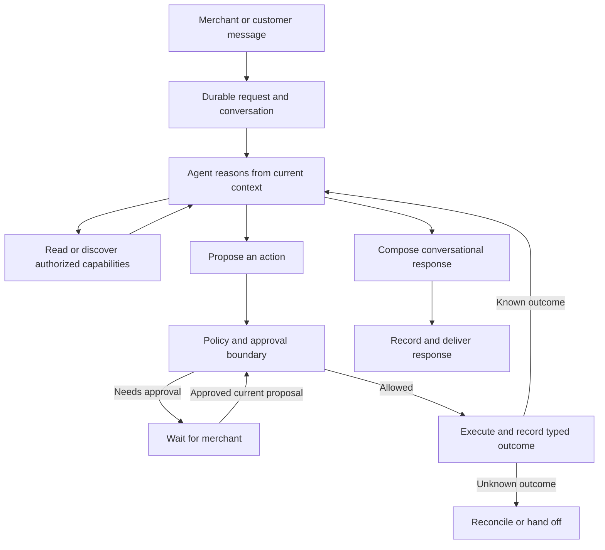

# Conversational agent overhaul plan

Status, 2026-10-04: the core migration and v2 rollout are deployed through
`ecb514bb` (#164). Runtime v2 became the default for every organization's new
tasks at 21:08 UTC. Retirement and final documentation are implemented on
`codex/retire-agent-v1`; release verification and deployment are being completed.
The [runtime runbook](agent-runtime.md) describes the single active contract,
historical-data handling, and deployment rollback.

The production retirement inventory at 21:38:51 UTC found 64 runtime-2 tasks,
zero runtime-1 tasks or proposals, and no legacy unknown operations. Two v2
unknown actions retain their reconciliation identity. Five current taskless
plans are retained for reading and require regeneration and fresh review before
execution. No production rows were changed by the inventory.

All retained Oct 4 dev-store rechecks after #162–#164 are recorded complete:
phone approval of exchange #1041-R2; full refund #1040 in CAD with limits in shop
money; one-line partial refund #1033; named sale creation and ending; price change
and undo; order creation/editing; current-date answers; and refusal to silently
create a paid order for a free replacement (decision M). These do not establish
unobserved conversational or failure cases. Decision L defines those limits.

Created 2026-09-11. Shipping priorities revised 2026-09-29 at the release
owner's direction: this app is in development; finish working user flows,
verify them manually, and ship. New tests and repository-wide test cleanup
are exceptions, not work packages.

## Continuation and approval repair — #155 merged and deployed

The answer/revision path retains the customer-message source on its durable
request and uses the same base instruction in the cache, card and proposal hash.
Gateway and dashboard continuations retain cumulative budgets, renew their
leases, and publish the proposal and cache together. Cancellation, lost or
expired claims, and a newer customer message prevent publication. Reply-only
continuations remain awaiting approval until the reviewed reply executes.

Revised proposals send the canonical full card to the answering iMessage device
as well as other bindings. Drafts too long to display require dashboard review
and cannot be approved from the phone. The operator tool retains its pending
question until the answer succeeds, without clearing a replacement question.
Revision guidance reaches the planner even without a question; a label URL no
longer asserts that a return has already been opened.

Targeted checks used real isolated local Postgres with controlled model/provider
responses. They verify persistence, approval identity and refusal behavior;
manual dashboard/iMessage delivery and Shopify continuation evidence remain
open. #155 merged as `1d88d6d6` and is included in deployed `7ef89abb`.
The ordinary #1041 exchange email initially produced an invalid draft. #157's
deployed regeneration now produces a valid exchange-only proposal and survives
reload. #158 delivered its replacement card to the phone at 04:59:29 UTC.
The owner confirmed receipt by quoting the delivered card. After three rewrites
the owner approved the revision-3 draft from the phone on 2026-10-04, and the
exchange committed as #1041-R2. Phone revision remains unobserved.

## Next session

Finish release verification and deploy the reviewed retirement change. Items
12 and 13 are implemented; they close only when the required release checks pass
and the retirement revision is deployed. Runtime selection can no longer be
rolled back with an environment flag; redeploy #164 as described in the runbook.

Observe remaining conversational checks in normal use under decision L. Do not
create staged tickets or a paid eval campaign to close this migration. The
unknown-summary and refused-action-label defects from Oct 4 are fixed in the
retirement change. Remaining small defects are recorded under *Outside this
plan*; they are not migration gates.

iMessage is the main phone channel. Telegram and stop-by-text are excluded.

**Workspace handoff:** production's recorded revision is `ecb514bb`. Retirement
work is isolated in `/private/tmp/shopkeeper-retire-agent-v1`, branch
`codex/retire-agent-v1`. The shared root checkout still has HEAD `606da169` and
uncommitted phone, marketing and documentation work. Preserve those edits and
use the isolated branch for this release.

## Shipping objective

A merchant can give Shopkeeper a realistic instruction from the dashboard or
iMessage, review or revise what it proposes, and receive an honest
account of what happened. Customer requests use the same durable execution
contracts. The approved action happens once, Shopify's state agrees with its
receipt, and the intended message reaches its destination.

Telegram is a test-only surface, excluded from the shipping objective at the
release owner's direction (2026-09-30). Existing transport code can remain;
building, linking and verifying Telegram are not completion requirements.

Finish the existing scope using the existing runtime. Preserve the
[settled decisions](#settled-decisions) and contracts below. A narrower release
scope needs an explicit product decision; test cleanup cannot change it.

This document authorizes no production operation by itself. Existing session
authorizations continue to apply. It supersedes the
[maintainability audit](agent-maintainability-audit-2026-09-11.md) where they
differ: conversation remains model-authored and tool discovery adaptive.

Read *Current state*, *Open work*, and *How to finish a change* before working.
Use the contract sections when changing their owners. The
[release evidence](conversational-agent-overhaul-p6-release-evidence.md)
holds manual run results; the
[release matrix](conversational-agent-overhaul-release-matrix.md) records
earlier implementation evidence. The
[Package 0 baseline](conversational-agent-overhaul-p0-baseline.md)
holds retained capabilities and budgets. Detailed history remains in git.

## Rules for implementing this plan

1. **Deliver a working flow.** Implement the next missing behavior, exercise it
   in the real app, and close the item when it works. Combine tightly coupled
   fixes where that finishes the flow; no requirement for one PR per sub-item.
2. **Manual verification is the default.** Use realistic tickets, the Shopify
   dev store, and actual dashboard or phone surfaces. Check the proposal,
   provider state, receipt and delivered message. Scripted models and fake
   providers cannot demonstrate useful conversation or real delivery.
3. **Keep the edit loop short.** Run checks relevant to the change. Typecheck
   code; build when the change affects compilation or deployment; use existing
   targeted tests when they exercise the changed contract. Use existing PR CI
   for aggregate checks. Run a broad local suite for the release candidate or
   a specific unresolved failure, not after every small change or manual run.
4. **New automated tests are an exception.** Add one only for a concrete defect
   or change-specific failure that manual verification cannot safely or
   reliably reproduce, and only when it shortens diagnosis or prevents a
   meaningful recurrence. First check existing coverage. Money, tenancy and
   recovery are important contracts, not instructions to build a test campaign.
5. **No test-cleanup campaign.** Keep existing tests unless one blocks the
   current change, produces a false failure, or imposes a demonstrated delay.
   Fix or remove that specific obstacle and resume implementation. Do not
   audit, trim, restore or rewrite the suite as a prerequisite for shipping.
6. **Fix the owning contract.** Establish the cause from code, stored data or a
   dev-store reproduction. Fix claims, receipts, approvals and delivery in
   their owners. Do not add prompt patches or prose-matcher exceptions to
   compensate for a missing runtime contract.
7. **Report status honestly and briefly.** Distinguish implemented, manually
   verified and still open. Unverified behavior is not done. Record a finding
   once beside its work item and update this plan in the code change; detailed
   evidence belongs in the release evidence. Continue independent work when a
   particular manual run is unavailable.
8. **Keep scope and authority stable.** Reuse the existing registry, task
   ledger, workers, approvals and providers. Land agent-path changes through
   PRs. Paid eval campaigns run only when requested; normal authorized manual
   app exercises are the verification path. Never replay an uncertain write.

## Current state

Flow observations below come from the recorded dev-store/phone runs. The
retirement inventory is a fresh read-only production inspection on 2026-10-04.

| Area | State |
| --- | --- |
| Core implementation | Receipts, task storage, claims, budgets, proposal binding, discovery and customer-task routing exist. Phone and composer integration, the order-status read, the refund-limit currency fix and the full-refund card amount are deployed through #148. Composer, dashboard Stop/reload, iMessage inbound/task/reply delivery and the #1035 recipient email are verified. |
| Manual provider runs (Gate C) | Cancellation #1036/#1035, return #1042-R1, exchange #1041-R2, full refund #1040 (CAD), partial refund #1033, named sale creation/end, variant prices both ways, and order creation/editing passed the recorded retained runs. #162–#164 rechecks are complete, including free-replacement refusal. Fulfillment and customer-info updates were owner-observed without receipt read-back. Gift-card/label runs are excluded by decision L. |
| Manually verified approval display | Cancellation quote display (8d) confirmed by the release owner on `6616da7f`, 2026-09-29. The exact-draft card with a labeled placeholder (8c) was seen on the customer-info ticket and on a full-refund card (`[refund amount]`), 2026-10-01 and 2026-10-02. |
| Built changes awaiting observation | Full-refund amount on both card surfaces; definite reply-failure recovery; dashboard email provider id (8f); partial-refund cap refusal at execution. Full refund #1040 in CAD and partial refund #1033 committed on Oct 4. Phone approval/confirmation were observed. Stop-by-text and Telegram are excluded; unsafe failure cases remain recorded as not seen live (decision L). |
| Known implementation gaps | No remaining core runtime migration behavior is identified. Unknown-summary/refused-label fixes accompany retirement. Other small product defects are deferred below. Stale/over-limit approval refusal remains unobserved; stop-by-text is excluded (decision L). |
| Conversational acceptance | A one-order status question is answered briefly and in ordinary language after #144 (owner phone check and stored turns, one sample per question). A status question by customer name still uses the full read and can pad. #151's handoff removes the unsupported return/refund suggestion; the owner confirmed iMessage receipt and wording. The #1039 investigation read current data and preserved the no-return constraint; its explanation-only follow-up made no actions. Financial explanations remain incorrect/unverified (8h). References, topic return, conversational revision and language/voice remain unobserved. |
| Rollout and runtime retirement | Item 11 deployed Oct 4. Item 12 deletion and item 13 docs implemented on the retirement branch; aggregate verification and deployment pending. Historical readers and v2 reconciliation/delivery remain. Rehearsal waived (decision L). |
| Optional paid comparison (Gate B) | Last comparison on `cf41c169` failed; it was incorrectly called passed before correction. #125 fixed the C08 runtime defect, so that input is no longer held out. Comparison tooling (Gate A) exists; neither a rerun nor new fixtures are required unless requested. |
| Active runtime and rollback | Retirement creates only runtime-2 tasks and refuses other versions. Historical rollout variables become inert. Rollback redeploys #164 across all hosts; retain the additive schema and v2 operation identities. See [agent-runtime.md](agent-runtime.md). |

## Open work, in order

Item numbers are stable references for existing evidence, not a rule to finish
every historical sub-item before writing more code. Historical evidence may
cite the earlier rule/package numbering. Work follows this sequence; manual
runs also happen as soon as the affected flow is ready.

| Order | Deliverable | Items | Completion |
| --- | --- | --- | --- |
| 1 | Fix iMessage response scope and wording | 8h | One-order status verified on the phone after #144. Escalation-only approval fixed and deployed in #149. #151's deployed replay removes #150's unsupported return/refund suggestion; the owner confirmed phone receipt and correct wording. Approval refusal was not exercised; other acceptance rows are unobserved. |
| 2 | Finish phone approval outcomes | 8g | PR #137 merged and deployed. Normal approval observed on the customer-info ticket (2026-10-01). Reply-failure recovery remains unverified. |
| 3 | Verify the remaining built approval fixes | 8c, 8e, start/resume 8 | Draft display (8c), cancellation quote (8d), dashboard confirmation and the iMessage confirmation on the customer-info ticket (8e) are verified. The full-refund card (#148) awaits a live card. |
| 4 | Merchant entry points | 10, 10a, 10c | Composer, dashboard Stop/reload, durable iMessage and recipient email passed. Stop-by-text is excluded. Definite reply-failure recovery is built but not observed live. |
| 5 | Finish provider and delivery correctness | 8f, 10b | Code-complete and deployed: #146 (8f), #136 and #147 (10b). Read-only live checks passed; a full refund (#1040, CAD) and a partial refund (#1033) committed on 2026-10-04; the 8f send and the partial-refund cap refusal have not run. |
| 6 | Retained behavior | remaining 8, 8h | Return/exchange and the retained Oct 4 merchant flows passed. #162–#164 rechecks are complete. Other conversational matrix observations remain open in normal use. |
| 7 | Runtime retirement and final docs | 11–13 | Item 11 deployed. Item 12 code and inventory plus item 13 docs implemented; release checks/deployment pending. Rollback rehearsal waived. |

### Retained-flow status

Items 8–10 are implemented and deployed through #164. Current observed results
are recorded above and in the release evidence. The earlier chronological
implementation log is preserved in the release evidence under *Implementation
history carried from the plan*.

The following remain unobserved in ordinary use: phone revision, explicit
stale/over-limit approval refusal, the full-refund amount on both card surfaces,
definite customer-delivery failure recovery, the dashboard email provider id,
partial-refund cap refusal at execution, and the conversational matrix's
reference/topic/language/voice checks. Decision L accepts the unsafe or unusual
failure cases as built but not seen live and does not require staged tickets.
These observations are not proof of completion and are not additional migration
work packages. Stop-by-text and Telegram are excluded. Gift cards and
merchant-supplied return labels remain available without a dedicated live run.

### Release and runtime retirement

- **9 — Observation and rollback (Gate D).** Controlled flow evidence is in the
  release log. A staged rollback rehearsal is waived by decision L. Do not claim
  production-scale traffic or a rehearsal that did not occur.
- **11 — Stage v2 routing.** Done 2026-10-04 21:08 UTC on `ecb514bb`; the owner
  removed the allowlist and selected runtime 2 on both Railway services.
- **12 — Retire the old active runtime (Gate E).** Implemented on the retirement
  branch. The read-only production inventory is clear of actionable v1 state.
  All new tasks use v2; persisted old versions and taskless historical plans are
  refused before execution. Historical decoders and recovery identities remain.
  Required checks and deployment are recorded in the release evidence.
- **13 — Final documentation.** The runtime runbook, operating instructions,
  matrix, and this plan describe the single active runtime. Current status is
  separated from historical evidence, exclusions, and unobserved normal-use
  acceptance. Close with item 12 after release verification and deployment.

### Gate E deletion targets

| Responsibility | Replacement / retained compatibility |
| --- | --- |
| Runtime/proposal/discovery rollout flags and v1 selection | New tasks always persist runtime 2; old versions fail before new work. Rollback redeploys #164. |
| Optional speculative customer drafting | Every support plan binds its exact draft and destination with receipt placeholders (decision A). |
| `request_wider_tool_set` and broad mutation fallback | Authorized starter sets and bounded in-loop capability discovery. |
| Result-text mutation completion inference | Validated success receipts; current provider order reads may establish observed state. Historical cache/receipt readers remain. |
| Taskless answer/revision and approval fallbacks | Required durable wait claims and shared proposal authorization, with regeneration guidance for historical cards. |
| Direct operator-run and dashboard-plan entry points | Already retired or moved onto durable task workers/composer. Shared execution remains the only approval owner. |
| Cached-plan recovery / delivery adapters | Retain current durable missing-plan recovery, historical display decoding, v2 unknown reconciliation, and attributed delivery without effect replay. |

## How to finish a change

1. Implement the missing behavior in its existing owner.
2. Run relevant cheap checks. Documentation-only changes need structure/docs
   checks. For code, typecheck the affected workspace and use targeted existing
   tests or a build where they help verify the change.
3. Exercise the affected flow in the dashboard, dev store or phone, using
   existing authorized test destinations. Check actual provider state and
   delivery as applicable.
4. Record: commit, request/surface, expected result, observed result, references,
   and any remaining issue. Update the item's status. No test-count narrative.
5. Move to the next implementation item. A missing manual input leaves that
   verification open but does not prevent unrelated code work.

`npm run verify:pr` remains the aggregate release/CI check. A failure is
investigated for its relation to the change; resolve a real product defect or
the specific broken check. Do not start a suite-wide audit or add tests to
satisfy coverage. A required check cannot be silently bypassed or called passed.

## Test cleanup decision

**Further broad cleanup is deferred until after shipping.** Coverage thresholds
are already removed, and the recent deletion/trim campaign has consumed many
changes without completing the missing merchant entry points. Less test code
alone does not make a user flow work. Restoring deleted tests is also outside
this work unless a current defect needs one.

Cleanup is worth doing only when a specific test or check blocks the current
change, falsely rejects working behavior, or measurably slows the required
verification. Make the smallest correction, retain checks that catch actual
failures, and continue the shipping queue. The status of the shipping items is
in *Current state*. Telegram implementation and testing are excluded from product
and release scope.

## Open decision

None. The two product questions from the 2026-10-04 runs are settled as
decision M. Stop-by-text (10c) is out of this release unless the owner asks
(decision L).

**Gate C scope, 2026-10-04:** decision L supersedes the 2026-10-02 scope.

Future questions should name the concrete affected work and available choice; do
not reopen settled product decisions as a testing prerequisite.

## What has been done

| Package / change | Implemented |
| --- | --- |
| 0 — Baseline | Capability/identity inventory, persisted-state inventory, budgets and evaluation manifest. |
| 1 — Receipts | Versioned per-tool results, durable action identity and dispatch lifecycle, typed Shopify/internal/communication outcomes, explicit compatibility readers. |
| 2 — Dashboard requests | Request/task/proposal storage, 202 submission/status recovery, worker claims, budgets, Stop and shared proposal authorization. Durable composer is deployed and exercised; dashboard Stop/reload and iMessage delivery passed. Remaining manual checks are above. |
| 3 — Adaptive slice | Write proposal suspension and receipt-based execution; partial-refund spend reservation moved to provider pricing. Customer composition later changed by decision A. |
| 4 — Discovery | Registry-derived bounded discovery, restricted starter sets and context load tiers. |
| 5 — Customer tasks | Durable inbound customer requests, proposal/runtime pinning, wait continuation, revisions, task settlement and attributed delivery. Broad real-app verification remains open. |
| 6 — Release fixes | Canonical approval hash, exact draft/receipt placeholders, committed-effect vs delivery outcome, close-thread cancellation, withheld-message follow-up, line-item display and C08 routing correction. |
| Cancellation (#132) | Clean dev-store cancellation/refund on #1036, matching receipt and approved customer delivery with provider id. |
| Approval presentation | 8d is manually verified on `6616da7f`; dashboard receipt summary (8e) passed on `6031e3b4`; the iMessage draft (8c), approval and confirmation were observed on the customer-info ticket on 2026-10-01. |
| Crash-sweep isolation (#134) | Existing recovery tests no longer race across organizations. No further cleanup is scheduled. |
| Operator status answers (#141, #142, #144) | Task state retained in history, the current instruction separated, response guidance corrected, and a lean `get_order_status` read. One-order status verified on the phone and from stored turns on 2026-10-01 (one sample per question). |
| Refund correctness (#136, #147) | Limits and the daily budget compared and reserved in shop-currency figures; planner over-cap routing fixed; unknown partial refunds reconcile; a partial refund's cap refusal is a `policy_block`. A full refund (#1040, CAD, held in shop money) and a partial refund (#1033) committed live on 2026-10-04. |
| Email provider id (#146) | The dashboard `send_email` path keeps the provider id on the response and receipt. Live send not verified. |
| Full-refund card amount (#148) | The phone and dashboard cards print a full refund's quote in the customer's currency and what it costs the shop. Deployed 2026-10-02; not yet seen on a live card. |

These entries describe implementation, not universal live proof. Detailed
history is in `git show fff54dc4:docs/conversational-agent-overhaul-plan.md`
and subsequent commits; run results remain in the release evidence.

## Settled decisions

The release owner's answers to what the plan left open. They are binding like
the fixed decisions below. Each keeps its letter, because the release evidence
and commits cite it.

- **A. What the merchant approves is what the customer receives** (2026-09-25).
  Every customer message proposed alongside a write uses `exact_draft`; the
  `intent` mode is not used for customer messages. The model writes the
  message before approval, with outcome-dependent values as labeled
  placeholders. It is shown on the card, bound into the approval hash, and sent
  only if the write succeeds and every placeholder fills. Filling those
  placeholders from the approved write's receipt is the only change permitted
  after approval. This replaces the original design's compose-after-outcome
  default for customer messages only. Messages to the merchant still compose
  after outcomes.
- **B. A flagged reply is never sent** (2026-09-25). A flag on a draft awaiting
  approval is shown on the card. A flag on a reply that would otherwise send
  without review holds it as a proposal. Removing the flagged sentence and
  sending the rest is forbidden (*Validate, don't repair*).
- **C. Closing a conversation cancels all of its waiting tasks** (2026-09-25),
  by the authorized-stop row of the task table: no new action starts, pending
  proposals and cards are invalidated, and a task with an uncertain submitted
  write goes to `reconciling` rather than `cancelled`.
- **D. A write that runs without the merchant reviewing it follows decision A**
  (2026-09-25). Its customer message is fixed as an `exact_draft` before the
  write, and only its placeholders are filled afterward. A flag (decision B)
  turns it into a proposal the merchant reviews.
- **E. Phone instructions move onto durable tasks in this plan** (2026-09-25),
  reusing the `OperatorEvent` claim and sweep rather than replacing them. This
  is item 10, before the staged rollout; Gate E then deletes the synchronous
  path.
- **F. Gate C runs every retained Shopify write that has never touched a real
  store** (2026-09-26). Package 1's live Shopify schema validation never ran,
  so every typed receipt except `add_shopify_customer_note` and
  `update_shopify_order_address` was built from fake provider responses. The
  fourteen runs are listed in item 8. Internal thread writes touch no store
  and are not included; email delivery is exercised by each customer-ticket
  run.
- **G. A withheld-message follow-up drafts; it does not escalate**
  (2026-09-27). When an approved write definitely failed, the follow-up's job
  is the replacement message #118 built, and the merchant reviews it. The C08
  escalation was the runtime's own write-guarding evidence applied to a turn
  that cannot write. The fix follows the follow-up contract and is keyed on
  the typed follow-up flag, not on phrasing. The keyword checks themselves
  stay outside this plan. C08's expectation stands.
- **H. A cancellation refunds the order's payment** (2026-09-28, item 8b).
  `cancel_order` on a paid order refunds the full paid amount to the original
  payment method as part of the same approved write. The card says so, the
  receipt records the refunded amount, and the customer message names the
  refund through a placeholder bound to that fact, so a refund that did not
  happen withholds the message (decision A). It stays outside the per-call and
  daily compensation limits: returning payment for goods never shipped is not
  goodwill. Found when Gate C rerun run 1 cancelled paid #1032, kept the
  payment, and told the customer a refund was coming.
- **I. The paid model comparison is advisory** (2026-09-28). Gate B, the
  budgeted v1/v2 eval comparison, runs only when the release owner asks and
  does not block rollout, which rests on Gate C's live runs. Paid evals had
  already stopped by standing rule (2026-09-27), so a blocking Gate B could
  never pass.
- **Task budget** (2026-09-26, item 7). Active latency p95 at most 10 seconds
  and mean task cost at most $0.035, measured over a runtime's comparison runs
  by the eval report's `[eval:task]` line.

- **J. Ship through working flows** (2026-09-29). Manual app verification is
  the default. New automated tests require a concrete change-specific need;
  broad test audits, deletion campaigns and routine full-suite runs do not
  precede implementation. Use proportional local checks and the existing
  aggregate release/CI check. Unverified conversational behavior remains open.
- **K. Shopkeeper opens a return and leaves the label to the merchant**
  (2026-10-03). Shopify does not sell return labels to apps and no label
  provider is integrated, so the agent never asks the merchant for a label URL
  or promises a label it cannot send. It proposes the return; the approval card
  and confirmation tell the merchant to send the label themselves. A label the
  merchant does supply can still be attached. Buying labels through a provider
  would be a new paid capability and needs its own decision.
- **L. Live checks cover what merchants actually do** (2026-10-04). The owner
  ruled out dedicated tests for rarely used actions and staged test tickets.
  `create_gift_card` (the owner said on 2026-09-12 that practically no store
  hands out gift cards) and `attach_return_label` (decision K: the agent never
  asks for a label) need no live run; both stay in the product. Claude runs
  merchant-side writes from the dashboard agent chat in plain merchant wording,
  so the owner's part is limited to approvals that need the phone. Acceptance-
  matrix rows not yet seen are judged in normal use, not staged. Failures that
  cannot be triggered safely (a reply failing after a committed write, an
  over-limit refusal at execution, a message on an escalated thread, the email
  provider id) are built and recorded as not seen live. Stop-by-text (10c) is out
  of this release unless the owner asks. Item 9's rollback rehearsal is waived:
  with no users nothing is in flight. The single-variable rollback applied before
  retirement; afterward rollback redeploys #164. This supersedes decision F's
  fourteen-effect list.
- **M. Sale names and free replacements go to the merchant** (2026-10-04). Before
  starting a sale the agent asks whether the merchant wants to name it, unless
  they already have; the Shopify title, which shoppers see at checkout, is that
  name or a generic one ("20% off everything"), with nothing of Shopkeeper's
  in it. Whenever an order is meant as a free replacement, the agent asks the
  merchant how to handle it before creating anything, because
  `create_shopify_order` leaves the full total pending and cannot make an order
  free. The sale name shipped in #162 and was observed working. The
  free-replacement rule shipped in #162 as a sentence in the tool description,
  and the live check created #1044 without asking. #163's optional
  `free_of_charge` flag also failed live: #1045 was created and the flag was
  never set. #164 makes the model state who pays on every order (`payment`,
  required in the schema the model sees and optional for persisted inputs), and
  static policy refuses `"free"`, so the merchant is asked. Observed working
  after #164 deployed (release evidence, *Free-replacement check after #164*).

## Outside this plan: recorded, not scheduled

Oct 4 follow-ups: raw escalation reason on an already-escalated ticket; silent
Reopen HTTP 500 when another open thread exists; answering the agent's own
operator-chat question reports no pending question; product-search chips print
an ID as a count; and changing an order line's quantity is unsupported. Unknown
summaries and refused-action success labels are fixed by runtime retirement.


The 2026-09-25 audit also found decisions made by matching English outside the
paths this plan migrates. They are listed so they are neither pulled into this
plan nor forgotten. Changing any of them needs the release owner's go-ahead
first.

- Keyword intent checks in `planner-safety/refunds.ts` and
  `planner-safety/mutative.ts`, and `hasActionableMutativeIntent` as used by
  `planner-evidence.ts`.
- `isMerchantAnswerPlanningInstruction` (`kb-learned.ts`), which recognizes a
  sentence we write ourselves by regex; `planner.ts` then removes `ask_operator`.
- The shipping and discount question regexes used by `merchant-answer-kb.ts`.
- Summary-string parsing in `order-ops/finding.ts`.
- The overall size of `SUPPORT_INSTRUCTIONS`.

### Known limitations, accepted and not scheduled

Each was recorded when its package closed and is not a defect against a
contract. It is listed so nobody rediscovers it as new.

- A continuation (an answer, a revision) is a new attempt on the same task that
  re-derives its context from the conversation. It does not resume from the
  task checkpoint, which is not updated after the task is created.
- A stale question cleared from one member's pending projection
  (`loadLiveOperatorContext`) stays parked on the organization-wide task until
  the customer writes again. One member's card must not close a task, so this is
  intended.
- A stop is observed at loop-iteration boundaries, so a tool call already in
  flight finishes. This is the intended bound.

## Product outcome

The agent understands informal instructions, investigates, remembers relevant context, improvises within its authority, and explains itself naturally. It can handle combinations of requests that were never individually programmed. It asks a focused question when the answer matters and takes reasonable initiative when it has enough information.

The runtime makes that freedom dependable. It owns authorization, durable execution, action identity, approvals, provider outcomes, and delivery. It does not prescribe a script for each customer situation.

Example acceptance conversation:

> Merchant: “This customer has been messed around twice. Figure out what happened and sort it out. Check with me before giving money back.”
>
> Agent: “The replacement was created, but it hasn't shipped. The blue one is out of stock; the black one is available. I can ask whether they'd prefer that or a refund. Want me to offer both?”
>
> Merchant: “Ask about the black one first, and keep it short.”

The agent discovers the order state and alternative through tools, changes direction based on the merchant's instruction, and drafts a suitable reply. There is no hardcoded “replacement failed twice” workflow. It does not interpret the initial request as permission to refund.

## Design boundaries

| Model owns | Runtime owns |
| --- | --- |
| Understanding requests and conversational references | Tenant, member, customer, and order access |
| Choosing relevant investigations and discovering tools | Tool availability and execution-time authorization |
| Proposing actions and alternatives | Approval binding and current-state policy checks |
| Deciding whether clarification is useful | Durable suspension and resumption |
| Adapting after new information or a definite failure | Retry limits and unknown-outcome reconciliation |
| Natural explanations, brand voice, and summaries | Verified result fields and delivery records |

Non-goals:

- No fixed intent-to-workflow catalog, mandatory conversation script, or template-only assistant.
- No multi-agent team, new agent framework, generic plugin platform, or giant catch-all tool.
- No new commercial capabilities during migration. The support wedge and existing merchant operations remain the scope.
- No broad rewrite of working provider adapters, identity checks, or channel integrations.
- No promise of perfect factual correctness for arbitrary generated prose. Structured evidence improves grounding; language quality still needs evaluation.

## Target architecture


```mermaid
flowchart TD
    A[Merchant or customer message] --> B[Durable request and conversation]
    B --> C[Agent reasons from current context]
    C --> D[Read or discover authorized capabilities]
    D --> C
    C --> E[Propose an action]
    E --> F[Policy and approval boundary]
    F -->|Needs approval| G[Wait for merchant]
    G -->|Approved current proposal| F
    F -->|Allowed| H[Execute and record typed outcome]
    H -->|Known outcome| C
    H -->|Unknown outcome| I[Reconcile or hand off]
    C --> J[Compose conversational response]
    J --> K[Record and deliver response]
```

Use the existing gateway, queue, database, and shared agent package. Support and operator turns retain different authorities and interaction styles, but share request identity, budgets, receipts, and recovery semantics. A policy decision may require approval even when the model wants to proceed.

### Durable request and work state

Distinguish a conversation, an inbound request, an ongoing task, a proposed action, an execution attempt, and a delivery. They are related identities, not interchangeable names for a turn. Several messages can advance one task, and one conversation can contain independent tasks.

Before introducing tables, map these responsibilities onto `OperatorEvent`, `PlanExecution`, `AgentAction`, existing pending state, request outcomes, and delivery storage. Extend existing records where their semantics fit. Do not repurpose a provider-specific event table as a generic task table without validating its claim and recovery behavior.

Persist only the work state needed to resume: objective, relevant entity references, evidence references, explicit constraints, pending question or approval, proposed actions, execution receipts, and progress. Do not persist hidden chain-of-thought or grow a parallel transcript of speculative reasoning.

Conceptual states include queued, running, waiting for input, waiting for approval, reconciling, completed, failed, and cancelled. Map them to existing storage before choosing a new enum. Record action completion separately from response delivery; a completed refund with a failed email must remain a completed refund.

### Adaptive agent loop

The model chooses a useful next step from reading, capability discovery, clarification, action proposal, or response. It may combine capabilities to solve novel requests. It need not produce a complete speculative action-and-reply plan before investigating.

Execute independent reads together. Record write proposals before execution; preserve meaningful dependencies between writes. Feed actual outcomes back before composing a completion response. Multiple related writes can still be reviewed together when their targets and parameters are known, so the new runtime does not introduce an approval or model round trip per trivial step.

Expose a compact relevant starting set plus authorized capability discovery. Discovery may expand the tool set during a task; it must not expose forbidden capabilities or load every schema as the default fallback. A model-selected task label is a relevance hint, never an authorization decision.

Maintain one execution owner for a task at a time. New instructions can supersede pending proposals, clarify an existing task, or start separate work. A request to stop prevents new actions; it cannot undo a provider write already submitted. Cross-device approvals and revisions must resolve against exact proposal identities.

### Capability and result contracts

Evolve the existing tool definitions rather than creating a second registry. Each capability owns its input schema, required evidence, allowed actor/context, provider requirements, approval/policy metadata, execution adapter, typed result, and recovery behavior.

Results carry outcome, target, relevant financial or operational fields, provider reference, and execution identity. Preserve distinctions such as not found, rejected, definite failure, and unknown outcome. Human-readable messages are presentation, not the source from which machine facts are reconstructed.

Separate stable operation identity from model tool-call IDs. A repeated proposal or restarted model turn must not accidentally receive fresh authority to repeat a committed action. Use provider idempotency where supported and reconcile where it is not. Do not claim universal exactly-once execution across external providers.

### Conversation, evidence, and memory

Generate responses from actual outcomes and relevant evidence. The model chooses wording, tone, and explanation. Exact consequential fields can be referenced through validated bindings to receipt fields; avoid fixed full-sentence templates as the default experience. Audit notes and delivery bookkeeping are runtime-generated.

For approval, clearly show proposed actions and any customer draft. If the merchant approves exact wording, preserve it except for explicitly shown result placeholders. A substantive change in action, amount, recipient, or approved message invalidates the relevant approval. Otherwise, post-execution composition follows the merchant's authorized intent and communication policy.

Scope evidence to the task, entity, and observation time. Recheck provider preconditions before writes, especially after waiting for approval. Prevent a model-provided evidence reference from establishing success without a matching successful record.

Keep conversational memory separate from authority. Store explicit preferences and useful task facts with source and scope, using the existing memory system. Summaries and preferences cannot grant permissions or turn customer claims into verified facts. Questions, references such as “that one,” topic changes, and returning to unfinished work need conversational evaluation, not a growing keyword router.

## Implementation instructions and fixed decisions

Read this section before starting a work package. The architecture above describes the product; this section specifies how to build it. If a later repository change makes a named location inaccurate, find the current owner and update the location here. Do not use that mismatch as a reason to invent another runtime.

### How to execute this plan

1. Packages 0–5 supply the existing implementation. Finish the open shipping sequence above; implement and manually verify each affected user flow before moving on. Do not replay completed package checklists.
2. Keep old callers working through additive contracts and a versioned compatibility boundary. Do not change legacy persisted plan interpretation in place.
3. For each change, record what was implemented, what was seen working, remaining failures and any material rollback concern. A checkbox means implemented and verified; an unverified flow stays open.
4. Use existing functions for tenant checks, policy, claims, refund reservations, sending, and reconciliation. Extract a shared function only when two concrete callers need it. Do not add a service container, event-sourcing framework, workflow DSL, generic repository layer, or second capability registry.
5. Keep the configured model and provider adapters stable during the first slice so runtime regressions can be isolated. Do not compensate for broken claims, receipts, or tool selection by adding prompt instructions.
6. If a decision affects which merchant operations remain supported, preserve current merchant availability until the inventory provides a documented scope decision. Lack of usage data is not evidence that a capability is unused.

### Persistence decisions: identity is not status

*Condensed; built in Packages 1, 2 and 5.* The schema
(`packages/db/prisma/schema.prisma`) is the source of truth for fields. The rules
that still bind:

- A conversation (`Thread`), a request (`AgentRequest`), a task (`AgentTask`), a
  proposal (`AgentProposal`), a proposal execution (`PlanExecution`), an action
  with its receipt (`AgentAction`) and a delivery (`Message`) are distinct
  identities. `OperatorContext` pending state is a projection that cards read.
  It is not authority, and trimming it never deletes work.
- Do not widen `OperatorEventStatus` or `PlanExecutionStatus` to carry task or
  conversation state. Do not add one table per conceptual word.
- A task checkpoint holds short observable facts and references, never the
  transcript, provider payloads or model reasoning.
- Every lookup and mutation is scoped by organization and parent ownership. New
  records join workspace deletion, redaction and retention. Nothing cascades
  away evidence of an unresolved provider write.

### Task transitions and concurrency

Use a task-specific state set: `queued`, `running`, `waiting_input`, `waiting_approval`, `reconciling`, `completed`, `failed`, `cancelled`. These are proposed task states, not replacements for existing execution enums.

| From | Event and guard | To / required write |
| --- | --- | --- |
| queued | Worker wins conditional claim | running; store token and lease |
| running | Model asks a relevant question | waiting_input; persist question and response before releasing claim |
| running | Policy requires approval for persisted proposal | waiting_approval; persist proposal and notification intent |
| waiting_input | Scoped answer matched to question/task | queued; attach request and increment revision |
| waiting_approval | Valid decision for current proposal/hash | queued; record approval atomically, then enqueue |
| waiting_approval | Revision/dismissal | queued or cancelled according to instruction; invalidate pending proposal |
| running | Submitted write has uncertain outcome | reconciling; retain operation key, receipt if available and spend reservation |
| reconciling | Provider probe establishes outcome | queued to observe known outcome, or cancelled after recording outcome if cancellation was requested |
| running | Objective satisfied; required response persisted | completed; delivery can still be pending/failed |
| waiting_approval | Approved execution withheld its exact draft — a write definitely failed, or a placeholder had no receipt value — and no outcome is unknown | queued, revision incremented, the follow-up and its execution recorded on the checkpoint |
| queued (follow-up) | Worker wins the follow-up claim; every write settled, no execution claimed or unknown | running; the attempt may only read and draft, and its draft requires review. With nothing to draft against — conversation closed, customer answered or wrote again — completed or failed as the execution was |
| queued/running/waiting_* | Authorized stop | cancelled if no uncertain submitted write; otherwise reconciling with cancellation recorded |
| waiting_input/waiting_approval | Conversation closed, unless its proposal is already approved (decision C) | Authorized stop, in the transaction that closes the conversation; the pending proposal is superseded |
| running | Definite unrecoverable failure or exhausted budget | failed with reason and resumable facts; uncertainty still takes precedence as reconciling |

Completed/cancelled/failed tasks are not reset by a duplicate request. A deliberate new instruction can create a new task referencing prior work. A known partial result remains visible even when the overall task fails or is cancelled.

Concurrency implementation rules:

1. PostgreSQL conditional updates/transactions decide ownership; Redis locks and queue job IDs are optimizations. Claim task status and token atomically. Every state mutation from a worker must verify its token and expected revision.
2. Renew leases while work runs. A replacement worker may reclaim expired reasoning/read work. If any action reached dispatch, inspect its durable operation state first; lease expiry never authorizes replay.
3. Persist inbound revisions and action-dispatch authorization through a shared task-row ordering point. If a stop/revision wins before dispatch authorization, the old action cannot start. Once dispatch authorization wins, report that the action may already be underway; attempt abort where supported but still reconcile its outcome.
4. Do not hold a database transaction across model or provider network calls. Persist dispatch intent under the transaction, then call the provider. This introduces a conservative crash window: a crash after intent but before the call is treated as potentially submitted unless the adapter can prove otherwise.
5. A stale worker that receives a provider result may record evidence against the exact operation through the reconciliation path. It must not update the current task revision, overwrite a newer result, send a new reply, or start another action.
6. Recovery scans durable rows for accepted-but-not-enqueued requests, expired claims, unknown operations, and unsent responses. Queue publication after a database commit can fail; the sweep is required, not optional cleanup.

### Typed receipts and operation identity

*Condensed; built in Package 1.* `ReceiptV1` and its per-tool validators live in
`tools/result.ts` and `shopify/receipts.ts`. The rules that still bind, and that
Gate E deletions must not break:

- Keep `ToolStatus` values at compatibility boundaries. The mapping is
  `succeeded → ok`, `not_found → not_found`, local `rejected → policy_block`,
  `failed → error`, `unknown → unknown`. If a legacy status and a receipt
  disagree, validation fails and the uncertainty is preserved. Never pick the
  more optimistic value.
- Facts come from the provider: exact decimal money, currency, canonical target
  and provider reference. Never take them from the requested input, parse them
  from a `message`, or infer a currency from locale. Missing required success
  fields after a possible write means `unknown`.
- The operation identity is runtime-assigned, never a model tool-call ID. It is
  created before dispatch and reused on every attempt of that action. A fresh
  proposal or tool-call ID cannot bypass a committed or unknown operation on the
  same target and effect.
- Persist the receipt before a dependent write or a success message. Retry a
  definite failure only when the adapter documents that no effect occurred.
  Unknown outcomes go to reconciliation, and a single empty probe is not proof
  of failure.
- In a bundle, writes run sequentially in dependency order. A succeeds and B
  fails means A stays successful. Dependents of B are blocked, and no
  compensation is invented. Delivery retries separately from commercial
  actions.

### Approval and communication contract

Use a canonical server-generated hash of the immutable proposal. Extend the existing `hashPlan` / instruction-hash machinery rather than hand-building hashes in channel code. Canonicalization must sort object keys, preserve meaningful array order, normalize input with the registered parser, and preserve exact approved draft bytes. Reordered object keys retain the same identity; changed amount, recipient, draft or dependencies invalidate it.

The approved snapshot binds organization, task and revision, proposal ID/version, actor scope, normalized tool names/inputs/targets, ordered action dependencies, communication mode, destination, approved draft (if any), and allowed result bindings. Keep existing policy and instruction binding at least as strict as today. Record approver identity and decision time from authentication, never from model arguments.

Use exactly two communication approval modes initially:

- `exact_draft`: display the destination and exact draft before approval. After execution, only explicitly displayed placeholders may be substituted from validated successful receipts. If an action fails or a binding is unavailable, do not send the success draft; compose a new status/proposal and apply normal communication policy.
- `intent`: record what the merchant authorized communicating, to whom, and any wording limits. Compose after actual outcomes. This mode is available only where existing policy allows it; it is not an automatic replacement for exact-draft approval.

Approval execution must load the persisted proposal, verify current membership and proposal revision/hash, recheck applicable policy and provider state, and acquire the existing execution claim. Buttons and conversational approval call this same boundary. A terse “yes” with two plausible pending proposals triggers clarification; never use “latest card wins” to authorize money or recipient changes.

A changed amount, order, address, recipient, action set, dependency, or exact draft supersedes the proposal and needs whatever approval the replacement requires. A changed display label does not change authority. Recheck refundable balance, fulfillment/cancellation state, customer/order ownership, grant health, and applicable limits after any wait. If current state no longer permits the exact approved action, return a rejection or propose a revision; do not silently adjust the amount.

For several known related actions, persist and display one bundle and approve its complete snapshot once. Use the existing plan claim as the bundle owner and individual operation records for partial results. This is not an atomic provider transaction.

### Dashboard submission and recovery contract

*Condensed; built in Package 2.* `POST /api/agent/chat` takes a client-generated
`clientRequestId`, persists before acknowledging, and returns 202 with a durable
`requestId`. The status route is `GET /api/agent/requests/:requestId`. A
duplicate with the same payload returns the original; a changed payload under
the same key is 409. Cancel and approve persist a scoped decision. Answer/revision handlers persist
a scoped continuation and claim the existing task before awaiting planning in
the host; they renew its lease and settle the proposal/cache together. These
handlers remain synchronous. The private ask route is bounded and read-only.
See the runtime runbook for the active entry-point contracts. A browser disconnect
stops observation, not execution. Server history is the authority when client
state is lost.

### Adaptive-loop implementation recipe

*Condensed; built in Packages 2–4.* Keep one model loop with ordinary registered
tools. Investigation may precede a proposal; decision A requires a proposed
customer message to be an exact draft with receipt-bound placeholders. A model-provided proposal is untrusted
until the runtime parses and persists it. Budgets are persisted, reserved before
dispatch, and never replenished by a restart or a human wait. Reconciliation and
delivery keep their own bounded recovery, so exhausting model calls never
abandons a submitted write. The frozen values are in the Package 0 baseline, in
one configuration location.

### Discovery, evidence and continuity

*Condensed; built in Packages 4 and 5.*
- **Discovery.** `discover_capabilities` returns only tools from the caller's
  authorized set. It never falls back to the full registry, and repeated
  fruitless discovery hits the shared budget. A model-selected label is a
  relevance hint, never authorization. Discovery cannot turn support into
  merchant mode or supply a missing verification credential.
- **Evidence.** Evidence records carry source kind, organization, entity,
  observation time and source identity. User claims and summaries never become
  provider evidence by being copied. Freshness is per operation: each write
  adapter names its preflight reads.
- **Continuity.** A consequential reference that is ambiguous gets a
  clarification. Customer text is never a merchant preference or a permission
  change.

### Response grounding and delivery

New completion facts must come from stored, schema-valid receipts or authoritative provider observations with explicit provenance. A current order state can support “the order is cancelled”; it does not prove “I cancelled it” without a matching operation receipt. An input field or proposed action can support future-tense proposal wording only.

Reuse and narrow the existing completion-binding mechanism. Bind a specific receipt/operation, target and allowed field; reject mismatched tenant/task/target/outcome or unsupported field paths. Give the model structured outcomes and let it author surrounding prose. Amounts and provider references shown as consequential bindings are rendered by validated code. Prose checks remain heuristics: do not claim that field bindings prove the truth of every sentence.

Persist the composed response and its destination before attempting delivery. Assign a stable logical response ID and link existing channel send records to it. Retry the stored approved/composed text, not a new model generation. Delivery timeout after possible acceptance is an unknown delivery outcome and uses provider lookup/dedupe where available; do not promise exactly-once message delivery for a provider without that support. Never mark an email delivered just because it was queued. Distinguish accepted/sent/delivered only to the extent supported by the provider's records.

## Migration work packages

Packages 0–5 provide the implementation summarized above. Package 6 closes the
remaining user flows, verifies them in the real app, stages routing, and
retires the old active runtime. Its work queue is
[Open work](#open-work-in-order); its completion procedure is
[How to finish a change](#how-to-finish-a-change). Do not create a second
verification backlog from the earlier package checklists.

### 6. Certify, cut over, and delete superseded machinery

Keep the persisted runtime-version field immutable as historical provenance.
New tasks select v2 directly. Inventory persisted state before deleting each
superseded responsibility and retain v2 workers, historical readers, and
operation/delivery recovery. Rollback redeploys the previous compatible image;
the rehearsal is waived under decision L. Never replay uncertain operations.

Acceptance: all retained entry points share the durable execution contracts,
manual evidence demonstrates retained and conversational behavior, outcomes
agree with provider state and delivery, rollout/rollback work, and the old
active orchestration path is removed. Historical readers may remain where
actionable persisted state still needs them. A narrower release scope requires
an explicit owner decision.

## Acceptance matrix

| Situation | Required behavior |
| --- | --- |
| Vague “figure it out and sort it out” instruction | Investigates, proposes a useful path, respects explicit limits |
| Novel combination of replacement, stock, and customer communication | Composes existing capabilities without a bespoke workflow |
| “Actually, use the other one” | Resolves context or asks one focused question when ambiguous |
| Merchant changes direction while approval is pending | Supersedes the proposal; old approval cannot execute new inputs |
| Topic change, then return to earlier work | Keeps tasks distinct and resumes relevant pending state |
| Merchant requests an explanation only | Answers without inferring permission to act |
| Customer text claims owner authorization | Treats it as untrusted data; cannot expand authority |
| Action commits, reply delivery fails | Retries delivery without repeating the action |
| Provider timeout with uncertain commit | Reconciles or hands off; never blindly retries the write |
| Identical request retried after refresh | Reconnects to the original task |
| Different members or devices approve concurrently | One valid claim, one effect, consistent visible outcome |
| Missing optional context | Continues useful unrelated work; states relevant uncertainty naturally |
| New phrasing, language, or brand voice | Maintains conversational quality and uses real outcome evidence |
| Capability unavailable | Discovers a legitimate alternative or explains a useful handoff |

Use this table during the same realistic dev-store/dashboard/phone sessions as
item 8. Record which rows the session demonstrated. A conversational row is
complete when observed working; “not verified” leaves it open. For dangerous
or unreliable failure injections, inspect the implementation and reuse
existing failure coverage. New automated cases follow the exception rule
above. No fixture or test-file count is a completion target.

### Conversation checks in normal support flows

**Owner correction, 2026-10-03.** The earlier grouped conversation sequence
became an artificial exercise: a conflicting refund request on #1039 was used
for an exchange, followed by repeated financial challenges and instructions to
change the customer's intent. That sequence is withdrawn. The customer should
not have to participate in a test script or change their request to satisfy the
acceptance matrix. Preserve the recorded findings and completed observations;
do not repeat the financial explanation probes.

Use the ordinary return/exchange workflow:

1. The controlled customer emails support asking to return an item or exchange
   it. They name the desired replacement, or ask what alternative is in stock.
   An existing suitable request is enough; no return needs to be pre-created.
2. The agent reads the current request, order, eligibility, applicable policy
   and relevant stock. It proposes the supported action and a suitable reply,
   or explains a real blocker without inventing a policy or financial outcome.
3. If the customer has not chosen a replacement and a choice is necessary,
   obtain that answer through the normal support reply. Ask only for information
   genuinely needed to proceed. Do not manufacture follow-up requests, reversals
   or agreement to return an item to make an unsuitable case fit.
4. The merchant approves, revises or declines the actual proposal through the
   existing dashboard/iMessage review. A customer's acceptance of an offered
   replacement is separate from merchant authorization of the app's action.
5. For an approved action, check the resulting Shopify state and actual customer
   reply once. For a declined or blocked action, check the honest response and
   that the app did not claim it executed. Record the result and move on.

Investigating stock, resolving the chosen replacement, handling genuinely
missing information and communicating naturally can be observed together in
this flow. Topic changes, language changes, explanation-only requests and
ambiguous references need a suitable merchant conversation when they arise;
do not append them all to a customer return request. Recovery and concurrency
retain their existing evidence paths; do not induce an uncertain provider write.
Unobserved acceptance rows stay open without forcing the customer through them.

The #1039 investigation and explanation-only turns are retained as partial
evidence in the release log. Investigation preserved the customer's no-return
constraint and used fresh reads; the explanation-only turn had no effects.
Financial and capability claims remain defective. Those are implementation
findings to fix from the existing evidence, not additional customer steps.
The direct provider probe opened #1041-R1 for its Sample item; that line is
already on an OPEN return and must not be used for a duplicate return. Its
regular line remained returnable at inspection. Confirm present eligibility and
actual customer intent before choosing a normal return/exchange case.

## Verification specification

### Manual app exercise

Choose an existing dev-store customer/order and a realistic request. Observe
the actual entry point, task/request identity, draft and approval; approve or
revise through the intended surface. Confirm the provider state, stored outcome
and actual recipient delivery. Return to the conversation, change direction,
ask for an explanation or stop work where relevant. Record a brief result
against the commit. This is ordinary feature verification, not a separate
test-infrastructure project.

### Deterministic failure and race cases

The existing D01–D20 cases describe contracts to preserve, not a new test list.
Reuse `task-ledger.integration.test.ts`, `task-approval.integration.test.ts`,
`plan-execution.integration.test.ts` and
`unknown-outcome-reconciliation.integration.test.ts` when they cover the
changed decision. The principal invariants are:

- Duplicate/redelivered requests and concurrent approvals have one owner;
  changed payloads or obsolete approvals do not gain authority.
- Stop/revision ordered before dispatch prevents that dispatch; after dispatch
  it preserves actual or unknown outcomes and prevents subsequent work.
- A crash or timeout cannot authorize blind write replay; reconcile the stored
  operation and preserve its provider identity.
- A committed action survives response failure; retry the stored delivery
  without repeating the action.
- Tenant, member, provider grants, current-state policy and budgets remain
  authoritative through waits, continuations and runtime routing changes.

Do not manufacture an actual uncertain write for a manual demonstration.
A small diagnostic or automated regression is warranted only when it resolves
a concrete change-specific problem that cannot be reproduced manually.
Existing historical case descriptions remain in git.

### Model evaluation cases and scoring

Paid comparisons, new fixtures and fixture expansion happen only when the
release owner requests them. Gate B is advisory. Reuse the existing dashboard
and gateway harnesses; do not introduce another framework or tune against a
held-out input. C08 needs a new unseen variant only if a new comparison is
requested, because #125 fixed against the original.

Manual sessions assess useful investigation, clarification, reference
resolution, instruction adherence, actual outcomes, delivery and natural
communication. An unauthorized/duplicate effect or a known false completion
claim is a defect regardless of wording quality. Record observed latency and
cost when available; do not build instrumentation solely to fill a scorecard.

### Commands and evidence to record

Use the relevant workspace scripts from [TESTING.md](../TESTING.md). Typical
choices are:

```sh
# Documentation-only edits.
npm run lint:structure

# Code changes: typecheck the affected workspace.
npm run typecheck -w packages/agent

# An existing targeted check when its contract changed.
npm run test:integration -w packages/agent -- --run src/task-approval.integration.test.ts

# Once for the release candidate / through existing CI.
npm run verify:pr
```

These are choices for the change, not commands to run after every edit. Broad
checks are repeated only when subsequent changes or a failure justify them.
No paid eval runs implicitly. Record manual results and remaining defects,
rather than suite counts. Documentation edits need documentation checks.

## Success criteria and scope discipline

The overhaul is complete when the retained user flows and conversational
behavior have been seen working, the remaining entry points use durable tasks,
provider and delivery outcomes are honest, rollout/rollback work, and the old
active runtime has been removed safely.

Track defects that obstruct that result and fix their owners. Keep recoverable
unknown outcomes visible; preserve tenant authority, exact approvals and
provider identity. Do not add new capabilities, frameworks, testing campaigns
or unrelated cleanup to this work. A displayed wording change cannot change
execution; a new channel cannot acquire a copy of policy.

Unverified required behavior remains open. If the release owner chooses a
smaller initial scope, record the excluded behavior and enforce that scope
before rollout; do not silently redefine completion.
