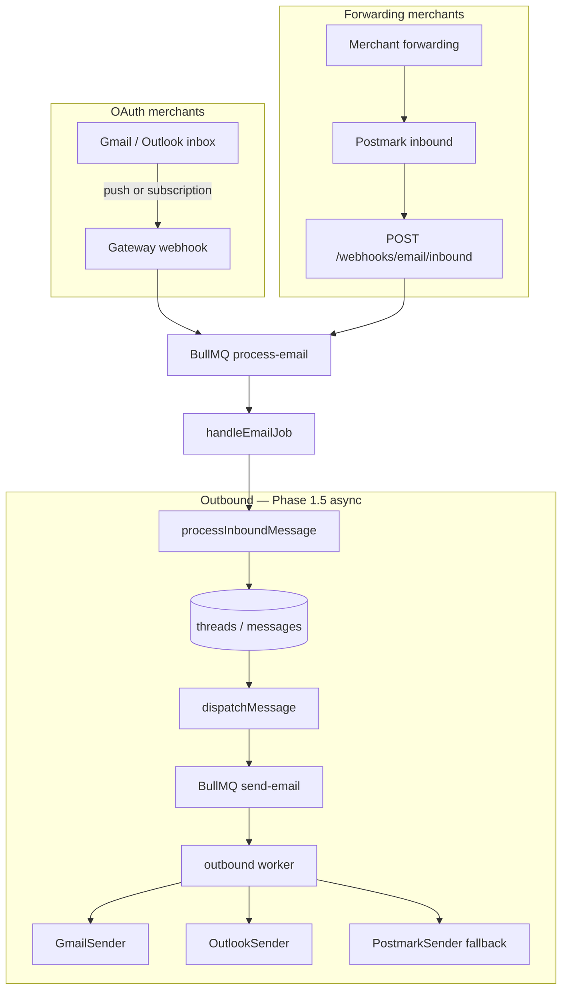

# Email integration plan — full Gmail + inbound/outbound cleanup

Plan for native Gmail inbox sync (no forwarding required for OAuth merchants), parallel Outlook improvements, and cleanup of the split Postmark / OAuth email model.

**Status:** Phase 0 + Phase 1 complete (2026-06-09); Phase 1.5 / Phase 2 not started  
**Last updated:** 2026-06-09 (Phase 1 shipped: `packages/email` shared package — token refresh, MIME build/parse, inbound normalize, address filter, providers, senders; dashboard email lib reduced to re-export shims)

## Goal

After this work:

1. **Gmail OAuth** means connect → inbox sync → reply, with no Postmark forwarding step for merchants who connect Google.
2. **Custom support addresses** (`support@theirstore.com` via Google Workspace) are first-class: merchant picks the public address; inbound filters and outbound `From` use it.
3. **Forwarding + Postmark** remains a supported fallback for merchants who cannot or will not use OAuth read access.
4. **Outbound** is consistent across Gmail, Outlook, and forwarding: correct threading headers, verified send-as behavior, attachment support where providers allow it.
5. **Product copy and onboarding** match the technical model (no “Connect Gmail” that silently still requires forwarding).
6. **Outbound reliability** matches inbound: async send queue with retries, visible send status on messages, and provider message IDs stored where available.

Out of scope for this plan: marketing email, bulk campaigns, shared-team inbox features beyond current ticket model, IMAP for arbitrary providers.

**Known architectural debt (documented, not fixed in this plan):** agent auto-execute and auto-ack email sends hop `gateway worker → HTTP → dashboard → provider`. This couples worker reliability to dashboard uptime and adds latency. Acceptable at current volume; revisit colocating outbound dispatch in gateway or a shared worker once send volume or auto-execute rate grows. Phase 1.5 outbound queue reduces user-facing impact but does not remove the hop.

---

## Current state

### Inbound (all providers)

```
Merchant mailbox ──forward──► {orgId}@inbound.<domain> (Postmark MX)
                                      │
                                      ▼
                         POST /webhooks/email/inbound (gateway)
                                      │
                                      ▼
                         BullMQ process-email → handleEmailJob
                                      │
                                      ▼
                         processInboundMessage (ticket + attachments → Blob)
```

- Webhook handler: `apps/gateway/src/routes/webhooks-email.ts`
- Worker: `apps/gateway/src/message-handlers/channels.ts` (`handleEmailJob`)
- Attachments: Postmark base64 → `uploadInboundAttachment` → `blob:{pathname}` refs
- Tenant routing: `{orgUuid}@inbound.domain` **or** match `Integration.externalAccountId` (support address)

### Outbound

| Provider | Path | Scope / notes |
|----------|------|----------------|
| Gmail | `GmailSender` → `users/me/messages/send` | OAuth: `gmail.send` only |
| Outlook | `OutlookSender` → Graph `me/sendMail` | OAuth: `Mail.Send` only |
| Forwarding | `PostmarkSender` | Sends with merchant `From`; no per-merchant domain verification |

Dispatch: `apps/dashboard/src/lib/messaging/dispatch-message.ts` → `getEmailSender(integration)`.

- **Synchronous only** — no outbound queue; provider latency and transient failures return immediately to the caller (502). Contrast with inbound BullMQ (3 retries).
- **Gateway hop for agent sends** — `gatewayThreadSink` calls `POST /api/agent/io-send-internal` on the dashboard for `send_reply` / `send_email`; auto-ack uses the same dashboard path.

Threading: `buildThreadReplyHeaders` in `apps/dashboard/src/lib/messaging/email/reply.ts` sets `Message-ID`, `In-Reply-To`, `References`. Outbound agent messages do not store provider-assigned message IDs today.

### OAuth connect

- Gmail scopes today: `openid`, `email`, `gmail.send` — see `apps/dashboard/src/app/api/integrations/_lib/email-oauth-providers.ts`
- On connect, `externalAccountId` and `fromEmail` are set to the Google account email from userinfo
- Forwarding setup is hidden under “Use email forwarding (advanced)” in `EmailForwardingDisclosure.tsx`

### Production env coupling

- Gateway requires `POSTMARK_INBOUND_USERNAME` / `POSTMARK_INBOUND_PASSWORD` in production even when merchants use Gmail OAuth (`apps/gateway/src/config/env.ts`)
- Postmark is channel-critical for all inbound today

---

## Target architecture

Hybrid model — two inbound rails, one worker pipeline:



**Design rules:**

1. Normalize every inbound source into the existing `InboundJobData` email shape before enqueueing. Do not fork ticket creation logic.
2. Normalize every outbound send through a queue (Phase 1.5) with `sendStatus` on `Message`. Sync send remains as flag-off fallback during rollout.
3. Shared send/MIME/token code lives in `packages/email` — imported by gateway workers and dashboard API routes.

---

## Phased plan

### Phase 0 — cleanup & contracts (no behavior change) — ✅ DONE (2026-06-09)

**Purpose:** reduce confusion and harden the existing stack before adding Gmail sync.

1. ✅ **Document the hybrid model** in README and `docs/production/runbook.md` (inbound rail vs outbound provider). — README Email channel line rewritten; runbook gained an "Email architecture: inbound rail vs outbound provider" section + new env vars.
2. ✅ **Integrations UX**
   - ✅ After Gmail/Outlook connect, show explicit status: “Sending: connected” / “Receiving: forwarding required” until Phase 2 lands. — `EmailRailStatus` panel in `connect-bodies.tsx`.
   - ✅ Move forwarding instructions out of “advanced” for forwarding-only merchants; keep separate checklist for OAuth users during transition. — `EmailForwardingDisclosure` gained `defaultOpen` + `label`; auto-expands and relabels to "Set up inbound forwarding" for OAuth-connected merchants.
3. ✅ **Env validation split** (`apps/gateway/src/config/env.ts`)
   - ✅ Keep Postmark inbound auth required when `EMAIL_INBOUND_MODE=postmark|hybrid` (default). — via new `getEmailInboundMode()`.
   - ✅ Allow gateway boot without Postmark inbound creds only when `EMAIL_INBOUND_MODE=gmail-only` (dev / future); production default stays `hybrid`. — covered by new `env.test.ts` case.
4. ✅ **Outbound hygiene** — audit found the rules already satisfied; **no code change.**
   - ✅ `fromEmail` preferred for `From`, `externalAccountId` for OAuth identity in both send paths (`dispatch-message.ts:168`, `agent/tools/thread.ts:119`).
   - ✅ Provider + integration id already logged on send failures via `recordEmailSendFailure`.
5. ✅ **Re-auth path + email OAuth token health**
   - Email OAuth uses an **epoch sentinel** (`tokenExpiresAt = 0`) for “refresh token dead — reconnect required,” not `Date.now()` comparison. Normal access-token expiry is handled by proactive refresh at send time (`GmailSender` / `OutlookSender`). This is intentional — see `providers.test.ts`.
   - **Gap (now closed):** Instagram had a daily `token-health` job; Gmail/Outlook did not.
   - ✅ **Added `email-token-health` maintenance job** (`apps/gateway/src/maintenance/email-token-health.ts`, registered in `workers.ts`):
     - Daily: for each `platform: email` integration with `provider: gmail | outlook` and a refresh token, attempt a refresh-token probe.
     - On 4xx (dead grant): set `tokenExpiresAt: new Date(0)` (same sentinel pattern as `token-health.ts`). 5xx/network treated as transient — token left alone.
     - On success: update `accessToken` + `tokenExpiresAt` (and `refreshToken` if rotated).
   - ✅ Reconnect surfacing in Integrations UI **already wired** (`isEmailAuthReauthorizationRequired` → `integration-card-helpers.ts` → `IntegrationCard` Fix button); job only needed to set the sentinel.
   - **Caveat (deferred):** probe needs `GOOGLE_CLIENT_ID/SECRET` + `MICROSOFT_CLIENT_ID/SECRET` in the gateway (not present today). Job skips gracefully (warn, no sentinel) when absent; documented in `apps/gateway/.env.example`. Add to production env / `verify:production:env` when provisioned.
   - Phase 2 adds a second re-auth trigger: missing `gmail.readonly` scope in metadata (extend `isEmailAuthReauthorizationRequired`).

**Verify:** ✅ Postmark webhook tests unchanged; gateway + dashboard typecheck clean; new unit tests pass (`email-token-health.test.ts` sentinel/refresh/transient cases, `env.test.ts` gmail-only case, `workers.test.ts` registry counts).

---

### Phase 1 — shared email infrastructure — ✅ DONE (2026-06-09)

**Purpose:** extract code Gmail and Outlook inbound will share; avoid duplicating token refresh and MIME logic.

**Shipped:**
- ✅ `packages/email` (`@shopkeeper/email`) created with subpath exports, consumed by both `apps/dashboard` and `apps/gateway`. Build wired into root `predev` + turbo `^build`; `packages/email/src` added to ESLint globs.
- ✅ Modules: `types.ts`, `providers.ts`, `token.ts` (shared OAuth refresh — `requestTokenRefresh` / `persistRefreshedToken` / `getEmailOAuthClient`), `mime-build.ts`, `mime-parse.ts` (mailparser), `inbound-normalize.ts`, `address-filter.ts`, `reply.ts`, `logger.ts` (install seam, mirrors agent), `senders/` (Postmark/Gmail/Outlook + `getEmailSender`).
- ✅ `GmailSender` / `OutlookSender` now refresh via shared `token.ts`.
- ✅ Dashboard `apps/dashboard/src/lib/messaging/email/*` reduced to thin re-export shims (importers + existing tests unchanged; shims removed in Phase 5).
- ✅ Both apps install the email logger (`installEmailLogger`) alongside the agent logger.
- ✅ **Verify:** `packages/email` unit tests (MIME parse fixtures: multipart, attachments, Message-ID, HTML-only→text fallback; address-filter; inbound-normalize) pass; dashboard DB-backed sender tests still green through shims; gateway + dashboard typecheck clean; package lint clean.

**Deferred to later phases (as planned):**
- `email-token-health.ts` still carries its own refresh copy — Phase 5 "Complete migration" folds it onto `token.ts`.
- GCP Pub/Sub client + wiring `inbound-normalize` / `address-filter` into the gateway worker pipeline land in **Phase 2** (they are inbound-consumption glue, dark until Gmail native inbound).

#### Package location — resolved

Create **`packages/email`** (not gateway-only). Rationale:

- Dashboard needs shared code for outbound senders (`GmailSender`, `OutlookSender`), send-as validation (Phase 3), and eventually outbound queue worker.
- Gateway needs the same token refresh, MIME parse, and inbound normalize modules for Gmail/Outlook sync.
- A gateway-only module would force a refactor when Phase 3 adds `settings.sendAs.list` on the dashboard.

Layout:

```
packages/email/
├── src/
│   ├── token.ts              # OAuth refresh; used by senders + gateway sync + token-health
│   ├── mime-parse.ts         # Inbound MIME → normalized shape (mailparser)
│   ├── mime-build.ts         # Outbound MIME (move from dashboard mime.ts)
│   ├── inbound-normalize.ts  # → InboundJobData fields
│   ├── address-filter.ts     # Support-address matching for Workspace aliases
│   ├── providers.ts          # getEmailProvider, types (move from dashboard)
│   ├── senders/              # PostmarkSender, GmailSender, OutlookSender
│   └── types.ts
```

Gateway and dashboard import from `@shopkeeper/email`. Phase 1 migrates existing dashboard `apps/dashboard/src/lib/messaging/email/` incrementally; keep thin re-export shims until Phase 5 cleanup.

| Module | Responsibility |
|--------|----------------|
| `token.ts` | Refresh OAuth tokens for Gmail/Outlook; persist to `Integration` (generalize from `GmailSender` / `OutlookSender`) |
| `mime-parse.ts` | Parse raw MIME → `{ from, to, subject, text, messageId, attachments[] }` using `mailparser` (or similar) |
| `inbound-normalize.ts` | Map parsed message → `InboundJobData` fields; apply `stripQuotedReply` at worker boundary (unchanged) |
| `address-filter.ts` | Given `fromEmail` + headers, decide if message is for the support address (Workspace aliases, `Delivered-To`, `X-Original-To`) |

#### Schema / metadata (no migration required initially — use `Integration.metadata` JSON)

```typescript
type EmailIntegrationMetadata = {
  provider: 'gmail' | 'outlook' | 'postmark';
  inboundMode?: 'postmark' | 'native' | 'hybrid';

  // Gmail native
  gmailHistoryId?: string;
  gmailWatchExpiration?: string; // ISO
  gmailWatchResourceId?: string;

  // Outlook native (Phase 4)
  outlookSubscriptionId?: string;
  outlookSubscriptionExpiration?: string;
  outlookDeltaLink?: string;

  // Health
  lastInboundSyncAt?: string;
  lastInboundError?: string;
};
```

Optional later migration: dedicated columns if JSON querying becomes necessary.

#### Dependencies

- Add `packages/email` workspace package; depend from `apps/dashboard`, `apps/gateway`.
- Add `mailparser` to `packages/email` for MIME parsing from Gmail `raw` / Outlook Graph MIME.
- GCP Pub/Sub client for Gmail push (gateway only).

**Verify:** unit tests for MIME parse fixtures (multipart, attachments, `Message-ID`, HTML-only → text fallback).

---

### Phase 1.5 — outbound async send queue (parallel with Phase 1–2)

**Purpose:** close the inbound/outbound reliability gap. Runs in parallel with Phase 1 (shared package) and Phase 2 (Gmail inbound) — no dependency on native inbound.

**Problem today:** every outbound email is synchronous in the HTTP handler (`dispatchMessage`, `io-send-internal`). Transient Gmail/Postmark/Graph failures fail the merchant or agent immediately with 502. Inbound already uses BullMQ with 3 retries.

#### Design

```
POST /api/messages (or io-send-internal)
    │
    ├─ [sync path, optional flag off] existing behavior
    │
    └─ [async path, default after rollout]
         1. createMessage with sendStatus: 'pending' (or separate OutboundSend row — prefer column on Message)
         2. enqueue BullMQ job send-email on gateway (reuse REDIS_URL) OR dashboard worker if colocated later
         3. return 202 / message with pending status to UI
              │
              ▼
         Worker: load integration, build headers, getEmailSender().send()
              │
              ├─ success → sendStatus: 'sent', providerMessageId (if returned), sentAt confirmed
              ├─ retry (3x, exponential backoff from constants.ts pattern) on transient errors
              └─ exhausted → sendStatus: 'failed', recordEmailSendFailure, UI shows retry affordance
```

**Queue placement:** prefer **gateway** (`send-email` queue) to avoid Vercel serverless worker limitations and to colocate with inbound queues. Worker calls `@shopkeeper/email` senders directly (requires moving senders to `packages/email` in Phase 1 — Phase 1.5 ships after Phase 1 package exists).

**Enqueue path — unresolved, must decide before coding.** The dashboard cannot do a "direct Redis enqueue" onto the gateway's BullMQ queue without violating the project's Redis split: the gateway runs a dedicated per-instance `ioredis`/`REDIS_URL` for BullMQ, while the dashboard uses Upstash REST — *separate instances by design* (see CLAUDE.md). Two real options, neither free:

- **(A) Internal HTTP enqueue** (`POST` to a gateway internal route, like `plan-internal`). Keeps the Redis split intact, but the enqueue itself becomes a synchronous dashboard→gateway call that can fail — which partly re-introduces the very hop fragility this phase exists to reduce. Mitigated because the failure surface is now "couldn't enqueue" (fast, retryable, message stays `pending`) rather than "provider timed out mid-send."
- **(B) Give the dashboard the gateway's `REDIS_URL`** so it can enqueue directly. Removes the HTTP hop but creates a new dashboard→gateway-Redis coupling that does not exist today and cuts against the separation rationale (serverless connection churn against the BullMQ Redis).

Recommendation: **(A)** for v1 — it preserves the architecture and the orphan-`pending` row is already recoverable via the retry affordance. Revisit (B) only if enqueue-hop failures show up in metrics. Whichever is chosen, an orphan-`pending` sweeper (messages stuck `pending` > N min with no job) is needed since enqueue-after-row-create is not atomic.

**Job payload (minimal):**

```typescript
type OutboundEmailJobData = {
  organizationId: string;
  messageId: string;       // pre-created agent message row
  threadId: string;
  integrationId: string;
  source: 'dispatch_message' | 'agent_send_reply' | 'agent_send_email' | 'auto_ack';
};
```

**UI:** composer shows “Sending…” for `pending`; failed messages get retry button (re-enqueue same job). Optimistic UI can remain; reconcile on poll or revalidate.

**Idempotency:** worker checks `sendStatus !== 'sent'` before calling provider; safe under at-least-once delivery.

**Schema (small migration):**

```prisma
// On Message — optional fields
sendStatus     String?   // pending | sent | failed
providerMessageId String?
sendError      String?
```

**Rollout:** behind `OUTBOUND_EMAIL_ASYNC=true`. Start with agent/auto-ack paths (highest blast radius from gateway hop), then merchant composer.

**Verify:**

- Unit: job handler skips already-sent messages; retries on 5xx/timeout
- Integration: enqueue → worker → provider mocked → `sendStatus: sent`
- Regression: `OUTBOUND_EMAIL_ASYNC=false` preserves current sync behavior
- E2E: failed send → retry → success

**Does not fix:** gateway → dashboard HTTP hop for agent tools (see architectural debt note). It does prevent provider blips from failing the hop response and gives merchants a recoverable send state.

---

### Phase 2 — Gmail native inbound

**Purpose:** OAuth Gmail merchants receive tickets without Postmark forwarding.

> **Blocking dependency — start before any Phase 2 coding.** `gmail.readonly` is a Google **restricted scope**. Native inbound cannot ship to external merchants until Google's restricted-scope verification (OAuth consent screen + security audit) clears — this is weeks-to-months, outside our control, and can be rejected. Until it clears, native inbound only works for `Internal`-type app / test users, and the forwarding rail remains the *actual* production path. **File the verification application as step 0** (parallel with Phase 1), because every Phase 2/3 line of code is dark until it lands. Treat Success Criterion #1 ("zero forwarding") as gated on this, not on our engineering.

#### 2a — OAuth scope expansion

Update `GMAIL_EMAIL_OAUTH.scopes`:

```
openid
email
https://www.googleapis.com/auth/gmail.send
https://www.googleapis.com/auth/gmail.readonly   # or gmail.modify if labeling later
```

- Existing integrations: treat as **send-only** until user completes re-auth (banner in Integrations + `isEmailAuthReauthorizationRequired` extended for missing read scope).
- Google Cloud Console: enable Gmail API; configure OAuth consent screen for restricted scopes.
- **Plan for Google verification** (restricted scope audit). Start early — often weeks. Use test users / Internal app type until approved.

#### 2b — Google Pub/Sub setup

Env (gateway):

| Variable | Purpose |
|----------|---------|
| `GOOGLE_CLOUD_PROJECT` | GCP project id |
| `GMAIL_PUBSUB_TOPIC` | e.g. `projects/<project>/topics/gmail-inbound` |
| `GMAIL_PUBSUB_AUDIENCE` | Optional audience for push JWT verification |

One-time: grant `gmail.googleapis.com` publish to the topic (Google documented IAM binding).

Push subscription → `POST /webhooks/gmail/push` on gateway (new route file `webhooks-gmail.ts`).

#### 2c — Watch lifecycle

On successful Gmail OAuth callback (`completeEmailOAuth`):

1. Call `users.watch` with `topicName`, `labelIds: ['INBOX']`.
2. Store `historyId`, `expiration`, `resourceId` in metadata.
3. Enqueue initial backfill job (optional MVP: only new mail after connect; v1.1: `messages.list` last 7 days for support address).

Maintenance job — `registerGmailWatchMaintenanceJob` in `apps/gateway/src/maintenance/`:

- Daily (or every 12h): find Gmail integrations where `gmailWatchExpiration` < now + 24h
- Renew watch; update metadata
- On repeated failure: set `lastInboundError`, surface reconnect in dashboard

Pattern: copy `registerTokenHealthMaintenanceJob` structure in `maintenance/workers.ts`.

#### 2d — Push handler → sync → enqueue

`POST /webhooks/gmail/push`:

1. Verify Pub/Sub push auth (JWT or shared secret — follow Google push verification docs).
2. Decode notification `{ emailAddress, historyId }`.
3. Load integration by `externalAccountId` (Google email) + `provider: gmail`.
4. Refresh access token if needed.
5. `users.history.list` from stored `gmailHistoryId` → collect `messagesAdded`.
6. For each new message id:
   - `messages.get(format=raw)` → MIME parse
   - Skip if `Message-ID` already exists for org (idempotency)
   - Skip if not addressed to `fromEmail` (support address filter)
   - Skip outbound-only / SENT (check labels on `format=metadata` first for cheap filter)
   - Extract attachments → base64 or buffer → existing `uploadInboundAttachment`
7. Update `gmailHistoryId` in metadata.
8. Enqueue `process-email` job(s) with same shape Postmark uses today. **Carry the parsed `Message-ID` as `externalMessageId`** (dedup) **and persist it on the stored customer `Message`** (threading). Dedup already works off `externalMessageId`, but reply threading (`In-Reply-To` / `References` via `buildThreadReplyHeaders`) needs the inbound `Message-ID` stored on the row. **This must land with Phase 2, not Phase 5** — otherwise Gmail-native replies thread incorrectly the moment native inbound is enabled. The Phase 5 "threading regression" row is verification/tests for this, not the first time the field is written.

#### 2e — Deduping and edge cases

| Case | Handling |
|------|----------|
| Shopkeeper sent the message | Skip if `From` matches merchant `fromEmail` / integration |
| Duplicate Postmark + Gmail | Prefer `externalMessageId` unique per org; first wins |
| Gmail verification forwards | Ingest (merchant expects verification tickets) or filter with UI note |
| HTML-only body | MIME parser → text; fallback `[No plain text body]` |
| Large attachments | Keep 10 MB gateway cap in `blob.ts` |
| Watch expires | Maintenance renew; alert if expired > 1h |

**Verify:**

- Integration test: mock Gmail API + Pub/Sub payload → job enqueued → ticket created
- Manual: connect Gmail test account, send mail to INBOX, ticket appears without forwarding
- Regression: Postmark inbound path still works for `provider: postmark`

---

### Phase 3 — Gmail native UX + custom domains

**Purpose:** make Workspace / custom-domain support explicit in product.

#### Connect flow changes

1. OAuth completes → **Step 2 screen**: “What address do customers email?”
   - Default: Google account email
   - Allow edit: `support@theirstore.com` (saved to `fromEmail`)
   - Copy: explain Google Workspace requirement for custom domains
2. Show inbound mode badge:
   - `Native` — Gmail watch active
   - `Forwarding required` — send-only or watch failed
3. Remove implication that OAuth alone enables inbound (until watch succeeds).

#### Google Workspace guide (in-app)

Short checklist (extend `EmailForwardingDisclosure` or new component):

- Add domain in Google Admin
- MX records to Google
- Create user or alias for support address
- Connect that Google account in Shopkeeper
- Select support address in Step 2

#### Send-as validation (outbound)

Before sending via Gmail API with non-primary `fromEmail`:

- Option A (MVP): document that merchant must add “Send mail as” in Gmail settings
- Option B: call Gmail `settings.sendAs.list` after connect; warn if `fromEmail` not present
- Option C (later): API to create send-as alias (Workspace admin scopes — avoid for v1)

#### Optional: initial inbox backfill

Controlled job on connect:

- `messages.list?q=newer_than:7d` filtered to support address
- Rate-limited; merchant opt-in checkbox “Import recent conversations”

---

### Phase 4 — Outlook native inbound (parallel rail)

**Purpose:** parity for Outlook OAuth merchants.

Microsoft Graph **change notifications** on `/me/messages` (or `/users/{id}/messages`):

- Subscription renewal via maintenance job (Graph subscriptions max ~4230 minutes)
- Delta query or `getMessage` + MIME parse
- Same normalize → `process-email` enqueue

Scopes: add `Mail.Read` (or `Mail.ReadWrite` if marking read later) to `OUTLOOK_EMAIL_OAUTH.scopes`.

Reuse Phase 1 MIME + normalize modules; separate webhook route `webhooks-outlook.ts`.

Ship after Gmail path is stable — same patterns, different API surface.

---

### Phase 5 — Outbound cleanups

**Purpose:** consistent, trustworthy replies across providers. Phase 1.5 covers async queue + retries; this phase is feature parity and polish.

| Priority | Item | Action |
|----------|------|--------|
| High | **Provider message IDs** | Persist `providerMessageId` on outbound agent messages when Gmail/Graph/Postmark return one; enables future bounce correlation |
| High | **Threading regression** | Inbound `Message-ID` storage already lands in Phase 2 (see 2d step 8). This row is **verification only**: confirm replies use `In-Reply-To` / `References`; add tests for Gmail-native inbound threading. Do not defer the field write here. |
| Medium | **Attachment outbound** | Extend `OutboundEmail` + `mime-build.ts` for `multipart/mixed`; Gmail raw + Outlook MIME send |
| Medium | **Shared token refresh** | Complete migration: all senders + gateway sync use `packages/email/token.ts` (started in Phase 1) |
| Low | **HTML replies** | Optional `textHtml` on outbound; plain text fallback required |
| Low | **Postmark forwarding outbound** | Deprioritize: UI nudges OAuth; document SPF/DKIM limits; do not invest in per-merchant Postmark domain verification unless demand |
| Deferred | **Bounce handling** | Out of scope v1; log provider errors only; revisit after `providerMessageId` storage |

---

### Phase 6 — Postmark / forwarding cleanup

**Purpose:** Postmark becomes fallback rail only, not the default story.

1. **Integrations labeling**
   - `postmark` provider → UI label “Email forwarding” (already “Forwarding” in `getEmailProviderLabel`)
   - Clear separation from “Gmail” / “Outlook” cards
2. **Onboarding**
   - OAuth path: no Postmark setup steps
   - Forwarding path: inbound address + provider-specific forwarding guide (keep existing guides)
3. **Env**
   - Document: production can run Gmail-native merchants without forwarding; Postmark creds still required for hybrid until last forwarding merchant migrates
   - Long-term: make Postmark inbound creds optional when zero `provider: postmark` integrations (metric gate — not Phase 0)
4. **Dev experience**
   - Local dev: keep Postmark webhook proxy `apps/dashboard/src/app/api/webhooks/email/route.ts`
   - Add dev doc for Gmail push (ngrok + Pub/Sub or polling fallback for local)

---

## File touch list

### New

| Path | Purpose |
|------|---------|
| `packages/email/` | Shared token, MIME, providers, senders (see Phase 1 layout) |
| `apps/gateway/src/routes/webhooks-gmail.ts` | Pub/Sub push receiver |
| `apps/gateway/src/clients/gmail-sync.ts` | watch, history.list, messages.get |
| `apps/gateway/src/maintenance/gmail-watch.ts` | Watch renewal cron |
| `apps/gateway/src/maintenance/email-token-health.ts` | Daily Gmail/Outlook token probe; sets epoch sentinel on failure |
| `apps/gateway/src/message-handlers/outbound-email.ts` | Phase 1.5: `send-email` job handler |
| `apps/gateway/src/workers/outbound-email.ts` | Phase 1.5: BullMQ worker registration |
| `apps/dashboard/src/app/api/integrations/gmail/addresses/route.ts` | Optional: list send-as addresses |
| `apps/dashboard/src/components/integrations/GmailConnectFlow.tsx` | Post-OAuth support address + status |
| `packages/db/prisma/migrations/*_message_send_status` | Phase 1.5: `sendStatus`, `providerMessageId`, `sendError` on `Message` |

### Modified

| Path | Change |
|------|--------|
| `apps/dashboard/src/app/api/integrations/_lib/email-oauth-providers.ts` | Gmail/Outlook read scopes |
| `apps/dashboard/src/app/api/integrations/_lib/email-oauth.ts` | Trigger watch + metadata on connect |
| `apps/dashboard/src/lib/messaging/dispatch-message.ts` | Phase 1.5: enqueue outbound job + pending message; sync fallback behind flag |
| `apps/dashboard/src/lib/messaging/email/*` | Phase 1: thin re-exports → `@shopkeeper/email`; delete after Phase 5 |
| `apps/gateway/src/maintenance/workers.ts` | Register gmail-watch + email-token-health jobs |
| `apps/gateway/src/constants.ts` | Phase 1.5: `QUEUE.OUTBOUND_EMAIL`, `JOB.SEND_EMAIL` |
| `apps/gateway/src/index.ts` | Mount gmail webhook routes |
| `apps/gateway/src/config/env.ts` | Pub/Sub env vars; conditional Postmark requirement |
| `apps/dashboard/src/components/integrations/connect-bodies.tsx` | Connect flow UX |
| `docs/production/runbook.md` | GCP Pub/Sub + Google verification checklist |
| `README.md` | Email architecture section |

### Unchanged (reuse as-is)

- `apps/gateway/src/message-handlers/channels.ts` — `handleEmailJob`
- `apps/gateway/src/storage/blob.ts` — attachment upload
- `apps/dashboard/src/app/api/attachments/route.ts` — authenticated download
- `apps/gateway/src/routes/webhooks-email.ts` — Postmark fallback

---

## Environment variables

### New (gateway)

```
GOOGLE_CLOUD_PROJECT
GMAIL_PUBSUB_TOPIC
GMAIL_PUBSUB_VERIFICATION_TOKEN   # if using token-based push verification
EMAIL_INBOUND_MODE=hybrid           # hybrid | postmark | gmail-only (dev)
OUTBOUND_EMAIL_ASYNC=true           # Phase 1.5: async outbound queue (default off until rolled out)
```

### Existing (keep)

```
GOOGLE_CLIENT_ID / GOOGLE_CLIENT_SECRET     # OAuth + API
POSTMARK_INBOUND_USERNAME / PASSWORD        # hybrid fallback
POSTMARK_API_KEY                            # forwarding outbound only
INBOUND_EMAIL_DOMAIN                        # Postmark routing
BLOB_READ_WRITE_TOKEN                       # attachments
```

### Dashboard

No new required vars for Phase 2; optional feature flags via org settings later.

---

## Testing strategy

| Layer | Coverage |
|-------|----------|
| Unit | MIME parse fixtures; address filter; history diff logic; metadata watch expiry; email token health sentinel; outbound job idempotency |
| Gateway integration | Pub/Sub payload → queue job; Gmail API mocked; idempotency by `Message-ID`; send-email job retry + status transitions |
| Dashboard | OAuth scope in auth route test; connect flow saves `fromEmail`; pending/failed send UI states |
| E2E | Gmail-native path behind mock OR staging test account; outbound retry after simulated provider failure |
| Manual checklist | See below |

### Manual E2E checklist (staging)

- [ ] Connect Gmail (test user). Confirm watch metadata populated.
- [ ] Send email to connected inbox support address. Ticket appears without Postmark forwarding.
- [ ] Send with image attachment. Attachment visible via `/api/attachments`.
- [ ] Reply from Shopkeeper. Customer receives from `fromEmail`; thread stays grouped.
- [ ] Reconnect after token revoke. Banner + re-auth restores watch.
- [ ] Revoke Gmail refresh token; within 24h email token health sets sentinel and Integrations shows reconnect.
- [ ] Simulated Postmark timeout on reply → message shows failed → retry → sent.
- [ ] Forwarding-only merchant: Postmark inbound still creates ticket.
- [ ] Workspace: connect admin account, set `fromEmail` to alias, inbound filtered correctly.

---

## Rollout

0. **Google restricted-scope verification** — file *before* Phase 2 coding, in parallel with Phase 0/1. Long pole, externally gated. Phases 2–3 can be built and tested against `Internal`/test users while it's pending, but cannot reach external merchants until it clears.
1. **Phase 0** — ✅ shipped (2026-06-09); no flag.
2. **Phase 1** — ✅ shipped (2026-06-09); no user-visible change. Unblocked Phase 1.5 and Phase 2.
3. **Phase 1.5** — behind `OUTBOUND_EMAIL_ASYNC=true`. Ship in parallel with Phase 2 once `packages/email` exists. Internal orgs → agent/auto-ack paths first → merchant composer.
4. **Phase 2** — behind `GMAIL_NATIVE_INBOUND=true` (gateway + dashboard). Internal orgs first. Can run in parallel with Phase 1.5.
5. **Phase 3** — enable Gmail flag for all new connects; existing integrations prompt re-auth.
6. **Phase 4** — Outlook flag `OUTLOOK_NATIVE_INBOUND=true` after Gmail stable.
7. **Phase 5–6** — incremental; no flag.

Do not remove Postmark inbound until metrics show negligible `provider: postmark` usage.

---

## Open questions (resolve before Phase 2 coding)

1. **`gmail.readonly` vs `gmail.modify`?** Readonly is enough for ingest; modify enables mark-read/label to reduce duplicates. Start readonly; add modify only if duplicate/noise is a problem.
2. **Initial backfill on connect?** Default off to avoid flooding inbox with old mail; opt-in for migration scenarios.
3. **Poll fallback when Pub/Sub fails?** Optional safety net: maintenance job polls `history.list` when `lastInboundSyncAt` is stale > 2h (elevated from “defer” — cheap insurance alongside watch renewal). Full periodic poll every N minutes remains deferred unless watch reliability is a problem in production.
4. **Google Groups as support address?** Document as unsupported for native sync v1; require user mailbox or alias.
5. **Make Postmark optional in production env?** Only after hybrid rollout + monitoring; not Phase 0.
6. **Outbound queue worker location?** Resolved for v1: gateway (`send-email` queue). Revisit if dashboard moves off serverless or gateway/dashboard merge send paths (see architectural debt).

---

## Risk notes

- **Google restricted scope verification** — blocks production Gmail native for external users until approved. Start verification in parallel with Phase 1.
- **Watch 7-day expiry** — missed renewal = inbound gap. Maintenance job + alerting on `lastInboundSyncAt` stale > 2h.
- **Pub/Sub delivery** — at-least-once; idempotency on `Message-ID` is mandatory.
- **Dual ingestion** — merchant leaves forwarding on after enabling native: dedupe by `Message-ID` prevents duplicate tickets.
- **Token storage** — refresh tokens in DB; ensure Pino redaction covers any new log paths (see `docs/to-do-list.md`).
- **Rate limits** — Gmail API quotas; batch history fetches; backoff in maintenance job.
- **Outbound queue duplication** — at-least-once job delivery must not double-send; `sendStatus` gate on worker is mandatory.
- **Gateway/dashboard hop** — remains a failure mode for agent sends until architectural debt is addressed; Phase 1.5 limits blast radius to provider errors, not dashboard timeouts.

---

## Success criteria

- [ ] Gmail OAuth merchant receives inbound mail with zero Postmark/forwarding configuration
- [ ] Custom `fromEmail` (Workspace) works for inbound filter + outbound From
- [ ] Postmark forwarding path unchanged for existing merchants
- [ ] Attachments work end-to-end on Gmail-native inbound
- [ ] Watch renewal runs automatically; failures visible in Integrations UI
- [ ] Email OAuth token health sets reconnect sentinel within 24h of refresh token revocation
- [ ] Outbound async queue: transient provider failure retries and surfaces `failed` + retry in UI (Phase 1.5)
- [ ] `packages/email` is the single source for token refresh, MIME, and senders (Phase 1)
- [ ] Production runbook documents GCP + Google verification steps
- [ ] No regression in `npm run verify:pr` and gateway webhook tests

---

## Related docs

- `docs/production/runbook.md` — production env and Postmark inbound setup
- `docs/phase-6-external-services.md` — Google OAuth console checklist
- `docs/to-do-list.md` — Postmark inbound auth, attachment storage (done)
