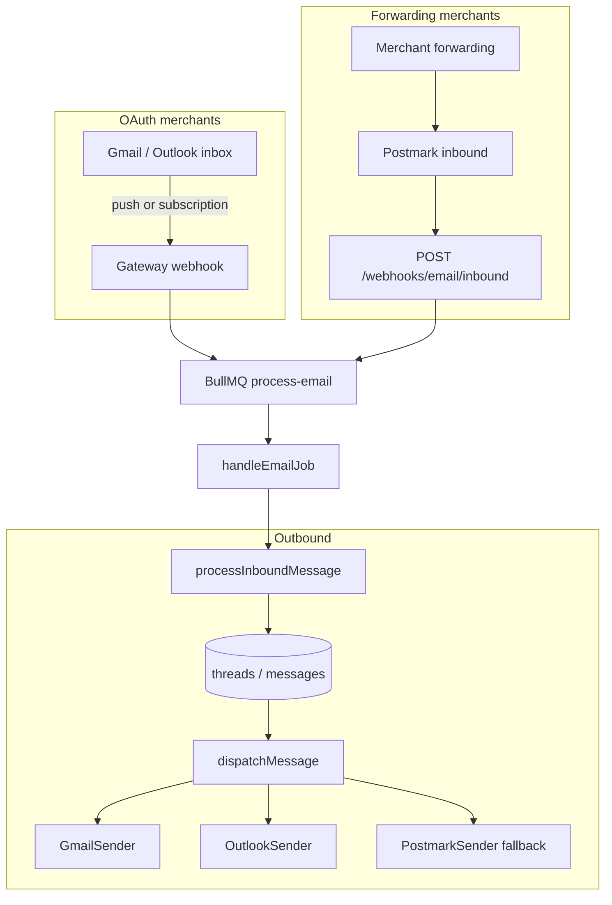

# Email integration plan — full Gmail + inbound/outbound cleanup

Plan for native Gmail inbox sync (no forwarding required for OAuth merchants), parallel Outlook improvements, and cleanup of the split Postmark / OAuth email model.

**Status:** draft  
**Last updated:** 2026-06-07

## Goal

After this work:

1. **Gmail OAuth** means connect → inbox sync → reply, with no Postmark forwarding step for merchants who connect Google.
2. **Custom support addresses** (`support@theirstore.com` via Google Workspace) are first-class: merchant picks the public address; inbound filters and outbound `From` use it.
3. **Forwarding + Postmark** remains a supported fallback for merchants who cannot or will not use OAuth read access.
4. **Outbound** is consistent across Gmail, Outlook, and forwarding: correct threading headers, verified send-as behavior, attachment support where providers allow it.
5. **Product copy and onboarding** match the technical model (no “Connect Gmail” that silently still requires forwarding).

Out of scope for this plan: marketing email, bulk campaigns, shared-team inbox features beyond current ticket model, IMAP for arbitrary providers.

---

## Current state

### Inbound (all providers)

```
Merchant mailbox ──forward──► {orgId}@inbound.<domain> (Postmark MX)
                                      │
                                      ▼
                         POST /webhooks/email/inbound (gateway)
                                      │
                                      ▼
                         BullMQ process-email → handleEmailJob
                                      │
                                      ▼
                         processInboundMessage (ticket + attachments → Blob)
```

- Webhook handler: `apps/gateway/src/routes/webhooks-email.ts`
- Worker: `apps/gateway/src/message-handlers/channels.ts` (`handleEmailJob`)
- Attachments: Postmark base64 → `uploadInboundAttachment` → `blob:{pathname}` refs
- Tenant routing: `{orgUuid}@inbound.domain` **or** match `Integration.externalAccountId` (support address)

### Outbound

| Provider | Path | Scope / notes |
|----------|------|----------------|
| Gmail | `GmailSender` → `users/me/messages/send` | OAuth: `gmail.send` only |
| Outlook | `OutlookSender` → Graph `me/sendMail` | OAuth: `Mail.Send` only |
| Forwarding | `PostmarkSender` | Sends with merchant `From`; no per-merchant domain verification |

Dispatch: `apps/dashboard/src/lib/messaging/dispatch-message.ts` → `getEmailSender(integration)`.

Threading: `buildThreadReplyHeaders` in `apps/dashboard/src/lib/messaging/email/reply.ts` sets `Message-ID`, `In-Reply-To`, `References`.

### OAuth connect

- Gmail scopes today: `openid`, `email`, `gmail.send` — see `apps/dashboard/src/app/api/integrations/_lib/email-oauth-providers.ts`
- On connect, `externalAccountId` and `fromEmail` are set to the Google account email from userinfo
- Forwarding setup is hidden under “Use email forwarding (advanced)” in `EmailForwardingDisclosure.tsx`

### Production env coupling

- Gateway requires `POSTMARK_INBOUND_USERNAME` / `POSTMARK_INBOUND_PASSWORD` in production even when merchants use Gmail OAuth (`apps/gateway/src/config/env.ts`)
- Postmark is channel-critical for all inbound today

---

## Target architecture

Hybrid model — two inbound rails, one worker pipeline:



**Design rule:** normalize every inbound source into the existing `InboundJobData` email shape before enqueueing. Do not fork ticket creation logic.

---

## Phased plan

### Phase 0 — cleanup & contracts (no behavior change)

**Purpose:** reduce confusion and harden the existing stack before adding Gmail sync.

1. **Document the hybrid model** in README and `docs/production/runbook.md` (inbound rail vs outbound provider).
2. **Integrations UX**
   - After Gmail/Outlook connect, show explicit status: “Sending: connected” / “Receiving: forwarding required” until Phase 2 lands.
   - Move forwarding instructions out of “advanced” for forwarding-only merchants; keep separate checklist for OAuth users during transition.
3. **Env validation split**
   - Keep Postmark inbound auth required when `EMAIL_INBOUND_MODE=postmark|hybrid` (default).
   - Allow gateway boot without Postmark inbound creds only when `EMAIL_INBOUND_MODE=gmail-only` (dev / future); production default stays `hybrid`.
4. **Outbound hygiene**
   - Audit `fromEmail` vs `externalAccountId` usage in `dispatch-message.ts`; always prefer `fromEmail` for `From`, `externalAccountId` for OAuth identity lookup.
   - Log provider + integration id on send failures (already partially done via `recordEmailSendFailure`).
5. **Re-auth path**
   - Surface “Reconnect Gmail” when `tokenExpiresAt` is expired sentinel (same pattern as Instagram in `token-health.ts`).

**Verify:** existing e2e email flow (`e2e/core-agent-flow.spec.ts`) and Postmark webhook tests unchanged.

---

### Phase 1 — shared email infrastructure

**Purpose:** extract code Gmail and Outlook inbound will share; avoid duplicating token refresh and MIME logic.

#### New shared module (location TBD — prefer `packages/` or `apps/gateway/src/email/`)

| Module | Responsibility |
|--------|----------------|
| `email-token.ts` | Refresh OAuth tokens for Gmail/Outlook; persist to `Integration` (generalize from `GmailSender` / `OutlookSender`) |
| `email-mime-parse.ts` | Parse raw MIME → `{ from, to, subject, text, messageId, attachments[] }` using `mailparser` (or similar) |
| `email-inbound-normalize.ts` | Map parsed message → `InboundJobData` fields; apply `stripQuotedReply` at worker boundary (unchanged) |
| `email-address-filter.ts` | Given `fromEmail` + headers, decide if message is for the support address (Workspace aliases, `Delivered-To`, `X-Original-To`) |

#### Schema / metadata (no migration required initially — use `Integration.metadata` JSON)

```typescript
type EmailIntegrationMetadata = {
  provider: 'gmail' | 'outlook' | 'postmark';
  inboundMode?: 'postmark' | 'native' | 'hybrid';

  // Gmail native
  gmailHistoryId?: string;
  gmailWatchExpiration?: string; // ISO
  gmailWatchResourceId?: string;

  // Outlook native (Phase 4)
  outlookSubscriptionId?: string;
  outlookSubscriptionExpiration?: string;
  outlookDeltaLink?: string;

  // Health
  lastInboundSyncAt?: string;
  lastInboundError?: string;
};
```

Optional later migration: dedicated columns if JSON querying becomes necessary.

#### Dependencies

- Add `mailparser` (gateway or shared package) for MIME parsing from Gmail `raw` / Outlook Graph MIME.
- GCP Pub/Sub client for Gmail push (gateway).

**Verify:** unit tests for MIME parse fixtures (multipart, attachments, `Message-ID`, HTML-only → text fallback).

---

### Phase 2 — Gmail native inbound

**Purpose:** OAuth Gmail merchants receive tickets without Postmark forwarding.

#### 2a — OAuth scope expansion

Update `GMAIL_EMAIL_OAUTH.scopes`:

```
openid
email
https://www.googleapis.com/auth/gmail.send
https://www.googleapis.com/auth/gmail.readonly   # or gmail.modify if labeling later
```

- Existing integrations: treat as **send-only** until user completes re-auth (banner in Integrations + `isEmailAuthReauthorizationRequired` extended for missing read scope).
- Google Cloud Console: enable Gmail API; configure OAuth consent screen for restricted scopes.
- **Plan for Google verification** (restricted scope audit). Start early — often weeks. Use test users / Internal app type until approved.

#### 2b — Google Pub/Sub setup

Env (gateway):

| Variable | Purpose |
|----------|---------|
| `GOOGLE_CLOUD_PROJECT` | GCP project id |
| `GMAIL_PUBSUB_TOPIC` | e.g. `projects/<project>/topics/gmail-inbound` |
| `GMAIL_PUBSUB_AUDIENCE` | Optional audience for push JWT verification |

One-time: grant `gmail.googleapis.com` publish to the topic (Google documented IAM binding).

Push subscription → `POST /webhooks/gmail/push` on gateway (new route file `webhooks-gmail.ts`).

#### 2c — Watch lifecycle

On successful Gmail OAuth callback (`completeEmailOAuth`):

1. Call `users.watch` with `topicName`, `labelIds: ['INBOX']`.
2. Store `historyId`, `expiration`, `resourceId` in metadata.
3. Enqueue initial backfill job (optional MVP: only new mail after connect; v1.1: `messages.list` last 7 days for support address).

Maintenance job — `registerGmailWatchMaintenanceJob` in `apps/gateway/src/maintenance/`:

- Daily (or every 12h): find Gmail integrations where `gmailWatchExpiration` < now + 24h
- Renew watch; update metadata
- On repeated failure: set `lastInboundError`, surface reconnect in dashboard

Pattern: copy `registerTokenHealthMaintenanceJob` structure in `maintenance/workers.ts`.

#### 2d — Push handler → sync → enqueue

`POST /webhooks/gmail/push`:

1. Verify Pub/Sub push auth (JWT or shared secret — follow Google push verification docs).
2. Decode notification `{ emailAddress, historyId }`.
3. Load integration by `externalAccountId` (Google email) + `provider: gmail`.
4. Refresh access token if needed.
5. `users.history.list` from stored `gmailHistoryId` → collect `messagesAdded`.
6. For each new message id:
   - `messages.get(format=raw)` → MIME parse
   - Skip if `Message-ID` already exists for org (idempotency)
   - Skip if not addressed to `fromEmail` (support address filter)
   - Skip outbound-only / SENT (check labels on `format=metadata` first for cheap filter)
   - Extract attachments → base64 or buffer → existing `uploadInboundAttachment`
7. Update `gmailHistoryId` in metadata.
8. Enqueue `process-email` job(s) with same shape Postmark uses today.

#### 2e — Deduping and edge cases

| Case | Handling |
|------|----------|
| Shopkeeper sent the message | Skip if `From` matches merchant `fromEmail` / integration |
| Duplicate Postmark + Gmail | Prefer `externalMessageId` unique per org; first wins |
| Gmail verification forwards | Ingest (merchant expects verification tickets) or filter with UI note |
| HTML-only body | MIME parser → text; fallback `[No plain text body]` |
| Large attachments | Keep 10 MB gateway cap in `blob.ts` |
| Watch expires | Maintenance renew; alert if expired > 1h |

**Verify:**

- Integration test: mock Gmail API + Pub/Sub payload → job enqueued → ticket created
- Manual: connect Gmail test account, send mail to INBOX, ticket appears without forwarding
- Regression: Postmark inbound path still works for `provider: postmark`

---

### Phase 3 — Gmail native UX + custom domains

**Purpose:** make Workspace / custom-domain support explicit in product.

#### Connect flow changes

1. OAuth completes → **Step 2 screen**: “What address do customers email?”
   - Default: Google account email
   - Allow edit: `support@theirstore.com` (saved to `fromEmail`)
   - Copy: explain Google Workspace requirement for custom domains
2. Show inbound mode badge:
   - `Native` — Gmail watch active
   - `Forwarding required` — send-only or watch failed
3. Remove implication that OAuth alone enables inbound (until watch succeeds).

#### Google Workspace guide (in-app)

Short checklist (extend `EmailForwardingDisclosure` or new component):

- Add domain in Google Admin
- MX records to Google
- Create user or alias for support address
- Connect that Google account in Shopkeeper
- Select support address in Step 2

#### Send-as validation (outbound)

Before sending via Gmail API with non-primary `fromEmail`:

- Option A (MVP): document that merchant must add “Send mail as” in Gmail settings
- Option B: call Gmail `settings.sendAs.list` after connect; warn if `fromEmail` not present
- Option C (later): API to create send-as alias (Workspace admin scopes — avoid for v1)

#### Optional: initial inbox backfill

Controlled job on connect:

- `messages.list?q=newer_than:7d` filtered to support address
- Rate-limited; merchant opt-in checkbox “Import recent conversations”

---

### Phase 4 — Outlook native inbound (parallel rail)

**Purpose:** parity for Outlook OAuth merchants.

Microsoft Graph **change notifications** on `/me/messages` (or `/users/{id}/messages`):

- Subscription renewal via maintenance job (Graph subscriptions max ~4230 minutes)
- Delta query or `getMessage` + MIME parse
- Same normalize → `process-email` enqueue

Scopes: add `Mail.Read` (or `Mail.ReadWrite` if marking read later) to `OUTLOOK_EMAIL_OAUTH.scopes`.

Reuse Phase 1 MIME + normalize modules; separate webhook route `webhooks-outlook.ts`.

Ship after Gmail path is stable — same patterns, different API surface.

---

### Phase 5 — Outbound cleanups

**Purpose:** consistent, trustworthy replies across providers.

| Item | Action |
|------|--------|
| **Attachment outbound** | Extend `OutboundEmail` + MIME builder (`mime.ts`) for `multipart/mixed`; Gmail raw + Outlook MIME send |
| **HTML replies** | Optional `textHtml` on outbound; plain text fallback required |
| **Postmark forwarding outbound** | Deprioritize: UI nudges OAuth; document SPF/DKIM limits; do not invest in per-merchant Postmark domain verification unless demand |
| **Threading** | Ensure inbound `Message-ID` stored on customer messages; replies use `In-Reply-To` / `References` (already implemented — add regression tests for Gmail-native inbound) |
| **Bounce handling** | Out of scope v1; log provider errors only |
| **Shared token refresh** | Refactor `GmailSender` / `OutlookSender` to use Phase 1 `email-token.ts` |

---

### Phase 6 — Postmark / forwarding cleanup

**Purpose:** Postmark becomes fallback rail only, not the default story.

1. **Integrations labeling**
   - `postmark` provider → UI label “Email forwarding” (already “Forwarding” in `getEmailProviderLabel`)
   - Clear separation from “Gmail” / “Outlook” cards
2. **Onboarding**
   - OAuth path: no Postmark setup steps
   - Forwarding path: inbound address + provider-specific forwarding guide (keep existing guides)
3. **Env**
   - Document: production can run Gmail-native merchants without forwarding; Postmark creds still required for hybrid until last forwarding merchant migrates
   - Long-term: make Postmark inbound creds optional when zero `provider: postmark` integrations (metric gate — not Phase 0)
4. **Dev experience**
   - Local dev: keep Postmark webhook proxy `apps/dashboard/src/app/api/webhooks/email/route.ts`
   - Add dev doc for Gmail push (ngrok + Pub/Sub or polling fallback for local)

---

## File touch list

### New

| Path | Purpose |
|------|---------|
| `apps/gateway/src/routes/webhooks-gmail.ts` | Pub/Sub push receiver |
| `apps/gateway/src/clients/gmail-sync.ts` | watch, history.list, messages.get |
| `apps/gateway/src/email/mime-parse.ts` | MIME → normalized inbound |
| `apps/gateway/src/email/inbound-normalize.ts` | → `InboundJobData` |
| `apps/gateway/src/maintenance/gmail-watch.ts` | Watch renewal cron |
| `apps/dashboard/src/app/api/integrations/gmail/addresses/route.ts` | Optional: list send-as addresses |
| `apps/dashboard/src/components/integrations/GmailConnectFlow.tsx` | Post-OAuth support address + status |

### Modified

| Path | Change |
|------|--------|
| `apps/dashboard/src/app/api/integrations/_lib/email-oauth-providers.ts` | Gmail/Outlook read scopes |
| `apps/dashboard/src/app/api/integrations/_lib/email-oauth.ts` | Trigger watch + metadata on connect |
| `apps/dashboard/src/lib/messaging/email/gmail.ts` | Shared token helper; optional send-as check |
| `apps/dashboard/src/lib/messaging/email/mime.ts` | Outbound attachments |
| `apps/gateway/src/maintenance/workers.ts` | Register gmail-watch job |
| `apps/gateway/src/index.ts` | Mount gmail webhook routes |
| `apps/gateway/src/config/env.ts` | Pub/Sub env vars; conditional Postmark requirement |
| `apps/dashboard/src/components/integrations/connect-bodies.tsx` | Connect flow UX |
| `docs/production/runbook.md` | GCP Pub/Sub + Google verification checklist |
| `README.md` | Email architecture section |

### Unchanged (reuse as-is)

- `apps/gateway/src/message-handlers/channels.ts` — `handleEmailJob`
- `apps/gateway/src/storage/blob.ts` — attachment upload
- `apps/dashboard/src/app/api/attachments/route.ts` — authenticated download
- `apps/gateway/src/routes/webhooks-email.ts` — Postmark fallback

---

## Environment variables

### New (gateway)

```
GOOGLE_CLOUD_PROJECT
GMAIL_PUBSUB_TOPIC
GMAIL_PUBSUB_VERIFICATION_TOKEN   # if using token-based push verification
EMAIL_INBOUND_MODE=hybrid           # hybrid | postmark | gmail-only (dev)
```

### Existing (keep)

```
GOOGLE_CLIENT_ID / GOOGLE_CLIENT_SECRET     # OAuth + API
POSTMARK_INBOUND_USERNAME / PASSWORD        # hybrid fallback
POSTMARK_API_KEY                            # forwarding outbound only
INBOUND_EMAIL_DOMAIN                        # Postmark routing
BLOB_READ_WRITE_TOKEN                       # attachments
```

### Dashboard

No new required vars for Phase 2; optional feature flags via org settings later.

---

## Testing strategy

| Layer | Coverage |
|-------|----------|
| Unit | MIME parse fixtures; address filter; history diff logic; metadata watch expiry |
| Gateway integration | Pub/Sub payload → queue job; Gmail API mocked; idempotency by `Message-ID` |
| Dashboard | OAuth scope in auth route test; connect flow saves `fromEmail` |
| E2E | New spec: Gmail-native path behind mock OR staging test account |
| Manual checklist | See below |

### Manual E2E checklist (staging)

- [ ] Connect Gmail (test user). Confirm watch metadata populated.
- [ ] Send email to connected inbox support address. Ticket appears without Postmark forwarding.
- [ ] Send with image attachment. Attachment visible via `/api/attachments`.
- [ ] Reply from Shopkeeper. Customer receives from `fromEmail`; thread stays grouped.
- [ ] Reconnect after token revoke. Banner + re-auth restores watch.
- [ ] Forwarding-only merchant: Postmark inbound still creates ticket.
- [ ] Workspace: connect admin account, set `fromEmail` to alias, inbound filtered correctly.

---

## Rollout

1. **Phase 0** — ship immediately; no flag.
2. **Phase 1** — ship; no user-visible change.
3. **Phase 2** — behind feature flag `GMAIL_NATIVE_INBOUND=true` (gateway + dashboard). Internal orgs first.
4. **Phase 3** — enable flag for all new Gmail connects; existing integrations prompt re-auth.
5. **Phase 4** — Outlook flag `OUTLOOK_NATIVE_INBOUND=true` after Gmail stable.
6. **Phase 5–6** — incremental; no flag.

Do not remove Postmark inbound until metrics show negligible `provider: postmark` usage.

---

## Open questions (resolve before Phase 2 coding)

1. **`gmail.readonly` vs `gmail.modify`?** Readonly is enough for ingest; modify enables mark-read/label to reduce duplicates. Start readonly; add modify only if duplicate/noise is a problem.
2. **Package location for shared email code?** `packages/email` vs gateway-only. Prefer `packages/email` if dashboard needs send-as list; else keep in gateway until Outlook forces sharing.
3. **Initial backfill on connect?** Default off to avoid flooding inbox with old mail; opt-in for migration scenarios.
4. **Poll fallback when Pub/Sub fails?** Optional safety net: maintenance job polls `history.list` every N minutes if no push received. Adds complexity; defer unless watch reliability is an issue.
5. **Google Groups as support address?** Document as unsupported for native sync v1; require user mailbox or alias.
6. **Make Postmark optional in production env?** Only after hybrid rollout + monitoring; not Phase 0.

---

## Risk notes

- **Google restricted scope verification** — blocks production Gmail native for external users until approved. Start verification in parallel with Phase 1.
- **Watch 7-day expiry** — missed renewal = inbound gap. Maintenance job + alerting on `lastInboundSyncAt` stale > 2h.
- **Pub/Sub delivery** — at-least-once; idempotency on `Message-ID` is mandatory.
- **Dual ingestion** — merchant leaves forwarding on after enabling native: dedupe by `Message-ID` prevents duplicate tickets.
- **Token storage** — refresh tokens in DB; ensure Pino redaction covers any new log paths (see `docs/to-do-list.md`).
- **Rate limits** — Gmail API quotas; batch history fetches; backoff in maintenance job.

---

## Success criteria

- [ ] Gmail OAuth merchant receives inbound mail with zero Postmark/forwarding configuration
- [ ] Custom `fromEmail` (Workspace) works for inbound filter + outbound From
- [ ] Postmark forwarding path unchanged for existing merchants
- [ ] Attachments work end-to-end on Gmail-native inbound
- [ ] Watch renewal runs automatically; failures visible in Integrations UI
- [ ] Production runbook documents GCP + Google verification steps
- [ ] No regression in `npm run verify:pr` and gateway webhook tests

---

## Related docs

- `docs/production/runbook.md` — production env and Postmark inbound setup
- `docs/phase-6-external-services.md` — Google OAuth console checklist
- `docs/to-do-list.md` — Postmark inbound auth, attachment storage (done)
