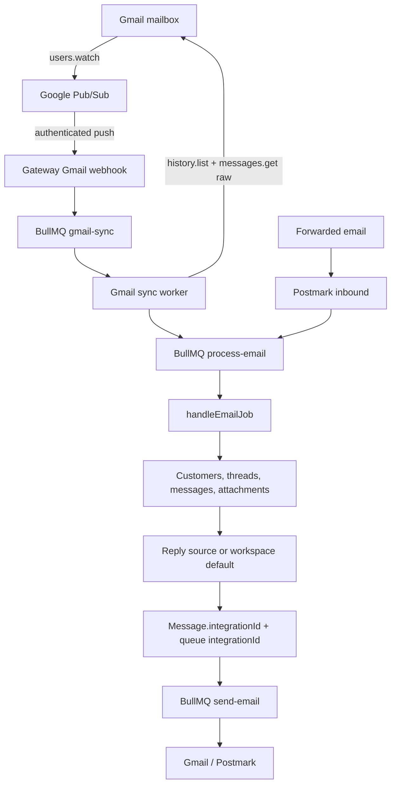

# Email integration plan

Independent Gmail and forwarded-email integrations with deterministic reply routing.

**Status:** shared email infrastructure, async outbound, and implementation for Phases 1–7 of native Gmail inbound are complete. Controlled production rollout remains. Google Cloud resources still need to be provisioned per environment with `npm run configure:gmail-pubsub`.

**Last reviewed:** 2026-07-13

## Independent integration model

Each workspace may connect one Gmail integration and one forwarded Email/Postmark integration at
the same time. They are peers, not replacements or fallbacks for one another. `Integration.emailProvider`
is the authoritative provider identity; `metadata.provider` remains only for compatibility during
rollout. Connecting or disconnecting forwarding never stops a Gmail watch, and reconnecting Gmail
never removes forwarding.

Both inbound paths merge into the same open email thread for an organization/customer. Every
inbound and outbound message records `integrationId`. A thread records the source of its newest
distinct inbound email in `replyIntegrationId`; receipt timestamps prevent delayed queue jobs from
regressing that source. Replies and auto-acknowledgements use that source when it still exists.
New proactive email uses `Organization.defaultEmailIntegrationId`. If a workspace has two
providers and no valid default, sending fails with a configuration error instead of selecting an
arbitrary row. The selected integration is copied to the outbound message and queue job before
sending.

Postmark tenancy is derived only from its SMTP envelope recipient (`OriginalRecipient`). The
generated recipient contains the organization UUID and is claimable only while that organization
has a Postmark integration row. The visible `To` header is never used for tenancy.

## Goal

After this work:

1. Connecting Gmail enables inbox sync and replies without Postmark forwarding.
2. Google Workspace aliases such as `support@merchant.com` work for inbound filtering and outbound sending.
3. Postmark forwarding can be connected independently for custom-domain or alternate intake.
4. Gmail and Postmark both feed the existing email ticket pipeline.
5. OAuth, watch, sync, and send failures are visible and recoverable.

Out of scope:

- Marketing or bulk email
- IMAP support for arbitrary providers
- Shared-inbox features beyond the current ticket model
- Automatically creating Gmail send-as aliases

## Current state

### Complete

- `@shopkeeper/email` contains shared senders, token refresh, MIME parsing, inbound normalization, address filtering, and reply-header construction.
- Gmail outbound uses `gmail.send`, refreshes expired access tokens, and sends raw MIME through the Gmail API.
- Postmark outbound uses the same sender interface as Gmail.
- The gateway has an async outbound queue with retries, send status, failed-send recovery, and an orphaned-pending sweeper.
- Email OAuth token health runs daily and marks revoked grants for reconnection.
- Gmail OAuth requests `gmail.readonly`, stores granted scopes, preserves provider metadata on reconnect, and identifies accounts that need reauthorization.
- Postmark inbound normalizes messages into the `process-email` queue.
- Customer messages persist `externalMessageId`; an organization-scoped partial unique index prevents duplicate provider messages.

### Remaining

- Native Gmail inbound must remain in controlled rollout until production soak is complete.
- `EMAIL_INBOUND_MODE=gmail-only` must not be used outside development until native inbound is complete.
- The async outbound feature is implemented behind `OUTBOUND_EMAIL_ASYNC`; its deployed rollout state must be checked separately.

## Target architecture



### Design decisions

1. Use `gmail.readonly`, not `gmail.modify`. Reading and syncing are required; changing mailbox state is not.
2. Keep the Pub/Sub webhook small: authenticate, validate, enqueue, and return. Gmail API work belongs in a retryable worker.
3. Verify Pub/Sub with an OIDC token. Do not use an unauthenticated endpoint or a query-string shared secret.
4. Serialize sync jobs per integration so concurrent notifications cannot race the history checkpoint.
5. Normalize Gmail messages into the existing `InboundJobData` shape. Do not create a second ticket-ingestion path.
6. Store Gmail watch state in `Integration.metadata`; store provider identity in the dedicated `emailProvider` column.
7. Start from the history ID returned by `users.watch`; do not import existing mail by default.
8. Keep Postmark and Gmail active together. Database idempotency suppresses a MIME message delivered through both paths.

## Integration metadata

Preserve the top-level `provider` field for backward-compatible reads, but do not use it as the
authoritative provider identity for new writes or queries.

```typescript
type EmailIntegrationMetadata = {
  provider: 'gmail' | 'postmark';
  oauthScopes?: string[];
  inboundMode?: 'postmark' | 'native' | 'hybrid';

  gmail?: {
    inboundStatus: 'pending' | 'active' | 'degraded' | 'reauthorization_required';
    historyId?: string;
    watchExpiration?: string;
    lastSyncedAt?: string;
    lastError?: string;
  };
};
```

Metadata updates must preserve unknown fields. Do not replace the object with `{ provider }` after the initial connection.

Gmail's watch response contains `historyId` and `expiration`; it does not contain a watch `resourceId`.

## Implementation plan

### Phase 1 — OAuth scopes and integration state — complete (2026-07-02)

**Purpose:** ensure new connections receive the required grant and existing send-only connections are identified.

Work:

1. Add `https://www.googleapis.com/auth/gmail.readonly` to `GMAIL_EMAIL_OAUTH.scopes`.
2. Extend the token response type to accept `scope`.
3. Store the token response's granted scopes as normalized `oauthScopes` metadata. If Google omits `scope`, record the requested read scope only after `users.watch` succeeds.
4. Preserve existing metadata during integration upserts.
5. Extend `isEmailAuthReauthorizationRequired`:
   - Keep the existing epoch-token sentinel behavior.
   - Require reconnection when a Gmail integration lacks `gmail.readonly`.
6. Update the integrations UI to distinguish:
   - Reconnect required
   - Sending connected, inbound pending
   - Native inbound active
   - Native inbound degraded
7. Reconnect Gmail accounts after deployment. Tokens issued for the deleted OAuth client cannot be reused.

Files:

- `apps/dashboard/src/app/api/integrations/_lib/email-oauth-providers.ts`
- `apps/dashboard/src/app/api/integrations/_lib/email-oauth.ts`
- `apps/dashboard/src/app/api/integrations/_lib/email-integration.ts`
- `packages/email/src/providers.ts`
- Gmail OAuth route and callback tests
- Integration-card helpers and status components

Acceptance:

- A new connection stores both `gmail.send` and `gmail.readonly`.
- A legacy Gmail integration without the read scope displays a reconnect action.
- Reconnecting does not discard unrelated integration metadata.

### Phase 2 — shared Gmail API client — complete (2026-07-02)

**Purpose:** centralize Gmail API behavior used by connection setup, sync, and maintenance.

Add `packages/email/src/gmail/` with:

- Authenticated Gmail requests
- One refresh-and-retry after `401`
- `users.watch`
- `users.stop`
- Paginated `users.history.list`
- `users.messages.get?format=raw`
- Bounded `users.messages.list` for recovery
- Gmail base64url decoding
- Typed response validation
- Error classification for retryable, authentication, quota, and stale-history failures

Reuse `packages/email/src/token.ts`; do not add another refresh implementation.

Acceptance:

- Unit tests cover token refresh, pagination, malformed responses, base64url decoding, `404` stale history, `429`, and `5xx`.
- The dashboard and gateway use the same Gmail client.

### Phase 3 — Pub/Sub and watch registration — complete (2026-07-03)

**Purpose:** subscribe the connected mailbox to Gmail change notifications.

Infrastructure:

1. Create a Pub/Sub topic such as `projects/<project>/topics/gmail-inbound`.
2. Grant `gmail-api-push@system.gserviceaccount.com` permission to publish to the topic.
3. Create a push subscription targeting:

   `POST <gateway-url>/webhooks/gmail/push`

4. Configure the subscription to attach an OIDC token from a dedicated push service account.
5. Configure the expected audience and service-account email in the gateway.

Application work:

1. After Gmail OAuth is persisted, call `users.watch` with:
   - `topicName: GMAIL_PUBSUB_TOPIC`
   - `labelIds: ['INBOX']`
   - `labelFilterBehavior: 'include'`
2. Store the returned `historyId` and `expiration`.
3. Set `gmail.inboundStatus` to `active`.
4. If watch setup fails:
   - Keep the outbound connection.
   - Mark inbound as `degraded`.
   - Store a safe error category, not provider response bodies or tokens.
   - Allow maintenance to retry.
5. Do not backfill the mailbox during the initial connection.
6. On disconnect, call `users.stop` on a best-effort basis only when no other native integration uses that mailbox. An expired orphaned watch is harmless because unknown-mailbox pushes are acknowledged.

Required environment:

| Service | Variable | Purpose |
|---------|----------|---------|
| Dashboard and gateway | `GMAIL_PUBSUB_TOPIC` | Fully qualified Gmail watch topic |
| Gateway | `GMAIL_PUBSUB_AUDIENCE` | Expected push-token audience |
| Gateway | `GMAIL_PUBSUB_PUSH_SERVICE_ACCOUNT` | Expected OIDC service-account email |
| Dashboard and gateway | `GOOGLE_CLIENT_ID` | OAuth client |
| Dashboard and gateway | `GOOGLE_CLIENT_SECRET` | OAuth token refresh |

Acceptance:

- Connecting a Gmail test user creates an active watch and stores a baseline history ID.
- A watch failure leaves outbound sending usable and exposes a degraded inbound state.

### Phase 4 — authenticated Pub/Sub webhook — complete (2026-07-03)

**Purpose:** safely convert Gmail notifications into retryable sync work.

Add:

- `apps/gateway/src/routes/webhooks-gmail.ts`
- `QUEUE.GMAIL_SYNC`
- `JOB.GMAIL_SYNC`
- `GmailSyncJobData`

Webhook behavior:

1. Reject missing or invalid bearer tokens.
2. Verify token signature, issuer, audience, and service-account email.
3. Validate the Pub/Sub envelope and base64-decode its data.
4. Validate `{ emailAddress, historyId }`.
5. Find every Gmail integration matching the mailbox. Do not use `findFirst`; the same mailbox may serve multiple organizations or aliases.
6. Enqueue one sync job per matching integration.
7. Use `integrationId` plus notification `historyId` as the job identity to collapse exact duplicate pushes.
8. Return success after durable enqueueing. Return a retryable error if enqueueing fails.

Minimal payload:

```typescript
type GmailSyncJobData = {
  integrationId: string;
  notifiedHistoryId: string;
  traceId: string;
};
```

Acceptance:

- Invalid tokens and malformed envelopes are rejected.
- Unknown mailboxes are acknowledged without work.
- Duplicate notifications do not create duplicate sync jobs.
- The route does not call Gmail APIs or parse MIME.

### Phase 5 — Gmail sync worker — complete (2026-07-03)

**Purpose:** turn mailbox history changes into the existing inbound email jobs.

Processing:

1. Acquire a per-integration Redis lock with a token, expiry, and safe token-checked release.
2. Load the integration and verify:
   - Provider is Gmail
   - Native inbound is enabled
   - Refresh token exists
   - Stored history ID exists
3. Call `users.history.list` from the stored checkpoint with `historyTypes=messageAdded`.
4. Follow every page and deduplicate Gmail message IDs within the sync.
5. Fetch each message with `format=raw`.
6. Skip messages that:
   - Do not have the `INBOX` label
   - Have the `SENT` label
   - Originate from the connected merchant address
   - Are not addressed to `fromEmail`, including alias headers handled by `address-filter`
7. Parse and normalize with the existing:
   - `parseMime`
   - `isForSupportAddress`
   - `normalizeInboundEmail`
8. Enqueue the existing `process-email` job, including attachments and the MIME `Message-ID`.
9. When a MIME `Message-ID` is absent, use a stable Gmail provider key for deduplication and ensure reply-header construction does not emit that provider key as an RFC `In-Reply-To` value.
10. Advance the checkpoint to Gmail's returned history ID only after every resulting inbound job has been durably enqueued.
11. Release the integration lock.

The existing email worker remains responsible for ticket persistence, attachment upload, classification, and downstream automation.

Failure behavior:

- `401` after refresh: mark reauthorization required.
- `404` from `history.list`: run bounded recovery.
- `429` or `5xx`: retry with exponential backoff.
- Parse failure for one message: record the Gmail message ID and continue only if the failure is explicitly classified as non-retryable; otherwise retry the sync.
- Never advance the checkpoint past work that was not durably enqueued.

Acceptance:

- A Gmail message creates exactly one ticket.
- Attachments and HTML-only messages use the existing inbound behavior.
- Concurrent and out-of-order notifications cannot move the checkpoint backward.
- Postmark and Gmail delivering the same MIME message create one customer message.

### Phase 6 — watch renewal and recovery — complete (2026-07-03)

**Purpose:** keep inbound active without manual intervention.

Add `apps/gateway/src/maintenance/gmail-watch.ts`, following the existing maintenance registration pattern.

Run every 12 hours:

1. Find Gmail integrations that:
   - Have no watch
   - Are degraded
   - Expire within 24 hours
2. Refresh the access token if needed.
3. Call `users.watch` and update `historyId`, `watchExpiration`, and status.
4. On renewal, update the expiration but never replace an existing checkpoint with the watch response's history ID. Only the sync worker advances an established checkpoint.
5. Record repeated failures and expose them in the dashboard.
6. Mark revoked grants for reconnection.

Stale-history recovery:

1. On `history.list` returning `404`, list a bounded window such as `newer_than:7d in:inbox`.
2. Fetch and normalize those messages through the same pipeline.
3. Rely on `externalMessageId` idempotency for overlap.
4. Establish a fresh watch and checkpoint after recovery jobs are durably enqueued.

Add stale-sync monitoring:

- Warn when an active Gmail integration has no successful sync for two hours.
- Alert when a watch is expired or renewal repeatedly fails.

Acceptance:

- Expiring watches renew automatically.
- Recovery does not duplicate existing tickets.
- Renewal and token failures produce actionable integration status.

### Phase 7 — Gmail UX and controlled rollout — implementation complete (2026-07-03)

**Purpose:** make the native-inbound state accurate and usable.

UX:

- Ask which address customers use after OAuth.
- Default to the Google account address.
- Allow a Google Workspace user or alias in `fromEmail`.
- Explain that the alias must already exist in Gmail and must be configured as a valid send-as address.
- Display:
  - Native inbound active
  - Forwarded Email connected (on its independent integration card)
  - Setup pending
  - Reconnect required
  - Sync degraded
  - Last successful sync

Feature flags:

- Add `GMAIL_NATIVE_INBOUND` to the dashboard and gateway.
- The flag defaults off and must have the same value in both services.
- Keep `EMAIL_INBOUND_MODE=hybrid` throughout development and initial production rollout.
- Do not select `gmail-only` until native inbound has passed production soak and no forwarding integrations remain.

Rollout:

1. Local and automated testing with mocked Gmail and Pub/Sub.
2. One real Gmail test user through a public development tunnel.
3. Internal organizations with dual Gmail and Postmark ingestion.
4. Google OAuth test users while verification is pending.
5. Newly connected external merchants after restricted-scope verification.
6. Existing Gmail merchants after explicit reconnection.
7. Consider `gmail-only` only after metrics show Postmark is no longer required.

The app can be built and tested with OAuth test users before Google verification. Public external access to `gmail.readonly` remains gated by Google's restricted-scope review and any required security assessment.

## Test plan

### Unit

- OAuth requests and persists `gmail.send` and `gmail.readonly`.
- Missing read scope requires reconnection.
- Metadata merge preserves existing Gmail state.
- Gmail client refresh and retry behavior.
- History pagination and response validation.
- Base64url decoding.
- Pub/Sub envelope decoding and OIDC claim validation.
- Watch-expiry selection.
- Support-address and alias matching.
- Stable duplicate handling when MIME `Message-ID` is absent.

### Gateway integration

- Valid Pub/Sub push creates a Gmail sync job.
- Invalid authentication is rejected.
- Unknown mailbox is acknowledged without a job.
- Gmail history produces `process-email` jobs.
- Duplicate, concurrent, and out-of-order notifications remain idempotent.
- Checkpoint advances only after enqueue success.
- Token refresh, rate-limit retry, and stale-history recovery.
- Postmark/Gmail dual delivery creates one message.
- Watch renewal updates metadata without losing the sync checkpoint.

### Dashboard

- OAuth authorization URL contains the expected scopes.
- Callback stores granted scopes and watch state.
- Watch failure preserves outbound connectivity.
- Integration status and reconnect actions match metadata.
- Workspace support address is saved as `fromEmail`.

### Manual development checklist

- [ ] Connect a configured Gmail test user.
- [ ] Confirm granted scopes, watch expiration, and baseline history ID.
- [ ] Receive plain-text, HTML-only, reply, and attachment messages.
- [ ] Confirm one ticket per message with Postmark forwarding still enabled.
- [ ] Reply and verify Gmail threading.
- [ ] Test a Workspace alias in `To`, `Delivered-To`, and `X-Original-To`.
- [ ] Revoke the refresh token and confirm reconnect status.
- [ ] Force watch renewal.
- [ ] Force a stale history ID and confirm bounded recovery.
- [ ] Confirm no tokens, MIME bodies, or customer data appear in logs.

## Delivery sequence

Use four reviewable changes:

1. **OAuth and state**
   - Scope expansion
   - Granted-scope metadata
   - Reauthorization logic
   - Integration statuses
2. **Gmail client and watch**
   - Shared API client
   - Pub/Sub configuration
   - Watch setup
3. **Webhook and synchronization**
   - OIDC verification
   - Sync queue and lock
   - History processing
   - MIME normalization and deduplication
4. **Operations and rollout**
   - Renewal and recovery
   - Monitoring
   - Development and production runbooks
   - Feature-flag rollout

Each change must leave Postmark inbound and Gmail outbound operational.

## Remaining email roadmap

These items are separate from Gmail native inbound and should not delay it.

### Async outbound rollout

- Verify the deployed value of `OUTBOUND_EMAIL_ASYNC`.
- Enable for internal organizations first.
- Confirm pending, retry, and orphan-sweeper behavior.
- Populate `providerMessageId` when provider APIs expose it.

### Outbound parity

- Outbound attachments
- Provider message IDs
- Gmail-native threading regression tests
- Optional HTML replies with a plain-text fallback
- Bounce handling after provider message IDs are available

## Risks and controls

| Risk | Control |
|------|---------|
| Restricted-scope verification delays external rollout | Build and test with Google OAuth test users; keep Postmark forwarding |
| Watch expiration creates an inbound gap | Renew every 12 hours; alert before expiration |
| Pub/Sub delivers more than once | Job identity, serialized sync, and database idempotency |
| Notifications arrive out of order | Always sync from the stored checkpoint; never replace it with the notification ID |
| History checkpoint expires | Bounded recovery followed by a fresh watch |
| OAuth token is revoked | Shared refresh behavior, daily token health, and reconnect status |
| Gmail and Postmark both ingest the message | Organization-scoped `externalMessageId` uniqueness; the first persisted copy retains attribution |
| Delayed inbound work changes a reply route backwards | Compare captured receipt time before updating `replyIntegrationId` |
| Both providers exist with no default | Return a configuration error; never use an unordered `findFirst` |
| Alias receives unrelated mailbox mail | Filter `To`, `Delivered-To`, and `X-Original-To` against `fromEmail` |
| Restricted data leaks into logs | Log identifiers and error categories only; redact tokens and message content |
| Gmail API quotas or outages | Retry `429` and `5xx` with backoff; monitor stale sync |

## Success criteria

- [ ] A Gmail OAuth test user receives tickets without forwarding.
- [x] Gmail OAuth stores both send and read grants.
- [ ] Workspace aliases work for inbound filtering and outbound sending.
- [x] Pub/Sub requests are authenticated.
- [ ] Duplicate and out-of-order notifications do not duplicate tickets or regress checkpoints.
- [ ] Attachments and HTML-only mail work through the existing pipeline.
- [x] Watch renewal and stale-history recovery run automatically.
- [ ] Token, watch, and sync failures are visible in the integrations UI.
- [ ] Postmark forwarding remains unchanged.
- [ ] Restricted-scope verification and production setup are documented in the runbook.
- [ ] Gateway, dashboard, and email-package tests, type checks, and lint pass.

## References

- [Gmail push notifications](https://developers.google.com/workspace/gmail/api/guides/push)
- [Gmail history synchronization](https://developers.google.com/workspace/gmail/api/guides/sync)
- [Gmail API scopes](https://developers.google.com/workspace/gmail/api/auth/scopes)
- `docs/production/runbook.md`
- `docs/phase-6-external-services.md`
