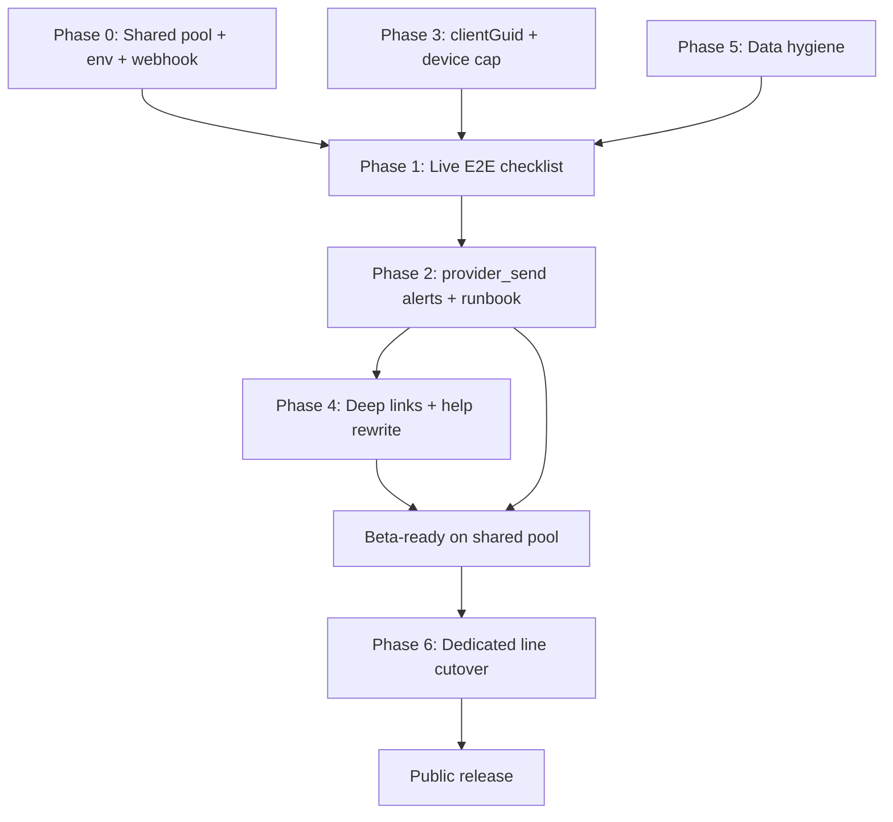

# iMessage Production Readiness Plan

Operator-channel iMessage (merchant ↔ agent, Telegram's twin). Customers never text
this line.

Last reviewed: 2026-07-07 (Phase 0 + Phase 1 partial sign-off).

Archived implementation history:
[`archive/imessage-operator-rewire-plan.md`](archive/imessage-operator-rewire-plan.md)
(rewire marked complete 2026-06-24).

## Current state

The operator rewire is **code-complete**. What remains is infra verification,
observability parity, merchant-facing polish, and documentation — not a new
transport layer.

| Layer | Status |
|-------|--------|
| Inbound | `POST /webhooks/photon` → synchronous operator dispatch, Redis dedupe, HMAC verify |
| Binding | Dashboard mints token → merchant texts code → `OrgMemberImessageBinding` |
| Connect UX | QR + `sms:` deep link, polling, multi-iPhone unlink |
| Operator commands | HELP, SUMMARY, digest (OPEN/SPAM/REPLY), plan yes/no/skip, order lookup, free-form |
| Proactive push | Plans, questions, digests, escalations via `notifyOperator` to bound spaces |
| Onboarding | `step-connect.tsx` offers iMessage alongside Telegram |
| Tests | Handler, binding, notify, bind API, Photon webhook unit tests |

Architecture: **one platform-wide Spectrum line** (`SPECTRUM_*` on gateway,
`IMESSAGE_LINE_HANDLE` on dashboard). No per-org credentials.

## Line tier strategy (shared now, dedicated later)

**Decision:** Ship pre-release and early beta on Photon's **shared pool** (Free/Pro).
Purchase a **Business dedicated line** only when the app is closer to public release.

This does not block any engineering work below. The code path is identical for both
tiers — only Photon project/line configuration and two env vars change at cutover.

### What works on shared pool today

- Full operator bind flow, commands, plan approval, digests, escalations
- Internal dogfood and closed beta with known limitations documented to merchants
- Live E2E verification checklist (Phase 1)

### Shared-pool limitations (acceptable until GA)

- Sender number may vary per recipient (Photon shared pool behavior)
- Stricter deliverability discipline — operator-only traffic is low risk, but avoid
  burst testing against the line
- `IMESSAGE_LINE_HANDLE` must match whatever handle Photon assigns for the pool line
  (update env when Photon rotates or re-provisions)

### Cutover to dedicated line (when purchased)

No code deploy required beyond env updates if the Spectrum **project** stays the same:

1. Upgrade line to Business / provision dedicated number in Photon dashboard.
2. Update **`IMESSAGE_LINE_HANDLE`** on Vercel (dashboard) to the new stable handle.
3. If Photon issues new project credentials, rotate **`SPECTRUM_PROJECT_ID`**,
   **`SPECTRUM_PROJECT_SECRET`**, and **`SPECTRUM_WEBHOOK_SECRET`** on Railway
   (gateway). Webhook URL stays `https://<gateway>/webhooks/photon`.
4. Re-run the Phase 1 bind smoke on one test iPhone (QR + token).
5. Notify beta merchants: "Text the new number" or rely on existing bindings —
   inbound refreshes `spaceId` on each message; proactive sends use stored
   `spaceId` until the merchant texts once.

If the dedicated line lives in a **new Spectrum project**, repeat webhook registration
and credential rotation; bindings table is unchanged.

**Do not** block Phases 1–5 below on the dedicated-line purchase.

---

## Phase 0 — Infra on shared pool (blocking)

**Status:** ✅ Complete (verified 2026-07-07).

**Goal:** A working shared-pool line in staging/production with correct wiring.

1. ✅ Confirm or create Spectrum project with a provisioned iMessage line (shared pool
   is fine).
2. ✅ Register webhook: `https://clerk-production-e37f.up.railway.app/webhooks/photon`.
3. ✅ Set env vars:

   | Service | Vars |
   |---------|------|
   | **Gateway (Railway)** | `SPECTRUM_PROJECT_ID`, `SPECTRUM_PROJECT_SECRET`, `SPECTRUM_WEBHOOK_SECRET` |
   | **Dashboard (Vercel)** | `IMESSAGE_LINE_HANDLE` — must match the handle merchants text |

4. ✅ Deploy migration `20260624000000_add_org_member_imessage_bindings` (and subsequent
   iMessage migrations) — applied on production Neon.
5. ✅ Confirm gateway **server** role serves public ingress (`GATEWAY_RUNTIME_ROLE`
   defaults to `all` on Railway) — Spectrum gRPC long-lived process verified.

**Exit:** ✅ Gateway logs `[Webhook] Photon delivery processed` status 200 on test
inbound; dashboard Integrations shows Connect enabled (not disabled).

---

## Phase 1 — Live verification checklist (blocking)

**Status:** In progress — **6/12** live-verified (2026-07-07). Bind through skip-step
confirmed. Rows 7–12 still need hands-on pass.

**Goal:** Prove every merchant-critical path on a real iPhone before beta.

**Preflight (automated):** Run before the hands-on pass:

```bash
npm run verify:imessage:phase1-preflight
```

**Environment (production):**

| Field | Value |
|-------|-------|
| Gateway | `https://clerk-production-e37f.up.railway.app` |
| Dashboard | `https://dashboard-shopkeeper.vercel.app` |
| Line handle | `+16282647754` |

Use a dedicated test org/workspace. Record sign-off at the bottom when all rows pass.

### Checklist

| # | Flow | Live | Pass criteria | Automated coverage |
|---|------|------|---------------|-------------------|
| 1 | Bind | ✅ | QR scan → prefilled message sends → welcome text → binding in Integrations | `message-handler.test`, `bind/route.test` |
| 2 | Re-bind | ✅ | Unlink + new token works; stale token rejected | `message-handler.test` (stale token) |
| 3 | Inbound ticket → plan push | ✅ | Customer email/IG → plan cached → iMessage receives plan | `planning-notifications.test` |
| 4 | Approve | ✅ | Reply `yes` → plan executes → confirmation summary | Manual (shared w/ Telegram) |
| 5 | Dismiss | ✅ | Reply `no` → plan cleared, no execution | Manual |
| 6 | Skip step | ✅ | `skip 1` on multi-step plan works | Manual |
| 7 | Ask operator | ☐ | Agent asks question → merchant free-text answer → re-plan fires | Manual |
| 8 | Escalation | ☐ | Notification arrives with dashboard link | `operator-escalation.test` |
| 9 | Digest | ☐ | `SUMMARY` + scheduled morning digest deliver | Manual (`SUMMARY`); scheduled via `digest.ts` |
| 10 | Free-form | ☐ | e.g. `refund #1234` runs operator agent turn | Manual |
| 11 | Dedupe | ☐ | Webhook redelivery does not double-execute | `webhooks-meta-photon.test` (dedupe) |
| 12 | Unbound sender | ☐ | Unknown number gets connect instructions, no agent run | `message-handler.test` |

**Also confirmed (not separate rows):** bound `HELP` returns operator help text;
welcome message delivers after connect (post `sendImessageOnSpace` gRPC reconnect
deploy, `ddc3453`).

### Step-by-step (hands-on)

**1 — Bind**

1. Dashboard → Integrations → iMessage → **Link your iPhone**.
2. Scan QR with iPhone camera; send the prefilled message.
3. Expect welcome text on iPhone within ~30s.
4. Integrations shows your handle linked; gateway log: `[Webhook] iMessage operator handled`.

**2 — Re-bind**

1. Integrations → **Unlink** the handle.
2. Mint a new connect code; text it — binding reappears.
3. Text an old/expired code (or a random string) — expect connect instructions, no binding.

**3 — Plan push**

1. Send a customer message into the test org (email or IG) so a ticket opens and a plan caches.
2. Within ~1 min, bound iPhone receives a plan notification with step summary.
3. Dashboard ticket shows the same cached plan.

**4 — Approve**

1. Reply `yes` to the plan push.
2. Expect execution summary on iPhone; ticket reflects executed actions.

**5 — Dismiss**

1. Trigger another plan push; reply `no`.
2. Expect “Plan dismissed.”; plan cleared in dashboard; no outbound customer action.

**6 — Skip step**

1. Open a ticket whose cached plan has **2+ actionable steps** (not read-only).
2. On plan push, reply `skip 1`.
3. Expect execution of remaining steps only.

**7 — Ask operator**

1. Use a ticket/scenario where the agent needs merchant input (policy gap or explicit question).
2. Expect question on iPhone; reply with free text.
3. Expect re-plan or updated plan in dashboard.

**8 — Escalation**

1. Trigger an escalation (agent `escalate` tool or high-risk scenario).
2. iPhone receives message with `Open: https://dashboard-shopkeeper.vercel.app/dashboard/tickets/<id>`.

**9 — Digest**

1. Text `SUMMARY` — receive open-ticket digest immediately.
2. For scheduled digest: confirm `digestEnabled` on org (set at bind); wait for `digestHour` in org timezone, or temporarily set `digestHour` to current local hour in Settings and wait one cron cycle (~15 min).

**10 — Free-form**

1. Text e.g. `status #1001` or `help with order 1001` (valid order in test store).
2. Expect operator agent turn with order/status reply.

**11 — Dedupe**

1. During a bound free-form or `yes` approval, note gateway logs for one `messageId`.
2. Photon may redeliver at-least-once; second delivery should log `[Webhook] iMessage duplicate delivery skipped` with no double execution.

**12 — Unbound sender**

1. From a phone number **not** linked to any org, text the line.
2. Expect connect instructions referencing Integrations → iMessage; no agent run, no ticket created.

### Sign-off

| Field | Value |
|-------|-------|
| Date | 2026-07-07 |
| Tester | internal dogfood |
| Org id | _(test workspace — fill if recording)_ |
| Handle used | `+19096622741` (merchant iPhone); line `+16282647754` |
| Environment | production |
| Failures ticketed | ☐ N/A (initial `ECONNRESET` on welcome fixed in `ddc3453`) |

**Exit:** Checklist complete; failures ticketed before beta.

---

## Phase 2 — Observability parity (ship with beta)

**Status:** Not started (runbook env matrix partially done — see below).

**Goal:** Silent iMessage failures are as visible as Telegram failures.

**Gap:** Telegram `sendMessage` calls `recordProviderSendFailureInBackground`;
`sendImessageToSpace` does not yet.

1. Wire `provider_send` ops alerts on iMessage send failures (mirror Telegram:
   org id, thread id, space id, error detail).
2. Structured logs for bind success/failure and plan-notify sent vs failed per channel.
3. ✅ Runbook section in [`production/runbook.md`](production/runbook.md) (Phase 0,
   2026-07-07):
   - Env matrix row for Spectrum vars
   - iMessage Phase 0/1 setup + webhook routing
   - iMessage down triage: `isImessageConfigured()`, webhook 503, cred rotation,
     stale `spaceId` _(triage bullets still to expand in Phase 2)_
   - No delivery receipts — ack means `space.send()` resolved, not read on iPhone

**Exit:** Controlled failure emits `opsAlert: true`, `category: provider_send`.

---

## Phase 3 — Reliability hardening

**Status:** Partial — gRPC send reconnect shipped (`ddc3453`); remainder open.

**Goal:** Retries and edge cases do not duplicate work or strand notifications.

1. **Stable `clientGuid` on proactive sends** — deterministic guid per notification
   (e.g. hash of `orgId + threadId + kind + planHash`) so BullMQ retries do not
   double-text.
2. **Stale `spaceId`** — Inbound refreshes `spaceId` each message; proactive sends
   fail until merchant texts once after a space change. Document in runbook; optional
   future: friendly reconnect hint on send failure.
3. **Device cap** — Telegram limits 3 devices per member; iMessage has no cap.
   Decide: mirror `MAX_TELEGRAM_DEVICES` or document unlimited iPhones.
4. ✅ **gRPC reconnect on send** — `sendImessageOnSpace` reconnects cached Spectrum
   app and retries once on `ECONNRESET` / `ConnectionError` (welcome + webhook
   replies). Deploy verified 2026-07-07.
5. **Graceful shutdown** — `stopAllSpectrumApps` on gateway shutdown; verify clean
   reconnect on Railway deploy.

**Exit:** Retry of failed plan-notification job does not duplicate iMessage in test.

---

## Phase 4 — Merchant UX polish

**Status:** Partial — redundant Integrations “linked” toast removed (`ddc3453`).

**Goal:** Close gaps in [`channel-roles.md`](channel-roles.md) (labels, deep links,
edit/revise UX).

1. **Dashboard deep links in plan notifications** — Escalations already include
   `Open: <DASHBOARD_URL>/dashboard/tickets/<id>`. Add same link to plan pushes so
   review/edit is one tap; keep `yes` / `no` / `skip N` for fast approve.
2. **Shorter plan copy** — SMS-friendly step lines; footer:
   `yes · no · skip 1 · Open link above`.
3. **Handle labels** — `displayName` is null on inbound; consider member name or
   friendly label at bind time.
4. **Help rewrite (high priority)** — [`integrations.ts` help
   content](../apps/dashboard/src/app/dashboard/_components/help/content/integrations.ts)
   `connect-imessage` still describes per-org Photon credential paste. Correct model:
   - Shopkeeper provides the line; merchant links iPhone with connect code
   - No merchant-facing Spectrum secrets
   - Troubleshooting: expired token, unlink/relink
5. **README** — List iMessage under operator channels with env vars and bind flow.

**Exit:** New merchant connects via Integrations + iPhone only, no support contact.

---

## Phase 5 — Data hygiene & security (pre-GA)

1. **Legacy customer `imessage` threads** — Pre-rewire test data may exist. Decide
   purge vs leave; document in runbook if purged.
2. **Binding security** — Global `senderId` uniqueness (rebind moves org); 24h token
   TTL; billing-write gate on bind mint (already on POST).
3. **Log audit** — Connect tokens and bodies not at info level in production logs.

**Exit:** Support playbook for wrong-org bind and lost access.

---

## Phase 6 — Dedicated line cutover (deferred until pre-release)

**Trigger:** App is close to public release / first paying merchants need a stable
number.

**Prerequisite:** Phases 0–4 complete on shared pool.

1. Purchase Business dedicated line in Photon.
2. Follow [Line tier strategy — Cutover to dedicated line](#cutover-to-dedicated-line-when-purchased) above.
3. Update marketing/onboarding copy if the public number changes.
4. Re-run Phase 1 rows 1 and 3–5 on the new handle.
5. Optional: add Integrations UI note when `IMESSAGE_LINE_HANDLE` changes (one-time
   merchant comms).

**Exit:** Stable handle in prod env; beta merchants re-bound or informed.

---

## Phase 7 — Onboarding & analytics (nice-to-have)

1. Verify `integration_connection_started` / `completed` for iMessage in staging
   PostHog.
2. Confirm `step-connect` shows iMessage when `IMESSAGE_LINE_HANDLE` is set in prod.
3. Integrations page groups iMessage with Telegram under operator channels.

---

## Execution order



**Minimum bar for beta on shared pool:** Phases **0 + 1 + 2 + 4 (help rewrite)**.

**Deferred until pre-release:** Phase **6** (dedicated line purchase).

**Can slip post-first-merchant:** Phase 3 `clientGuid`, device cap decision, legacy
thread purge.

---

## Effort estimate

| Phase | Effort | Skip risk |
|-------|--------|-----------|
| 0 — Infra (shared pool) | 0.5 day | Channel does not work |
| 1 — E2E checklist | 0.5 day hands-on | Breakage on approve/digest |
| 2 — Observability | 0.5 day code | Silent plan-push failures |
| 3 — Reliability | 0.5–1 day | Duplicate texts on retry |
| 4 — UX + docs | 1 day | Merchants confused by stale help |
| 5 — Data hygiene | 0.25 day | Support confusion |
| 6 — Dedicated line | 0.5 day vendor + env | Unstable number at GA only |

---

## Known gaps (code review 2026-07-07)

1. Help article describes per-merchant Photon credentials — wrong; platform line +
   bind code is the model.
2. Plan pushes lack dashboard deep links; escalations already have them.
3. iMessage sends lack `provider_send` ops alerts; Telegram has them.
4. ~~No `docs/production/` Spectrum/iMessage section yet (Phase 2).~~ **Resolved:**
   runbook env matrix + Phase 0/1 setup added 2026-07-07.

**Operator-channel bugs (not iMessage-specific):** Dogfood on 2026-07-07 surfaced
Telegram/shared-path issues (plan retry duplicates, skip/email copy mismatch,
pending-plan routing). Tracked in
[`operator-channel-bugs.md`](operator-channel-bugs.md).

## Source of truth

- Channel role: [`channel-roles.md`](channel-roles.md)
- Product framing: [`product-truth.md`](product-truth.md)
- Near-term task pointers: [`to-do-list.md`](to-do-list.md)
