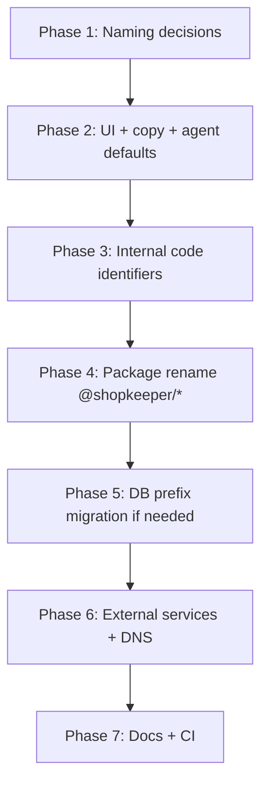

# Clerk → Shopkeeper Name Change Plan

This document describes how to rename the product from **Clerk** to **Shopkeeper** across the codebase and external services.

The main trap is that **"clerk" means three different things** in this repo. A blind find-and-replace on `clerk` will break authentication.

## The Three "Clerk" Namespaces

| Category | Examples | Rename to Shopkeeper? |
|---|---|---|
| **Your product/brand** | Page title, marketing copy, default `agentName: "Clerk"`, `TELEGRAM_BOT_USERNAME="ClerkBot"`, `hello@useclerk.co` | **Yes** |
| **Clerk.com (auth vendor)** | `@clerk/nextjs`, `ClerkProvider`, `CLERK_SECRET_KEY`, `/api/webhooks/clerk`, `clerkOrgId`, CSP `*.clerk.com` | **No** — keep as-is |
| **Internal monorepo packages** | `@clerk/db`, `@clerk/agent`, `clerk-monorepo`, `clerk-dashboard` | **Yes** — strongly recommended (`@shopkeeper/*`) |

**Rule:** Only rename product branding and internal package names. Never rename Clerk.com integration identifiers.

---

## Phase 1 — Decide Scope and Naming Conventions

**Status:** Complete (2026-06-06)

### Locked naming conventions

| Item | Decision | Notes |
|---|---|---|
| **Product name** | Shopkeeper | User-facing brand. Capitalize in prose; lowercase only in URLs, package scopes, and repo names. |
| **Product tagline** | `Shopkeeper — AI support for Shopify brands` | Replaces `"clerk: Your Chief Customer Officer"` in `layout.tsx`. |
| **Agent default name** | `Shopkeeper` | `AGENT_SETTINGS_DEFAULTS.agentName` and composer defaults. Existing orgs keep their saved `agentName` until they change it. |
| **NPM root** | `shopkeeper-monorepo` | Root `package.json` name. |
| **NPM workspaces** | `@shopkeeper/db`, `@shopkeeper/agent`, `shopkeeper-dashboard`, `shopkeeper-gateway` | Replaces internal `@clerk/db` / `@clerk/agent` collision with Clerk.com SDK. |
| **Telegram bot display name** | Shopkeeper | BotFather display name. |
| **Telegram bot username** | `ShopkeeperBot` | Env: `TELEGRAM_BOT_USERNAME`. Register via BotFather in Phase 6; keep `ClerkBot` until then. |
| **Sentry release prefix** | `shopkeeper@` | Cosmetic; update in Phase 6/7. |

### Scope decisions

| Question | Decision | Rationale |
|---|---|---|
| Rename local repo folder (`~/dev/clerk` → `~/dev/shopkeeper`)? | **Yes, after Phase 4** | Do it once package names and turbo filters match. Avoids broken paths mid-migration. |
| Rename GitHub repo? | **Yes, after Phase 4** | Same timing as folder rename. Update Vercel/Railway deploy hooks in Phase 6. |
| Rename DB columns (`clerkOrgId`, `clerkUserId`)? | **No** | These are Clerk.com foreign keys, not product branding. Renaming adds migration risk with no user-visible benefit. |
| Rename local dev database (`/clerk` in `DATABASE_URL`)? | **Yes, in Phase 5** | Cosmetic; update `.env.example` and docker-compose when convenient. |
| Migrate stored message prefixes (`__clerk_agent__`, `__clerk_agent_note__`)? | **Dual-read, then migrate** | Phase 3: parsers accept both old and new prefixes. Phase 5: one-off migration script if production rows exist. New writes use `__shopkeeper_agent__` / `__shopkeeper_agent_note__`. |
| Rename internal code identifiers (`isClerkMode`, etc.)? | **Yes** | Phase 3. These are product code, not Clerk.com integration. |

### Domain and contact (current vs target)

| Item | Current | Target | When |
|---|---|---|---|
| **Primary domain** | `useclerk.co` | **Open — confirm owner** | Phase 6 |
| **App URL** | env-driven (`APP_URL`) | Same pattern; value changes with domain | Phase 6 |
| **Marketing mock URL** | `clerk.app/inbox` (LiveDemo) | `shopkeeper.app/inbox` or `app.<domain>/inbox` | Phase 2 |
| **Contact email** | `hello@useclerk.co` | `hello@<primary-domain>` | Phase 6 (or Phase 2 if staying on `useclerk.co`) |
| **Inbound email** | `INBOUND_EMAIL_DOMAIN` env | `inbound.<primary-domain>` | Phase 6 |

**Domain note:** Logos and footer copy already say Shopkeeper, but legal/contact surfaces still use `useclerk.co`. In-app rebrand (Phases 2–5) can ship before DNS moves. Pick the primary domain before Phase 6.

**Candidates to evaluate:** `shopkeeper.app`, `getshopkeeper.com`, or keep `useclerk.co` with Shopkeeper-only branding (no DNS migration).

### Clerk.com integration — do not rename

These stay as-is through all phases:

| Identifier | Why |
|---|---|
| `@clerk/nextjs`, `@clerk/testing` | Vendor npm packages |
| `ClerkProvider`, `useClerk()`, `auth()`, `clerkClient` | Vendor SDK API |
| `CLERK_*`, `E2E_CLERK_*` env vars | Vendor configuration |
| `/api/webhooks/clerk` route | Webhook URL registered in Clerk.com dashboard |
| `clerkOrgId`, `clerkUserId` DB columns | Clerk.com entity IDs |
| CSP `*.clerk.com`, `*.clerk.accounts.dev` | Vendor auth domains |

### Glossary

| Term | Meaning after rename |
|---|---|
| **Shopkeeper** | The product (support AI for Shopify merchants). |
| **Clerk.com** | Third-party auth provider. Unrelated to product name. |
| **`@shopkeeper/*`** | Internal monorepo packages (db, agent). |
| **`@clerk/nextjs`** | Clerk.com's Next.js SDK. Not ours. |

### Phase 1 checklist

- [x] Product name locked: Shopkeeper
- [x] Internal package naming locked: `@shopkeeper/*`
- [x] Agent default name locked: Shopkeeper
- [x] DB column rename scoped out
- [x] Message prefix migration strategy chosen
- [x] Repo/folder rename timing decided (after Phase 4)
- [x] Clerk.com integration boundary documented
- [ ] Primary domain confirmed (open — needed before Phase 6)

**Next:** Phase 6 — [external services runbook](./phase-6-external-services.md) (primary domain must be confirmed first).

---

## Phase 2 — User-Facing Branding (Low Risk, Do First)

**Status:** Complete (2026-06-06)

The visual rebrand is partially done (Shopkeeper logos exist). Finish the rest.

### App Metadata & Marketing

- [x] `apps/dashboard/src/app/layout.tsx` — title updated to `"Shopkeeper — AI support for Shopify brands"`
- [x] Marketing components under `apps/dashboard/src/app/(marketing)/` — Hero, FAQ, Workflow, Terms, Privacy, Footer, LiveDemo, etc.
- [x] Footer: `Shopkeeper · made for shopkeepers`
- [x] Auth pages (login/signup), help content, integrations copy, feedback page
- [x] `hello@useclerk.co` kept until primary domain confirmed (Phase 6)

### Agent Identity Defaults

- [x] `packages/agent/src/settings.ts` — `agentName: "Shopkeeper"`
- [x] Composer defaults in `Composer.tsx`, `composer-state.ts`, `agent-tab-helpers.ts`, `ConciergeSummary.tsx`
- [x] Related unit tests updated

### Env Examples

- [x] `TELEGRAM_BOT_USERNAME="ShopkeeperBot"` in `.env.example` (production still uses `ClerkBot` until Phase 6)

### Search Patterns for This Phase

```bash
rg -i '"Clerk"|"clerk"|ClerkBot|useclerk|clerk\.app' apps/dashboard/src
```

---

## Phase 3 — Internal Code Identifiers (Medium Risk)

**Status:** Complete (2026-06-06)

Rename product-specific **code names**, not auth vendor names:

| Current | Suggested |
|---|---|
| `getClerkCommandState` | `getAgentCommandState` |
| `isClerkMode` | `isAgentMode` |
| `clerkInstruction` | `agentInstruction` |
| `onClearClerk` | `onClearAgentMode` |

### Phase 3 checklist

- [x] `getClerkCommandState` → `getAgentCommandState`
- [x] `isClerkMode` → `isAgentMode`
- [x] `clerkInstruction` → `agentInstruction`
- [x] `onClearClerk` → `onClearAgentMode`
- [x] New write prefixes: `__shopkeeper_agent__` / `__shopkeeper_agent_note__`
- [x] Dual-read parsers accept legacy `__clerk_agent__` / `__clerk_agent_note__` prefixes
- [x] Unit tests for prefix helpers and composer/agent-mode renames

### Stored Data Prefixes — Be Careful

These are persisted in the DB:

- `packages/agent/src/thread-constants.ts` — `AGENT_NOTE_PREFIX = "__clerk_agent_note__"`
- `packages/agent/src/tools/turn-content.ts` — `AGENT_TURN_PREFIX = "__clerk_agent__"`

Options:

1. **Keep old prefixes** and add parsers for new ones (safest for production data)
2. **Migrate existing rows** in a one-off script, then switch constants
3. **Support both** prefixes in `action-log.ts` during a transition window

Recommended: (3) briefly, then (2) if you have production data.

---

## Phase 4 — Monorepo Package Rename (High Effort, High Value)

**Status:** Complete (2026-06-06)

Internal packages currently collide with Clerk.com's npm scope (`@clerk/db` vs `@clerk/nextjs`).

### Steps

1. Rename in `package.json` files:
   - `clerk-monorepo` → `shopkeeper-monorepo`
   - `@clerk/db` → `@shopkeeper/db`
   - `@clerk/agent` → `@shopkeeper/agent`
   - `clerk-dashboard` → `shopkeeper-dashboard`
   - `clerk-gateway` → `shopkeeper-gateway`

2. Update all imports (`@clerk/db` → `@shopkeeper/db`, etc.) — hundreds of files

3. Update build config:
   - `vercel.json` filter: `--filter=shopkeeper-dashboard`
   - `next.config.js` `transpilePackages: ['@shopkeeper/db']`
   - `turbo.json` workspace references

4. Run `npm install` to refresh `package-lock.json`

5. Rename local folder `~/dev/clerk` → `~/dev/shopkeeper` (optional — deferred)

### Phase 4 checklist

- [x] Root `package.json` → `shopkeeper-monorepo`
- [x] `@shopkeeper/db`, `@shopkeeper/agent` package names
- [x] `shopkeeper-dashboard`, `shopkeeper-gateway` app names
- [x] All source imports updated (`apps/`, `packages/`, `scripts/`)
- [x] `vercel.json` and `next.config.js` build config
- [x] `package-lock.json` refreshed via `npm install`
- [x] `@clerk/nextjs` and `@clerk/testing` left unchanged
- [x] Local folder rename `~/dev/clerk` → `~/dev/shopkeeper` (2026-06-06)
- [x] GitHub repo rename `clerk` → `shopkeeper` (2026-06-06); local `origin` updated

**Next:** Phase 6 — external services + DNS.

### Do Not Rename

- `@clerk/nextjs`
- `@clerk/testing`
- Any `CLERK_*` env vars

---

## Phase 5 — Database (Optional, Mostly Cosmetic)

**Status:** Complete (2026-06-06)

Fields like `clerkOrgId` and `clerkUserId` refer to **Clerk.com IDs**, not your product name. Renaming them to `authOrgId` / `authUserId` is clearer long-term but requires a Prisma migration and is not required for branding — **left unchanged**.

### Local dev database name

`.env.example` files now use `shopkeeper` instead of `clerk`:

```
postgresql://.../shopkeeper?...
```

Developers with an existing local `clerk` database should create/rename to `shopkeeper`, or update their local `.env` to match.

Test infrastructure (`clerk_test` in CI/docker-compose) was left unchanged — it is isolated from local dev and renaming would touch CI workflows without user-visible benefit.

### Stored message prefix migration

One-off script for production rows still using legacy prefixes:

```bash
DATABASE_URL=<url> node --import tsx \
  packages/db/scripts/migrate-agent-prefixes.ts [--dry-run] [--org <orgId>]
```

Rewrites `__clerk_agent__` → `__shopkeeper_agent__` and `__clerk_agent_note__` → `__shopkeeper_agent_note__`. Idempotent; run against production when ready (Phase 6 deploy window).

### Phase 5 checklist

- [x] Local dev `DATABASE_URL` in `.env.example` → `/shopkeeper`
- [x] Env validation test stubs updated
- [x] `clerkOrgId` / `clerkUserId` columns left as-is (Clerk.com FKs)
- [x] `migrate-agent-prefixes.ts` one-off script added
- [ ] Run prefix migration against production (when ready — Phase 6)

---

## Phase 6 — External Services (Outside the Repo)

**Status:** In progress (2026-06-06)

**Runbook:** [phase-6-external-services.md](./phase-6-external-services.md) — step-by-step checklists per service, env var tables, deploy order, and verification.

### Repo-side prep (done in this phase)

- [x] Phase 6 runbook created
- [x] `NEXT_PUBLIC_CONTACT_EMAIL` env — marketing/legal pages read contact address from env (defaults to `hello@useclerk.co`)
- [x] Gateway Telegram bot copy → Shopkeeper
- [x] Gateway health/log strings → Shopkeeper
- [x] Sentry release auto-prefix `shopkeeper@<sha>` in `scripts/sentry-upload-sourcemaps.mjs`
- [x] `verify-production.mjs` smoke test strings → Shopkeeper

### External services (manual — see runbook)

| Service | What to Update |
|---|---|
| **Clerk.com dashboard** | Application name/display name → "Shopkeeper"; keep API keys and webhook URL path (`/api/webhooks/clerk` is fine) |
| **Vercel** | Project name, custom domain, env var values that mention branding (not `CLERK_*`) |
| **Railway** | Gateway service name, `DASHBOARD_URL`, Sentry release tags |
| **Neon** | Project name (cosmetic) |
| **Sentry** | Org/project name, `SENTRY_PROJECT`, release naming |
| **Stripe** | Product names, checkout descriptions, customer-facing receipt text |
| **Postmark** | Sender name, inbound domain if you use `inbound.useclerk.co` |
| **Shopify app** | App name in Partner Dashboard, OAuth redirect URLs if domain changes |
| **Meta / Google / Microsoft OAuth** | App display names, privacy policy URLs |
| **Telegram** | Bot display name + `@username` via BotFather; update `TELEGRAM_BOT_USERNAME` and webhook |
| **DNS** | `useclerk.co` → new domain; update `APP_URL`, OAuth callbacks, webhook URLs |
| **GitHub** | Repo rename `clerk` → `shopkeeper`; update CI secrets and deploy hooks |

After domain changes, update OAuth redirect URIs and webhook endpoints in every provider console.

---

## Phase 7 — Docs, CI, and Ops

**Status:** In progress (2026-06-06)

Rename product branding in developer docs, production runbooks, and ops scripts. Leave Clerk.com integration identifiers (`CLERK_*`, `clerk_test`, `clerkOrgId`, `/api/webhooks/clerk`) unchanged.

### Phase 7 checklist

- [x] `README.md` — product name, repo layout, `@shopkeeper/db`, agent defaults, message prefixes
- [x] `.claude/CLAUDE.md` — `@shopkeeper/db`, Shopkeeper bot, `__shopkeeper_agent__` prefix
- [x] `packages/db/README.md` — `@shopkeeper/db` package surface
- [x] `docs/production/data-deletion.md` — Shopkeeper product references; Clerk.com auth kept explicit
- [x] `docs/production/runbook.md` — `shopkeeper-dashboard` filter, Better Stack monitor names, smoke email
- [x] `docs/production/critical-path-test-checklist.md` — Clerk.com disambiguation
- [x] `docs/telegram-operator-channel.md` — Shopkeeper dashboard/bot, `@shopkeeper/db`
- [x] `scripts/verify-production.mjs` — user-agent `shopkeeper-production-verify/1.0`
- [x] `scripts/clean.mjs`, `scripts/check-production-env.test.mjs` — cosmetic ops strings
- [x] Sentry release prefix `shopkeeper@` (done in Phase 6: `scripts/sentry-upload-sourcemaps.mjs`)
- [ ] `.github/workflows/*` — `clerk_test` DB name left unchanged (Phase 5; isolated CI infra)
- [ ] Historical planning docs (`docs/cleanup.md`, `docs/remediation-plan.md`, `docs/core-extraction-and-module-expansion-plan.md`) — optional follow-up

---

## Suggested Execution Order



1. Branding/copy (can ship independently)
2. Code identifier cleanup (`isClerkMode` → `isAgentMode`)
3. Package rename in one focused PR
4. External services once domain is ready
5. DB column rename only if you want long-term clarity

---

## Practical Search Commands

**Product branding only:**

```bash
rg -i 'clerk' apps/dashboard/src/app --glob '!**/*clerk*'
```

**Internal packages (candidates to rename):**

```bash
rg '@clerk/(db|agent)' .
```

**Clerk.com integration (do NOT rename):**

```bash
rg '@clerk/nextjs|CLERK_|clerkOrgId|clerkUserId|ClerkProvider|/api/webhooks/clerk'
```

---

## What You Can Safely Ignore

- `@clerk/nextjs`, `ClerkProvider`, `auth()` from Clerk
- All `CLERK_*` and `E2E_CLERK_*` env vars
- `/api/webhooks/clerk` route path
- `clerkOrgId` / `clerkUserId` DB fields (unless you want semantic cleanup)
- CSP entries for `*.clerk.com`

---

## Already In Progress

Logos already use Shopkeeper:

- `apps/dashboard/src/app/(marketing)/_components/Navbar.tsx`
- `apps/dashboard/src/app/dashboard/_components/sidebar/Logo.tsx`

Footer updated: `Shopkeeper · made for shopkeepers`.
