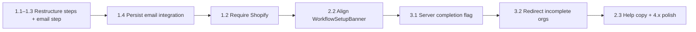

# Onboarding v1 Plan

Refocus first-run onboarding around the v1 wedge: **connect Shopify → set up email forwarding → receive first agent reply**. De-emphasize post-launch channels (Instagram, multi-channel, team invites) during the initial flow.

**Source:** [`to-do-list.md`](to-do-list.md) (Onboarding Polish section)  
**Last updated:** 2026-06-16

---

## Current state (what's wrong today)

The flow is 6 steps in `apps/dashboard/src/app/(onboarding)/onboarding/_components/model.ts`:

`intro` → `store` → `shopify` → `channels` → `autonomy` → `plan`

| Issue | Where |
|---|---|
| Email path is Gmail/Outlook OAuth, not forwarding-first | `step-channels.tsx` (`EmailCard`) |
| Instagram is a first-class channel card | `model.ts` (`CHANNEL_META`) |
| Shopify appears twice (step 3 + channels grid) | `step-shopify.tsx` + `CHANNEL_META` |
| `primaryEmail` is collected but **never saved** | `page.tsx` — no call to `POST /api/integrations` |
| Finish = clear localStorage + go to dashboard; no server-side "onboarding done" | `page.tsx` (`finish()`) |
| Post-onboarding checklist is 8 broad steps (team, Telegram, KB, multi-channel) | `useHomeData.ts` |
| Help docs still say "Gmail or Instagram" | `getting-started.ts` |

**Reusable piece already exists:** `EmailForwardingSetupPanel` in `apps/dashboard/src/components/integrations/EmailForwardingDisclosure.tsx` — inbound address, provider guides, support address save via `POST /api/integrations`.

---

## Epic 1 — Restructure the onboarding flow for v1

**Goal:** Shopify + email forwarding + first reply. Drop Instagram from onboarding.

### Task 1.1 — Redefine steps and labels

**File:** `apps/dashboard/src/app/(onboarding)/onboarding/_components/model.ts`

- Change `STEPS` from 6 steps to:
  1. Meet me (`intro`)
  2. Your store (`store`)
  3. Connect Shopify (`shopify`) — **required for continue**
  4. Set up email (`email`) — rename from `channels`
  5. My limits (`autonomy`)
  6. First night (`plan`)
- Remove `ig_dm` from `ChannelKey` and `CHANNEL_META`.
- Remove duplicate Shopify entry from channel meta (Shopify only on step 3).

### Task 1.2 — Make Shopify required before continuing

**File:** `apps/dashboard/src/app/(onboarding)/onboarding/page.tsx`

- Update `canContinue`:
  - `shopify` step: `connected.has("shopify")` (not skippable in v1).
  - `email` step: email integration exists **and** support address saved (see Task 2.2).
- Remove or hide "Not on Shopify? skip" copy in `step-shopify.tsx` for v1 (or keep skip but block finish with a warning — product call).

### Task 1.3 — Replace channels step with forwarding-first email step

**Files:** new `step-email.tsx` (or rewrite `step-channels.tsx`), `page.tsx`

Replace the OAuth picker with a dedicated email step:

1. **Primary path:** Reuse `EmailForwardingSetupPanel`:
   - Show `{orgId}@{inboundEmailDomain}` (needs org created first — call `ensureOrganization()` on step enter).
   - Provider tabs (Google Workspace, Outlook, cPanel, Cloudflare).
   - Support address input → `POST /api/integrations` with `platform: "email"`.
2. **Secondary path (collapsed):** "Connect Gmail or Outlook instead" → existing OAuth URLs, with copy that OAuth is optional and forwarding is the default v1 path.
3. **No Instagram card.**
4. **Verification hint:** "Send a test email to your support address — it should appear in your inbox within a minute."

Wire `useOrg()` for `inboundEmailDomain` (same as integrations page).

### Task 1.4 — Persist email on finish (bug fix)

**File:** `apps/dashboard/src/app/(onboarding)/onboarding/page.tsx`

- On email step save (or on `finish()` if email step was completed): call `POST /api/integrations` via existing `saveForwardingEmailIntegration` path with `data.primaryEmail`.
- Today `primaryEmail` only lives in localStorage and is lost.

### Task 1.5 — Update copy on intro, plan, and autonomy

**Files:** `step-intro.tsx`, `step-plan.tsx`, `step-autonomy.tsx`

- Intro: emphasize "Connect Shopify + forward support email → I start tonight."
- Plan step: remove references to Instagram; mention forwarding verification and first ticket.
- Plan step "Build memory from past replies" — align with current product (KB sync from Shopify, not removed customer memory).

---

## Epic 2 — De-emphasize post-launch channels

### Task 2.1 — Remove Instagram from onboarding UI

**File:** `step-channels.tsx` → `step-email.tsx`

- No IG card, no IG OAuth link.
- Optional footer: "Instagram, Telegram, and more — add later in Integrations."

### Task 2.2 — Align post-onboarding workflow banner

**File:** `apps/dashboard/src/app/dashboard/_components/home/useHomeData.ts`

Replace the 8-step checklist with a v1-focused set (4–5 steps):

| Step | Done when |
|---|---|
| Connect Shopify | `hasShopify` |
| Set up email forwarding | email integration with `metadata.provider === 'postmark'` **or** support address saved |
| Connect Telegram (optional) | `hasTelegramBound` |
| Receive first ticket | integrations + at least one thread exists |
| Send first reply | `home.hasSentReply` |

Remove or demote for v1: "Add memory notes", "Invite team", "Add more channels", "Configure agent" (store step already captures `aiContext`).

### Task 2.3 — Update help content

**File:** `apps/dashboard/src/app/dashboard/_components/help/content/getting-started.ts`

- Step 1: "Connect Shopify, then set up email forwarding" (not "Gmail or Instagram").
- Add forwarding verification steps (match `EmailForwardingSetupPanel` copy).

---

## Epic 3 — Completion / progress state

### Task 3.1 — Server-side onboarding completion flag

**Files:** `packages/db` (optional migration), `page.tsx`, `PATCH /api/org`

- Add `settings.onboardingCompletedAt` (ISO timestamp) or `settings.onboardingV1Complete: boolean`.
- Set on successful `finish()` after Shopify + email preconditions met.
- Lets you redirect new orgs to `/onboarding` until complete (if desired).

### Task 3.2 — Redirect incomplete orgs to onboarding (optional but high value)

**Files:** dashboard layout or middleware

- If org exists, no `onboardingCompletedAt`, and missing Shopify or email → redirect `/dashboard/*` → `/onboarding?step=shopify|email`.
- Respect localStorage resume (`concierge-onboarding-v1`) for in-progress sessions.

### Task 3.3 — Onboarding progress indicator tied to real milestones

**Files:** `chrome.tsx`, `page.tsx`

- Header progress dots should reflect **completion**, not just step index:
  - Shopify dot: green when connected (poll `useIntegrations` — already wired).
  - Email dot: green when integration saved + forwarding address shown.
- Replace generic "≈ N min left" with milestone text: "2 of 3 essentials done".

### Task 3.4 — Unify onboarding localStorage with dashboard banner

**Files:** `model.ts`, `WorkflowSetupBanner.tsx`

- Either drop `concierge-onboarding-v1` after server flag is set, or map the same milestone keys so progress isn't lost between onboarding and home.
- Banner should not re-show steps already completed in onboarding.

---

## Epic 4 — Polish and edge cases

### Task 4.1 — Org creation timing

**File:** `apps/dashboard/src/app/(onboarding)/onboarding/page.tsx`

- Create org at end of **store** step (not only on OAuth), so email step can show `{orgId}@inbound...` immediately.
- Today org is created lazily on OAuth or finish.

### Task 4.2 — Email step without org (edge case)

- Block email step UI until `ensureOrganization()` succeeds; show loading/error state.

### Task 4.3 — Telegram as optional nudge (not a step)

- After plan/finish, or on dashboard home: "Get plan approvals on your phone → Connect Telegram" linking to integrations.
- Keeps operator channel visible without bloating onboarding.

### Task 4.4 — Tests

- Component test: email step renders forwarding panel, not Gmail-first.
- Integration test: finishing onboarding calls `POST /api/integrations` with support email.
- E2E: signup → onboarding → Shopify connect (mock) → save forwarding email → land on dashboard with workflow banner showing 2/4 done.

---

## Suggested implementation order

**Smallest shippable PR:** Tasks 1.1, 1.3, 1.4, 2.1 — forwarding-first email step, drop Instagram, fix email persistence.

**Second PR:** 1.2, 2.2, 3.1 — require Shopify, align home banner, server completion flag.

**Third PR:** 3.2, 3.3, 4.x — redirect logic, progress UX, tests.

---

## Acceptance criteria

- [ ] New merchant sees: store → Shopify (required) → email forwarding (primary) → autonomy → plan.
- [ ] No Instagram card during onboarding.
- [ ] Support email + forwarding integration saved to DB before finish.
- [ ] Dashboard `WorkflowSetupBanner` tracks Shopify + forwarding + first reply (not 8 generic steps).
- [ ] Help "Quick start" matches forwarding-first model.
- [ ] Optional: org with incomplete setup gets nudged back to onboarding or sees accurate progress on home.

---

## Key files

| File | Role |
|---|---|
| `apps/dashboard/src/app/(onboarding)/onboarding/page.tsx` | Step orchestration, `canContinue`, `finish()`, org creation |
| `apps/dashboard/src/app/(onboarding)/onboarding/_components/model.ts` | Step definitions, `CHANNEL_META`, localStorage key |
| `apps/dashboard/src/app/(onboarding)/onboarding/_components/step-channels.tsx` | Current channels step (to be replaced) |
| `apps/dashboard/src/components/integrations/EmailForwardingDisclosure.tsx` | Reusable forwarding setup panel |
| `apps/dashboard/src/app/api/integrations/_lib/email-integration.ts` | `saveForwardingEmailIntegration` |
| `apps/dashboard/src/app/dashboard/_components/home/useHomeData.ts` | Post-onboarding workflow steps |
| `apps/dashboard/src/app/dashboard/_components/home/WorkflowSetupBanner.tsx` | Home progress banner UI |
| `apps/dashboard/src/app/dashboard/_components/help/content/getting-started.ts` | Help center quick start |
