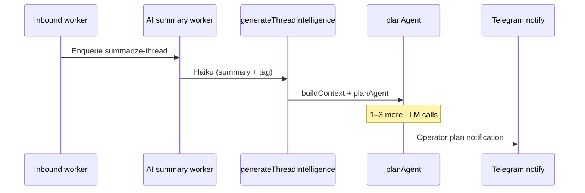
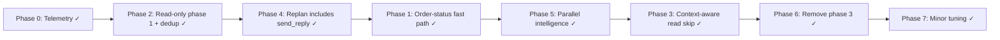

# Planner optimization plan

Reduce inbound ticket → operator-notification latency by cutting redundant LLM calls, unnecessary Shopify reads, and sequential pipeline work in `planAgent` and the upstream `ai-summary` worker.

## Goal

Get first-message plan time from **~6–10s** down to **~2–4s** on common cases (WISMO, KB policy questions, simple refunds) without changing execution semantics, Telegram approval flows, or plan-cache behavior.

Out of scope for this doc: gateway→dashboard dispatch hop, Telegram async queueing, `buildContext` caching between plan and execute (see agent/messaging architecture notes elsewhere).

## Current architecture

`planAgent` (`packages/agent/src/planner.ts`) is a **3-phase state machine**:

| Phase | When it runs | Model | Purpose |
|-------|--------------|-------|---------|
| **1. Initial** | Always | Haiku (`plan_initial`) | Pick tools — usually reads |
| **2. Replan** | Only if phase 1 returned read tools | Sonnet (`plan_replan`) | Decide mutative action after read results |
| **3. Reply draft** | ~~Customer channel only, and no `send_reply` / `escalate` yet~~ **Removed (Phase 6)** | ~~Haiku (`reply_draft`)~~ | ~~Force `send_reply` via `tool_choice`~~ |

Before any of that, the inbound pipeline adds a **4th LLM call** — `generateThreadIntelligence` (Haiku, 256 tokens) in `apps/gateway/src/workers/ai-summary.ts` — for summary/tag/classification. Planning then runs with `instruction = thread.aiSummary`.



### Path analysis

**Best case (1 planner call, ~30–40% of tickets):** Initial returns only `send_reply` using orders/KB already in `buildContext`. No reads → skip replan. `hasSendReply` → skip reply draft. Eval targets: `order-status-basic`, `quick-reply-shipping-policy-kb`.

**Common bad case (3 planner calls):** Initial returns an unnecessary read (e.g. `get_order_by_name` when order is in `recentOrders`). Replan returns `create_refund` but **no `send_reply`**. Phase 3 forces the reply. Eval target: `multi-step-refund-and-reply` (ideal: 1–2 calls, no reads).

**Structural issue (correctness, not just perf):** Phase 1 is not restricted to read-only tools. When phase 1 returns reads **and** mutative tools, mutative calls from phase 1 stay in `rawToolCalls` (`planner.ts:73` pushes *all* phase-1 blocks) and replan **appends** more (`planner.ts:135`) — there is no dedup/replace today, so a phase-1 `[get_order_by_name, create_refund]` + replan `[create_refund, send_reply]` yields **two `create_refund` entries** in the cached plan. Within business hours that cached plan can be auto-executed (`generate-thread-plan.ts:113-117`), so this is a double-refund exposure, not a cosmetic dupe. Fixing it (Phase 2) is the highest-value change here.

## What not to change

- **Plan cache** (`packages/agent/src/plan-cache.ts`) — same instruction + message ID + settings fingerprint = skip all planner calls.
- **Operator channel skipping phase 3** — `operatorMode` check in `planner.ts` is correct.
- **Sonnet for replan** — refund/cancel judgment stays on Sonnet.
- **Parallel read execution** — `planner-read-tools.ts` already uses `Promise.all`.
- **Prompt caching** — `buildSplitCachedSystemPrompt` helps on calls 2 and 3.

## Phased plan

> **Execution order ≠ document order.** Sections keep their original numbers, but the recommended sequence (revised after a code read) is:
>
> 1. **Phase 0 — Telemetry** ✓
> 2. **Phase 2 — Read-only phase-1 filter + dedup** ✓
> 3. **Phase 4 — Replan includes `send_reply`** ✓
> 4. **Phase 1 — Order-status fast path** ✓
> 5. **Phase 5 — Parallel intelligence + plan** ✓
> 6. **Phase 3 — Context-aware read skip** ✓
> 7. **Phase 6 — Remove phase-3 fallback** ✓, then **Phase 7 — Minor tuning** ✓
>
> The per-phase savings figures below are estimates **to be validated against Phase 0's `planPath` distribution, not committed to in advance.** If production is already mostly 1-call, Phases 1/3/4 have little headroom.

### Phase 0 — Telemetry (prerequisite) [COMPLETE]

Add a `planPath` enum to the `[agent:plan] complete` log in `planner.ts`:

```
"fast-path" | "1-call" | "2-call-mutative"
```

Derive from which phases ran and whether a fast path short-circuited. Use production logs to baseline before/after each phase.

**Verify:** Deploy with logging only; no behavior change. Dashboard or log query shows distribution of paths.

---

### Phase 1 — Plan-time order-status fast path (P2 — gated; see constraint) [COMPLETE]

`run.ts` has `tryRunOperatorOrderStatusFastPath` for Telegram operator queries. **No equivalent exists at plan time** for customer tickets.

> ⚠️ **Safety constraint (load-bearing).** The operator fast path answers the *operator* internally; a plan-time fast path synthesizes a **customer-facing `send_reply`**. Within business hours the cached plan is auto-executed (`generate-thread-plan.ts:113-117` → `maybeAutoExecuteCurrentCachedHomePlan`), so a templated, non-brand-voice string from `summarizeLatestOrder` (e.g. *"X's latest order #1234 from Jun 1 is paid and fulfilled. Total is…"*) could be **sent to a customer with no LLM in the loop**. That violates product principles #1 (brand voice) and #3 (trust is binary).
>
> Therefore the fast path **must classify as `needs_review` and never auto-execute the `send_reply`.** The merchant sees the order facts as a one-tap draft; the saving is the *planning* round-trips, not the human review. If you want auto-send, you must keep a reply-draft call for voice — which erases most of the savings. Do not ship an auto-sending templated reply.

1. Add `tryPlanOrderStatusFastPath` in `packages/agent/src/` (new file or extend `order-status-fast-path.ts`).
2. At the top of `planAgent`, before any LLM call:
   - Trigger when `looksLikeOrderStatusIntent(instruction)` and `recentOrders.length > 0` and no mutative signals in instruction.
   - Return a single `send_reply` plan synthesized from `recentOrders` (reuse summarization from operator fast path), **flagged so plan-preview classifies it `needs_review`** (no auto-execute).
3. Only applies to non-operator customer channels.

**Expected savings:** ~1–3s. WISMO is the *best case* that already runs on a single Haiku call and rarely hits replan (no mutative tool), so this replaces ~1–2 Haiku calls + at most one Shopify read — not the 3-call path. **Re-derive the real number from Phase 0 before committing.** (Original 3–6s estimate assumed the bad path and is overstated for this intent.)

**Verify:** Eval fixtures `order-status-basic`, `order-status-multiple-orders-pick-recent`, and `order-status-not-shipped-yet` pass with `mustClassifyAs: needs_review`. `planPath: "fast-path"` logged for WISMO threads with linked Shopify customer and orders in context.

**Implemented:** `tryPlanOrderStatusFastPath` in `packages/agent/src/order-status-fast-path.ts`; early return in `planAgent` before any LLM call. Detects order-status intent from customer message or instruction; `orderStatusFastPath: true` on plan forces `needs_review` in `plan-preview.ts` (no auto-execute).

---

### Phase 2 — Phase-1 read-only tool filter (P0 — do first after telemetry) [COMPLETE]

This is the one **correctness** fix in the plan, not just a perf win: it closes the double-refund exposure in "Structural issue" above. Promote ahead of Phase 1.

Make the two-phase design explicit instead of hoped-for.

1. In `planAgent` phase 1, pass `selectAgentTools` filtered to `TOOL_CATEGORIES[name] === "read"` plus `escalate_to_human`.
2. Phase 2 (replan) keeps the full tool set.
3. When replan runs, **replace** mutative tool calls from phase 1 rather than appending. NB: there is **no replace/dedup logic today** (`planner.ts:135` is a pure `rawToolCalls.push(...)`) — this step *adds* it. With the phase-1 filter in place phase 1 should no longer emit mutative tools, but keep the replace as a safety net against the dupe.

**Expected savings:** 2–4s on mutative tickets where phase 1 wrongly emitted action tools; **and eliminates the duplicate `create_refund` risk in `rawToolCalls` → cached plan → auto-execute.**

**Verify:** Eval suite unchanged. `multi-step-refund-and-reply` still produces ordered `create_refund` → `send_reply`.

---

### Phase 3 — Context-aware read skipping (P3 — behind a new eval) [COMPLETE]

> ⚠️ **Risk re-rated from Low to Medium.** Skipping `get_shopify_orders` because `recentOrders.length > 0` feeds a **bounded, possibly stale** context slice to the **Sonnet refund/cancel decision** instead of a live lookup. `recentOrders` is a recent-N slice, and "instruction does not imply refresh" is a fuzzy gate. This is exactly the failure mode principle #3 warns about. Gate this phase behind a new eval that proves the mutative decision is unchanged when the live read is skipped; if it can't be proven, drop the order/customer skips and keep only the KB skip.

Before executing phase-1 read blocks in `executePlanningReadTools`, filter out reads context already satisfies:

| Tool call | Skip when |
|-----------|-----------|
| `get_order_by_name` | Order name matches an entry in `recentOrders` |
| `get_shopify_orders` | `recentOrders.length > 0` and instruction does not imply refresh |
| `get_shopify_customer` | `thread.shopifyCustomerId` is set |
| `search_kb` | Pre-loaded `kbArticles` cover the query topic (heuristic: tag match or title keyword overlap) |

If all reads are skipped after filtering:
- Retry phase 1 once with the full tool set (mutative tickets like refunds can still emit `create_refund`).
- If the retry still has only skippable reads, replan on synthesized context (no live Shopify call).
- Remove context-satisfied reads from the final `rawToolCalls`.

**Expected savings:** 2–4s when the model requests redundant Shopify lookups (common on refund tickets with orders in context).

**Verify:** `multi-step-refund-and-reply` and new gate fixture `multi-step-refund-context-skip` do not call `get_order_by_name` / `get_shopify_orders`. `order-status-basic` stays on fast-path or 1-call.

**Implemented:** `packages/agent/src/planner-read-skip.ts` (skip heuristics + context synthesis); integrated in `planner-read-tools.ts` and `planner.ts`. Eval gate: `multi-step-refund-context-skip.json`.

---

### Phase 4 — Replan must include `send_reply` (P1) [COMPLETE]

Phase 3 (reply draft) exists because replan often omits `send_reply` despite the system prompt (`prompt.ts`: "After taking any action… you MUST call send_reply").

1. After injecting read results into `planMessages`, append a user turn:
   ```
   Plan the mutative action(s) AND send_reply in this single response. Do not stop after action tools alone.
   ```
2. If replan returns action tools but no `send_reply` and no `escalate_to_human`, **retry replan once** on the same Sonnet call context with a narrowed tool list: action tools from the first replan attempt + `send_reply` + `add_internal_note` + `update_thread_status`.
3. Keep existing phase 3 as fallback initially. Track `planPath: "3-call"` rate.

**Expected savings:** 1–2s on ~60% of mutative customer tickets (eliminates most phase-3 Haiku calls).

**Verify:** Eval fixtures with `mustCallToolsInOrder: ["create_refund", "send_reply"]` pass. Phase-3 fallback rate drops below 5% in production logs before removing fallback.

---

### Phase 5 — Pipeline intelligence + planning (P2) [COMPLETE]

Today `ai-summary.ts` runs sequentially: `generateThreadIntelligence` → `precomputeThreadPlan`.

1. **Non-email channels (IG, Shopify):** Start `precomputeThreadPlan` with `instruction = latestCustomerMessage` in parallel with intelligence. Intelligence updates `aiSummary` / `tag` for inbox UI; plan uses raw message.
2. **Email, first message** (`filterDecidedAt === null`): Keep sequential — spam filter must complete before plan + operator notify.
3. **Email, follow-ups** (`filterDecidedAt !== null`): Parallelize — filter already decided.

> **Premises confirmed during implementation:**
> - **Sanitization.** Inbound text is normalized/truncated at message upsert in `inbound-persistence.ts` (before `ai-summary`). Parallel planning consumes the same sanitized raw message.
> - **Filter gate for IG/Shopify.** `intelligence.ts` only applies spam classification to email (`shouldSetFilter` gated on `channelType === email`). Non-email threads stay `genuine`.

**Expected savings:** 1–2s on repeat messages and all IG/Shopify events.

**Verify:** Non-genuine email threads still skip plan (filter gate unchanged). Worker filter-gating tests pass.

**Implemented:** `processAiSummaryJob` in `apps/gateway/src/message-handlers/ai-summary-flow.ts`; `generateThreadPlan` / `precomputeThreadPlan` accept optional `instruction` override; `getLatestCustomerMessageText` in `packages/agent/src/thread-auth.ts`.

---

### Phase 6 — Remove phase 3 fallback (P3) [COMPLETE]

Once Phase 4 metrics show phase-3 usage below ~5%:

1. Remove the `reply_draft` block from `planner.ts` (lines ~139–185).
2. Remove `reply_draft` from `ModelTask` in `packages/agent/src/ai/index.ts` if unused elsewhere.
3. On the rare miss, classify as `needs_review` and surface plan without reply text rather than a 3rd LLM call.

**Verify:** Full eval suite green. No increase in `needs_review` misclassifications on `quick_reply` fixtures.

**Implemented:** Removed `reply_draft` fallback from `planner.ts` and `ModelTask`. Phase-1 tools now include `send_reply` so KB/quick-reply tickets stay 1-call. Mutative plans missing `send_reply` after replan retry classify as `needs_review` (no auto-execute without customer reply). Telemetry simplified to `fast-path` | `1-call` | `2-call-mutative`.

---

### Phase 7 — Minor tuning (P3) [COMPLETE]

- Reduce `max_tokens` on phase 1 from 2048 → 1024 (tool-only outputs). Replan stays at 2048 (may include `send_reply` body). Phase-3 reply draft removed in Phase 6.
- **Deferred:** Sonnet for phase 1 on mutative-heavy threads — revisit after Phase 0 `planPath` telemetry shows enough 2-call-mutative volume to justify the token-cost tradeoff; A/B via eval suite first.

**Implemented:** `PLAN_INITIAL_MAX_TOKENS` (1024) and `PLAN_REPLAN_MAX_TOKENS` (2048) in `planner.ts`.

---

## Implementation order (complete)



Revised priorities (savings are pre-telemetry estimates, to be validated by Phase 0):

| Priority | Phase | Est. savings | Risk | Status |
|----------|-------|--------------|------|--------|
| P0 | Telemetry | Enables tuning | None | **Complete** |
| **P0** | **Read-only phase 1 + dedup** | 2–4s; **fixes double-refund exposure** | Low | **Complete** |
| P1 | Replan requires `send_reply` | 1–2s on ~60% mutative | Medium | **Complete** |
| P2 | Order-status fast path (`needs_review` only) | ~1–3s on WISMO | **Medium-high** (customer-facing; auto-send forbidden) | **Complete** |
| P2 | Parallel intelligence + plan | 1–2s on follow-ups / IG | Medium | **Complete** |
| P3 | Context-aware read skip | 2–4s on redundant reads | **Medium** (stale context into Sonnet refund) | **Complete** |
| P3 | Remove phase 3 | 1–2s | Medium-high | **Complete** |
| P3 | Minor tuning | Token/latency | Low | **Complete** |

## Regression gate

Run before and after each phase:

```bash
# Agent eval suite (plan shape + classification)
pnpm --filter dashboard test -- src/lib/agent/__evals__

# Planner unit tests
pnpm --filter @shopkeeper/agent test -- planner

# Plan preview classification
pnpm --filter @shopkeeper/agent test -- plan-preview
```

Key fixtures:

| Fixture | What it guards |
|---------|----------------|
| `order-status-basic` | Fast-path or 1-call, no redundant reads, `needs_review` classification |
| `quick-reply-shipping-policy-kb` | 1 call, `quick_reply` classification |
| `multi-step-refund-and-reply` | `create_refund` → `send_reply` ordering, no unnecessary order reads |
| `multi-step-refund-context-skip` | Refund decision unchanged when live order reads are context-skipped |

## Key files

| Area | Path |
|------|------|
| Planner | `packages/agent/src/planner.ts` |
| Read tools during plan | `packages/agent/src/planner-read-tools.ts` |
| Context-aware read skip | `packages/agent/src/planner-read-skip.ts` |
| Plan classification | `packages/agent/src/plan-preview.ts` |
| Plan-time + operator order-status fast path | `packages/agent/src/order-status-fast-path.ts` |
| Model routing | `packages/agent/src/ai/index.ts` |
| System prompt / send_reply rule | `packages/agent/src/prompt.ts` |
| Plan cache | `packages/agent/src/plan-cache.ts` |
| Gateway plan precompute | `apps/gateway/src/message-handlers/generate-thread-plan.ts` |
| AI summary orchestration | `apps/gateway/src/message-handlers/ai-summary-flow.ts` |
| AI summary worker | `apps/gateway/src/workers/ai-summary.ts` |
| Intelligence | `apps/gateway/src/message-handlers/intelligence.ts` |
| Eval fixtures | `apps/dashboard/src/lib/agent/__evals__/fixtures/` |

## Open questions

1. ~~**Fast-path false positives:** Should `tryPlanOrderStatusFastPath` require a single unambiguous order in context, or allow "most recent order" when multiple exist?~~ **Resolved:** uses most recent order when no order number is referenced; matches `order-status-multiple-orders-pick-recent` fixture.
2. ~~**KB read skip heuristic:** Tag match only, or lightweight keyword overlap on pre-loaded articles?~~ **Resolved:** tag match or title keyword overlap (`planner-read-skip.ts`).
3. **Parallel intelligence UI:** If plan completes before intelligence and uses raw message, should inbox show a "planning…" state until `aiSummary` lands, or is stale summary acceptable for a few seconds? (Backend parallelization shipped; UI behavior unchanged.)
4. ~~**Phase 6 gate:** Phase-3 (`reply_draft`) fallback rate in production logs — remove fallback once below ~5%.~~ **Resolved:** fallback removed; quick replies use phase-1 `send_reply`; mutative misses route to `needs_review`.

## Related docs

- [telegram-operator-channel.md](./telegram-operator-channel.md) — operator approval path (unchanged by this plan)
- [core-extraction-and-module-expansion-plan.md](./core-extraction-and-module-expansion-plan.md) — broader agent architecture / channel adapter aspirations
