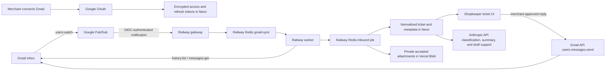

# Google Gmail restricted-scope verification packet

Prepared from the production deployment and repository behavior on
2026-07-29; domain rows reconciled against the live deployment 2026-08-02;
Branding, scope, and deletion rows reconciled 2026-08-30. This
is an owner-ready working packet, not proof that Google has approved the app. Do
not submit credentials, tokens, customer addresses, message content, or raw Gmail
payloads.

## Submission status

| Requirement | Current evidence | Owner action |
|---|---|---|
| Production app | Dashboard and two Railway gateway services are healthy | Keep production stable through review |
| Homepage | `https://useshopkeeper.com/` returns 200 and identifies Shopkeeper (owned domain, live 2026-08-02) | Verify the domain in Search Console |
| Privacy policy | `https://useshopkeeper.com/privacy` returns 200 anonymously and publishes `hello@useshopkeeper.com` | Legal-review the Limited Use disclosure |
| Terms | `https://useshopkeeper.com/terms` returns 200 anonymously | — |
| OAuth redirect | `https://app.useshopkeeper.com/api/integrations/gmail/callback` set in Vercel and Google Console (2026-08-02) | — |
| Authorized domains | `useshopkeeper.com` attached to Vercel and **verified in Search Console (2026-08-02)**; Branding app name, homepage, privacy and terms links updated to the apex (owner-confirmed in console 2026-08-30, not independently readable from the repo) | — |
| User support email | Live policy publishes `hello@useshopkeeper.com`, forwarding via ImprovMX to a monitored inbox (verified 2026-08-02) | — |
| Developer contacts | Not discoverable from the repository | Add at least two monitored owner/editor contacts |
| Demo video | Script below is ready | Record after the alias canary |
| Restricted-scope assessment | `gmail.readonly` is restricted and server-side data is stored/transmitted | Complete the assessor/CASA path when Google initiates it |

The owned-domain blocker is resolved: the homepage, privacy policy, and terms all
serve from `useshopkeeper.com`, which the app owner controls and has verified in
Search Console, and `hello@useshopkeeper.com` reaches a monitored inbox. The
Branding page was updated to the apex on 2026-08-30. **The remaining
pre-submission blockers are two developer contacts, the alias canary, and the
demo video, which the canary gates** — the script sends from the verified alias.

Re-verified against the live deployment 2026-08-30: the apex homepage, `/privacy`
and `/terms` each return 200 anonymously; the homepage links `/privacy` and
`/terms`; the privacy policy carries both the Limited Use sentence and the
"create, train, or improve a general-purpose AI model" prohibition; and the four
scopes requested by `emailOAuthProviders` in
`apps/dashboard/src/app/api/integrations/_lib/email-oauth-providers.ts` match the
four declared below, with no drift.

Note the apex/`app.` split when filling in console fields: the homepage and legal
pages are on the **apex**, while the OAuth redirect URI is on **`app.`**.

## App identity and URLs

- App name: **Shopkeeper**
- Homepage: `https://useshopkeeper.com/`
- Privacy policy: `https://useshopkeeper.com/privacy`
- Terms: `https://useshopkeeper.com/terms`
- OAuth redirect URI:
  `https://app.useshopkeeper.com/api/integrations/gmail/callback`
- User support email: `hello@useshopkeeper.com` (pending a monitored mailbox)
- Authorized domain: `useshopkeeper.com`
- Google Cloud project ID observed in production Gmail configuration:
  `shopkeeper-501301`

The Pub/Sub push URL remains operationally separate from the browser OAuth
redirect:

`https://clerk-production-e37f.up.railway.app/webhooks/gmail/push`

## Publishing status and the 7-day refresh token

Publishing status is **separate from verification** and worth changing first.
While an external-user-type consent screen sits in **Testing**, Google issues
refresh tokens that expire after 7 days, so every connected mailbox stops
sending weekly until the merchant reconnects. That is a console setting
(**Google Auth Platform → Audience → Publish app**), not a code defect, and it
does not wait on review.

Observed on the live `rscoding11@gmail.com` integration: the grant died on
2026-08-30 with a `400` on refresh roughly four such cycles after the row was
created on 2026-08-03. Publishing stops the clock for grants issued afterwards;
tokens already issued keep their original expiry until the next reconnect.

Publishing before verification is expected and reversible. The cost is the
unverified-app interstitial behind **Advanced** and a 100-user cap, neither of
which binds before launch.

## Exact requested scopes

The application requests exactly:

```text
openid
email
https://www.googleapis.com/auth/gmail.send
https://www.googleapis.com/auth/gmail.readonly
```

### Scope justifications

`openid`

: Establishes the OAuth/OpenID Connect session needed to associate the Google
  authorization result with the merchant who initiated the visible Gmail
  connection.

`email`

: Reads the connected Google account's email identity from the OpenID Connect
  userinfo response. Shopkeeper displays and stores that identity so the
  merchant can verify which mailbox is connected and so inbound filtering and
  reply routing use the intended account. A stable account identity cannot be
  derived from `gmail.send`.

`https://www.googleapis.com/auth/gmail.send`

: Sends merchant-approved support replies through the connected Gmail account,
  including the already-authorized Gmail send-as alias selected in Shopkeeper.
  Shopkeeper does not request compose, modify, or full-mail access for this
  feature. `gmail.send` is the narrow scope for sending without granting mailbox
  read or mutation rights.

`https://www.googleapis.com/auth/gmail.readonly`

: Reads Gmail history and the raw contents of newly added inbox messages so
  Shopkeeper can create visible support tickets, preserve MIME headers and Gmail
  threading, retain safe attachments, deduplicate delivery, recover dropped
  Pub/Sub notifications, and resume from a checkpoint. Metadata-only access
  cannot provide message bodies or attachments, while `gmail.modify` and
  `mail.google.com` grant mutation/deletion privileges Shopkeeper does not use.

Google currently classifies `gmail.send` as sensitive and `gmail.readonly` as
restricted. Because Shopkeeper transmits and stores restricted-scope data on its
servers, restricted-scope verification and a recurring security assessment are
expected.

## User-facing functionality

The requested access powers two prominent product features:

1. **Gmail inbox to Shopkeeper ticket.** A merchant connects Gmail, configures a
   support address, and messages delivered to that address appear as tickets
   with body, sender, subject, threading, and accepted attachments.
2. **Shopkeeper reply through Gmail.** An authorized merchant reviews or writes
   a reply in the ticket UI. Shopkeeper sends it from the connected Gmail
   account or verified send-as alias and preserves the Gmail conversation
   thread.

Shopkeeper does not mark mail read, edit labels, delete mail, manage Gmail
settings, scrape mailboxes, build a general email database, or use Gmail data
for advertising or credit decisions.

## Data flow



Raw Gmail MIME is fetched into worker memory and parsed. It is not stored as a
raw provider payload. The normalized message and accepted attachment data enter
the inbound queue; the database stores message text and metadata, and Vercel
Blob stores accepted attachments privately.

## Google data use and Limited Use statement

Publish this factual disclosure in the privacy policy before submission:

> Shopkeeper's use and transfer of information received from Google APIs
> adheres to the Google API Services User Data Policy, including the Limited Use
> requirements.

The production implementation uses Gmail data only to provide and secure the
visible ticket-ingestion, classification, summary, draft, and reply features.
It does not sell the data, use it for advertising, or use it to create, train,
or improve a general-purpose AI model. Human access is limited to authorized
merchant workspace users and narrowly controlled security/support situations
covered by the privacy policy and Google policy.

Shopkeeper sends bounded customer-support content to the Anthropic commercial
API for classification, summaries, and agent drafts. This transfer supports the
visible user-facing features and must be disclosed. Anthropic's current
commercial-product statement says API content is not used for model training
unless the customer explicitly opts in. Before submission, the owner must save
evidence that the production Anthropic organization is not enrolled in a
training/development-partner opt-in and that feedback paths do not submit
customer content.

## Storage, retention, and deletion

| Data | Storage and protection | Actual retention/deletion behavior |
|---|---|---|
| Gmail access/refresh tokens | Application-layer encrypted token fields in Neon; production requires `TOKEN_ENCRYPTION_KEY` | Retained while integration is connected; removed with integration/workspace deletion |
| Account identity and Gmail watch metadata | Neon | Retained with the integration; disconnect removes the integration and stops the last mailbox watch when applicable |
| Normalized messages and ticket metadata | Neon, tenant-scoped | Retained while the workspace/ticket remains active; user-soft-deleted records are hard-purged after 90 days |
| Accepted attachments | Private Vercel Blob objects; DB stores references | Removed through the documented workspace/customer deletion procedure; current deletion runbook requires an explicit Blob cleanup check |
| Inbound queue payload | Railway Redis/BullMQ | Completed jobs are retained up to 24 hours and failed jobs up to 7 days under the shared processing defaults |
| Gmail sync job | Railway Redis/BullMQ; contains integration/checkpoint identifiers, not message bodies | Completed jobs up to 24 hours; failed jobs up to 7 days |
| Raw Gmail MIME | Worker memory | Parsed during processing and not intentionally persisted as a raw payload |
| Operational logs | Railway/Vercel and configured observability drains | Identifiers, counts, and safe categories only by design; no tokens or message bodies |

Workspace deletion removes the local organization and cascades through
integrations, customers, threads, and messages. Customer deletion uses verified
request intake, soft deletion, attachment cleanup, and later hard purge.
Deleting Shopkeeper data does not delete the source message in the merchant's
Gmail mailbox. The owner must communicate that boundary.

Before security assessment, close or formally accept these operational gaps:

- attachment deletion is an explicit operator step rather than an automatic
  cascade;
- `customers/redact` could not complete at all until 2026-08-30:
  `request_episode_outcomes.source_message_id` was `NOT NULL` behind an
  `ON DELETE SET NULL` foreign key, so the customer delete cascaded into a
  message and raised `23502`, aborting the transaction and deleting nothing
  while the webhook returned 200. Fixed by making the column nullable and
  deleting the outcome rows in `deleteSelectedCustomerData`. A signed production
  delivery on 2026-08-30 then erased a fixture customer carrying that exact
  shape, with non-zero `deleted*` counts in the gateway log
  (`canary:customer-redact:{seed,deliver,verify}`). A second delivery the same
  day carried a real private Blob attachment and erased that too, so the
  operator-step concern above is exercised rather than merely accepted. One gap
  remains in that evidence: the canary holds the signing key, so it does not
  show Shopify originated the call — only the admin **Erase personal data** path
  does, on a ~10-day delay;
- active messages do not have a fixed maximum lifetime while the merchant keeps
  the workspace;
- verify backup/PITR deletion behavior and the exact production retention
  window with Neon;
- confirm log-drain retention and access controls with the configured provider.

## Subprocessor/data-recipient inventory

Owner/legal must verify current contracts, regions, and subprocessors before
submission. The implementation currently depends on:

| Provider | Gmail-related role |
|---|---|
| Google | OAuth identity, Gmail source mailbox, Pub/Sub notifications, Gmail send |
| Vercel | Dashboard hosting and private attachment storage |
| Railway | Gateway/worker compute and BullMQ Redis |
| Neon | Primary relational database |
| Anthropic | Support-message classification, summaries, and draft/agent generation |
| Clerk | Merchant authentication and workspace membership |
| PostHog | Server-side product events only; policy and code prohibit message content, emails, tokens, and provider payloads |
| Observability providers | Sanitized application/error logs; confirm the actual production vendors and retention |

Stripe, Shopify, Photon, and other connected-channel providers are product
subprocessors but are not required for the Gmail data path. Include them in the
company-wide public subprocessor list if they are active for submitted users.

## Demo video script

Use a test merchant, test Gmail/Workspace mailbox, test send-as alias, and
independent test sender. Keep the consent-screen language set to English.

1. Start on the final owned-domain homepage. Show Shopkeeper branding,
   Gmail-ticket/reply functionality, and visible Privacy/Terms links.
2. Open the privacy policy and briefly show the Google Workspace API data,
   Limited Use, retention/deletion, sharing, and no-general-model-training
   disclosures.
3. Sign in as the test merchant and open **Integrations → Gmail**.
4. Click **Connect Gmail** and show the complete Google consent screen,
   including the same app name and exact requested scopes submitted for review.
5. Grant access and return to Shopkeeper. Show the connected mailbox identity,
   native inbound status, and configured support alias.
6. From the independent mailbox, send a uniquely identified HTML email with a
   safe attachment to the alias.
7. Show the message arriving as one Shopkeeper ticket with the attachment.
   Explain that `gmail.readonly` powers history/message reads and that no Gmail
   mutation scope is requested.
8. Write and approve a reply in Shopkeeper. Show the reply was sent from the
   verified alias, then show the same conversation in Gmail. Explain that
   `gmail.send` powers this action.
9. Send a customer follow-up from the independent mailbox. Show one continuing
   Gmail thread and one continuing Shopkeeper ticket without duplicates.
10. Return to Integrations and show the disconnect control and the privacy/data
    deletion contact path.

Upload the video as an unlisted link accessible to Google's reviewers without a
login. Do not expose real customer data, console secrets, tokens, or production
logs in the recording.

## CASA/security assessment readiness

- [ ] Confirm assessment scope includes dashboard, both Railway services,
  production database, Redis, Blob storage, OAuth/token handling, CI/CD, and
  observability.
- [ ] Provide current architecture and data-flow diagrams.
- [ ] Provide asset inventory, owners, environments, and data classifications.
- [ ] Provide access-control/RBAC evidence and joiner/mover/leaver procedures.
- [ ] Provide encryption-in-transit and encryption-at-rest evidence, including
  application-layer OAuth token encryption and key rotation.
- [ ] Provide SDLC, code-review, dependency/vulnerability-management, and
  release evidence.
- [ ] Provide incident response, breach notification, backup/PITR, restoration,
  and disaster-recovery evidence.
- [ ] Provide penetration-test and vulnerability-remediation evidence.
- [ ] Provide logging/monitoring configuration showing restricted data is not
  written to logs.
- [ ] Exercise verified deletion across Neon, Vercel Blob, Redis retention,
  backups, and connected-provider handoff. The Neon and Vercel Blob legs of
  `customers/redact` are both proven against signed production deliveries
  (2026-08-30). Redis retention, backup/PITR and connected-provider handoff are
  not.
- [ ] Select a Google-empanelled assessor and budget for at least annual
  reassessment/recertification.

Google states that server-side apps accessing restricted data generally require
an assessment using the App Defense Alliance/CASA framework and reassessment at
least every 12 months after the Letter of Assessment approval date.

## Final owner submission checklist

- [x] Attach an owned custom domain to Vercel. (`useshopkeeper.com`, 2026-08-02)
- [x] Verify that domain in Google Search Console using a project owner/editor.
  (2026-08-02)
- [x] Set `APP_URL` and `NEXT_PUBLIC_APP_URL` to the final domain and redeploy.
  (both `https://app.useshopkeeper.com`)
- [x] Update the Google OAuth client redirect URI to the exact final callback.
- [x] Add only the final owned domain to OAuth Branding authorized domains, and
  update the Branding app name / homepage / privacy and terms URLs to the apex.
  (2026-08-30, owner-confirmed in console)
- [x] Confirm homepage, privacy, and terms return 200 in an anonymous browser.
  (verified 2026-08-02 on the apex)
- [x] Confirm homepage visibly links the same privacy URL used in OAuth
  Branding. (`href="/privacy"` on the apex homepage)
- [x] Confirm the support mailbox is monitored and matches the public brand.
  (`hello@useshopkeeper.com` via ImprovMX, 2026-08-02)
- [ ] Add at least two current developer/project contacts.
- [ ] Declare exactly the four scopes above in Google Cloud Data Access.
- [ ] Paste the scope justifications above, adjusted only for final UI wording.
- [ ] Complete the Palette/test-mailbox alias canary.
- [ ] Record and review the demo video.
- [ ] Legal/owner approves the privacy, retention, deletion, subprocessor, and
  no-training statements against current contracts.
- [ ] Publish the OAuth app to production and click **Prepare for Verification**.
  Publishing is worth doing immediately and independently of the rest: it ends
  the 7-day refresh-token expiry described above.
- [ ] Submit the verification request from an authorized project owner/editor.
- [ ] Respond to reviewer questions and begin the security assessment when
  Google requests it.
- [ ] Record annual recertification and assessment owners.

## Primary references

- [Google verification requirements](https://support.google.com/cloud/answer/13464321?hl=en)
- [Google submission process](https://support.google.com/cloud/answer/13461325?hl=en)
- [Google restricted-scope verification](https://developers.google.com/identity/protocols/oauth2/production-readiness/restricted-scope-verification)
- [Gmail scope classifications](https://developers.google.com/workspace/gmail/api/auth/scopes)
- [Google API Services User Data Policy](https://developers.google.com/terms/api-services-user-data-policy)
- [Google Workspace API user data and developer policy](https://developers.google.com/workspace/workspace-api-user-data-developer-policy)
- [Anthropic commercial API model-training statement](https://privacy.claude.com/en/articles/7996885-how-do-you-use-personal-data-in-model-training)
