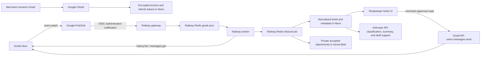

# Google Gmail restricted-scope verification packet

Prepared from the production deployment and repository behavior on
2026-07-29; domain rows reconciled against the live deployment 2026-08-02;
Branding, scope, publishing, and deletion rows reconciled 2026-08-30; the
submission to-do list and the security-assessment section rewritten 2026-08-30
against CASA Specification v2.1.1. This is an owner-ready working packet, not
proof that Google has approved the app. Do not submit credentials, tokens,
customer addresses, message content, or raw Gmail payloads.

## What is left to get verified

This is the only checklist in this file. Everything under **Blocks submission**
is console or desk work — none of it is blocked on code, and none of it is
blocked on the Palette alias canary.

### Blocks submission

- [ ] **Add at least two developer contacts.** Google Cloud console → OAuth
  Branding → developer contact information. They must be monitored owner or
  editor addresses. Open since 2026-07-29 and the oldest blocker in the file.
- [ ] **Declare exactly the four scopes** in Google Cloud Data Access — the four
  under *Exact requested scopes* below, no more.
- [ ] **Paste the scope justifications** from that same section, adjusted only
  for final UI wording.
- [ ] **Save the Anthropic no-training evidence.** Proof that the production
  Anthropic organization is not enrolled in a training or development-partner
  opt-in, and that feedback paths do not submit customer content. Required by
  the Limited Use disclosure below, which is what makes it a submission blocker
  rather than a nicety.
- [ ] **Legal/owner approval** of the privacy, retention, deletion,
  subprocessor, and no-training statements against current contracts.
- [ ] **Record and review the demo video.** Script below. It uses a *test*
  merchant, test mailbox, test send-as alias and independent sender — it does
  not need `support@palettegarments.com`, and nothing gates it.
- [ ] **Click Prepare for Verification**, once every box above is checked.
- [ ] **Submit** from an authorized project owner or editor.

### After submission

- [ ] Respond to reviewer questions.
- [ ] Begin the security assessment **when Google requests it** — see *Security
  assessment (CASA)* below. Do not start it early.
- [ ] Record annual recertification and assessment owners.

### Deliberately not blockers

Both are real work, both are tracked in [../to-do-list.md](../to-do-list.md),
and neither stands between the app and a submission:

- The Palette alias canary for `support@palettegarments.com`. It needs Gmail
  administrator access the release workspace does not have. Earlier revisions of
  this file gated the demo video on it; that was wrong.
- Reconnecting `rscoding11@gmail.com` to pick up a non-expiring grant.

### Already established

- [x] Attach an owned custom domain to Vercel. (`useshopkeeper.com`, 2026-08-02)
- [x] Verify that domain in Google Search Console using a project owner/editor.
  (2026-08-02)
- [x] Set `APP_URL` and `NEXT_PUBLIC_APP_URL` to the final domain and redeploy.
  (both `https://app.useshopkeeper.com`)
- [x] Update the Google OAuth client redirect URI to the exact final callback.
- [x] Add only the final owned domain to OAuth Branding authorized domains, and
  update the Branding app name / homepage / privacy and terms URLs to the apex.
  (2026-08-30, owner-confirmed in console)
- [x] Confirm homepage, privacy, and terms return 200 in an anonymous browser.
  (re-verified 2026-08-30 on the apex)
- [x] Confirm homepage visibly links the same privacy URL used in OAuth
  Branding. (`href="/privacy"` on the apex homepage)
- [x] Confirm the support mailbox is monitored and matches the public brand.
  (`hello@useshopkeeper.com` via ImprovMX, 2026-08-02)
- [x] Publish the OAuth app to production. (2026-08-30, which ends the 7-day
  refresh-token expiry for grants issued afterwards)

## Submission status

| Requirement | Current evidence | Owner action |
|---|---|---|
| Production app | Dashboard and two Railway gateway services reported healthy 2026-08-02; not re-checked since | Re-confirm immediately before submitting, and keep production stable through review |
| Homepage | `https://useshopkeeper.com/` returns 200 and identifies Shopkeeper (owned domain, live 2026-08-02) | — |
| Publishing status | Consent screen published to production 2026-08-30; separate from verification | Reconnect the live mailbox once to pick up a non-expiring grant |
| Privacy policy | `https://useshopkeeper.com/privacy` returns 200 anonymously and publishes `hello@useshopkeeper.com` | Legal-review the Limited Use disclosure |
| Terms | `https://useshopkeeper.com/terms` returns 200 anonymously | — |
| OAuth redirect | `https://app.useshopkeeper.com/api/integrations/gmail/callback` set in Vercel and Google Console (2026-08-02) | — |
| Authorized domains | `useshopkeeper.com` attached to Vercel and **verified in Search Console (2026-08-02)**; Branding app name, homepage, privacy and terms links updated to the apex (owner-confirmed in console 2026-08-30, not independently readable from the repo) | — |
| User support email | Live policy publishes `hello@useshopkeeper.com`, forwarding via ImprovMX to a monitored inbox (verified 2026-08-02) | — |
| Developer contacts | Not discoverable from the repository | Add at least two monitored owner/editor contacts |
| Demo video | Script below is ready and needs only a test mailbox | Record it — nothing gates it |
| Restricted-scope assessment | `gmail.readonly` is restricted and server-side data is stored/transmitted | Downstream and Google-initiated; see *Security assessment (CASA)* |

The owned-domain blocker is resolved: the homepage, privacy policy, and terms all
serve from `useshopkeeper.com`, which the app owner controls and has verified in
Search Console, and `hello@useshopkeeper.com` reaches a monitored inbox. The
Branding page was updated to the apex on 2026-08-30. What remains is the
*Blocks submission* list above — all of it console or desk work.

Re-verified against the live deployment 2026-08-30: the apex homepage, `/privacy`
and `/terms` each return 200 anonymously; the homepage links `/privacy` and
`/terms`; the privacy policy carries both the Limited Use sentence and the
"create, train, or improve a general-purpose AI model" prohibition; and the four
scopes requested by `emailOAuthProviders` in
`apps/dashboard/src/app/api/integrations/_lib/email-oauth-providers.ts` match the
four declared below, with no drift.

Note the apex/`app.` split when filling in console fields: the homepage and legal
pages are on the **apex**, while the OAuth redirect URI is on **`app.`**.

## App identity and URLs

- App name: **Shopkeeper**
- Homepage: `https://useshopkeeper.com/`
- Privacy policy: `https://useshopkeeper.com/privacy`
- Terms: `https://useshopkeeper.com/terms`
- OAuth redirect URI:
  `https://app.useshopkeeper.com/api/integrations/gmail/callback`
- User support email: `hello@useshopkeeper.com` (forwarding via ImprovMX to a
  monitored inbox, verified 2026-08-02)
- Authorized domain: `useshopkeeper.com`
- Google Cloud project ID observed in production Gmail configuration:
  `shopkeeper-501301`

The Pub/Sub push URL remains operationally separate from the browser OAuth
redirect:

`https://clerk-production-e37f.up.railway.app/webhooks/gmail/push`

## Publishing status and the 7-day refresh token

**Published 2026-08-30.** Publishing status is separate from verification, which
is why it did not wait on it.

While an external-user-type consent screen sits in **Testing**, Google issues
refresh tokens that expire after 7 days, so every connected mailbox stops
sending weekly until the merchant reconnects. That was observed on the live
`rscoding11@gmail.com` integration: the grant died on 2026-08-30 with a `400` on
refresh, roughly four such cycles after the row was created on 2026-08-03.

Publishing stops that clock only for grants issued **afterwards**. Tokens
already issued keep their original expiry, so the live mailbox stays on a dying
grant until it reconnects once — tracked in
[../to-do-list.md](../to-do-list.md), not here.

The cost before verification is the unverified-app interstitial behind
**Advanced** and a 100-user cap, neither of which binds before launch.

## Exact requested scopes

The application requests exactly:

```text
openid
email
https://www.googleapis.com/auth/gmail.send
https://www.googleapis.com/auth/gmail.readonly
```

### Scope justifications

`openid`

: Establishes the OAuth/OpenID Connect session needed to associate the Google
  authorization result with the merchant who initiated the visible Gmail
  connection.

`email`

: Reads the connected Google account's email identity from the OpenID Connect
  userinfo response. Shopkeeper displays and stores that identity so the
  merchant can verify which mailbox is connected and so inbound filtering and
  reply routing use the intended account. A stable account identity cannot be
  derived from `gmail.send`.

`https://www.googleapis.com/auth/gmail.send`

: Sends merchant-approved support replies through the connected Gmail account,
  including the already-authorized Gmail send-as alias selected in Shopkeeper.
  Shopkeeper does not request compose, modify, or full-mail access for this
  feature. `gmail.send` is the narrow scope for sending without granting mailbox
  read or mutation rights.

`https://www.googleapis.com/auth/gmail.readonly`

: Reads Gmail history and the raw contents of newly added inbox messages so
  Shopkeeper can create visible support tickets, preserve MIME headers and Gmail
  threading, retain safe attachments, deduplicate delivery, recover dropped
  Pub/Sub notifications, and resume from a checkpoint. Metadata-only access
  cannot provide message bodies or attachments, while `gmail.modify` and
  `mail.google.com` grant mutation/deletion privileges Shopkeeper does not use.

Google currently classifies `gmail.send` as sensitive and `gmail.readonly` as
restricted. Because Shopkeeper transmits and stores restricted-scope data on its
servers, restricted-scope verification and a recurring security assessment are
expected.

## User-facing functionality

The requested access powers two prominent product features:

1. **Gmail inbox to Shopkeeper ticket.** A merchant connects Gmail, configures a
   support address, and messages delivered to that address appear as tickets
   with body, sender, subject, threading, and accepted attachments.
2. **Shopkeeper reply through Gmail.** An authorized merchant reviews or writes
   a reply in the ticket UI. Shopkeeper sends it from the connected Gmail
   account or verified send-as alias and preserves the Gmail conversation
   thread.

Shopkeeper does not mark mail read, edit labels, delete mail, manage Gmail
settings, scrape mailboxes, build a general email database, or use Gmail data
for advertising or credit decisions.

## Data flow



Raw Gmail MIME is fetched into worker memory and parsed. It is not stored as a
raw provider payload. The normalized message and accepted attachment data enter
the inbound queue; the database stores message text and metadata, and Vercel
Blob stores accepted attachments privately.

## Google data use and Limited Use statement

Publish this factual disclosure in the privacy policy before submission:

> Shopkeeper's use and transfer of information received from Google APIs
> adheres to the Google API Services User Data Policy, including the Limited Use
> requirements.

The production implementation uses Gmail data only to provide and secure the
visible ticket-ingestion, classification, summary, draft, and reply features.
It does not sell the data, use it for advertising, or use it to create, train,
or improve a general-purpose AI model. Human access is limited to authorized
merchant workspace users and narrowly controlled security/support situations
covered by the privacy policy and Google policy.

Shopkeeper sends bounded customer-support content to the Anthropic commercial
API for classification, summaries, and agent drafts. This transfer supports the
visible user-facing features and must be disclosed. Anthropic's current
commercial-product statement says API content is not used for model training
unless the customer explicitly opts in. Before submission, the owner must save
evidence that the production Anthropic organization is not enrolled in a
training/development-partner opt-in and that feedback paths do not submit
customer content.

## Storage, retention, and deletion

| Data | Storage and protection | Actual retention/deletion behavior |
|---|---|---|
| Gmail access/refresh tokens | Application-layer encrypted token fields in Neon; production requires `TOKEN_ENCRYPTION_KEY` | Retained while integration is connected; removed with integration/workspace deletion |
| Account identity and Gmail watch metadata | Neon | Retained with the integration; disconnect removes the integration and stops the last mailbox watch when applicable |
| Normalized messages and ticket metadata | Neon, tenant-scoped | Retained while the workspace/ticket remains active; user-soft-deleted records are hard-purged after 90 days |
| Accepted attachments | Private Vercel Blob objects; DB stores references | Removed through the documented workspace/customer deletion procedure; current deletion runbook requires an explicit Blob cleanup check |
| Inbound queue payload | Railway Redis/BullMQ | Completed jobs are retained up to 24 hours and failed jobs up to 7 days under the shared processing defaults |
| Gmail sync job | Railway Redis/BullMQ; contains integration/checkpoint identifiers, not message bodies | Completed jobs up to 24 hours; failed jobs up to 7 days |
| Raw Gmail MIME | Worker memory | Parsed during processing and not intentionally persisted as a raw payload |
| Operational logs | Railway/Vercel and configured observability drains | Identifiers, counts, and safe categories only by design; no tokens or message bodies |

Workspace deletion removes the local organization and cascades through
integrations, customers, threads, and messages. Customer deletion uses verified
request intake, soft deletion, attachment cleanup, and later hard purge.
Deleting Shopkeeper data does not delete the source message in the merchant's
Gmail mailbox. The owner must communicate that boundary.

Before security assessment, close or formally accept these operational gaps:

- attachment deletion is an explicit operator step rather than an automatic
  cascade;
- `customers/redact` could not complete at all until 2026-08-30:
  `request_episode_outcomes.source_message_id` was `NOT NULL` behind an
  `ON DELETE SET NULL` foreign key, so the customer delete cascaded into a
  message and raised `23502`, aborting the transaction and deleting nothing
  while the webhook returned 200. Fixed by making the column nullable and
  deleting the outcome rows in `deleteSelectedCustomerData`. A signed production
  delivery on 2026-08-30 then erased a fixture customer carrying that exact
  shape, with non-zero `deleted*` counts in the gateway log
  (`canary:customer-redact:{seed,deliver,verify}`). A second delivery the same
  day carried a real private Blob attachment and erased that too, so the
  operator-step concern above is exercised rather than merely accepted. One gap
  remains in that evidence: the canary holds the signing key, so it does not
  show Shopify originated the call — only the admin **Erase personal data** path
  does, on a ~10-day delay;
- active messages do not have a fixed maximum lifetime while the merchant keeps
  the workspace;
- verify backup/PITR deletion behavior and the exact production retention
  window with Neon;
- confirm log-drain retention and access controls with the configured provider.

## Subprocessor/data-recipient inventory

Owner/legal must verify current contracts, regions, and subprocessors before
submission. The implementation currently depends on:

| Provider | Gmail-related role |
|---|---|
| Google | OAuth identity, Gmail source mailbox, Pub/Sub notifications, Gmail send |
| Vercel | Dashboard hosting and private attachment storage |
| Railway | Gateway/worker compute and BullMQ Redis |
| Neon | Primary relational database |
| Anthropic | Support-message classification, summaries, and draft/agent generation |
| Clerk | Merchant authentication and workspace membership |
| PostHog | Server-side product events only; policy and code prohibit message content, emails, tokens, and provider payloads |
| Observability providers | Sanitized application/error logs; confirm the actual production vendors and retention |

Stripe, Shopify, Photon, and other connected-channel providers are product
subprocessors but are not required for the Gmail data path. Include them in the
company-wide public subprocessor list if they are active for submitted users.

## Demo video script

Use a test merchant, test Gmail/Workspace mailbox, test send-as alias, and
independent test sender. Keep the consent-screen language set to English.

1. Start on the final owned-domain homepage. Show Shopkeeper branding,
   Gmail-ticket/reply functionality, and visible Privacy/Terms links.
2. Open the privacy policy and briefly show the Google Workspace API data,
   Limited Use, retention/deletion, sharing, and no-general-model-training
   disclosures.
3. Sign in as the test merchant and open **Integrations → Gmail**.
4. Click **Connect Gmail** and show the complete Google consent screen,
   including the same app name and exact requested scopes submitted for review.
5. Grant access and return to Shopkeeper. Show the connected mailbox identity,
   native inbound status, and configured support alias.
6. From the independent mailbox, send a uniquely identified HTML email with a
   safe attachment to the alias.
7. Show the message arriving as one Shopkeeper ticket with the attachment.
   Explain that `gmail.readonly` powers history/message reads and that no Gmail
   mutation scope is requested.
8. Write and approve a reply in Shopkeeper. Show the reply was sent from the
   verified alias, then show the same conversation in Gmail. Explain that
   `gmail.send` powers this action.
9. Send a customer follow-up from the independent mailbox. Show one continuing
   Gmail thread and one continuing Shopkeeper ticket without duplicates.
10. Return to Integrations and show the disconnect control and the privacy/data
    deletion contact path.

Upload the video as an unlisted link accessible to Google's reviewers without a
login. Do not expose real customer data, console secrets, tokens, or production
logs in the recording.

## Security assessment (CASA)

**Google initiates this after verification review. It is not part of getting the
submission in, and starting it early is worse than not starting it:** the Letter
of Assessment expires 12 months after approval, so certifying before there are
merchants spends a validity window on an empty application.

The requirements are not the ones an earlier revision of this section listed. The
current standard is **CASA Specification v2.1.1 (2026-06-03)**, published at
[appdefensealliance/ASA-WG](https://github.com/appdefensealliance/ASA-WG) —
**23 requirements across 7 domains**: Authentication, Session Management, Access
Control, Communications, Data Validation, Configuration, and Webhook Security.
The ADA website still describes an older scan-driven model built on 73 or 134
ASVS requirements; the specification repository is authoritative.

There are two assurance levels, and **Google assigns the level, not the
developer** — weighted by data sensitivity, user volume per data type, and risk
indicators:

- **AL1 (Verified Self Assessment)** — the developer provides evidence and
  statements of compliance per audit test case, and the lab reviews that evidence
  without assessing the application directly. An evidence-assembly exercise.
- **AL2 (Lab Assessment)** — the lab evaluates each audit test case directly
  against the running application.

Neither Google nor ADA publishes pricing. Reported assessor pricing is roughly
$540–$1,500 per year for the verified-self-assessment path with a one-to-three
week turnaround, and several thousand for a lab-conducted assessment; treat those
as indicative and get a quote. The widely repeated $50,000 figure does not
reflect either path.

ADA recommends Fluid Attacks for static scanning and OWASP ZAP for dynamic. Its
own tooling matrix states that the static tool is **incompatible with TypeScript
or JavaScript applications**, so it cannot be used against this codebase at all.
Semgrep is the substitute; an alternative tool additionally owes a CWE policy
file, PASS/FAIL-per-CWE results, and an OWASP Benchmark scorecard.

A requirement-by-requirement readiness assessment against all 23 — with the
Semgrep result, the evidence per requirement, and the reasoning behind each
status — was produced 2026-08-30. Static analysis found no findings in
first-party application source across 2,007 files.

Open before an assessment:

- [ ] **Inbound attachment filtering is a denylist, and CASA 5.2.1 asks for an
  allowlist.** `isBlocked` in `apps/gateway/src/storage/blob.ts` rejects
  executables and shell scripts but passes `text/html` and `image/svg+xml`, and
  `applyInboundAttachmentBudget` filters only on count and size. Inbound email is
  attacker-controlled. Mitigated but not resolved by private blob access and
  `nosniff`.
- [ ] **Pre-write the CASA 7.2.3 argument.** Signed-timestamp replay protection
  is satisfied for Clerk via `svix-timestamp`, but Shopify's HMAC covers the body
  only and carries no timestamp. As the webhook consumer this cannot be fixed in
  code; deduplication by `externalMessageId` is idempotency, which the
  specification lists as a Leading Practice and explicitly does not accept as a
  substitute. Name the providers, state which sign timestamps, describe the
  deduplication.
- [ ] **Close the seven requirements not yet verified**: URLs exposing
  authentication material (2.1), sensitive account modifications (2.4), access
  control including IDOR and anti-CSRF (3.1), administrative-interface MFA (3.3),
  origin-header authorization (6.3), subdomain takeover (6.4), and clearing
  browser storage on logout (6.6).
- [ ] **Run the dynamic scan.** Not yet done. It must not target production, and
  against a local instance it must run with `E2E_AI_MODE=deterministic` —
  `preview:serve` hardcodes `live`, and a spider crossing the agent routes would
  bill a model call per request.
- [ ] **Exercise verified deletion** across Redis retention, backup/PITR, and
  connected-provider handoff. The Neon and Vercel Blob legs of
  `customers/redact` are both proven against signed production deliveries
  (2026-08-30); these three are not.
- [ ] **Select a Google-empanelled assessor** when a merchant is actually blocked
  by the unverified-app interstitial, or the 100-user cap comes into view.

## Primary references

- [Google verification requirements](https://support.google.com/cloud/answer/13464321?hl=en)
- [Google submission process](https://support.google.com/cloud/answer/13461325?hl=en)
- [Google restricted-scope verification](https://developers.google.com/identity/protocols/oauth2/production-readiness/restricted-scope-verification)
- [Gmail scope classifications](https://developers.google.com/workspace/gmail/api/auth/scopes)
- [CASA Specification v2.1.1 and Test Guide](https://github.com/appdefensealliance/ASA-WG/tree/develop/CASA) —
  the 23 requirements themselves; read this rather than the ADA website, which
  still describes the older ASVS-based model
- [ADA authorized assessment labs](https://www.appdefensealliance.org/certification/authorized-labs)
- [Google API Services User Data Policy](https://developers.google.com/terms/api-services-user-data-policy)
- [Google Workspace API user data and developer policy](https://developers.google.com/workspace/workspace-api-user-data-developer-policy)
- [Anthropic commercial API model-training statement](https://privacy.claude.com/en/articles/7996885-how-do-you-use-personal-data-in-model-training)
